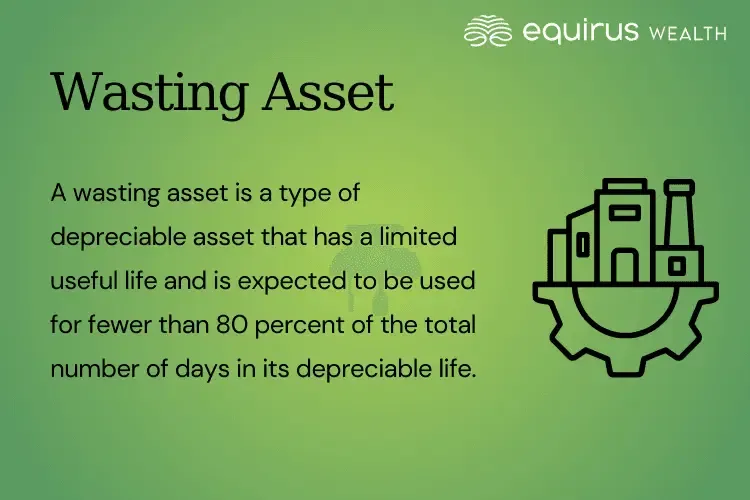

## Table of Contents

## What is a wasting asset?

A wasting asset is something that loses value over time. It's like a car or a piece of machinery that wears out as you use it. These assets become less useful and worth less money the longer you have them. For example, a new car might be worth a lot when you buy it, but after a few years, it's worth much less because it's older and has been driven a lot.

In finance, wasting assets can also include things like options or leases. An option gives you the right to buy something in the future, but as that future date gets closer, the option loses value if it's not used. A lease on a building is another example. As the lease gets closer to ending, it becomes less valuable because you have less time left to use the building. Understanding wasting assets is important for making smart choices about buying and using things that lose value over time.

## Can you give examples of wasting assets?

Wasting assets are things that lose value as time goes by. A common example is a car. When you buy a new car, it's worth a lot of money. But as you drive it and it gets older, it becomes worth less and less. This happens because cars wear out and need repairs, and people usually want to buy newer models.

Another example is electronic devices like smartphones or laptops. When they are new, they are valuable. But as new models come out and the old ones get used, they lose value quickly. People often want the latest technology, so older devices become less appealing and worth less money.

In finance, options can also be wasting assets. An option gives you the right to buy or sell something at a certain price in the future. But as the date to use the option gets closer, if the price of what you can buy or sell doesn't move in your favor, the option loses value. This is because the time to use the option is running out, making it less useful.

## How does a wasting asset differ from a non-wasting asset?

A wasting asset is something that loses value over time. It's like a car or a smartphone that becomes less valuable the older it gets. These things wear out or become less useful as time goes by, so they are worth less money. In finance, an example of a wasting asset is an option, which loses value as the time to use it runs out.

A non-wasting asset, on the other hand, is something that keeps its value or even grows in value over time. This can be things like land or certain types of investments like stocks or bonds. Land doesn't wear out, so it can stay valuable or even become more valuable if the area around it improves. Stocks can go up in value if the company does well, and bonds can keep paying interest over time, making them non-wasting assets.

## What are the key characteristics of a wasting asset?

A wasting asset is something that loses value as time goes by. It's like a car that becomes less valuable the more you drive it. This happens because the car wears out and needs repairs, and people usually want to buy newer models. Other examples are smartphones and laptops, which lose value quickly as new models come out and the old ones get used.

In finance, an option can also be a wasting asset. An option gives you the right to buy or sell something at a certain price in the future. But as the date to use the option gets closer, it loses value if the price doesn't move in your favor. This is because the time to use the option is running out, making it less useful. Understanding these characteristics helps you make better choices about buying and using things that lose value over time.

## Why is it important to understand wasting assets in financial planning?

Understanding wasting assets is important in financial planning because it helps you make smart choices about what you buy and how you use your money. If you know that something like a car or a smartphone will lose value over time, you can plan to spend less on these items or think about how long you'll keep them before they become too old or worn out. This way, you can save money for other things that might be more important or keep their value better, like saving for a house or investing in stocks.

Also, in financial planning, knowing about wasting assets like options can help you make better investment decisions. Options lose value as time passes, so if you're thinking about buying one, you need to consider if it's worth the risk. If the price of what the option is for doesn't move in your favor, you could lose money. By understanding this, you can plan your investments more carefully and avoid losing money on things that will just keep losing value.

## How do wasting assets impact an investor's portfolio?

Wasting assets can affect an investor's portfolio by making it less valuable over time. If an investor has a lot of wasting assets like cars or smartphones, the overall value of their portfolio goes down as these items lose value. This means the investor might not have as much money to use for other investments or to spend on things they need. It's important for investors to think about how much they want to spend on things that will lose value quickly.

In finance, wasting assets like options can also impact a portfolio. If an investor buys options and they don't work out, the value of the portfolio can drop because options lose value as time goes by. This can make the investor's overall financial situation worse if they don't plan carefully. By understanding wasting assets, investors can make better choices and keep their portfolios growing instead of shrinking.

## What strategies can be used to manage or mitigate the effects of wasting assets?

One way to manage wasting assets is to be careful about what you buy. If you know that things like cars or smartphones will lose value quickly, you can choose to spend less money on them. Instead of buying the newest model, you might pick a used one that's still good but cheaper. This way, you save money that you can use for things that keep their value better, like a house or investments that grow over time.

Another strategy is to plan how long you'll keep a wasting asset. For example, if you buy a car, think about how many years you'll use it before it gets too old. You can then sell it before it loses too much value. In finance, if you're buying options, you need to think about when to use them. If you don't use an option before it loses all its value, you could lose money. By planning ahead, you can make better choices and reduce the impact of wasting assets on your money.

## How does depreciation affect the value of wasting assets?

Depreciation is the way we measure how much a wasting asset loses value over time. It's like a car that gets older and needs more repairs. When you buy a new car, it's worth a lot of money. But every year, the car loses some of its value because it's getting used and worn out. This is depreciation. It's important to understand depreciation because it helps you know how much your car or other wasting assets will be worth in the future.

In financial planning, depreciation affects how you think about buying and using wasting assets. If you know a car will lose a lot of its value in a few years, you might decide to buy a cheaper used car instead of a new one. This way, you can save money and use it for other things that might not lose value as quickly. By understanding depreciation, you can make smarter choices about what to buy and how to manage your money.

## What role do wasting assets play in tax planning?

Wasting assets can be important in tax planning because you can sometimes get tax breaks for the money you lose when these assets go down in value. When you buy things like cars or machines for your business, they lose value over time. This is called depreciation. You can use depreciation to lower your taxes because you can take the loss in value as a deduction on your tax return. This means you pay less tax because the value of your wasting assets is going down.

Understanding how wasting assets affect your taxes can help you plan better. If you know that buying a new car for your business will lose value quickly, you can plan to take the depreciation as a tax deduction. This can save you money on taxes. It's a good idea to talk to a tax professional to make sure you're using these tax breaks the right way and getting the most out of them.

## How can the concept of wasting assets be applied in real estate investments?

In real estate investments, wasting assets can be things like appliances, roofs, or heating systems in a property. These parts of a building wear out over time and need to be replaced or fixed. This means they lose value as they get older. If you own a rental property, you need to think about how much it will cost to keep these things working. You can plan for these costs and even take the loss in value as a tax deduction, which can help you save money on taxes.

Understanding wasting assets in real estate can help you make better investment decisions. For example, if you're buying a property, you might look at how old the appliances and systems are. If they're very old, you know you'll need to spend money to replace them soon. By planning for these costs, you can make sure you're not surprised by big expenses later. This way, you can keep your property in good shape and make sure it stays a good investment.

## What advanced financial models are used to predict the decay rate of wasting assets?

To predict how quickly wasting assets lose value, financial experts often use something called the Black-Scholes model. This model is usually used for options, which are a type of wasting asset in finance. The Black-Scholes model looks at things like how long the option lasts, how much the price of what the option is for moves around, and the interest rate. By putting these things into the model, it can tell you how much the option will lose value over time. This helps investors know if buying an option is a good idea or not.

Another model used is the depreciation model, which is simpler and often used for physical things like cars or machines. This model looks at how much the asset loses value each year. For example, a car might lose 20% of its value every year. By knowing this rate, you can predict how much the car will be worth in the future. This is important for people who own businesses or invest in property because they can plan for when they need to replace things and how it will affect their taxes.

## How do regulatory changes impact the management of wasting assets in different industries?

Regulatory changes can affect how businesses handle wasting assets in different ways. In industries like manufacturing, if new rules come out about how to get rid of old machines, companies might have to spend more money to follow these rules. This could make them think more carefully about when to replace their equipment. They might decide to keep using old machines longer or find cheaper ways to get rid of them. This can change how they plan for the costs of their wasting assets and how they manage their money.

In the financial industry, if there are new rules about options or other financial wasting assets, it can change how investors use them. For example, if new laws make it harder to buy and sell options, fewer people might want to use them. This could make options lose value faster because there are fewer people interested in them. Investors need to keep up with these changes to make smart choices about their investments and plan for how these rules might affect the value of their wasting assets.

## What are the key aspects to consider when exploring depreciating assets?

Depreciating assets are a fundamental concept in financial and managerial accounting, which deals with the systematic allocation of the cost of a tangible asset over its useful life. The depreciation of an asset is primarily due to wear and tear, obsolescence, or the passage of time, and it has significant implications for financial reporting and tax calculations.

When businesses acquire assets like machinery, vehicles, or buildings, these assets typically provide utility beyond the year of their acquisition. Instead of expensing the entire cost upfront, depreciation allows businesses to spread out the expense over the asset's useful life. This allocation aligns the cost of the asset with the revenues generated from its use, following the matching principle in accounting.

**Methods of Depreciation**

Several methods exist to calculate depreciation, each with its own application and financial implications. The most common methods include:

1. **Straight-Line Depreciation:** This method is the simplest and most widely used, where the asset's cost is evenly distributed over its useful life.
$$
   \text{Annual Depreciation Expense} = \frac{\text{Cost of the Asset} - \text{Residual Value}}{\text{Useful Life of the Asset}}

$$

2. **Declining Balance Method:** An accelerated depreciation method that writes off a larger portion of the asset’s cost in the early years of its useful life. A common variant is the Double Declining Balance Method.
$$
   \text{Depreciation Expense} = \text{Book Value at Beginning of Year} \times \frac{2}{\text{Useful Life}}

$$

3. **Units of Production Method:** This method ties the expense to the actual usage of the asset, making it suitable for machinery that wears out not only with time but with use.
$$
   \text{Depreciation Expense} = \left(\frac{\text{Cost} - \text{Residual Value}}{\text{Total Estimated Production}}\right) \times \text{Units Produced}

$$

**Implications for Businesses**

Depreciation affects a company's financial statements, reducing the book value of assets on the balance sheet and impacting net income through depreciation expense on the income statement. Furthermore, the choice of depreciation method can influence tax liabilities due to varying deductions allowed in different accounting periods. For instance, accelerated depreciation methods offer higher initial deductions, providing tax benefits by reducing taxable income in the early years of asset life.

**Strategic Management of Depreciating Assets**

Efficiently managing depreciating assets not only ensures accurate financial reporting but can also aid in achieving tax efficiency. Businesses can leverage depreciation to maintain optimal levels of capital expenditure, ensuring that assets are maintained, replaced, or upgraded as needed. This strategic approach contributes to sustaining operational efficiency and financial health, aligning asset management with broader business objectives.

Understanding and managing depreciating assets are essential for businesses to ensure accurate financial portrayal and capitalize on any fiscal advantages, ultimately aiding in achieving sustainable long-term growth.

## References & Further Reading

[1]: Bergstra, J., Bardenet, R., Bengio, Y., & Kégl, B. (2011). ["Algorithms for Hyper-Parameter Optimization."](https://dl.acm.org/doi/10.5555/2986459.2986743) Advances in Neural Information Processing Systems 24.

[2]: ["Advances in Financial Machine Learning"](https://www.amazon.com/Advances-Financial-Machine-Learning-Marcos/dp/1119482089) by Marcos Lopez de Prado

[3]: ["Evidence-Based Technical Analysis: Applying the Scientific Method and Statistical Inference to Trading Signals"](https://www.amazon.com/Evidence-Based-Technical-Analysis-Scientific-Statistical/dp/0470008741) by David Aronson

[4]: ["Machine Learning for Algorithmic Trading"](https://github.com/stefan-jansen/machine-learning-for-trading) by Stefan Jansen

[5]: ["Quantitative Trading: How to Build Your Own Algorithmic Trading Business"](https://www.amazon.com/Quantitative-Trading-Build-Algorithmic-Business/dp/1119800064) by Ernest P. Chan