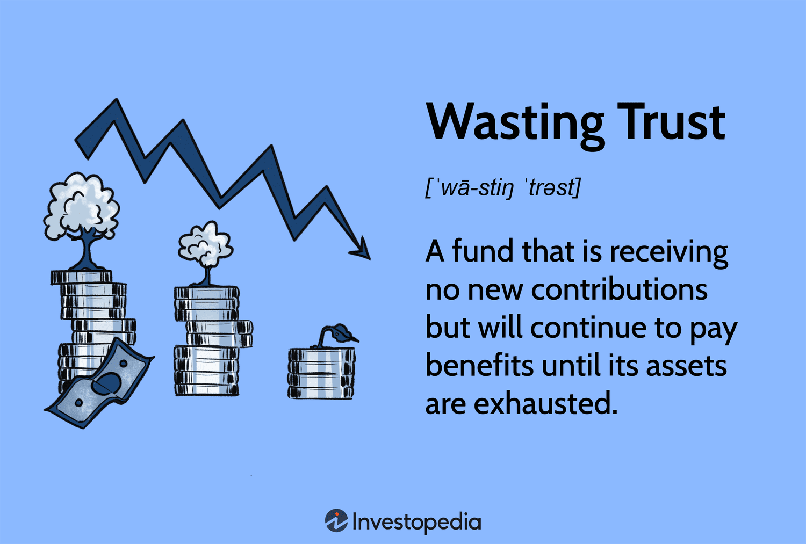

In today's rapidly evolving financial landscape, algorithmic trading, or 'algo trading,' has established itself as a crucial component of the markets. This trading method utilizes advanced algorithms to analyze market data and execute trades at speeds that surpass human capability. By automating the trading process, algo trading offers significant advantages, including enhanced speed and accuracy, which provide a competitive edge to its practitioners.

However, with the advantages of algorithmic trading come several challenges. Trust, legalities, and financial implications stand out as significant concerns that traders must address. Trust is essential as traders and investors need to rely on the algorithms' reliability and performance. Ensuring algorithms adhere to ethical standards and legal requirements is a challenge complicated by the rapid technological changes and the increasing complexity of financial markets. Moreover, the financial implications of deploying these systems, including the substantial investment and potential risks, cannot be overlooked.



This article aims to explore the intersection of trust, legal frameworks, financial considerations, and algorithmic trading. Through this exploration, we aim to provide a comprehensive understanding of how these elements interact within the context of algorithmic trading. By examining these interactions, we identify what traders and investors must know to navigate the complexities of algo trading effectively. Understanding these dynamics will enable market participants to leverage algorithmic trading successfully while minimizing risks and maximizing opportunities.

## Table of Contents

## Understanding Algorithmic Trading

Algorithmic trading involves using advanced computer programs to automate trading decisions, leveraging predefined criteria and models. This technology plays an essential role in today's financial markets, implemented by institutional investors, hedge funds, and individual traders to exploit market efficiencies, reduce transactional costs, and enhance execution speed.

At its core, the effectiveness of algorithmic trading relies on its ability to process vast amounts of data at unprecedented speeds. Traders employ algorithms to analyze market conditions, identify trading opportunities, and execute trades in fractions of a second, often faster than a human could. High-Frequency Trading ([HFT](/wiki/high-frequency-trading-strategies)), a subset of algorithmic trading, epitomizes this speed advantage by executing millions of orders in a fraction of a second, thereby enabling traders to capitalize on minor price discrepancies across different markets or instruments.

The key benefits of algorithmic trading include its speed, accuracy, and efficiency. Algorithms can monitor and analyze multiple markets and orders simultaneously, allowing traders to make more informed decisions. This capability significantly reduces the chances of human errors and increases the opportunities for [arbitrage](/wiki/arbitrage).

In terms of mathematical models, [algorithmic trading](/wiki/algorithmic-trading) often employs statistical and probabilistic calculations to inform its operations. For example, algorithms might use mean reversion strategies, which rely on the assumption that asset prices will revert to their historical means over time. This approach can be mathematically expressed as:

$$
\text{Expected Price} = \frac{1}{N} \sum_{i=1}^{N} P_i
$$

where $P_i$ represents historical prices and $N$ is the total number of observations. Traders may also implement momentum strategies that attempt to capitalize on market trends through indicators such as moving averages.

Despite the benefits, algorithmic trading introduces numerous challenges. Concerns over market stability, illustrated by incidents like the 2010 Flash Crash, raise questions about the ethical implications and potential for market manipulation. Additionally, algorithmic trading systems require robust risk management frameworks to handle unexpected market events or discrepancies, as the automated nature of trading can lead to significant financial losses if not properly supervised and maintained.

Legal and ethical considerations are also paramount. Traders must ensure that their algorithms adhere to financial regulations and are transparent about their trading intentions. The reliance on complex algorithms necessitates a rigorous verification process to maintain trust and integrity in financial activities.

Overall, while algorithmic trading offers remarkable advantages in speed and efficiency, it is crucial for traders to pursue responsible strategies that align with regulatory standards and ethical norms. This practice ensures a balanced approach that maximizes gains while minimizing risks associated with automated trading systems.

## Legal Implications of Algorithmic Trading

Algorithmic trading, while a powerful tool for executing trades with precision and speed, is subject to stringent regulatory frameworks aimed at maintaining market integrity and protecting investors. As with all trading activities, algo trading is governed by regulations, but due to its highly automated nature, it faces additional scrutiny from regulatory bodies such as the U.S. Securities and Exchange Commission (SEC) and the Financial Industry Regulatory Authority (FINRA).

One of the primary concerns associated with algorithmic trading is the potential for market manipulation. High-frequency trading, a subset of algorithmic trading, has been linked to practices such as "quote stuffing" and "spoofing," where traders place large orders with no intention of executing them, simply to create misleading signals about supply and demand. These practices can distort market prices and undermine investor confidence, prompting regulatory bodies to implement stricter rules and penalties to deter such activities. The SEC, for example, continues to focus on these issues through initiatives like the Market Access Rule (SEC Rule 15c3-5), which requires broker-dealers to establish risk management controls and supervisory procedures to manage the financial and regulatory risks associated with providing market access.

Furthermore, insider trading is another critical issue in the context of algorithmic trading. The misuse of privileged information to gain an unfair advantage is illegal under securities laws, and regulatory authorities are increasingly vigilant in monitoring for such breaches. Algorithms can be programmed to act on non-public information, and therefore, ensuring compliance with insider trading laws is paramount for firms using automated trading strategies.

Transparency is another focus area for regulators, as it is crucial for maintaining trust in financial markets. The SEC and FINRA enforce requirements for real-time reporting and disclosure of trades to enhance market transparency. These measures aim to prevent information asymmetry, where some market participants could potentially trade with unfair informational advantages.

Complying with these regulatory requirements demands that firms engage in robust compliance practices and internal controls. It is essential for traders and firms utilizing algorithmic strategies to regularly audit their systems and strategies to ensure adherence to both general and specific regulatory requirements.

In summary, understanding and complying with the legal framework surrounding algorithmic trading is essential. Regulatory bodies are vigilant, and the consequences for non-compliance can be severe, including fines, sanctions, and reputational damage. Therefore, legal and ethical trading practices are crucial for sustaining the long-term viability and success of algorithmic trading operations.

## Trust in Algorithmic Trading

Trust is a critical [factor](/wiki/factor-investing) for the adoption and acceptance of algorithmic trading. Traders and investors must have confidence that the algorithms they use are both reliable and accurate, which is crucial for ensuring that these automated systems perform as expected in various market conditions. The confidence in these algorithms is significantly enhanced by transparency in algorithmic processes and the availability of historical performance data. This transparency allows traders to understand the underlying decision-making mechanisms of the algorithms, assess their past performances, and predict their future behaviors.

One of the key methods to build trust in algorithmic trading systems is through rigorous back-testing. Back-testing involves using historical market data to simulate trading strategies, which helps in evaluating their effectiveness and robustness without risking actual capital. By analyzing how an algorithm would have performed in the past, traders can identify potential strengths and weaknesses, as well as adjust the algorithms to improve future performance.

Reputable trading platforms often provide comprehensive back-testing results and detailed strategy reports. These reports typically include metrics such as return on investment (ROI), Sharpe ratio, maximum drawdown, and other statistical measures that help in assessing the risk and return profile of algorithms. Presenting these findings in a clear and accessible format allows traders and investors to make informed decisions about the viability and trustworthiness of a trading strategy.

An example of a Python code snippet to back-test an algorithmic trading strategy could look like this:

```python
import pandas as pd

def backtest_strategy(data, signal_column):
    # Initialize variables
    capital = 100000  # Starting capital
    positions = 0
    portfolio_value = capital
    portfolio_values = []

    # Backtest
    for index, row in data.iterrows():
        if row[signal_column] == 'buy':
            positions += capital / row['Close']
            capital = 0
        elif row[signal_column] == 'sell':
            capital += positions * row['Close']
            positions = 0
        portfolio_value = capital + positions * row['Close']
        portfolio_values.append(portfolio_value)

    return portfolio_values

# Example dataframe 'historical_data' with OHLC data and buy/sell signals
historical_data = pd.DataFrame({
    'Date': pd.date_range(start='1/1/2022', periods=5),
    'Close': [110, 115, 112, 117, 120],
    'Signal': ['hold', 'buy', 'hold', 'sell', 'hold']
})

backtested_values = backtest_strategy(historical_data, 'Signal')
print(backtested_values)
```

Overall, trust in algorithmic trading is built upon the foundation of transparency, rigorous back-testing, and detailed performance analysis. These elements not only reassure traders of the reliability and accuracy of their algorithms but also enhance the overall confidence in the automated trading systems they employ. By leveraging these tools and methodologies, traders and investors are better equipped to engage with algorithmic trading responsibly and successfully.

## Financial Considerations

Algorithmic trading, characterized by its reliance on precise and rapid trade execution, demands significant initial and ongoing financial investment. Key components of this investment include technology infrastructure and data analysis capabilities. The deployment of high-speed servers and sophisticated trading software is essential for minimizing latency and maximizing efficiency. These systems often require regular updates and maintenance, adding to the overall cost.

Data is another critical investment area. Successful algorithmic trading necessitates access to comprehensive and high-quality market data, which can be costly. Traders need historical data for back-testing and real-time data for live decisions. The complexity of analyzing large datasets often requires advanced analytical tools and skilled personnel, further driving up expenses.

While algorithmic trading promises increased profits through efficient execution, it also introduces notable risks. Overfitting, a common pitfall in algorithmic trading, occurs when a model is too closely tailored to historical data, leading to poor performance in live trading scenarios. Additionally, algorithmic strategies can contribute to or exacerbate market disruptions, as evidenced by events like the 2010 Flash Crash. To mitigate such risks, traders must implement robust risk management protocols and regularly reassess their strategies.

Proper financial management is critical in algotrading. This involves continuous evaluation of system performance, adapting to changing market conditions, and ensuring the efficiency of resource allocation. Strategy optimization is also fundamental, requiring traders to tweak algorithms for improved accuracy and performance continuously.

Python is a popular choice for developing and managing algorithmic trading strategies. Its wide array of libraries, such as NumPy and pandas, enables efficient data manipulation and analysis. Consider the following Python snippet that demonstrates a simple moving average crossover strategy, a basic form of algorithmic trading:

```python
import pandas as pd
import numpy as np

# Load market data
data = pd.read_csv('market_data.csv')

# Calculate moving averages
data['Short_MA'] = data['Close'].rolling(window=40).mean()
data['Long_MA'] = data['Close'].rolling(window=100).mean()

# Identify buy/sell signals
data['Signal'] = 0
data['Signal'][40:] = np.where(data['Short_MA'][40:] > data['Long_MA'][40:], 1, -1)

# Calculate returns
data['Returns'] = data['Close'].pct_change()
data['Strategy_Returns'] = data['Signal'].shift(1) * data['Returns']

# Assess strategy's performance
total_return = data['Strategy_Returns'].sum()
print(f'Total Strategy Return: {total_return:.2f}')
```

In conclusion, while algorithmic trading offers the potential for enhanced profitability through rapid and precise trade execution, it also requires a substantial financial commitment and carries inherent risks. Achieving consistent returns demands rigorous financial management and continual strategy refinement.

## The Future of Algorithmic Trading

As technology advances, algorithmic trading is poised to undergo significant transformations, becoming even more sophisticated and integral to financial markets. Emerging technologies such as [machine learning](/wiki/machine-learning) and [artificial intelligence](/wiki/ai-artificial-intelligence) are anticipated to greatly enhance the capability of algorithms to predict market trends and execute trades with increased precision. These technologies can process vast amounts of data to identify complex patterns and make informed decisions, thereby enhancing the accuracy and speed of trading models.

Machine learning algorithms, in particular, can improve over time as they are exposed to more data, allowing them to refine their predictive models. For instance, algorithms might employ techniques such as regression analysis or neural networks to forecast price movements or detect anomalies in trading patterns. These models can be continually updated, ensuring that trading strategies remain relevant in dynamic market conditions.

Here is a simple example of a Python code snippet using machine learning for a basic predictive model:

```python
from sklearn.model_selection import train_test_split
from sklearn.ensemble import RandomForestRegressor
import pandas as pd

# Load dataset
data = pd.read_csv('market_data.csv')
features = data.drop('target', axis=1)
target = data['target']

# Split data into training and testing
X_train, X_test, y_train, y_test = train_test_split(features, target, test_size=0.2, random_state=42)

# Train the model
model = RandomForestRegressor(n_estimators=100, random_state=42)
model.fit(X_train, y_train)

# Predict and calculate accuracy
predictions = model.predict(X_test)
accuracy = model.score(X_test, y_test)
```

As algorithmic trading becomes more intertwined with these advanced technologies, the regulatory environment will also need to evolve. Regulators must ensure that market practices remain transparent and fair, preventing new forms of market manipulation that could arise from highly automated trading systems. Regulatory bodies may have to implement rules targeting the ethical deployment of machine learning models in trading while also ensuring that they do not inadvertently contribute to market [volatility](/wiki/volatility-trading-strategies).

Traders and investors will need to stay informed and adaptable to maintain their competitive edge in a rapidly changing landscape. This can be achieved through continuous education and by leveraging technology to enhance their trading capabilities. Maintaining awareness of the latest developments in algorithmic trading and regulatory changes will be crucial for success.

In conclusion, as algorithmic trading advances, it will introduce both opportunities and challenges. Enhanced predictive capabilities through AI and machine learning promise significant benefits, but regulatory and ethical considerations must be carefully managed. By keeping abreast of these developments, market participants can effectively navigate the future of algorithmic trading.

## Conclusion

Algorithmic trading serves as a powerful tool in the contemporary financial markets, bringing a blend of opportunities and challenges to traders and investors. Effectively navigating the intricate web of legal frameworks is pivotal to ensuring that trading activities are lawful and ethically sound. Regulatory awareness helps prevent issues such as market manipulation and insider trading, thus preserving the integrity of financial markets.

Trust in the technology behind algorithmic trading is another cornerstone of success. Traders and investors must have confidence in the reliability and accuracy of the algorithms deployed. This trust can be enhanced through the transparency of algorithmic processes and by offering insights into historical trading performance. Providing robust back-testing results and detailed strategy reports are approaches used by reputable trading platforms to bolster this trust.

Understanding the financial implications is equally essential. While algorithmic trading can optimize trade execution and potentially enhance profitability, it is not devoid of risks. Adopting advanced technologies requires significant investment, and risks like overfitting or unexpected market disruptions must be managed carefully.

As algorithmic trading continues to evolve with advancements in technology, staying informed about industry developments and maintaining compliance with regulatory changes will be increasingly important. Machine learning and artificial intelligence are expected to further refine predictive trading models, presenting new opportunities while simultaneously introducing complex challenges. Thus, it is crucial for traders and investors to continuously update their knowledge and adapt their strategies to remain competitive and capitalize on algorithmic trading's advantages, while also implementing measures to mitigate associated risks. By understanding and integrating these elements, traders and investors can make informed decisions, optimizing their trading strategies for sustained success in an ever-evolving market landscape.

## References & Further Reading

[1]: Bergstra, J., Bardenet, R., Bengio, Y., & Kégl, B. (2011). ["Algorithms for Hyper-Parameter Optimization."](https://dl.acm.org/doi/10.5555/2986459.2986743) Advances in Neural Information Processing Systems 24.

[2]: ["Advances in Financial Machine Learning"](https://www.amazon.com/Advances-Financial-Machine-Learning-Marcos/dp/1119482089) by Marcos Lopez de Prado

[3]: ["Evidence-Based Technical Analysis: Applying the Scientific Method and Statistical Inference to Trading Signals"](https://www.amazon.com/Evidence-Based-Technical-Analysis-Scientific-Statistical/dp/0470008741) by David Aronson

[4]: ["Machine Learning for Algorithmic Trading"](https://github.com/stefan-jansen/machine-learning-for-trading) by Stefan Jansen

[5]: ["Quantitative Trading: How to Build Your Own Algorithmic Trading Business"](https://www.amazon.com/Quantitative-Trading-Build-Algorithmic-Business/dp/1119800064) by Ernest P. Chan