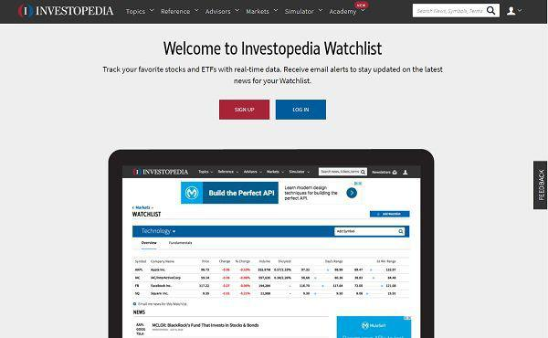

In trading and investing, a watchlist is an essential tool utilized by traders to systematically monitor and prioritize particular financial instruments. By focusing on select securities, traders can streamline their activities, making it easier to respond to market opportunities efficiently. This article examines the creation and application of watchlists with a specific focus on algorithmic trading, a strategy that employs advanced mathematical models and automated tools to execute trades.

Understanding how watchlists contribute to trading efficiency is crucial for traders aiming to enhance their market positioning. Watchlists help traders prioritize securities, ensuring that they remain alert to critical price changes and market events. The process of constructing an effective watchlist involves identifying securities that align with a trader's strategy, thus supporting a more focused and disciplined trading approach.



This discussion will cover the advantages, key features, and strategies for creating an optimized watchlist. Key elements include selecting suitable securities based on predefined criteria and managing lists to reflect shifts in market conditions or strategies. Furthermore, by integrating watchlists with algorithmic trading, traders can substantially improve their decision-making capabilities. Algorithmic trading enables automated monitoring and management of watchlists, facilitating a proactive trading strategy.

Finally, the article highlights the role of algorithmic trading in watchlist management, showcasing how technology can enhance performance and efficiency. Through the use of algorithmic strategies, traders can quickly adjust to market changes and capitalize on high-probability trading setups, thereby gaining a competitive advantage. As trading environments continue to evolve, the synergy between watchlists and algorithmic tools promises to be a valuable asset in the pursuit of successful trading outcomes.

## Table of Contents

## Understanding Watchlists

A watchlist is a tailored list of securities chosen by a trader or investor to monitor for potential trading opportunities. These lists serve several crucial functions, primarily tracking portfolio performance, observing price movements, and staying informed about relevant news surrounding the selected securities.

Customizability is a key feature of watchlists, as they can be adjusted to align with personal investment objectives and interest in specific sectors or industries. For instance, a technology-focused investor may compile a watchlist of leading tech companies to closely monitor technological advancements and market trends within that sector.

Creating a watchlist begins with identifying key securities that fit an investor's strategy. This involves selecting those assets that meet predetermined criteria such as market capitalization, [volatility](/wiki/volatility-trading-strategies), dividend yield, or industry sector. By focusing on specific criteria, investors ensure their watchlist reflects their trading goals and risk tolerance.

Many modern trading platforms facilitate the efficient construction and management of watchlists. These platforms offer tools that simplify the tracking process, allowing investors to categorize and organize their watchlists according to various attributes such as industry group, geographic location, or [liquidity](/wiki/liquidity-risk-premium) levels. This enhances the user experience by providing seamless access to critical information about the securities being monitored.

Ultimately, a well-constructed watchlist aids investors and traders by centralizing the monitoring of assets, enabling quick responses to market changes, and supporting informed decision-making. Through continuous updates and strategic adjustments, watchlists remain a vital component in navigating the dynamic financial markets effectively.

## Purpose of a Watchlist in Trading

A watchlist is an essential tool in trading, enabling traders to monitor and analyze market movements actively. By efficiently organizing a list of securities, traders can quickly react to market opportunities that fit their predefined criteria, allowing for timely decision-making. This proactive monitoring is crucial as it facilitates the identification of potential trades, minimizing the likelihood of missing valuable market changes.

The primary function of a watchlist is to streamline the trading process by focusing on specific stocks, indices, or other financial instruments. This targeted approach aids traders in recognizing emerging trends, which is essential for anticipating market shifts and making informed decisions. Consequently, a watchlist not only serves as a tool for observation but also enhances a trader’s ability to capitalize on anticipated market movements.

Additionally, a well-maintained watchlist contributes to a disciplined trading strategy. By regularly updating their watchlists, traders ensure they are aligned with their current investment strategies and market conditions. Consistent monitoring of the stocks on the watchlist prevents emotional or impulsive trading, fostering a systematic approach to entering and exiting positions.

For instance, traders can create watchlists based on technical indicators such as moving averages, Relative Strength Index (RSI), or other custom criteria. Python, a popular programming language in trading, allows for the automation of watchlist management, ensuring that securities meeting the defined criteria are automatically added, updated, or removed. Here's a basic example of using Python to filter stocks into a watchlist based on their moving average:

```python
import yfinance as yf  # For more datasets, visit: https://paperswithbacktest.com/datasets

def add_to_watchlist(tickers, short_window, long_window):
    watchlist = []
    for ticker in tickers:
        data = yf.download(ticker, period='6mo', interval='1d')
        data['Short_MA'] = data['Close'].rolling(window=short_window).mean()
        data['Long_MA'] = data['Close'].rolling(window=long_window).mean()

        if data['Short_MA'].iloc[-1] > data['Long_MA'].iloc[-1]:
            watchlist.append(ticker)

    return watchlist

# Example usage
tickers = ["AAPL", "MSFT", "GOOGL", "AMZN"]
short_window = 40
long_window = 100
watchlist = add_to_watchlist(tickers, short_window, long_window)
print("Watchlist:", watchlist)
```

This script uses moving averages as a filtering criterion. Stocks are added to the watchlist if their short-term moving average exceeds the long-term moving average, which may indicate a potential buying opportunity. As such, the integration of technology in managing watchlists significantly enhances the efficiency and precision of trading activities.

In summary, watchlists are indispensable in the trading sector, offering a structured, strategic, and disciplined mechanism to monitor securities. By concentrating on specific market segments, traders can better anticipate market fluctuations and optimize their trading strategies accordingly.

## Creating an Effective Watchlist

Creating an effective watchlist is a crucial step in streamlining and enhancing your trading strategy. It begins with the clear identification and definition of investment criteria for selecting securities. These criteria should reflect your specific trading goals, risk tolerance, and market interests. 

### Identifying Investment Criteria
Determine the fundamental and technical indicators that are critical to your trading strategy. For instance, you might focus on financial ratios like the price-to-earnings (P/E) ratio, earnings per share (EPS), or technical indicators such as moving averages and Relative Strength Index (RSI). Define criteria that align with your trading objectives, whether they are [momentum](/wiki/momentum)-based, value investing, or growth-focused.

### Using Stock Screeners
Stock screeners are powerful tools that enable traders to filter a vast universe of securities based on defined parameters. Most online trading platforms offer screening functionality, allowing you to input criteria such as market capitalization, dividend yield, or specific technical indicators. This filtration helps in shortlisting securities that meet your investment requirements, ensuring a more focused approach.

```python
# Example: Using Python's Pandas to filter stocks based on criteria
import pandas as pd

# Sample stock data
data = {
    'Ticker': ['AAPL', 'GOOGL', 'MSFT', 'AMZN'],
    'P/E': [28.53, 30.22, 35.42, 58.21],
    'EPS': [3.28, 56.22, 5.02, 41.83]
}

df = pd.DataFrame(data)

# Define your screening criteria
pe_criteria = df['P/E'] < 30
eps_criteria = df['EPS'] > 5

# Get stocks that meet the criteria
filtered_stocks = df[pe_criteria & eps_criteria]
print(filtered_stocks)
```

### Maintaining Manageability
Balancing the size of your watchlist is essential for effective tracking and decision-making. A typical watchlist should include between 50 to 100 securities. This number is manageable and allows for comprehensive analysis. An overly extensive list can lead to analysis paralysis, while too narrow a selection might omit important opportunities.

### Regular Updates
Consistently updating your watchlist ensures that it remains relevant to current market conditions. Market trends can shift, new information can emerge, and your investment strategy might evolve. Regular reviews and adjustments are necessary to keep your watchlist aligned with these changes, ensuring optimal performance.

### Grouping Securities
For easy monitoring and analysis, it is beneficial to group securities based on common characteristics such as sector, industry, or geographic region. Grouping allows for a structured approach to evaluating movement trends and understanding sector correlations. This categorization aids in the identification of systemic performance drivers or specific opportunities within a sector.

By following these structured steps, traders can build a robust watchlist that enhances their ability to make informed trading decisions and effectively navigate the financial markets.

## Role of Algorithmic Trading in Watchlist Management

Algorithmic trading profoundly impacts watchlist management by streamlining the monitoring and updating processes for traders. Utilizing algorithms, traders can automate the management of watchlists, significantly enhancing efficiency and responsiveness to market changes.

Algorithms can be configured to trigger alerts based on predefined criteria such as price movements, [volume](/wiki/volume-trading-strategy) fluctuations, or even technical indicators. For example, an algorithm can be set to alert a trader when the price of a security crosses a certain threshold, signaling a potential trading opportunity. This automation enables traders to react promptly to market conditions without constant manual monitoring.

Incorporating algorithmic strategies allows traders to focus on high-probability setups that have been identified through their watchlists. By doing so, traders can allocate their attention to the most promising trades, optimizing their time and resources. Algorithms can process vast datasets quickly, filtering out noise and refining the watchlist to the most relevant securities. This data-driven approach minimizes the cognitive load on traders and enhances decision-making accuracy.

Moreover, algorithmic tools can scan large volumes of market data to discover new candidates for the watchlist. Techniques such as [machine learning](/wiki/machine-learning) and advanced data analytics can identify patterns and trends that might go unnoticed through manual observation. This capability ensures that the watchlist remains dynamic and relevant, adapting to the ever-changing market landscape.

The efficiency gains from [algorithmic trading](/wiki/algorithmic-trading) tools allow traders to dynamically adjust their strategies based on insights derived from their watchlists. For example, real-time data analysis can uncover shifts in market sentiment or emerging trends, enabling traders to reallocate capital accordingly. By leveraging these technological advancements, traders maintain a competitive advantage in navigating complex market environments.

## Conclusion

Watchlists are indispensable in the strategic framework of trading and investing. They serve as meticulously curated lists of securities, carefully selected to align with the trader's specific goals and strategies. This targeted approach allows traders to efficiently navigate the complexities of the financial markets, identifying opportunities that fit their trading profile and strategy. By aligning securities with predefined objectives, traders can focus their attention on potential opportunities that meet their criteria, enhancing the probability of successful investments.

Integration with algorithmic trading further enhances the utility of watchlists. Algorithmic trading systems can process vast amounts of market data in real-time, providing traders with critical insights and facilitating swift decision-making. By using watchlists in conjunction with algorithmic tools, traders can automate the processes of monitoring and analyzing securities. This integration enables the identification of high-probability trading setups, leading to improved trading efficiency and effectiveness. Algorithms can actively update watchlists by filtering new data according to defined parameters, thus ensuring that the list remains relevant to the dynamically changing market conditions.

Maintaining optimal trading performance requires the continual refinement and proactive management of watchlists. As market conditions evolve, it is critical to regularly reassess and update the securities on a watchlist, ensuring alignment with current trading goals and strategies. This demands a disciplined approach to monitor performance, trends, and any shifts in the macroeconomic environment that could impact these securities.

In a rapidly evolving trading landscape, the combined use of watchlists and algorithmic trading tools offers traders a significant competitive advantage. These tools can process information more quickly and accurately than is possible through manual analysis, leading to faster recognition of market shifts and new opportunities. Using these advanced tools allows traders not only to maintain pace with the market but also to capitalize on new trends before they are reflected in security prices. In summary, an effective strategy incorporating both watchlists and algorithmic trading is essential for achieving sustained success in trading and investing.

## References & Further Reading

[1]: ["Advances in Financial Machine Learning"](https://www.amazon.com/Advances-Financial-Machine-Learning-Marcos/dp/1119482089) by Marcos Lopez de Prado

[2]: ["Machine Learning for Algorithmic Trading"](https://github.com/stefan-jansen/machine-learning-for-trading) by Stefan Jansen

[3]: Aldridge, I. (2013). ["High-Frequency Trading: A Practical Guide to Algorithmic Strategies and Trading Systems,"](https://onlinelibrary.wiley.com/doi/pdf/10.1002/9781119203803.fmatter) 2nd Edition. Wiley.

[4]: Chan, E. P. (2008). ["Quantitative Trading: How to Build Your Own Algorithmic Trading Business"](https://github.com/ftvision/quant_trading_echan_book). Wiley.

[5]: Aronson, D. R. (2006). ["Evidence-Based Technical Analysis: Applying the Scientific Method and Statistical Inference to Trading Signals"](https://www.amazon.com/Evidence-Based-Technical-Analysis-Scientific-Statistical/dp/0470008741). Wiley.

[6]: Grinold, R. C., & Kahn, R. N. (2000). ["Active Portfolio Management: A Quantitative Approach for Producing Superior Returns and Controlling Risk,"](https://www.amazon.com/Active-Portfolio-Management-Quantitative-Controlling/dp/0070248826) 2nd Edition. McGraw-Hill Education.

[7]: ["The Quants: How a New Breed of Math Whizzes Conquered Wall Street and Nearly Destroyed It"] by Scott Patterson