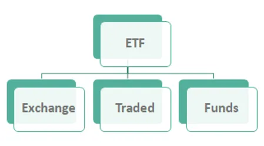

## Table of Contents

## What is a Water Exchange-Traded Fund (ETF)?

A Water Exchange-Traded Fund (ETF) is a type of investment fund that focuses on companies involved in the water industry. This can include businesses that manage water utilities, provide water treatment solutions, or develop technologies for water conservation. By investing in a Water ETF, you are buying a small piece of many different water-related companies all at once, which helps spread out the risk compared to investing in just one company.

Water ETFs are popular because water is essential for life and many industries, so the demand for water services and technologies is expected to grow. As populations increase and water scarcity becomes a bigger issue, companies in the water sector may have good opportunities to grow and make profits. This makes Water ETFs an attractive option for investors who want to support sustainable practices and potentially benefit from the growth of the water industry.

## How does a Water ETF work?

A Water ETF works by pooling money from many investors to buy shares in a variety of companies that are involved in the water industry. These companies can be involved in things like water treatment, water utilities, or even technology that helps save water. When you buy shares in a Water ETF, you are essentially buying a small piece of all these different companies at once. This is different from buying stock in just one company, because it spreads your investment across many companies, which can help reduce risk.

The value of a Water [ETF](/wiki/etf-trading-strategies) goes up or down based on how well the companies it invests in are doing. If the water companies are making more money and growing, the value of the ETF usually goes up. If they are not doing well, the value might go down. You can buy or sell shares of a Water ETF on a stock exchange, just like you would with regular stocks. This makes it easy to get in and out of your investment whenever you want.

## What are the benefits of investing in Water ETFs?

Investing in Water ETFs can be a good idea because it helps you spread your money across many different water companies. This means if one company does not do well, it might not hurt your whole investment as much. It's like not putting all your eggs in one basket. Also, water is something everyone needs, so the companies that work with water, like those that clean it or help save it, are likely to keep being important. This can make Water ETFs a safe place to put your money over a long time.

Another benefit is that Water ETFs let you support companies that are trying to solve big problems like water scarcity. As more people live on Earth and need water, these companies might grow and make more money. This could make your investment grow too. Plus, it feels good to invest in something that helps the planet. So, Water ETFs can be a way to make money and do good at the same time.

## What are the risks associated with Water ETFs?

Investing in Water ETFs can be risky because the value of the ETF can go up and down a lot. This happens because the companies in the ETF might not do well. For example, if there's a drought or a big problem with water, the companies that work with water might lose money. This can make the value of your Water ETF go down. Also, if people start using less water or if new laws make it harder for water companies to make money, that can hurt the ETF too.

Another risk is that Water ETFs might not grow as fast as you hope. Even though water is important, the companies in the ETF might not make as much money as other kinds of companies. This means your investment might not grow as quickly as you want. Also, if a lot of people want to sell their shares in the ETF at the same time, the price can drop quickly. So, it's important to think about these risks before you decide to invest in a Water ETF.

## Which are some popular Water ETFs available in the market?

There are a few popular Water ETFs that people like to invest in. One of them is the Invesco Water Resources ETF (PHO). This ETF focuses on companies that are involved in water utilities, water treatment, and water technology. Another popular one is the First Trust Water ETF (FIW). This ETF also invests in companies that work with water, but it might have a different mix of companies than PHO.

Another well-known Water ETF is the Ecofin Global Water [ESG](/wiki/esg-investing) Fund (EBLU). This ETF not only focuses on water companies but also considers how those companies treat the environment and their workers. It's a good choice for people who want to invest in water and also care about sustainability. These ETFs are all traded on stock exchanges, so you can buy and sell them easily, just like regular stocks.

## How do Water ETFs contribute to sustainable investing?

Water ETFs help with sustainable investing because they focus on companies that work with water. Water is really important for everyone, and these companies help make sure we have enough clean water. They do things like clean water, save water, and find new ways to use water better. By investing in these companies through a Water ETF, you are helping them grow and do more good things for the planet.

Also, Water ETFs often look at how companies treat the environment and their workers. This is called ESG, which stands for Environmental, Social, and Governance. When you invest in a Water ETF that cares about ESG, you are supporting companies that try to be good to the earth and fair to people. This makes your investment not just about making money, but also about making the world a better place.

## What factors should be considered when choosing a Water ETF?

When choosing a Water ETF, you should first think about what kind of companies are in the ETF. Some Water ETFs focus more on water utilities, while others might have more companies that work on water technology or conservation. You need to decide which type of water company you want to support with your investment. Also, look at the fees the ETF charges. Some ETFs have higher fees than others, and these fees can eat into your profits over time. So, [picking](/wiki/asset-class-picking) an ETF with lower fees can help you keep more of your money.

Another thing to consider is how the ETF performs over time. You can look at past performance to see if the ETF has been growing or if it has been up and down a lot. Remember, past performance doesn't guarantee future results, but it can give you an idea of how the ETF might do. Also, think about the ETF's approach to sustainability. Some Water ETFs focus on ESG factors, which means they care about the environment, social issues, and how the companies are run. If you want your investment to help the planet, choosing an ETF that looks at these factors can be a good idea.

## How do Water ETFs compare to other types of ETFs?

Water ETFs are different from other types of ETFs because they focus on companies that work with water. This means they invest in businesses that deal with water utilities, water treatment, and water technology. Other ETFs might focus on different things, like technology companies, healthcare, or even specific countries or regions. So, if you care a lot about water and want to support companies that help with water issues, a Water ETF might be a good choice for you. But if you're more interested in other areas, like tech or healthcare, you might want to look at those ETFs instead.

Another way Water ETFs are different is that they often consider sustainability. Many Water ETFs look at how companies treat the environment and their workers, which is called ESG (Environmental, Social, and Governance). This makes them a good fit for people who want to invest in a way that helps the planet. Other types of ETFs might not focus as much on sustainability. For example, a tech ETF might just look at how much money tech companies make, without thinking about their impact on the environment. So, if you want your investments to be good for the earth, a Water ETF could be a better choice than other ETFs.

## What is the historical performance of Water ETFs?

Water ETFs have had ups and downs over the years, just like other types of investments. Over the last decade, some Water ETFs have done pretty well, growing at a steady pace. For example, the Invesco Water Resources ETF (PHO) has seen good growth, especially in years when people were more focused on water issues and sustainability. But there have also been times when Water ETFs didn't do so well, like during big economic downturns when all kinds of investments can lose value.

It's important to remember that past performance doesn't tell us exactly what will happen in the future. Water ETFs can be affected by things like droughts, new laws about water, and how well the companies in the ETF are doing. So, while some Water ETFs have had good historical performance, they can still go up and down. If you're thinking about investing in a Water ETF, it's a good idea to look at how it has done over time, but also think about what might happen in the future.

## How do regulatory changes affect Water ETFs?

Regulatory changes can have a big impact on Water ETFs. When governments make new rules about water, it can change how water companies do business. For example, if a new law makes it harder for water companies to make money, the value of the Water ETF might go down. On the other hand, if a new law helps water companies by giving them more money or making it easier for them to work, the value of the ETF might go up. So, it's important for people who invest in Water ETFs to keep an eye on what the government is doing.

These changes can also affect how much people need water services. If a new rule makes people use less water, the companies in the Water ETF might not make as much money. But if a new rule makes people need more water services, like better water treatment, the companies might do better. This can make the Water ETF go up or down. So, understanding how new rules might change things is a big part of investing in Water ETFs.

## What are the future trends and predictions for Water ETFs?

Water ETFs are likely to grow in the future because water is so important. As more people live on Earth, the need for clean water will go up. This means companies that work with water, like those that clean it or help save it, will have more chances to make money. Also, as people care more about the environment, they might want to invest in companies that help with water issues. This could make Water ETFs more popular and help them grow.

But there are also some things that could make Water ETFs go down. If there are big problems with water, like droughts or new laws that make it hard for water companies to make money, the value of Water ETFs might drop. Also, if people start using less water or if new technology changes how water companies work, that could affect Water ETFs too. So, while Water ETFs have a good chance to grow, they can also be risky because a lot of things can change in the future.

## How can an investor build a diversified portfolio including Water ETFs?

To build a diversified portfolio that includes Water ETFs, an investor should start by spreading their money across different types of investments. This means not putting all your money into just Water ETFs, but also investing in other kinds of ETFs, like those focused on technology, healthcare, or even different countries. By doing this, you can reduce the risk because if one type of investment goes down, the others might still do well. For example, you could put some money into a Water ETF like the Invesco Water Resources ETF (PHO), and then also invest in a tech ETF and a healthcare ETF. This way, your money is spread out and not all tied up in one place.

Another important thing to think about is how much of your portfolio should be in Water ETFs. A good rule of thumb is to keep your Water ETF investment to a smaller part of your overall portfolio, maybe around 5-10%. This way, you can still support water companies and benefit from their growth, but you won't be too heavily affected if the Water ETF doesn't do well. You can also look at different Water ETFs to see which ones fit best with your goals. Some might focus more on sustainability, which could be important if you want your investments to help the planet. By mixing Water ETFs with other types of investments and keeping a balanced approach, you can build a strong and diversified portfolio.

## References & Further Reading

[1]: ["Advances in Financial Machine Learning"](https://www.amazon.com/Advances-Financial-Machine-Learning-Marcos/dp/1119482089) by Marcos Lopez de Prado

[2]: Lorenzen, B. (2016). ["The Water Opportunity – Investing in Water Scarcity."](https://www.nature.com/articles/s41467-021-25026-3) The Nature Conservancy.

[3]: ["The Big Thirst: The Secret Life and Turbulent Future of Water"](https://www.amazon.com/Big-Thirst-Secret-Turbulent-Future/dp/1439102082) by Charles Fishman

[4]: Pictet Asset Management. (2021). ["Water - A precious resource and a major investment opportunity."](https://am.pictet.com/ch/en/investment-views/active-equity/2022/why-pictet-water) 

[5]: ["Algorithmic and High-Frequency Trading"](https://www.cambridge.org/us/universitypress/subjects/mathematics/mathematical-finance/algorithmic-and-high-frequency-trading) by Álvaro Cartea, Sebastian Jaimungal, and José Penalva

[6]: Rogers, P. (2008). ["Facing the Freshwater Crisis."](https://www.scientificamerican.com/article/facing-the-freshwater-crisis/) Scientific American.

