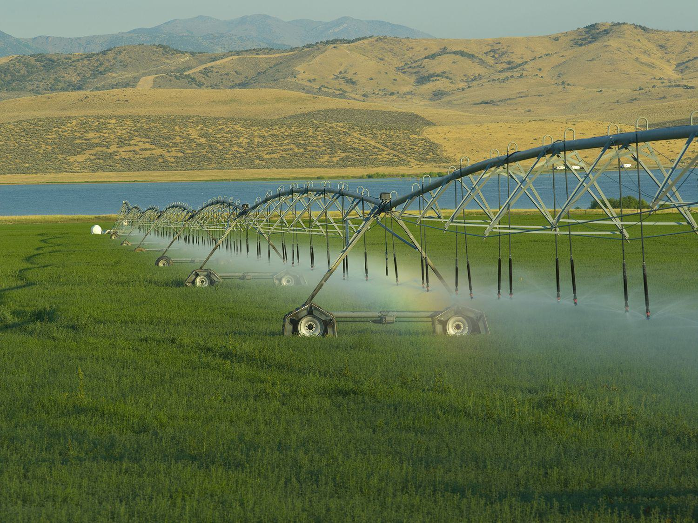

Water is undeniably one of the most vital resources on the planet, fundamental not only for sustaining life but also as a promising investment commodity. As the global population continues to grow and climate change impacts water availability, the demand for this finite resource intensifies, leading to increasing scarcity. This scarcity is transforming water into a strategically important asset, drawing significant attention from investors seeking to capitalize on its potential. Water investment strategies are rapidly gaining popularity, reflecting the recognition of water's paramount importance and the opportunities it presents for long-term financial gain.

The rising interest in water as an investment is driven by several factors. First, the fundamental necessity of water for human survival and economic development underscores its enduring value. Governments and private sectors worldwide are investing in water infrastructure and technology to address challenges associated with scarcity and ensure sustainable access. This investment trend points to robust growth potential in the water sector, making it an attractive prospect for investors.



Furthermore, technological advancements and innovative financial instruments have broadened the scope of water-related investments. Among these, algorithmic trading has emerged as a key opportunity for optimizing investment strategies in the water sector. Algorithmic trading involves using computer programs to execute trades based on pre-defined criteria, allowing for improved efficiency and consistency in trading practices. By employing sophisticated algorithms, investors can enhance their ability to navigate the complexities of the water market, maximizing potential returns while managing risk effectively.

In this article, we will explore the various investment strategies available in the water sector, with a particular focus on the potential advantages provided by algorithmic trading. Through a comprehensive analysis, investors can gain insights into the dynamics of the water market and strategically position themselves to benefit from this burgeoning investment opportunity.

## Table of Contents

## The Importance of Water as an Investment

Water scarcity is an increasingly critical issue on a global scale, driven by the dual forces of climate change and exponential population growth. These factors are contributing to the dwindling availability of freshwater resources, making water an asset of paramount importance. As freshwater availability decreases, the competition for this vital resource intensifies, thereby enhancing its intrinsic value.

Investing in water offers a strategic advantage by providing exposure to a commodity that is not only essential for life but is also growing in economic significance. The scarcity of freshwater resources is projected to increase, thereby potentially elevating the value of water-related investments. The economic principle of supply and demand underscores this phenomenon, where decreased supply due to scarcity, combined with constant or increasing demand, typically results in higher prices and, thus, greater investment value.

The growing recognition of water's importance has led to substantial investments by governments and the private sector. These investments primarily focus on developing water infrastructure and advancing technology for water management. Infrastructure development includes projects such as water treatment plants, desalination facilities, and distribution systems designed to enhance water availability and reduce wastage. Technological advancements in water management aim to improve the efficiency of water usage and distribution, leveraging innovations such as smart water meters and leak detection systems.

Significant investment in these areas indicates robust growth potential within the water sector. For instance, governments across the globe are allocating considerable funding for sustainable water management practices and infrastructure upgrades to address the challenges posed by water scarcity. Similarly, private sector companies are actively participating by investing in water-efficient technologies and infrastructure, recognizing the long-term economic benefits.

Moreover, the implementation of policies and regulations that promote sustainable water management is further catalyzing investment in this domain. These legislative measures often require compliance with stringent water usage standards, propelling the demand for advanced water technologies and infrastructure.

In summary, water represents a pivotal investment commodity, underpinned by its increasing scarcity and the essential nature of its use. The strong interest from both public and private sectors in augmenting water infrastructure and technology supports a promising outlook for growth in this investment sector. As a result, water investments not only offer the potential for significant financial returns but also play a crucial role in addressing global water scarcity challenges.

## Understanding Water ETFs

Water Exchange-Traded Funds (ETFs) provide investors with an opportunity to gain exposure to a diverse array of companies operating within the expansive water sector. These funds represent baskets of stocks from various sub-segments of the water industry, including water utilities, infrastructure development, purification technologies, and comprehensive water management services.

Water utilities companies are involved in the provision of essential water services, from extraction to distribution, serving both residential and industrial needs. This segment often includes municipally-owned entities and private firms tasked with maintaining and upgrading water distribution systems. Infrastructure companies, on the other hand, focus on the physical assets required for supplying water, such as pipelines, aqueducts, and treatment facilities. Investments in this sector often illustrate the broader economic utility and necessity of water infrastructure in supporting urban development.

Water purification firms specialize in technologies and processes that ensure water safety and quality. This includes filtration systems, chemical treatments, and advanced technological solutions like reverse osmosis and ultraviolet purification. As concerns over water contamination and environmental sustainability rise, these companies play a crucial role in meeting regulatory standards and public health requirements.

Lastly, water management technologies encompass a wide range of solutions aimed at optimizing water usage and improving efficiency. This can include smart water management systems utilizing Internet of Things (IoT) technology, water recycling methods, and innovations aimed at reducing wastage and enhancing the sustainable use of water resources.

Investing in Water ETFs involves the advantage of diversification, as these funds spread exposure across multiple companies, thus reducing the risk associated with investing in individual stocks. Diversification helps in mitigating specific risks such as a company's regulatory challenges, operational inefficiencies, or market fluctuations. By investing in a Water [ETF](/wiki/etf-trading-strategies), investors can capitalize on the potential growth across the entire sector rather than relying on the success of a single company. This approach is strategic, especially in a sector where regulatory and environmental factors can significantly impact company performance.

Moreover, as water becomes an increasingly scarce commodity due to factors such as climate change and population growth, the companies within these ETFs stand to benefit from the growing demand for innovative water solutions and infrastructure development. Consequently, Water ETFs provide investors with a pathway to potentially lucrative returns in a sector poised for substantial growth.

## Algorithmic Trading and Water ETFs

Algorithmic trading is a sophisticated method that uses computer algorithms to execute trades based on specific criteria rather than human intervention. This approach allows for rapid processing of market data and automatic execution of trades, enabling investors to capitalize on short-term market fluctuations.

In the context of Water Exchange-Traded Funds (ETFs), [algorithmic trading](/wiki/algorithmic-trading) can optimize entry and [exit](/wiki/exit-strategy) points by analyzing patterns and trends that may not be easily visible to human traders. This is achieved through data-driven models that assess historical price data, [volume](/wiki/volume-trading-strategy), and other relevant market indicators to forecast future movements. 

Consider a basic algorithmic trading strategy for water ETFs that uses moving averages. A simple moving average (SMA) is calculated over a given number of periods, smoothing out price data to identify trends. By comparing short-term and long-term SMAs, the algorithm can signal buy or sell decisions. For example, a common strategy involves buying when a short-term SMA crosses above a long-term SMA, and selling when it crosses below. In Python, this can be implemented as follows:

```python
import pandas as pd

# Assuming 'data' is a pandas DataFrame with columns 'Date' and 'Close'
data['SMA_short'] = data['Close'].rolling(window=20).mean()
data['SMA_long'] = data['Close'].rolling(window=50).mean()

# Generate buy/sell signals
data['Signal'] = 0
data.loc[data['SMA_short'] > data['SMA_long'], 'Signal'] = 1
data.loc[data['SMA_short'] < data['SMA_long'], 'Signal'] = -1

# Calculate daily returns
data['Returns'] = data['Close'].pct_change()

# Apply signals to returns
data['Strategy_Returns'] = data['Signal'].shift(1) * data['Returns']

# Calculate cumulative returns
cumulative_returns = (1 + data['Strategy_Returns']).cumprod()
```

This algorithm provides consistent trading decisions and can perform [backtesting](/wiki/backtesting) to gauge profitability over historical data. Such automated systems reduce emotional biases, ensuring disciplined investment strategies.

Additionally, algorithmic trading enhances the efficiency of trading operations by executing large volumes of trades at high speeds, which human traders cannot match. It reduces transaction costs by taking advantage of the best possible market prices, thus optimizing investment performance.

The benefits of incorporating algorithmic trading into water ETFs extend beyond mere automation; it allows for better risk management. By setting predefined criteria, the algorithm can limit potential losses through stop-loss orders or adjust positions to maintain desired risk levels. Moreover, it assures compliance with regulatory requirements by maintaining a comprehensive audit trail of trading activities, which manual processes may fail to track accurately.

In summary, algorithmic trading offers significant potential advantages over manual trading by enhancing efficiency, consistency, and risk management in investing in water ETFs. As the technology and methodologies continue to evolve, these systems are poised to provide valuable insights and avenues for optimizing investment strategies in the water sector.

## Strategies for Successful Water ETF Investment

Diversification across various water-related sectors is an essential strategy that can mitigate risk and potentially enhance returns for investors in Water Exchange-Traded Funds (ETFs). By investing across different segments, such as water utilities, infrastructure, purification technologies, and water management solutions, investors can spread their risk and reduce the impact of negative performance in any single area. Diversification helps balance the portfolio, taking advantage of growth prospects in emerging technologies and regions with high water scarcity and demand.

Regular evaluation of market trends and technological advancements is crucial for maintaining an optimal investment strategy in water ETFs. Technologies in desalination, wastewater treatment, and smart water management systems are evolving rapidly and present new opportunities for growth. Investors need to stay informed about advancements in these areas to make timely adjustments to their portfolio. Additionally, geopolitical events, policy changes, and climate trends can significantly influence water availability and consumption patterns, further affecting the performance of water-related assets.

Employing risk management tools like stop-loss orders is crucial in protecting investments from significant losses. A stop-loss order automatically sells a security when its price falls below a preset level, thus limiting potential losses in a volatile market. This tool can be integrated into an algorithmic trading strategy, where programs are designed to execute these stop-loss orders based on real-time market data. By setting these predefined criteria, investors can effectively manage their risk exposure and protect their investments against unforeseen market downturns.

Incorporating these strategies requires a clear understanding of both the water sector's unique characteristics and the broader economic environment. As such, investors should continuously assess their investment approach, making data-driven decisions to align with both long-term water industry trends and short-term market conditions.

## Risks and Considerations

Investing in the water sector, while promising, involves several inherent risks that investors must carefully consider. Geopolitical issues are a significant [factor](/wiki/factor-investing) as water resources often span multiple regions and countries. Disputes over water rights and access can lead to political conflict, impacting the predictability and stability of investments. Furthermore, regulatory changes can directly affect water-related investments. Governments may implement new policies or change existing ones to address water scarcity or environmental concerns. These regulatory shifts can create an uncertain investment environment, often leading to increased compliance costs and affecting the profitability of water-related businesses.

Market [volatility](/wiki/volatility-trading-strategies) is another crucial risk. The water sector does not operate in isolation; it is influenced by broader economic conditions. Economic downturns or fluctuations in currency values can lead to unpredictable stock performances, affecting water Exchange-Traded Funds (ETFs) and other investment vehicles. The volatility can be exacerbated by sudden shifts in supply and demand dynamics, which are often driven by factors like climate change and population growth.

Technological disruptions present both challenges and opportunities. While advancements in technology can lead to more efficient water management and purification systems, they can also render existing technologies obsolete. This risk necessitates continuous monitoring and adaptation by investors to remain competitive. Emerging technologies could also disrupt market dynamics, leading to increased competition and potential market entry barriers.

Liquidity risks are particularly pertinent in the water sector, as it may not always be easy to buy or sell investments without significantly affecting the price. This can be particularly concerning for large institutional investors whose trades are substantial enough to influence market prices.

Mitigating these risks requires a well-rounded investment strategy. Diversification across various water-related sectors, such as utilities, infrastructure, and purification technologies, can help reduce risk while enhancing potential returns. Staying informed about the latest industry developments and regulatory changes is essential for making timely investment decisions. Investors should also employ risk management tools—such as stop-loss orders—to limit potential losses. By considering these risks and implementing robust strategies, investors can better navigate the complexities of the water sector and capitalize on its growth potential.

## Conclusion

Water Exchange-Traded Funds (ETFs) stand out as a notable investment opportunity within the vital and continuously expanding water industry. With the increasing emphasis on addressing global water scarcity and the associated surge in investment in water infrastructure and technology, the water sector offers robust growth potential for investors. Consequently, engaging with Water ETFs allows investors to gain exposure to diversified water industry enterprises, which include utilities, infrastructure, and technology firms, thus reducing the risks tied to individual company performance.

Incorporating algorithmic trading into investment strategies can significantly enhance the management of Water ETFs. Algorithmic trading, through its ability to execute trades based on pre-defined criteria, optimizes market entry and exit points. This method not only enhances the efficiency of trading but also promises more consistency compared to manual methods. By leveraging data-driven algorithms, investors can better navigate market fluctuations and potentially secure favorable returns.

For investors aiming to successfully engage with Water ETFs, a comprehensive understanding of market dynamics is essential. Monitoring trends in water demand, technological advancements in water management, and regulatory developments are critical factors that influence investment outcomes. Furthermore, an awareness of the associated risks, such as geopolitical tensions, technological disruptions, and [liquidity](/wiki/liquidity-risk-premium) concerns, is vital. Implementing risk management strategies, like diversification and the use of stop-loss orders, can provide a buffer against market volatility and potential losses.

In conclusion, Water ETFs offer an attractive avenue for investment in a sector that is poised for growth due to its indispensable nature and increasing global demand. By integrating algorithmic trading and maintaining a strategic awareness of the market landscape and risks, investors can enhance their potential for success in this burgeoning sector.

## References & Further Reading

Suggested [books](/wiki/algo-trading-books) and articles for further understanding of water investments include "The Ripple Effect: The Fate of Fresh Water in the Twenty-First Century" by Alex Prud'homme, which provides insights into the global water crisis and potential investment avenues within the water sector. For those interested in water infrastructure and technology, "Blue Gold: The Fight to Stop the Corporate Theft of the World's Water" by Maude Barlow and Tony Clarke explores the privatization of water and its implications for the industry.

For algorithmic trading, "Algorithmic Trading: Winning Strategies and Their Rationale" by Ernie Chan is an excellent resource that covers various trading strategies, including those that can be applied to water ETFs. Additionally, "Inside the Black Box: A Simple Guide to Quantitative and High-Frequency Trading" by Rishi K. Narang offers insights into how algorithmic trading systems operate and can be leveraged in the financial markets.

Additional resources for water investments and algorithmic trading strategies include online platforms such as Investopedia, which provides articles and tutorials on ETF investing and trading strategies. Websites like Seeking Alpha and ETF.com regularly publish analyses and updates on ETFs, including those focused on water resources.

For a technical approach, the use of Python for algorithmic trading is well-documented in various online tutorials and books, such as "Python for Finance: Analyze Big Financial Data" by Yves Hilpisch. This resource includes practical examples of implementing algorithmic trading strategies using Python libraries like pandas, NumPy, and scikit-learn, which are instrumental in analyzing financial data.

Investors seeking to enhance their trading capabilities can explore platforms like QuantConnect and Alpaca, which offer tools for algorithmic trading strategy development and backtesting. These platforms provide an environment for developing and testing strategies on historical data, allowing investors to refine their approaches before deploying them in live markets.

Overall, a combination of literature, tutorials, and practical platforms can provide a robust foundation for investors interested in water investments and algorithmic trading strategies, enhancing their understanding and effectiveness in navigating this vital sector.