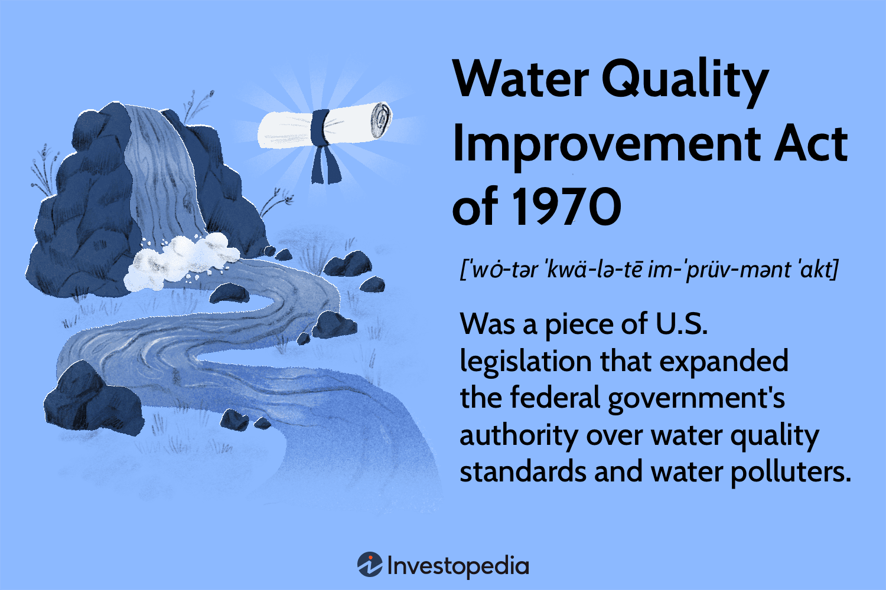

The intersection of environmental law and financial sectors is becoming increasingly significant in today's world. With growing concerns over climate change and natural resource depletion, regulatory frameworks such as the Water Quality Improvement Act of 1970 play a crucial role in shaping industrial practices and technological innovations. This article examines the connection between this landmark legislation and its effects on algorithmic trading, an avant-garde financial practice characterized by high-frequency, automated decision-making processes.

The Water Quality Improvement Act of 1970 set a precedent by amplifying the federal oversight on water pollution and establishing stringent standards for discharge. This emphasis on sustainability has not only influenced traditional industries such as manufacturing and agriculture but also the emergent sectors driven by data and automation. In this context, algorithmic trading serves as an intriguing example of how environmental policies might affect automated financial markets.



Algorithmic trading relies heavily on data to predict market trends and execute trades with precision. Environmental data, such as pollutant levels or changes in regulatory measures, can act as critical inputs that influence trading algorithms. For instance, shifts in environmental policies can alter market dynamics, affecting commodity prices and thereby impacting trading strategies. This interplay highlights the broader implications of environmental regulations on data-driven sectors, where compliance and adaptability can have substantial economic ramifications.

The objective of this article is to evaluate how water quality laws, exemplified by the Water Quality Improvement Act, impact various industries—particularly those like algorithmic trading that are deeply entwined with data analytics and automation. By exploring this relationship, we aim to enhance understanding of how regulatory changes can drive technological advancements and influence market behavior.

## Table of Contents

## The Water Quality Improvement Act of 1970: An Overview

The Water Quality Improvement Act of 1970 significantly augmented federal influence over water quality standards in the United States. This act traces its origins to the Federal Water Pollution Control Act of 1948, which was the first major initiative aimed at regulating water pollution nationwide. The 1970 Act provided a framework for setting and enforcing limitations on pollutant discharges into U.S. waters, marking a substantial shift towards more stringent environmental oversight.

One of the critical aspects of this legislation was its emphasis on preventive measures to hinder the degradation of water resources. The act established specific standards for water bodies, targeting pollutants from industrial, agricultural, and municipal sources. This broadened approach not only elevated the role of federal agencies in regulating water quality but also necessitated collaborations and partnerships with state authorities to ensure compliance and enforcement.

The Water Quality Improvement Act empowered the Environmental Protection Agency (EPA) to take decisive action against entities violating pollution limits, endorsing a more comprehensive and cohesive regulatory strategy. This elevated level of federal oversight was designed to facilitate cleaner waterways, benefiting ecosystems and public health across the country, while encouraging states to adopt compatible local legislation to complement federal efforts.

In conclusion, the 1970 legislation laid a solid foundation for contemporary water quality regulations by expanding federal jurisdiction, formalizing standards, and fostering state partnership—all of which were essential steps towards bolstering environmental protection.

## The Impact of Environmental Regulations on Industries

Environmental laws, such as the Water Quality Improvement Act of 1970, play a vital role in regulating industrial activities by imposing compliance regulations that aim to protect water resources. Initially designed to limit pollutant discharges into U.S. waters, such regulations extend beyond their immediate targets, influencing a wide array of industries.

Industries have responded to these regulations in various ways to meet environmental standards. Compliance often requires the adoption of new technologies and processes, which can lead to increased operational costs. For instance, manufacturing facilities might invest in advanced filtration systems or develop closed-loop systems to minimize waste discharge. This adaptation not only aids compliance but can also lead to more efficient processes, potentially reducing costs in the long run.

Economic implications of environmental regulations are significant. On one hand, compliance represents an upfront cost for industries, driving up prices and affecting competitiveness. However, these regulations can also stimulate innovation. By enforcing stricter environmental standards, there is a push towards developing cleaner and more sustainable technologies. This creates opportunities for research and development, leading to greener innovations that can find broader applications across various sectors.

Moreover, industries have begun to [factor](/wiki/factor-investing) environmental compliance into their cost-benefit analyses, evaluating the long-term benefits of sustainable practices against initial expenditures. This shift is evident in the growing trend of corporate responsibility and transparency, where companies actively report on their environmental impact and compliance status.

In the energy sector, for example, firms have transitioned to cleaner energy sources or invested in carbon capture technologies to align with environmental laws. This not only ensures compliance but can also serve as a competitive advantage as consumers and investors increasingly prioritize sustainability.

The agricultural industry faces unique challenges due to environmental regulations, which often require significant changes to traditional practices. Regulations may necessitate the reduction of runoff containing fertilizers and pesticides, prompting the adoption of precision agriculture techniques. These techniques optimize resource use and minimize environmental impact, leading to cost savings and improved yields.

Environmental regulations, while challenging, also act as catalysts for industry-wide changes, encouraging businesses to innovate and invest in sustainable practices. As industries adapt to these regulations, a balance is achieved between maintaining economic vitality and safeguarding environmental resources, underscoring the economic and ecological interconnectedness in the modern industrial landscape.

## Algorithmic Trading: The Intersection with Environmental Laws

Algorithmic trading, often referred to as algo trading, employs sophisticated computer programs to execute orders in financial markets at phenomenal speeds and substantial volumes. This method leverages complex algorithms to optimize trading strategies, analyze multiple market parameters, and respond to changes in milliseconds. Although on the surface algo trading appears distant from environmental concerns, emerging data trends reveal significant intersections between environmental laws and trading strategies.

Environmental regulations, such as those aimed at controlling pollutant discharges, can indirectly influence financial markets and, consequently, [algorithmic trading](/wiki/algorithmic-trading) activities. Trading algorithms increasingly factor in environmental data because it can serve as a crucial indicator of market conditions. For example, fluctuations in pollutant levels, which are regulated under acts like the Water Quality Improvement Act, might hint at impending regulatory actions or business interruptions in environmentally sensitive industries. These could lead algorithms to adjust trading strategies accordingly.

Historically, financial markets have reacted sharply to legislative changes, with sectors tied to natural resources or energy being notably sensitive. Algorithmic traders utilize these regulatory insights to forecast market movements and optimize trade executions. For instance, if pollutant levels in a region rise beyond acceptable limits, it could predict regulatory crackdowns that might affect industries dependent on those water resources, such as agriculture or manufacturing. Algorithms could potentially detect these trends by monitoring public environmental data and news releases, making anticipatory trades before market conditions shift significantly.

The integration of environmental data into trading algorithms also underscores the broader trend of data-driven finance. Algo trading systems are designed to process vast amounts of information, quantifying environmental metrics and their potential impact on market movements. For instance, traders might use environmental indices or sector-specific pollution metrics as input variables for algorithmic models. Python libraries such as `pandas` and `numpy` are frequently employed to manage and analyze these large datasets, while [machine learning](/wiki/machine-learning) models are trained to identify patterns correlating environmental policies with price movements.

```python
import pandas as pd
import numpy as np

# Example: Analyzing pollutant level data and correlating it with market indices
pollutant_data = pd.read_csv('pollutant_levels.csv')
market_data = pd.read_csv('market_indices.csv')

# Merging datasets on date
merged_data = pd.merge(pollutant_data, market_data, on='Date')

# Finding correlations
correlations = merged_data.corr()

# Example output: correlation between pollutant levels and market index
correlation_coefficient = correlations['Pollutant_Level']['Market_Index']
print(f"The correlation coefficient between pollutant levels and market index is: {correlation_coefficient:.2f}")
```

The above code snippet reflects the kind of analysis algo traders might perform to align trading strategies with environmental data variations. The resulting correlation coefficient could help assess the degree to which environmental changes might impact financial markets.

In conclusion, while algorithmic trading may not immediately associate with environmental laws, the data-driven nature of financial markets necessitates attention to regulatory changes and environmental metrics. By incorporating these factors, algorithmic traders can enhance their predictions, aligning financial strategies with broader ecological and regulatory landscapes. This convergence of finance and environmental policy highlights the emerging complexity of modern trading environments.

## Case Studies: Environmental Policies Influencing Trading Strategies

### Case Studies: Environmental Policies Influencing Trading Strategies

Environmental legislation has progressively influenced trading strategies by integrating ecological and regulatory data into algorithmic models, thereby affecting commodity markets linked to environmental resources such as energy, water, and agricultural products.

One illustrative case involves the European Union's Emissions Trading System (EU ETS), a cornerstone of the EU's policy to combat climate change and discourage carbon emissions through a cap-and-trade system. This framework allocates emission allowances, which serve as tradeable assets. Changes to emission caps or the introduction of stricter compliance measures can directly impact the price [volatility](/wiki/volatility-trading-strategies) of carbon credits. Algorithmic trading systems, in response to these regulatory changes, recalibrate their models to incorporate environmental compliance data, adjusting the valuation and timing of trades to optimize returns. For instance, the anticipation of stricter emission limits often results in a surge in demand for credits, prompting algorithms to forecast price spikes and adjust bidding strategies accordingly.

Additionally, the introduction of stricter water quality regulations, akin to the Water Quality Improvement Act of 1970 in the U.S., affects sectors reliant on water-intensive processes, such as agriculture and certain manufacturing entities. Algorithms trading in agricultural commodities like corn or soybeans integrate water quality and availability data as predictive indicators of crop yield and therefore commodity prices. Regulation-driven shifts in water distribution or quality can lead to revised projections in crop outputs, compelling traders to adapt their strategies to align with anticipated market movements.

Anticipation of regulatory changes significantly influences risk assessments. For example, unexpected policy adjustments can introduce substantial price swings, as observed with the Renewable Energy Directive in Europe, which required increased biofuel use, impacting agricultural commodity prices linked to biofuel production. Trading algorithms monitoring legislative developments exploit these regulatory anticipations to hedge positions or adjust portfolios preemptively, thus minimizing potential risks associated with evolving compliance landscapes.

By incorporating environmental compliance metrics, trading systems not only adjust for immediate regulatory impacts but also adopt a forward-looking stance, gauging long-term implications for market stability and commodity viability. As a result, traders equipped with advanced algorithms gain a competitive edge through the nuanced incorporation of regulatory data into trading models, a testament to the growing intersection of environmental policy and financial markets.

## The Future of Environmental Law in Data-Driven Financial Markets

The progression of environmental laws plays an increasingly significant role in the shaping of market trends, particularly as data analytics integrate more deeply into the financial sector. With the rapid evolution of technology, financial markets are becoming more data-driven, allowing for precise analyses and strategic decision-making. Environmental laws, particularly those addressing sustainability and resource management, can influence market perceptions and investment strategies, embedding themselves into the fabric of financial processes.

Policymakers and financial institutions are pivotal in aligning regulatory compliance with technological advancements. As environmental regulations evolve, they introduce new variables and constraints that must be addressed in financial models and trading algorithms. Policymakers are tasked with crafting regulations that both protect environmental interests and foster economic growth. They must understand that stringent regulations could potentially stifle innovation or shift investments away from environmentally sensitive sectors. Hence, a balanced approach is necessary to encourage sustainable economic practices while not hampering technological development. Financial institutions, on the other hand, are finding innovative ways to incorporate these regulations into their practices. They develop risk assessment models that account for environmental factors, helping investors make more informed decisions. The incorporation of machine learning and AI in analyzing environmental data allows institutions to anticipate regulatory impacts and adjust their strategies accordingly.

There is a growing recognition of the need for dynamic frameworks that consider both environmental sustainability and economic opportunity. Static regulations often fall short in addressing the complex, interconnected nature of modern financial markets. Dynamic frameworks propose adaptable regulations that can swiftly respond to new data and trends without requiring lengthy legislative processes. Such frameworks could involve the use of real-time data analytics to monitor environmental indicators and economic metrics, providing feedback to modulate regulatory intensity accordingly. This approach not only ensures compliance but also promotes innovation and economic growth within a sustainable framework.

In conclusion, as environmental regulations and financial markets become more interconnected, there is a profound opportunity to advance sustainable economic practices. Through collaborative efforts between policymakers and financial institutions, and the adoption of adaptive regulatory frameworks, it is possible to foster an environment where economic development does not compromise ecological stability.

## Conclusion

The intersection of the Water Quality Improvement Act of 1970 and financial sectors such as algorithmic trading illustrates the multifaceted relationship between environmental regulations and technological advancements in finance. Although the primary goal of the Act was to enhance water quality by reducing pollutant discharges, its influence extends beyond traditional environmental boundaries. The Act's emphasis on data-driven compliance has significant implications for industries reliant on high-speed data processing and decision-making, such as algorithmic trading.

Algorithmic trading systems depend heavily on a variety of data inputs, including environmental data that could reflect the implications of regulatory changes. For instance, changes in environmental policies affecting natural resources can influence market conditions and commodity prices. This reciprocal relationship highlights how environmental regulations, while safeguarding ecological resources, can also alter financial landscapes by impacting market dynamics and risk assessments.

The reciprocal impact between these sectors underscores the increasing importance of interdisciplinary strategies. To effectively address the challenges presented by environmental policies and financial innovations, both sectors must collaborate, incorporating environmental considerations into economic models and leveraging technological advancements to enhance regulatory compliance and market stability.

In conclusion, the Water Quality Improvement Act exemplifies how environmental legislation can transcend its primary objectives, affecting various sectors. As technological and financial landscapes continue to evolve, the integration of environmental policies into financial strategies offers both challenges and opportunities. Interdisciplinary approaches are essential for fostering sustainable development that aligns technological progress with environmental and economic health.

## References & Further Reading

[1]: Fleisher, Susan. "The Water Quality Improvement Act of 1970." Environmental Law Institute, 1970.

[2]: ["Advances in Financial Machine Learning"](https://www.amazon.com/Advances-Financial-Machine-Learning-Marcos/dp/1119482089) by Marcos Lopez de Prado

[3]: ["Environmental Governance: A Report on the Effects of Policies like the Water Quality Improvement Act"](https://www.sciencedirect.com/science/article/pii/S259033222200269X) by Graham Smith

[4]: ["Machine Learning for Algorithmic Trading"](https://github.com/stefan-jansen/machine-learning-for-trading) by Stefan Jansen

[5]: ["Quantitative Trading: How to Build Your Own Algorithmic Trading Business"](https://www.amazon.com/Quantitative-Trading-Build-Algorithmic-Business/dp/1119800064) by Ernest P. Chan