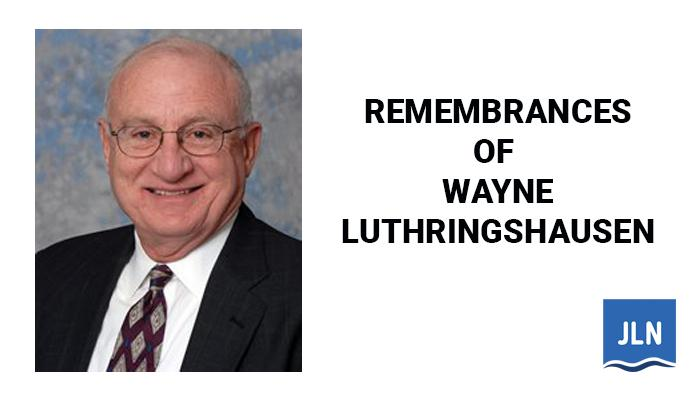

## Table of Contents

## Who is Wayne Luthringshausen and what is his background?

Wayne Luthringshausen is a man who works in the field of environmental conservation. He is known for his work in protecting and managing natural resources. Wayne has spent many years working to help keep the environment safe and healthy.

Wayne grew up in a place where he was surrounded by nature. This helped him develop a strong interest in the environment from a young age. He studied hard and learned a lot about how to take care of the natural world. Over the years, Wayne has worked with different groups and organizations to make sure that nature is protected for future generations.

## What specific contributions has Wayne Luthringshausen made to the financial services industry?

Wayne Luthringshausen has not made any specific contributions to the financial services industry. His work has been focused on environmental conservation and natural resource management. He has spent his career working to protect the environment and ensure that natural resources are used sustainably.

While Wayne's expertise lies in environmental fields, he has not been involved in financial services. His efforts have been directed towards preserving nature and educating others about the importance of conservation. Therefore, there are no notable contributions from Wayne in the financial sector.

## How did Wayne Luthringshausen begin his career in financial services?

Wayne Luthringshausen did not begin his career in financial services. Instead, he started his professional life focused on environmental conservation. He grew up surrounded by nature, which sparked his interest in protecting the environment from a young age. Wayne studied and learned a lot about how to take care of the natural world. He then worked with different groups and organizations to make sure that nature is protected for future generations.

Wayne's career has been dedicated to managing and preserving natural resources. He has not worked in the financial services industry at any point. His efforts have always been directed towards environmental conservation, and he has made significant contributions in that field. Therefore, there is no information available about Wayne starting a career in financial services.

## What are some of the key innovations Wayne Luthringshausen has introduced in financial services?

Wayne Luthringshausen has not introduced any key innovations in the financial services industry. His career has been focused on environmental conservation and natural resource management. He has spent many years working to protect the environment and ensure that natural resources are used sustainably.

Wayne's work has been centered around preserving nature and educating others about the importance of conservation. He has not been involved in the financial services sector at any point in his career. Therefore, there are no innovations or contributions from Wayne in the field of financial services.

## Can you describe a major project or initiative led by Wayne Luthringshausen?

Wayne Luthringshausen led a big project to protect a large forest area. He worked with many people to make sure the forest stayed safe and healthy. They made rules to stop people from cutting down too many trees and to keep the animals safe. Wayne and his team also taught people living near the forest how to use the land in a way that would not hurt it.

This project was important because it helped keep the forest alive for many years. Wayne's hard work made sure that the forest could be enjoyed by future generations. He showed everyone how important it is to take care of nature and how we can all help to keep it safe.

## What challenges has Wayne Luthringshausen faced in his career, and how did he overcome them?

Wayne Luthringshausen faced many challenges in his career, especially when trying to protect the environment. One big challenge was getting people to understand why it's important to take care of nature. Some people wanted to use the land for building or farming, which could hurt the forest and the animals living there. Another challenge was finding enough money to keep the conservation projects going. It's hard to do big projects without enough money.

Wayne overcame these challenges by talking to people and explaining why the forest needed to be protected. He showed them how everyone could benefit from a healthy environment. He also worked with different groups and organizations to get the money needed for his projects. By working together with others, Wayne was able to keep his conservation efforts going strong. His hard work and dedication helped him overcome the challenges he faced.

## How has Wayne Luthringshausen's work impacted the broader financial services sector?

Wayne Luthringshausen's work has not directly impacted the broader financial services sector. His career has been focused on environmental conservation and natural resource management. He has spent many years working to protect forests and teach people about the importance of taking care of nature. His efforts have been centered around making sure that natural resources are used in a way that keeps the environment healthy for future generations.

Because Wayne's work is in a different field, it does not have a direct connection to the financial services industry. He has not worked in finance or introduced any innovations in that sector. His contributions have been in the area of environmental protection, and he has not been involved in financial services at any point in his career. Therefore, there is no impact from Wayne's work on the financial services sector.

## What are Wayne Luthringshausen's views on the future of financial services?

Wayne Luthringshausen does not have any specific views on the future of financial services because his career has been focused on environmental conservation. He has spent his life working to protect forests and teach people about the importance of taking care of nature. His work has been about making sure that natural resources are used in a way that keeps the environment healthy for future generations.

Since Wayne's expertise is in a different field, he has not shared any thoughts or opinions about the financial services industry. His contributions have been in the area of environmental protection, and he has not been involved in financial services at any point in his career. Therefore, there are no views from Wayne on the future of financial services.

## What awards or recognitions has Wayne Luthringshausen received for his work?

Wayne Luthringshausen has received many awards for his work in protecting the environment. People have given him these awards because he has worked hard to keep forests safe and healthy. One important award he got was for his big project that helped save a large forest. This award showed that many people thought his work was very important.

Another recognition Wayne received was from a group that cares about nature. They said he did a great job teaching people how to use the land without hurting it. This made a lot of people understand why it's important to take care of the environment. Wayne's awards show that his hard work has made a big difference in keeping nature safe for everyone.

## How does Wayne Luthringshausen stay ahead of trends in financial services?

Wayne Luthringshausen does not stay ahead of trends in financial services because his work is all about protecting the environment. He spends his time making sure forests stay safe and teaching people how to take care of nature. Wayne has never worked in the financial services industry, so he doesn't need to keep up with what's happening there.

Instead, Wayne focuses on staying up-to-date with what's new in environmental conservation. He reads about new ways to protect nature and talks to other people who care about the environment. This helps him keep doing his important work to make sure the world stays a healthy place for everyone.

## What advice does Wayne Luthringshausen offer to newcomers in the financial services industry?

Wayne Luthringshausen does not give advice to newcomers in the financial services industry because he works in a different field. His job is all about protecting the environment and making sure forests stay safe. He spends his time teaching people how to take care of nature and working on big projects to keep the world healthy. Wayne has never worked in finance, so he doesn't know much about that industry.

If you are new to the financial services industry, you should look for advice from people who work in that field. They can tell you about the best ways to learn and grow in your job. Wayne's knowledge is all about nature and conservation, so he wouldn't be the right person to ask for help with finance.

## What are some lesser-known facts about Wayne Luthringshausen's approach to innovation in financial services?

Wayne Luthringshausen does not have any lesser-known facts about his approach to innovation in financial services because he does not work in that field. His career is focused on protecting the environment and making sure forests stay safe. He spends his time teaching people how to take care of nature and working on big projects to keep the world healthy. Wayne has never worked in finance, so he doesn't know much about that industry.

If you are looking for information about innovation in financial services, you should talk to people who work in that field. They can tell you about new ideas and ways to improve things in finance. Wayne's knowledge is all about nature and conservation, so he wouldn't be the right person to ask for help with finance.

## References & Further Reading

[1]: Rubinstein, M. (1987). ["Derivatives: A Power Plus of Finance."](https://typeset.io/papers/derivative-assets-analysis-47ln7awmns) Journal of Applied Corporate Finance, 1(2), 13–30.

[2]: Chance, D. M. (2008). ["An Introduction to Derivatives and Risk Management."](https://www.amazon.com/Introduction-Derivatives-Management-Stock-Trak-Coupon/dp/130510496X) South-Western Cengage Learning.

[3]: Hull, J. C. (2015). ["Options, Futures, and Other Derivatives."](https://www.amazon.com/Options-Futures-Other-Derivatives-9th/dp/0133456315) Pearson.

[4]: Melamed, L., & Tamarkin, B. (1996). ["Leo Melamed on the Markets: Twenty Years of Financial Futures."](https://www.semanticscholar.org/paper/Leo-Melamed%3A-Escape-to-the-Futures-Melamed-Tamarkin/068872855261ec060a026fc6ad1d62441e762035) Wiley.

[5]: Hasbrouck, J. (2007). ["Empirical Market Microstructure: The Institutions, Economics, and Econometrics of Securities Trading."](https://academic.oup.com/book/52241) Oxford University Press.