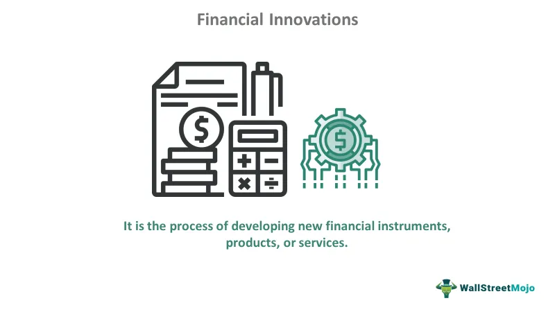

The financial services industry is characterized by rapid evolution and innovation, driven by key individuals and technological advancements. Wayne Luthringshausen emerges as a notable figure in this space, particularly for his contributions to the development of options trading and clearing mechanisms. He played a critical role in shaping the infrastructure that underpins modern financial markets. His leadership at the Options Clearing Corporation (OCC) was instrumental in revolutionizing the way options were traded, thus laying the groundwork for today’s dynamic trading environment.

Luthringshausen's efforts at OCC were pivotal in creating a reliable and efficient system for managing and clearing options trades. This transformation facilitated greater market participation and enhanced the transparency and security of options trading. His vision and implementation of robust clearing mechanisms have ensured that the financial markets operate smoothly, even as they face increasing complexity and scale.



Concurrently, the integration of algorithmic trading and technologies such as the Options Price Reporting Authority (OPRA) has significantly influenced the landscape of financial services. Algorithmic trading, which utilizes sophisticated algorithms to execute trades at high speeds, has become a cornerstone of modern trading strategies. This method relies heavily on accurate, real-time data – a need that OPRA fulfills by providing essential market information, thus enabling informed decision-making.

Wayne Luthringshausen’s work and the technological advancements in algorithmic trading and OPRA collectively provide the foundation for the modern financial trading practices observed today. They exemplify how visionary leadership and technological innovation are intertwined, spearheading the progress and efficiency of financial markets. As we explore these elements, Luthringshausen’s contributions and the significance of algorithmic trading become increasingly apparent in shaping the future of financial services.

## Table of Contents

## Wayne Luthringshausen: A Legacy in Options Clearing

Wayne Luthringshausen's career in financial services commenced in the early 1960s, a period marked by notable contributions to the securities and futures industry. He played a pivotal role in the establishment of the first centralized marketplace for listed options contracts through his efforts at the Chicago Board Options Exchange (CBOE). This development was a significant milestone in financial markets as it provided a regulated platform for the trading of standardized options, enhancing transparency and stability in the transactions.

In 1973, Luthringshausen took on the role of President and CEO of the CBOE Clearing Corporation, which was later renamed the Options Clearing Corporation (OCC). His strategic leadership was instrumental in transforming the OCC into the largest equity derivatives clearing organization globally. Under his stewardship, the OCC developed a robust clearing infrastructure that efficiently managed the risk and settlement processes, integral to the functioning of options markets. This institutional framework allowed for the scaling of options trading activities, supporting market growth and innovation.

Luthringshausen's influence extended beyond operational advancements to include advocacy for industry-wide standards and practices that ensured the sustainability and integrity of the options trading community. His contributions to the industry were recognized with his induction into the Futures Hall of Fame, underscoring his role as a visionary in enhancing the structure and function of financial markets. His legacy in options clearing continues to be acknowledged as foundational, forming the bedrock of modern options and derivatives trading.

## The Role of OPRA in Modern Trading

The Options Price Reporting Authority (OPRA) plays an essential role in providing market data crucial for options trading. Established to ensure that traders and investors have access to real-time options pricing, OPRA contributes to market transparency and supports informed decision-making.

Under the leadership of key figures such as Wayne Luthringshausen, OPRA underwent significant evolution. The demand for timely and accurate data increased as options trading gained popularity, prompting enhancements in OPRA's data dissemination capabilities. This evolution allowed for an improved flow of information, which was critical in matching the growing complexity and [volume](/wiki/volume-trading-strategy) of trades in the market. 

OPRA's data feeds are central to [algorithmic trading](/wiki/algorithmic-trading) strategies, which rely on the rapid and precise execution of trades. Algorithmic trading uses computer algorithms to make trading decisions based on various market conditions, and the data provided by OPRA is integral to this process. The availability of real-time data allows for the swift execution necessary in volatile markets, enabling traders to capitalize on fleeting opportunities.

Looking to the future, OPRA continues to enhance technological capabilities to increase the efficiency and reliability of options market information. Advancements focus on improving the speed and accuracy of data delivery, accommodating the fast-paced nature of modern trading environments. As technologies and market structures evolve, OPRA remains a pivotal component in ensuring the seamless operation and advancement of options trading.

## Algorithmic Trading: Revolutionizing Financial Markets

Algorithmic trading, a sophisticated investment strategy, leverages complex algorithms to execute trades at speeds and frequencies that are impossible for human traders. At its core, this type of trading uses mathematical models and advanced software to make swift, profitable trading decisions based on real-time market data. The primary objective is to capitalize on small price discrepancies across various financial instruments or markets, thus contributing significantly to market efficiency.

This approach to trading not only augments market efficiency but also underpins the very fabric of modern financial markets. The reliance on real-time data feeds is paramount, with sources like the Options Price Reporting Authority (OPRA) providing crucial information for executing trades seamlessly. The ability to access and process this data swiftly enables traders to capitalize on short-lived market movements, effectively reducing opportunities for [arbitrage](/wiki/arbitrage) and aligning prices more closely globally.

Technological advancements have further facilitated the growth of algorithmic trading by drastically reducing transaction costs. High-frequency traders, for instance, exploit minimal delays in order execution to optimize trading outcomes. This has been made possible through the integration of cutting-edge technology with strategic financial acumen, allowing for the meticulous crafting of trading strategies that deliver precise market outcomes.

Despite its revolutionary benefits, algorithmic trading does present challenges. Among these are heightened market [volatility](/wiki/volatility-trading-strategies) and potential [liquidity](/wiki/liquidity-risk-premium) issues, especially evident during events characterized by rapid price fluctuations. Additionally, the complexity of these algorithms necessitates stringent regulatory oversight to mitigate risks associated with erroneous trading activities or system failures, which could potentially lead to broader market disruptions.

To illustrate the basic concept of algorithmic trading, consider the Python example below, which demonstrates a simple algorithmic trading strategy utilizing moving averages:

```python
import pandas as pd

def moving_average_strategy(prices, short_window=40, long_window=100):
    signals = pd.DataFrame(index=prices.index)
    signals['price'] = prices
    signals['short_mavg'] = prices.rolling(window=short_window, min_periods=1).mean()
    signals['long_mavg'] = prices.rolling(window=long_window, min_periods=1).mean()

    signals['signal'] = 0.0
    signals['signal'][short_window:] = np.where(
        signals['short_mavg'][short_window:] > signals['long_mavg'][short_window:], 1.0, 0.0)
    signals['positions'] = signals['signal'].diff()

    return signals

# Example usage with hypothetical price data
prices = pd.Series([100, 101, 102, 103, 104, 105, 106, 107, 108, 109])
signals = moving_average_strategy(prices)
print(signals)
```

This sample strategy calculates short and long-term moving averages and generates buy or sell signals based on their crossovers. While simple, it embodies the foundational principles of algorithmic trading: using quantitative data to make trading decisions programmatically.

Algorithmic trading continues to evolve, integrating ever more sophisticated technologies such as [machine learning](/wiki/machine-learning) and [artificial intelligence](/wiki/ai-artificial-intelligence) to further refine decision-making processes. As the financial ecosystem becomes increasingly digitized, the significance of algorithmic trading is set to expand, reinforcing the importance of regulatory frameworks to ensure market stability and integrity.

## The Intersection of Luthringshausen's Work and Algorithmic Trading

Wayne Luthringshausen played a key role in shaping the modern landscape of trading through his development of a centralized options clearing platform. His vision for an efficient and transparent options market finds resonance in today’s algorithmic trading, which relies heavily on similar principles. Algorithmic trading requires fast, accurate, and reliable data to function effectively, and this need is supported by the infrastructure Luthringshausen helped to create.

One of the pivotal aspects of this intersection is the role of the Options Price Reporting Authority (OPRA). During Luthringshausen's leadership, the emphasis on transparency and timely data dissemination from OPRA established a reliable framework for market participants. This framework is crucial for contemporary algorithmic trading strategies, which require high-frequency data to initiate rapid trade executions and capitalize on market opportunities.

Furthermore, the synergy between a well-structured clearinghouse and advanced trading technologies underscores how financial markets have evolved. A centralized clearing platform ensures that transactions are settled efficiently, reducing counterparty risk and enhancing market stability—a prerequisite for the algorithmic systems that thrive on minimal latency and maximum accuracy.

Understanding Luthringshausen's impact reveals insights into the ongoing evolution of trading practices. His contributions provided the necessary training wheels for algorithmic trading's eventual emergence, which relies on similar foundations of transparency and efficiency. These elements are now essential to navigating the complex dynamics of financial markets, highlighting the lasting influence of Luthringshausen's work on current market structures and future advancements in trading technologies.

## Conclusion

Wayne Luthringshausen's legacy in the financial services industry continues to significantly shape the efficiency and structure of modern trading practices. His pioneering efforts in establishing a centralized options clearing platform have laid the groundwork for enhanced transparency and streamlined processes in options trading, a foundation that remains pivotal in today's markets.

The integration of data services from the Options Price Reporting Authority (OPRA) with algorithmic trading technologies marks a transformative evolution in financial markets. OPRA's ability to provide real-time, high-frequency data to traders has propelled the development of sophisticated algorithms that optimize trading decisions and execution. This synergy underscores the critical role of robust infrastructure and the indispensability of data accuracy and timeliness in facilitating market efficiency.

The success of these advancements highlights the necessity of visionary leadership and technological innovation. Industry leaders like Luthringshausen exemplify the profound impact that strategic foresight and commitment to market integrity can have on the development of trading ecosystems. As a result, the financial markets have become more resilient, capable of accommodating rapid technological advancements and adapting to dynamic economic landscapes.

Looking ahead, the future of algorithmic trading and options market infrastructure holds promise for even greater levels of efficiency and robustness in financial services. As these sectors evolve, they will continue to build on the foundational work of pioneers like Luthringshausen, further enhancing the sophistication of trading strategies and the resilience of market structures. This ongoing evolution promises to reinforce the stability and efficacy of modern financial markets, benefiting traders, investors, and the broader economic milieu.

## References & Further Reading

[1]: Rubinstein, M. (1987). ["Derivatives: A Power Plus of Finance."](https://typeset.io/papers/derivative-assets-analysis-47ln7awmns) Journal of Applied Corporate Finance, 1(2), 13–30.

[2]: Chance, D. M. (2008). ["An Introduction to Derivatives and Risk Management."](https://www.amazon.com/Introduction-Derivatives-Management-Stock-Trak-Coupon/dp/130510496X) South-Western Cengage Learning.

[3]: Hull, J. C. (2015). ["Options, Futures, and Other Derivatives."](https://www.amazon.com/Options-Futures-Other-Derivatives-9th/dp/0133456315) Pearson.

[4]: Melamed, L., & Tamarkin, B. (1996). ["Leo Melamed on the Markets: Twenty Years of Financial Futures."](https://www.semanticscholar.org/paper/Leo-Melamed%3A-Escape-to-the-Futures-Melamed-Tamarkin/068872855261ec060a026fc6ad1d62441e762035) Wiley.

[5]: Hasbrouck, J. (2007). ["Empirical Market Microstructure: The Institutions, Economics, and Econometrics of Securities Trading."](https://academic.oup.com/book/52241) Oxford University Press.