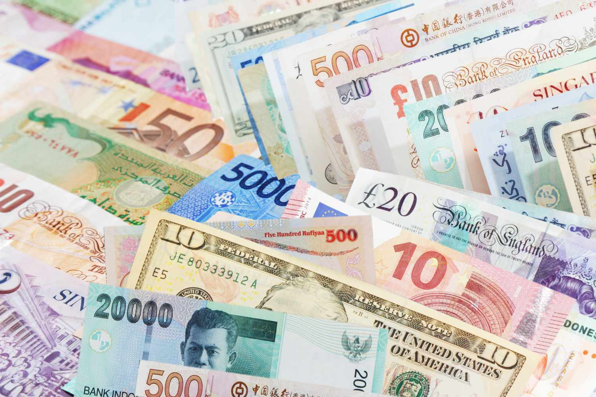

A weak currency is one that has a lower value in comparison to other currencies in the global market. Its significance is profound as it directly affects a nation's economic transactions, influencing trade balances, foreign investments, and inflation rates. Currency strength plays a pivotal role in determining a country's economic stability and growth trajectory. Strong currencies typically indicate robust economic performance and investor confidence, whereas weak currencies often reflect underlying economic challenges or instability.

For investors and traders, comprehending weak currencies is crucial as these currencies can result in unpredictable market movements. Weak currencies can create both risks and opportunities; they can attract foreign investments due to lower operational costs, or conversely repel them due to fear of devaluation. This understanding becomes particularly important in the context of algorithmic trading, where decisions are made at high speeds based on complex data analysis.

Understanding the dynamics of weak currencies helps in navigating the unpredictable terrains of global markets. Weak currencies, influenced by various factors such as economic policies, political instability, and social upheaval, can dictate trading strategies and investment outcomes. This article focuses on examining examples of current weak currencies and the resulting implications in algorithmic trading, thereby equipping investors and traders with the insights needed to adapt and thrive in environments marked by currency volatility.

## Table of Contents

## Understanding Weak Currencies

A weak currency is defined as one that has a lower value relative to other currencies. This valuation can make imports more expensive and exports cheaper, influencing trade balances and economic stability. Several factors contribute to a currency's weakness, including economic, political, and social elements.

Economically, a weak currency often arises when a country deals with high inflation rates, low interest rates, or a negative trade balance. Inflation diminishes a currency's purchasing power, leading to depreciation. Low interest rates can discourage foreign investment, reducing demand for the currency. A trade deficit implies more imports than exports, which can lead to outward currency flow, weakening its value.

Politically, instability or unpredictability can deter investment and confidence, impacting the currency adversely. Political decisions such as those involving monetary policy, fiscal actions, and regulatory changes can also influence currency strength. Social factors like public sentiment, labor strikes, or widespread unrest can affect economic performance, indirectly impacting the currency.

Distinguishing between temporary and persistent currency weakness is crucial. Temporary weakness might occur due to seasonal variations or short-term economic disruptions such as natural disasters. These usually resolve over time without substantial policy shifts. Persistent weakness, however, indicates deeper structural issues, requiring long-term policy interventions. This could be due to consistently high inflation rates, chronic trade deficits, or long-term political instability.

Weak currencies influence national economic strategies significantly. Governments and central banks might intervene through policy measures to stabilize or adjust currency valuations. Strategies such as altering interest rates, engaging in foreign exchange reserves management, or implementing fiscal policies can be deployed to address currency weakness. Furthermore, countries might adjust their economic focus, emphasizing export-driven growth to capitalize on the competitive advantage provided by a weaker currency.

In conclusion, understanding the nature and implications of weak currencies is essential for grasping global economic dynamics and steering economic strategies effectively.

## Examples of Current Weak Currencies

In recent years, several currencies have experienced periods of significant weakness, driven by a combination of domestic challenges and global events. A weak currency is typically characterized by a decline in its value relative to other currencies, which can be influenced by factors such as inflation, political instability, and economic policies. Below, we examine a few examples of currencies that have faced notable depreciation and the underlying causes.

### Turkish Lira

The Turkish Lira has been one of the most prominent examples of a weak currency in recent years. Its decline can be primarily attributed to high inflation rates, which reached nearly 20% in 2021, compounded by economic mismanagement and political pressures on the central bank. The Turkish government's interference in monetary policy, particularly its unconventional stance on interest rates, has further exacerbated the situation. Global economic uncertainties, such as fluctuating oil prices and geopolitical tensions in the region, have also played a role in the Lira's depreciation. The result has been increased inflation, reduced investor confidence, and challenges in maintaining foreign investment.

### Argentine Peso

The Argentine Peso has faced persistent weakness due to longstanding economic issues such as chronic inflation, which has often surpassed 40%, and a series of debt defaults. In 2018, Argentina approached the International Monetary Fund (IMF) for a record $57 billion bailout aimed at stabilizing the economy. Despite these efforts, the Peso continued to lose value, driven by lack of investor confidence and ongoing political instability. The Argentine government's fiscal policies, including the occasional use of capital controls, have attempted to curb the currency's depreciation but with limited success.

### Venezuelan Bolívar

Perhaps one of the most extreme cases of currency weakness is the Venezuelan Bolívar. Hyperinflation, reaching over a million percent in recent years, has rendered the Bolívar practically worthless in the global market. Economic mismanagement, widespread corruption, and severe political crises have contributed to the collapse of Venezuela's economy. The decline in oil prices, the country's primary export, has further eroded the Bolívar's value. In response, Venezuela introduced the Bolívar Soberano in 2018, cutting five zeros from the currency, although this measure failed to address the underlying economic issues.

### Global Events Impact

Currency valuations can also be significantly impacted by global events. For example, the COVID-19 pandemic led to widespread economic disruptions, causing investor uncertainty and prompting capital flows to more stable currencies, often referred to as "safe havens" like the US Dollar and Swiss Franc. Furthermore, trade tensions and geopolitical events—such as Brexit—have influenced the valuation of currencies like the British Pound and the Euro. In such scenarios, the depreciation of certain currencies can lead to adjustments in import and export balances, affecting economies worldwide.

Understanding the factors behind currency weakness in these case studies highlights the complex interplay of domestic policies and global influences. For investors and policymakers, recognizing these elements is crucial in navigating the challenges posed by weak currencies.

## Economic and Financial Implications of Weak Currencies

Weak currencies significantly affect both economic and financial landscapes, influencing a country's trade balance, pricing stability, and policy-making. The dynamics between imports and exports are notably altered when a currency depreciates in value. Currency depreciation typically makes a nation’s exports cheaper and imports more expensive. As a result, countries experiencing currency weakness often see an increase in export activity, which can be beneficial for domestic industries focused on international markets. Conversely, the cost of importing goods rises, which can lead to a reduction in import [volume](/wiki/volume-trading-strategy). This trade adjustment can help mitigate trade deficits but may also lead to inflationary pressures as the cost of imported goods increases.

Inflation is a frequent consequence of a weak currency, as imported goods and services become more expensive. Companies may pass these increased costs onto consumers, leading to higher overall price levels within the economy. Central banks may be forced to respond by adjusting interest rates to control inflation, albeit at the risk of slowing economic growth. However, a weaker currency might reduce the impact of deflation by stimulating demand for exports and encouraging domestic consumption due to the reduced attractiveness of imported goods.

Despite its challenges, a weak currency can present certain economic benefits. For one, it can boost tourism, as the destination becomes more affordable for foreign visitors, which in turn can lead to increased revenue in sectors like hospitality and retail. In addition, domestic production may receive a stimulus from reduced reliance on imports, fostering local businesses and potentially leading to job creation.

Central banks and policymakers face several challenges when dealing with weak currencies. They must balance the need to maintain price stability while supporting economic growth. Exchange rate policies might need adjustment to prevent excessive currency depreciation, requiring intervention in foreign exchange markets. Such interventions can be costly and may not always yield the desired outcomes without addressing underlying economic issues such as fiscal deficits or structural inefficiencies.

Overall, the weak currency environment necessitates careful economic management to harness potential benefits while mitigating negative consequences. Understanding these implications is critical for devising strategies that align with long-term economic objectives, ensuring stability and growth in increasingly interconnected global markets.

## The Role of Algo Trading in Weak Currency Environments

Algorithmic trading, commonly known as algo trading, refers to the use of computer algorithms to manage the trading of financial assets with minimal human intervention. This method has gained significant prominence due to its ability to process vast amounts of data at high speed, making it particularly useful in volatile market conditions where currency values fluctuate rapidly.

### Algorithmic Trading and Currency Weakness Response

Algo traders utilize sophisticated algorithms to effectively respond to currency weakness. In environments with weak currencies, there is increased [volatility](/wiki/volatility-trading-strategies) and potentially profitable opportunities that need quick responses. Algorithms are designed to analyze and interpret real-time data, including [forex](/wiki/forex-system) market trends, geopolitical events, and economic indicators. Such capabilities allow algo traders to capitalize on [arbitrage](/wiki/arbitrage) opportunities, where discrepancies in currency value between different markets are exploited for profit.

### Strategies for Exploiting Weak Currencies

Various strategies are employed in [algorithmic trading](/wiki/algorithmic-trading) to take advantage of weak currencies. One common approach is the [carry](/wiki/carry-trading) trade, where traders borrow funds in a currency with a low-[interest rate](/wiki/interest-rate-trading-strategies) (often a weaker currency) and invest in a currency with a higher interest rate, aiming to profit from the interest rate differential.

Another strategy involves mean reversion, which assumes that currency prices will eventually return to their historical average. Algorithms are programmed to identify currencies trading outside their historical price range and execute trades accordingly. Moreover, [statistical arbitrage](/wiki/statistical-arbitrage), which applies statistical methods to exploit pricing inefficiencies in currency markets, is also frequently used.

### Importance of Speed and Data Analysis

In the highly dynamic forex market, speed and data analysis are critical. Algorithms can execute trades in fractions of a second, significantly faster than any human trader. This speed advantage is crucial in weak currency environments where opportunities can be fleeting. High-frequency trading ([HFT](/wiki/high-frequency-trading-strategies)), a subtype of algo trading, exemplifies this necessity by focusing on executing a large number of orders at extraordinarily fast speeds to capture small price differences.

Furthermore, data analysis is a cornerstone of successful algo trading. Algorithms process and analyze large volumes of data, leveraging [machine learning](/wiki/machine-learning) and [artificial intelligence](/wiki/ai-artificial-intelligence) (AI) to improve decision-making processes. By employing complex models to predict price movements and identify trade signals, algo traders gain insights that lead to more informed trading decisions.

In conclusion, the role of algorithmic trading in weak currency environments underscores the importance of technological sophistication in modern financial markets. By harnessing high-speed execution and advanced data analytics, algo traders are well-positioned to navigate the challenges and opportunities presented by weak currencies.

## Strategies for Traders and Investors

When dealing with weak currencies, traders and investors need to adopt precise strategies to manage risk and optimize returns. This section outlines some effective approaches and considerations for navigating such financial environments.

### Tips for Traders Dealing with Weak Currencies

Understanding market trends and having access to reliable data are crucial when investing in weak currencies. Traders should focus on indicators related to inflation, interest rates, and political stability to forecast currency movements accurately. Following are some practical tips:

1. **Stay Informed**: Continuously monitor economic reports and geopolitical developments. Use platforms providing real-time data feeds and news alerts to remain updated on currency fluctuations.

2. **Leverage Technical Analysis**: Utilize chart patterns, oscillators, and moving averages to understand historical price movements and predict potential trends.

3. **Hedge Currency Exposure**: Employ derivative markets such as futures and options to hedge against adverse currency movements. Hedging helps in protecting investments from unexpected devaluations.

4. **Use Stop-Loss Orders**: Implement stop-loss orders to limit potential losses. This strategy is particularly crucial in volatile currency markets.

### Long-Term versus Short-Term Strategies in a Weak Currency Scenario

The choice between long-term and short-term investment strategies often depends on the trader’s risk tolerance, market outlook, and financial goals.

- **Long-Term Strategies**: These strategies typically involve holding positions for extended periods, betting on future economic stability or growth in affected countries. Investors could focus on intrinsic value and potential currency recovery driven by economic reforms or improved trade balances.

- **Short-Term Strategies**: Short-term trading, often referred to as forex trading, is more speculative, relying on daily or weekly market fluctuations. Algorithmic trading often suits short-term strategies due to its capability to process large datasets swiftly to capitalize on minor price movements.

### Risks Associated with Trading Weak Currencies

Trading weak currencies comes with inherent risks:

- **Volatility Risk**: Weak currencies may experience significant volatility, which can lead to substantial financial losses if not managed properly.

- **Political and Economic Risk**: Uncertain political climates or economic instability in countries with weak currencies can lead to abrupt market shifts.

- **Liquidity Risk**: In some scenarios, the currency may not be as easily tradable as stronger currencies, potentially leading to execution risk.

### The Role of Diversification in Hedging Against Currency Volatility

Diversification is a key risk management strategy that mitigates the impacts of currency volatility:

1. **Diversify Across Currency Pairs**: By trading in multiple currency pairs, investors can spread their risk. For instance, balancing positions between a weak currency and a major currency can stabilize returns.

2. **Incorporate Asset Diversification**: Beyond currencies, investing in various asset classes—such as commodities, equities, and bonds—can provide a buffer against significant currency depreciation.

3. **Utilize Geographical Diversification**: Investing in multiple geographic regions can reduce the risk associated with economic downturns in any single country.

By incorporating these strategies, traders and investors can effectively navigate the challenges posed by weak currencies, optimizing their portfolios to withstand potential economic and financial pressures.

## Conclusion

In conclusion, understanding the dynamics of weak currencies is crucial for both policymakers and investors. Weak currencies are characterized by their lower purchasing power relative to stronger counterparts, often resulting from a combination of economic, political, and social factors. Temporary depreciation might stem from transient economic imbalances, while persistent weakness could indicate deeper structural issues within a nation's economy. These distinctions impact economic strategies, influencing decisions regarding monetary policy, trade partnerships, and fiscal measures.

Weak currencies can have profound economic and financial implications. They typically lead to more expensive imports, potentially causing inflationary pressures, which central banks may counter with tighter monetary policies. Conversely, a weaker currency can boost exports by making them cheaper on the global market, potentially increasing a nation's trade balance. Some countries may even benefit from enhanced domestic production and a stimulated tourism sector as a result.

The rise of algorithmic trading has added a technological layer to how weak currencies are managed. Algo traders leverage speed and data analysis to exploit fluctuations, utilizing strategies that capitalize on the perceived volatility of these currencies. The importance of maintaining robust, adaptable trading systems cannot be overstated in monitoring and reacting to currency movements efficiently.

Looking forward, the outlook for weak currencies within the global economy appears to be mixed. Ongoing geopolitical tensions, shifting global trade patterns, and economic policy shifts can all play significant roles in influencing currency valuations. For investors and traders, staying informed about these developments is essential to manage risks and capitalize on opportunities. Diversification remains a pivotal strategy to hedge against the inherent volatility in trading weak currencies.

Ultimately, adaptability and awareness are key in navigating the complexities associated with weak currencies. Traders and policymakers must be attuned to the rapidly changing economic landscapes, leveraging both traditional and algorithmic strategies to achieve their objectives. As the global economy evolves, so too must our approaches to understanding and managing currency markets.

## References & Further Reading

[1]: Bergstra, J., Bardenet, R., Bengio, Y., & Kégl, B. (2011). ["Algorithms for Hyper-Parameter Optimization."](https://proceedings.neurips.cc/paper/2011/file/86e8f7ab32cfd12577bc2619bc635690-Paper.pdf) Advances in Neural Information Processing Systems 24.

[2]: ["Advances in Financial Machine Learning"](https://www.amazon.com/Advances-Financial-Machine-Learning-Marcos/dp/1119482089) by Marcos Lopez de Prado

[3]: ["Evidence-Based Technical Analysis: Applying the Scientific Method and Statistical Inference to Trading Signals"](https://www.amazon.com/Evidence-Based-Technical-Analysis-Scientific-Statistical/dp/0470008741) by David Aronson

[4]: ["Machine Learning for Algorithmic Trading"](https://github.com/stefan-jansen/machine-learning-for-trading) by Stefan Jansen

[5]: ["Quantitative Trading: How to Build Your Own Algorithmic Trading Business"](https://www.amazon.com/Quantitative-Trading-Build-Algorithmic-Business/dp/1119800064) by Ernest P. Chan

[6]: Reinhart, C. M., & Rogoff, K. S. (2009). ["This Time is Different: Eight Centuries of Financial Folly"](https://www.nber.org/system/files/working_papers/w13882/w13882.pdf) Princeton University Press. 

[7]: ["Currency Wars: The Making of the Next Global Crisis"](https://www.amazon.com/Currency-Wars-Making-Global-Crisis/dp/1591844495) by James Rickards

[8]: Eichengreen, B. (2012). ["Exorbitant Privilege: The Rise and Fall of the Dollar and the Future of the International Monetary System"](https://www.jstor.org/stable/26227197) Oxford University Press.