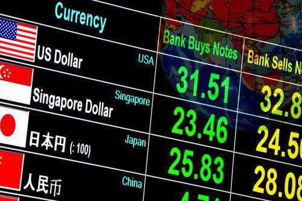

## Table of Contents

## What does a weak dollar mean?

A weak dollar means that the value of the U.S. dollar has gone down compared to other currencies. When the dollar is weak, it takes more dollars to buy things from other countries. This can make imports, like toys or electronics from overseas, more expensive for people in the U.S.

On the other hand, a weak dollar can be good for some parts of the economy. It makes U.S. products cheaper for people in other countries to buy. This can help American businesses that sell things abroad because they might sell more of their products. So, while a weak dollar can make some things more expensive at home, it can also help boost exports and tourism.

## What does a strong dollar mean?

A strong dollar means that the value of the U.S. dollar has gone up compared to other currencies. When the dollar is strong, it takes fewer dollars to buy things from other countries. This can make imports, like toys or electronics from overseas, cheaper for people in the U.S. It's like getting a discount on things you buy from other countries.

On the flip side, a strong dollar can make U.S. products more expensive for people in other countries to buy. This might mean that American businesses that sell things abroad could sell less of their products because they cost more. So, while a strong dollar can make things cheaper at home, it can also make it harder for American companies to sell their goods in other countries.

## How does a weak dollar affect the economy?

A weak dollar means the U.S. dollar is worth less compared to other countries' money. This makes things from other countries, like toys or electronics, more expensive for people in the U.S. When imports cost more, it can make prices go up at home. This is called inflation, and it can make life more expensive for everyone. Also, if the dollar is weak, people might not want to invest in the U.S. because they think the dollar might get even weaker.

But a weak dollar isn't all bad. It makes things made in the U.S. cheaper for people in other countries to buy. This can help American companies sell more of their products abroad, which is good for businesses and can create jobs. More exports can help grow the economy. Also, a weak dollar can make it cheaper for other countries to visit the U.S., which is good for tourism. So, while a weak dollar can make some things more expensive at home, it can also help other parts of the economy.

## How does a strong dollar impact international trade?

A strong dollar makes things from the U.S. more expensive for people in other countries to buy. This means that American companies might sell fewer of their products abroad because they cost more. When exports go down, it can hurt businesses and lead to fewer jobs in the U.S. So, a strong dollar can make it harder for American companies to do well in international trade.

On the other hand, a strong dollar makes things from other countries cheaper for people in the U.S. to buy. This can be good for American consumers because they can get more for their money when they buy imports like toys or electronics. But if the U.S. buys a lot more from other countries and sells less to them, it can lead to a trade deficit, which means the country is spending more on imports than it's earning from exports. So, while a strong dollar is good for buying things from abroad, it can make international trade less balanced.

## What causes the dollar to weaken or strengthen?

The value of the dollar can change because of many things. One big reason is interest rates. When the U.S. has higher interest rates than other countries, people want to invest in the U.S. to get more money from their investments. This demand for dollars can make the dollar stronger. But if the U.S. has lower interest rates, people might take their money to other countries with higher rates, which can make the dollar weaker.

Another reason the dollar's value changes is because of how well the U.S. economy is doing. If the economy is strong and growing, people around the world want to buy U.S. products and invest in the U.S. This can make the dollar stronger. But if the economy is weak, people might not want to buy U.S. products or invest, which can make the dollar weaker. Also, if there's a lot of uncertainty or problems in the world, people might see the dollar as a safe place to keep their money, which can make it stronger.

Other things like inflation, trade policies, and even what people think about the future can also affect the dollar. If inflation in the U.S. is high, the dollar can become weaker because it's worth less. Trade policies can also play a role; if the U.S. makes it hard for other countries to sell things here, those countries might not want to buy U.S. dollars. And if people think the U.S. economy will do well in the future, they might buy more dollars now, making it stronger. But if they think the economy will struggle, the dollar might weaken.

## How do interest rates influence the strength of the dollar?

Interest rates can make the dollar stronger or weaker. When the U.S. has high interest rates, it's like the country is offering a good deal on savings accounts. People from other countries want to put their money in the U.S. to earn more interest. When more people want dollars to invest, the value of the dollar goes up. It's like more people wanting to buy a toy, so the price of the toy goes up.

On the other hand, if the U.S. has low interest rates, it's not as good a deal for saving money. People might take their money to other countries where they can earn more interest. When fewer people want dollars, the value of the dollar goes down. It's like fewer people wanting to buy a toy, so the price of the toy goes down. So, high interest rates can make the dollar stronger, and low interest rates can make it weaker.

## What is the impact of a weak dollar on inflation?

When the dollar is weak, it means it takes more dollars to buy things from other countries. This makes imports, like toys or electronics, more expensive. When these things cost more, it can make the prices of many things go up at home. This rise in prices is called inflation. So, a weak dollar can lead to higher inflation because it makes the things we buy from other countries more costly.

But a weak dollar isn't just bad for inflation. It can also help in some ways. When the dollar is weak, things made in the U.S. become cheaper for people in other countries to buy. This can help American companies sell more of their products abroad. If they sell more, they might make more money and hire more people, which can help the economy grow. So, while a weak dollar can make inflation go up, it can also have some good effects on the economy.

## How does a strong dollar affect U.S. exports?

When the dollar is strong, it makes things made in the U.S. more expensive for people in other countries to buy. Imagine if a toy that used to cost 10 dollars now costs 15 dollars for someone in another country. They might decide not to buy it because it's too pricey. This means American companies might sell fewer of their products abroad. When they sell less, it can hurt their business and lead to fewer jobs in the U.S.

But a strong dollar isn't all bad for the economy. It makes things from other countries cheaper for people in the U.S. to buy. So, while American companies might struggle to sell their products abroad, people at home can get more for their money when they buy things like toys or electronics from other countries. This can help keep prices lower at home, which is good for consumers.

## Can government policies affect the strength of the dollar?

Yes, government policies can change how strong or weak the dollar is. When the government makes rules about trade, like putting taxes on things coming into the country, it can make the dollar stronger or weaker. If the U.S. makes it hard for other countries to sell things here, those countries might not want to buy U.S. dollars. But if the U.S. makes it easy for other countries to trade, more people might want dollars, making it stronger.

Also, the government can affect the dollar through its money policies. If the government decides to print a lot more money, it can make the dollar weaker because there's more of it around. On the other hand, if the government tries to control how much money is out there, like by raising interest rates, it can make the dollar stronger. People from other countries might want to keep their money in the U.S. to get more interest, which makes the dollar go up in value.

## What are the long-term effects of a consistently weak or strong dollar?

If the dollar stays weak for a long time, it can make life more expensive for people in the U.S. Things from other countries, like toys or electronics, will cost more because it takes more dollars to buy them. This can make prices go up at home, which is called inflation. But a weak dollar can also help American businesses sell more of their stuff to other countries because it's cheaper for them to buy. This can make the economy grow and create jobs. So, while a weak dollar can make things more expensive at home, it can also help other parts of the economy in the long run.

If the dollar stays strong for a long time, it can make things from other countries cheaper for people in the U.S. to buy. This is good for American consumers because they can get more for their money. But a strong dollar can make it hard for American companies to sell their stuff abroad because it's more expensive for people in other countries to buy. This can hurt businesses and lead to fewer jobs. Over time, a strong dollar can make the U.S. buy more from other countries and sell less to them, which can lead to a trade deficit. So, while a strong dollar is good for buying things from abroad, it can make international trade less balanced in the long run.

## How do investors react to changes in dollar strength?

When the dollar gets weaker, investors might see it as a chance to buy things from other countries at a lower price. They might move their money to buy stocks or bonds from other places where the currency is stronger. This can help them make more money if the value of those investments goes up compared to the dollar. But some investors might worry about a weak dollar because it can mean higher inflation, which makes their money worth less over time. So, they might look for ways to protect their money, like buying things that go up in value when prices rise, like gold or real estate.

When the dollar gets stronger, investors might see it as a good time to invest in the U.S. because their money will be worth more when they change it back to their own currency. This can make them want to buy U.S. stocks, bonds, or real estate. But a strong dollar can also make U.S. companies struggle to sell their products abroad, which might make some investors worried about the future of those businesses. So, they might be careful about where they put their money, trying to balance the benefits of a strong dollar with the risks it brings to U.S. exports.

## What strategies can businesses use to mitigate risks associated with dollar fluctuations?

Businesses can use a few strategies to handle the risks that come with the dollar going up or down. One way is to use something called hedging. This means they can buy or sell currencies in advance to protect themselves from future changes in the dollar's value. For example, if a company knows it will need to buy things from another country in the future, it can buy that country's currency now when the dollar is strong. This way, even if the dollar gets weaker later, the company won't have to pay more for the things it needs.

Another strategy is to spread out where they sell their products. If a business sells things in many different countries, it can balance out the risks. When the dollar is weak, it might be harder to sell in the U.S., but easier to sell in other countries because their products become cheaper for people there. By having customers in different places, a business can keep making money even if the dollar changes a lot. This can help them stay stable no matter what happens to the dollar.

## What is the understanding of exchange rates?

Exchange rates represent the relative value of one currency compared to another. They are a central component of the global financial system and play a critical role in international trade, investments, and economic policy. The value of currency influences economic stability and capacity for countries to engage in foreign transactions.

**Factors Affecting Exchange Rates**

1. **Interest Rates**: One of the primary drivers of exchange rates. Higher interest rates offer lenders in an economy a higher return relative to other countries. As a result, higher interest rates attract foreign capital, causing the exchange rate to rise. Conversely, lower interest rates can reduce the value of a currency. The relationship can be expressed simply as:
$$
   Exchange \, Rate \propto Interest \, Rates

$$

2. **Inflation Rates**: Inflation affects the purchasing power of a country's currency. Generally, lower inflation rates enable a currency's value to appreciate because when a country's inflation is lower than that of its trading partners, its exports become more competitive. The converse is also true when inflation is higher:
$$
   \Delta Exchange \, Rate \approx \Delta Inflation

$$

3. **Political Stability and Economic Performance**: A country with less risk for political turmoil and better economic performance tends to attract more foreign investors, demanding more of its currency in exchange for accessing investment opportunities. This demand increases the currency's value.

Understanding these dynamics is essential for anyone participating in or affected by international economic activities. Businesses exporting goods and services, for example, must consider these factors to determine the viability and pricing of their products in foreign markets. Likewise, travelers must stay informed on exchange rates to plan their expenditures accurately. Thus, a sound grasp of the forces behind exchange rates is crucial for making informed economic decisions and navigating the complex world of global finance.

## References & Further Reading

[1]: Krugman, P. (1998). ["What's new about the new economy?"](https://en.wikipedia.org/wiki/Paul_Krugman) Mimeo, Massachusetts Institute of Technology.

[2]: Blinder, A. S. (2006). ["Monetary policy today: sixteen questions and about twelve answers."](https://www.princeton.edu/~ceps/workingpapers/129blinder.pdf) Federal Reserve Bank of St. Louis Review.

[3]: Radelet, S., & Sachs, J. (1998). ["The East Asian financial crisis: Diagnosis, remedies, prospects."](https://www.brookings.edu/wp-content/uploads/1998/01/1998a_bpea_radelet_sachs_cooper_bosworth.pdf) Brookings Papers on Economic Activity.

[4]: Lopez de Prado, M. (2018). ["Advances in Financial Machine Learning."](https://www.amazon.com/Advances-Financial-Machine-Learning-Marcos/dp/1119482089) Wiley.

[5]: Chan, E. P. (2008). ["Quantitative Trading: How to Build Your Own Algorithmic Trading Business."](https://github.com/ftvision/quant_trading_echan_book) Wiley.