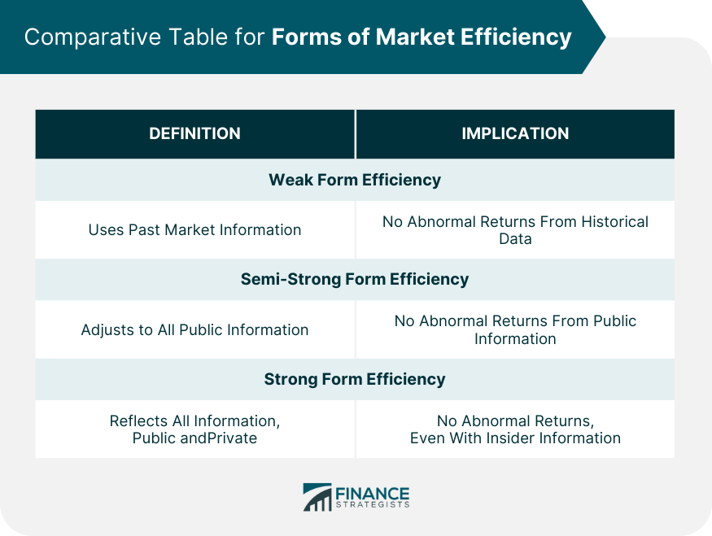

## Table of Contents

## What is weak form efficiency in financial markets?

Weak form efficiency in financial markets means that all past trading information, like prices and trading volumes, is already included in the current stock prices. This idea suggests that if you only look at past stock prices to decide whether to buy or sell, you won't be able to consistently make more money than the market average. The reason is that everyone else can see the same past data, so any advantage you might think you have is already reflected in the current price.

To test weak form efficiency, people often use statistical methods to see if they can predict future prices based on past data. If they can't, it supports the idea that the market is weak form efficient. However, some studies show that there might be small patterns or trends that can be used to make a little extra money, but these are usually not big enough to beat the market after accounting for costs like trading fees. So, many investors believe that trying to beat the market by looking at past prices is not a good strategy and it's better to just invest in a broad mix of stocks.

## How does weak form efficiency relate to the random walk hypothesis?

Weak form efficiency and the random walk hypothesis are closely related ideas in financial markets. Weak form efficiency says that all past trading information, like stock prices and volumes, is already included in the current stock price. This means that if you try to predict future prices just by looking at past prices, you won't be able to do better than the market on average. The random walk hypothesis takes this idea further by saying that stock prices move in a completely random way, so you can't predict future prices based on past ones at all.

The random walk hypothesis supports the idea of weak form efficiency because if stock prices are truly random, then all past information is already reflected in the current price, making it impossible to use past data to predict the future. This makes it hard for investors to find patterns or trends that can help them make more money than the market average. So, both concepts suggest that it's tough to beat the market just by looking at historical stock prices.

## What are the key assumptions behind weak form efficiency?

Weak form efficiency assumes that all past trading information, like stock prices and trading volumes, is already included in the current price of a stock. This means that if you look at past prices to decide whether to buy or sell a stock, you won't be able to make more money than the market average. The idea is that everyone can see the same past data, so any advantage you might think you have is already reflected in the price.

Another assumption is that markets react quickly to new information. If something new happens that could affect a stock's price, the market will adjust the price almost immediately. This quick reaction makes it hard to use past data to predict future prices because the market has already taken into account all the available information. So, trying to beat the market by looking at past prices is not a good strategy, according to weak form efficiency.

## How can weak form efficiency be tested empirically?

To test weak form efficiency, researchers look at past stock prices and trading volumes to see if they can predict future prices. They use statistical tests to check if there are any patterns or trends in the data that could help make money. If they find patterns, it might mean the market is not weak form efficient because you could use past data to predict future prices. But if they can't find any useful patterns, it supports the idea that the market is weak form efficient.

One common way to test weak form efficiency is by using something called a "runs test." This test checks if the sequence of price changes is random or if there are patterns. If the price changes look random, it supports weak form efficiency. Another method is to use technical analysis tools like moving averages or [momentum](/wiki/momentum) indicators to see if they can predict future prices. If these tools don't work better than just guessing, it suggests that the market is weak form efficient.

## What are the common statistical tests used to assess weak form efficiency?

To check if a market is weak form efficient, researchers often use a test called the "runs test." This test looks at the sequence of price changes to see if they are random or if there are patterns. If the price changes look random, it means that past prices can't help predict future prices, which supports weak form efficiency. Another common test is the "autocorrelation test," which checks if there is any relationship between the price changes at different times. If there is no significant relationship, it also supports the idea that the market is weak form efficient.

Another way to test weak form efficiency is by using something called "variance ratio tests." These tests compare the variance of returns over different time periods to see if they match what you would expect if the market were efficient. If the variances don't match up, it might mean that past prices can help predict future prices, which would go against weak form efficiency. Researchers also use "unit root tests" to see if stock prices follow a random walk, which is closely related to weak form efficiency. If the prices do follow a random walk, it supports the idea that the market is weak form efficient.

## Can you explain the difference between weak form, semi-strong form, and strong form efficiency?

Weak form efficiency means that all past trading information, like stock prices and trading volumes, is already included in the current stock price. This means you can't predict future prices just by looking at past prices. If you try to use past data to make money, you won't be able to do better than the market average. The idea is that everyone can see the same past data, so any advantage you might think you have is already reflected in the price.

Semi-strong form efficiency goes a step further. It says that all public information, not just past trading data, is already included in the current stock price. Public information includes things like news reports, company announcements, and economic data. If the market is semi-strong form efficient, you can't beat the market by using public information because the price will adjust to this information very quickly. So, even if you know about a new company report, you won't be able to use it to make more money than the market average.

Strong form efficiency is the strongest level of efficiency. It says that all information, public and private, is already included in the current stock price. This means that even if you have inside information that no one else knows, you still can't beat the market. In a strong form efficient market, the price already reflects everything there is to know about a stock. However, many people believe that strong form efficiency is not realistic because insider trading can sometimes give people an advantage.

## What are some real-world examples where weak form efficiency has been observed?

In the United States, the stock market is often thought to be weak form efficient. Researchers have looked at the prices of stocks on the New York Stock Exchange and found that it's hard to predict future prices just by looking at past prices. They used tests like the runs test and autocorrelation test, and the results showed that the price changes seemed random. This means that if you try to make money by looking at past stock prices, you won't do better than the market average. Many investors believe this and choose to invest in a broad mix of stocks instead of trying to pick winners based on past data.

Another example is the foreign exchange market, where currencies are traded. Studies have shown that it's tough to predict future currency prices just by looking at past exchange rates. People have used statistical tests like variance ratio tests and found that the market behaves in a way that supports weak form efficiency. This means that even if you look at past exchange rates, you won't be able to make more money than the market average. So, traders in the [forex](/wiki/forex-system) market often focus on other strategies, like looking at economic indicators or global events, rather than trying to use past prices to predict the future.

## How do technical analysis tools perform in markets that are weak form efficient?

In markets that are weak form efficient, technical analysis tools don't work well. Technical analysis looks at past prices and trading volumes to predict future prices. But if a market is weak form efficient, all that past information is already included in the current price. This means that looking at past prices won't help you make more money than the market average. Studies have shown that using technical analysis in these markets doesn't give you an advantage because the price changes are random.

For example, if you use tools like moving averages or momentum indicators, they won't help you beat the market in a weak form efficient market. These tools try to find patterns in past data, but if the market is weak form efficient, those patterns are already reflected in the price. So, many investors in these markets don't rely on technical analysis. Instead, they might choose to invest in a broad mix of stocks or use other strategies that don't depend on past price data.

## What are the implications of weak form efficiency for investors and traders?

If a market is weak form efficient, it means that looking at past stock prices won't help you make more money than the market average. This is because all the information from past prices is already included in the current price. So, if you're an investor or trader, trying to predict future prices just by looking at past prices is not a good strategy. You won't be able to beat the market by using technical analysis tools that look for patterns in past data.

Instead, many investors in weak form efficient markets choose to invest in a broad mix of stocks, like index funds. This way, they can get the average market return without trying to pick winners based on past prices. Traders might look at other kinds of information, like news reports or economic data, to make their decisions. But they know that if the market is weak form efficient, they can't rely on past prices to give them an edge.

## How does the presence of insider trading affect weak form efficiency?

Insider trading can make a market less weak form efficient. Weak form efficiency means that all past trading information is already included in the current stock price, so you can't predict future prices just by looking at past prices. But if some people have inside information that others don't know, they can use this to make money. This means that not all information is included in the current price, because the inside information isn't public yet. So, the market isn't weak form efficient anymore because some people can use past prices along with their secret information to predict the future.

When insider trading happens, it can create patterns in stock prices that people might be able to spot. For example, if insiders start buying a lot of stock before good news comes out, the price might start to go up a little bit before the news is public. People who notice this pattern might be able to make money by buying the stock before everyone else knows the good news. This goes against weak form efficiency because it shows that you can use past prices to predict future prices if you know about the insider trading. So, insider trading can mess up weak form efficiency and make it harder for the market to be fair for everyone.

## What are the criticisms and limitations of the weak form efficiency hypothesis?

Some people think that the weak form efficiency hypothesis, which says you can't predict future stock prices just by looking at past prices, has problems. One big criticism is that it doesn't always match what we see in real markets. Some studies have found small patterns in stock prices that people can use to make a little more money than the market average. These patterns might not be big enough to make a lot of money, but they show that the market might not be as random as weak form efficiency says it should be.

Another limitation is that weak form efficiency assumes everyone has the same information and reacts to it at the same time. But in real life, some people might have better information or be faster at using it. For example, big investors with lots of resources might be able to analyze data quicker than smaller investors. This can create small advantages that go against the idea of weak form efficiency. Also, things like transaction costs and taxes can make it hard for people to use past data to make money, even if the market is weak form efficient. So, while the hypothesis is useful, it doesn't explain everything about how markets work.

## How have advancements in technology and data analysis impacted the validity of weak form efficiency?

Advancements in technology and data analysis have made it easier for people to look at past stock prices and find small patterns. Computers and new software can quickly go through a lot of data and spot trends that might be hard for people to see. Some studies have used these tools and found small ways to make a little more money than the market average by looking at past prices. This goes against the idea of weak form efficiency, which says you can't predict future prices just by looking at past prices. But the extra money people can make is usually not enough to beat the market after you pay for things like trading fees.

However, even with these new tools, weak form efficiency still holds up pretty well in many markets. The patterns that people find are often small and don't last long, so they don't really change the overall idea that past prices can't help you make a lot more money than the market. Technology has made markets faster and more connected, so new information gets into prices quicker than before. This means that even if you can spot a small pattern, the market might change before you can use it to make money. So, while technology has made it easier to test weak form efficiency, it hasn't really proven that the hypothesis is wrong.

## What is Weak Form Market Efficiency?

Weak form market efficiency is a concept within the Efficient Market Hypothesis (EMH) asserting that all historical trading information, including stock prices and [volume](/wiki/volume-trading-strategy), is fully integrated into current market prices. This notion holds that past price movements and historical data are inadequate for predicting future price movements, thereby challenging the effectiveness of technical analysis.

The roots of weak form efficiency are grounded in the broader context of the EMH, which was popularized by economist Eugene Fama in the 1960s. The hypothesis posits three levels of market efficiency: weak, semi-strong, and strong. Weak form efficiency is the most basic level, suggesting that because all historical data is already reflected in stock prices, attempting to analyze past price actions to forecast future movements yields no tangible benefit.

A key element underpinning weak form efficiency is the random walk theory. This theory proposes that stock price changes are random and devoid of any predictable patterns, akin to a series of coin flips. The mathematical representation of a random walk can be simplified as follows:

$$
P_t = P_{t-1} + \text{news}_t
$$

where $P_t$ is the price at time $t$, $P_{t-1}$ is the price at time $t-1$, and $\text{news}_t$ represents new information affecting the price. Since news and information arrive randomly and unpredictably, price movements are likewise unpredictable.

The implications of weak form efficiency are significant for investors and traders. If stock prices fully reflect all historical data, the use of technical analysis, which involves the examination of past trends and patterns to predict future behavior, becomes ineffective. Therefore, traders relying solely on technical indicators to identify future price changes may not gain an advantage over the market.

While weak form efficiency sets a foundational understanding of market efficiency, it also emphasizes the unpredictable nature of financial markets. This unpredictability suggests that strategies based solely on historical price analysis may be insufficient for achieving consistent abnormal returns. Instead, investors may need to consider alternative approaches, such as incorporating [fundamental analysis](/wiki/fundamental-analysis) or leveraging real-time data for informed decision-making.

## What are the underlying assumptions of weak form efficiency?

Weak form market efficiency is primarily underpinned by the random walk theory, which posits that stock price movements are random and independent from past trends. This implies that future stock prices cannot be predicted based on historical data, making it difficult to achieve consistent profits above average market returns through technical analysis or other strategies that analyze past price patterns. The random walk theory suggests that stock prices evolve according to a stochastic process, often modeled mathematically as a random walk with drift. 

In this framework, the equation for a simple random walk of stock prices $P_t$ can be expressed as:

$$
P_t = P_{t-1} + \epsilon_t
$$

where $\epsilon_t$ is a random error term that follows a normal distribution with a mean of zero. In this model, each price change is independent of previous changes, reinforcing the notion that past prices do not influence future prices. 

Investors, under the assumption of weak form efficiency, are presumed to act rationally and efficiently, incorporating all available historical information into stock prices instantly. This means that any new information relevant to the stock price is quickly absorbed by the market, without delay, reflecting the collective judgment of all market participants. This quick incorporation of information ensures that stock prices at any given time are the best unbiased estimate of the true value of the security.

The implications for achieving abnormal returns in such a market are significant. If weak form efficiency holds true, attempting to predict future stock prices based on historical patterns or trends would be futile, as any potential signals or patterns would have already been accounted for in the current prices. Consequently, the likelihood of consistently outperforming the market by exploiting past price data diminishes. 

This efficiency also questions the utility of technical analysis, which is grounded in studying past market data to identify potential investment opportunities. While technical strategies might occasionally yield success through patterns and trends, in a weakly efficient market, such successes would be attributed to chance rather than the accurate prediction of market movements.

In conclusion, weak form efficiency, bolstered by the random walk theory and rational investor behavior, challenges traditional methods of achieving returns above the market average by assessing historical data. It underscores the necessity for strategies that focus on factors beyond mere price history, such as real-time data analysis and market sentiment, to navigate financial markets effectively.

## References & Further Reading

[1]: Fama, E. F. (1970). ["Efficient Capital Markets: A Review of Theory and Empirical Work."](https://www.jstor.org/stable/2325486) The Journal of Finance, 25(2), 383-417.

[2]: Malkiel, B. G. (2003). ["The Efficient Market Hypothesis and Its Critics."](https://pubs.aeaweb.org/doi/10.1257/089533003321164958) The Journal of Economic Perspectives, 17(1), 59-82.

[3]: Lo, A. W., & MacKinlay, A. C. (1988). ["Stock Market Prices Do Not Follow Random Walks: Evidence from a Simple Specification Test."](https://academic.oup.com/rfs/article-abstract/1/1/41/1601244) The Review of Financial Studies, 1(1), 41-66.

[4]: Jensen, M. C. (1978). ["Some Anomalous Evidence Regarding Market Efficiency."](https://www.sciencedirect.com/science/article/pii/0304405X78900259) Journal of Financial Economics, 6(2/3), 95-101.

[5]: Haugen, R. A. (2001). ["The Inefficient Stock Market: What Pays Off and Why."](https://www.amazon.com/Inefficient-Stock-Market-What-Pays/dp/0139171649) Prentice Hall.

[6]: Brus, D. (2007). ["Random Walk or Market Efficiency? Evidence from International Stock Markets."](https://www.sciencedirect.com/science/article/pii/S1059056018310979) Czech Journal of Economics and Finance (Finance a uver), 57(1-2), 56-72. 

[7]: Kahneman, D. (2011). ["Thinking, Fast and Slow."](https://psycnet.apa.org/record/2011-26535-000) Farrar, Straus and Giroux. 

[8]: Barberis, N., & Thaler, R. (2003). ["A Survey of Behavioral Finance."](https://www.nber.org/papers/w9222) In Handbook of the Economics of Finance.