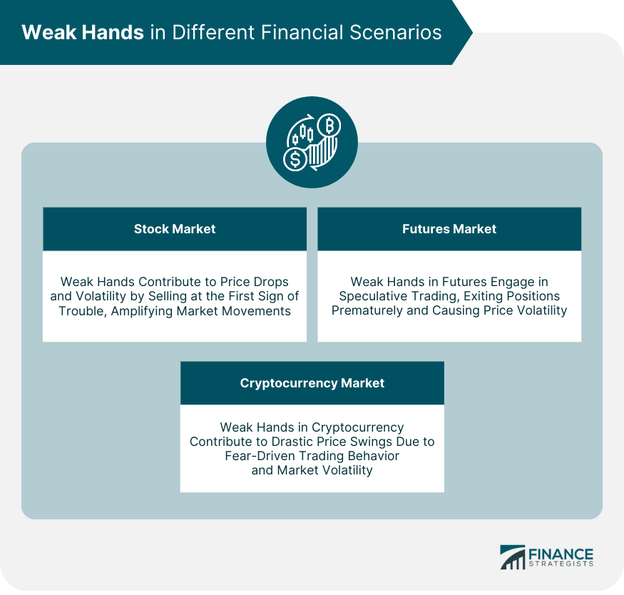

In today's fast-paced financial markets, terms like 'weak hands' have gained prominence as traders and investors navigate volatile environments. This term specifically refers to traders and investors who lack the stability and conviction to maintain their investment positions amid market fluctuations. These individuals often react impulsively, allowing their decisions to be driven by emotions such as fear or greed, which can lead to a pattern of buying high and selling low. Understanding the concept of 'weak hands' is crucial for anyone looking to succeed in investing, especially with the rise of algorithmic trading.

Algorithmic trading, a technique that uses computer programs to automate trading decisions, offers a potential solution to the challenges posed by 'weak hands'. By executing trades at optimal times based on a set of predetermined criteria, algorithmic trading helps eliminate emotional biases, thereby maintaining the discipline essential for successful investing. This article explores what 'weak hands' means in the context of financial markets, the implications of these behaviors, and the role algorithmic trading can play in mitigating these impacts. In doing so, it also highlights the importance of balancing emotional stability with technological advancements to ensure more informed and strategic investment decisions.



## Table of Contents

## What Are Weak Hands?

'Weak hands' is a financial term that refers to investors or traders who lack the confidence or resources needed to maintain their positions in times of market volatility. These individuals are typically characterized by their inability or unwillingness to withstand temporary downturns or price fluctuations in the market. As a result, weak hands are prone to making impulsive decisions that can lead to unfavorable trading outcomes.

Investors identified as weak hands often succumb to psychological pressures, such as fear and greed, which cloud their judgment. Their trading behavior is typically reactionary; they are quick to sell when prices drop, often incurring losses, and to buy when prices rise, increasing the likelihood of buying at a peak. This pattern of buying high and selling low can erode portfolio value over time and diminish long-term investment returns.

Moreover, the actions of weak hands can amplify market volatility. When a significant number of investors panic and sell their holdings during a downturn, it increases the downward pressure on prices, leading to sharper declines. Such market movements can create buying opportunities for more resilient investors, often referred to as strong hands, who possess the confidence and financial stability to hold or increase their positions during turbulent times.

Weak hands are typically less likely to employ systematic investment strategies or risk management techniques, which makes them vulnerable during periods of rapid market changes. Understanding the behaviors and tendencies of weak hands is essential for developing strategies that promote more disciplined and informed trading practices.

## Characteristics of Weak Hands

'Weak hands' is a concept in finance that characteristically embodies a set of traits among certain investors, often leading to suboptimal trading decisions. One defining trait is a lack of conviction in their investment strategies. These investors may frequently change their strategies based on market trends or news rather than sticking to a well-researched, disciplined approach. This lack of conviction can often result in panic-driven decisions, ultimately affecting the consistency and potential profitability of their investment portfolios.

A second characteristic is insufficient resources to withstand market downturns. Investors identified as having 'weak hands' may not have adequate financial backing or reserves to hold onto their positions during periods of market [volatility](/wiki/volatility-trading-strategies). This lack of financial resilience often forces them to liquidate assets at inopportune times, potentially realizing losses that could have been avoided with a more robust financial strategy.

Emotional trading driven by fear and greed is another hallmark of 'weak hands'. Such investors are heavily influenced by market sentiment and are prone to decisions rooted in emotional responses rather than logical analysis. Fear can lead to premature selling when prices drop, while greed can drive them to buy during market peaks, often leading to the common pitfall of buying high and selling low. This emotional volatility makes it challenging for these investors to consistently capitalize on market movements, as their actions are reactive rather than strategic.

These characteristics not only compromise individual investor outcomes but can also contribute to broader market volatility as they frequently respond impulsively to market changes.

## Impact of Weak Hands on Financial Markets

Weak hands play a significant role in influencing the volatility of financial markets, primarily through their tendency to engage in panic selling. This behavior is often triggered by sudden negative market movements or external shocks, where these traders and investors hastily liquidate their positions, fearing further losses. This impulsive selling can lead to a cascade effect, amplifying price declines as more investors begin to sell, further exacerbating downward [momentum](/wiki/momentum).

In essence, weak hands inadvertently contribute to price instability. Their lack of confidence and financial resilience often compel them to [exit](/wiki/exit-strategy) their positions hastily, without strategic consideration of intrinsic values or long-term potential. This results in an increased supply of assets in the market, overwhelming demand and thus driving prices lower than may be warranted by fundamental conditions.

This volatility, although detrimental for weak hands themselves, can present opportunities for more experienced, robust traders. These traders, often referred to as "strong hands," possess the confidence and financial capacity to endure periods of market stress. They exploit the market's reaction to weak-hand behaviors by purchasing undervalued assets sold off during panic phases, positioning themselves favorably for when the market eventually stabilizes and recovers.

Through this dynamic, weak hands inadvertently facilitate a redistribution of market assets, where opportunities arise for those poised to take advantage of emotionally driven selling pressures. Strong hands can implement strategies, such as value investing or contrarian trading, to capitalize on the mispriced assets consequent of panic-driven market conditions initiated by weaker participants.

## Algorithmic Trading: A Tool for Stronger Hands

Algorithmic trading leverages computer algorithms to execute trades at times deemed optimal by pre-set criteria. This approach is a significant shift from traditional trading methods, which are often susceptible to the emotional biases of human traders. Algorithms can execute trades faster and more efficiently, processing vast amounts of data to make decisions based on quantitative analysis rather than subjective judgment. This is particularly beneficial in avoiding the pitfalls associated with 'weak hands'—investors prone to making impulsive decisions driven by emotions like fear and greed.

One of the primary advantages of [algorithmic trading](/wiki/algorithmic-trading) is its ability to automate the implementation of investment strategies. These strategies can range from simple rules like moving average crossovers to more complex models involving statistical [arbitrage](/wiki/arbitrage) or [machine learning](/wiki/machine-learning) techniques. By automating these processes, algorithmic trading minimizes human intervention, reducing the likelihood of emotional trading decisions that characterize weak hands.

For instance, consider a basic moving average crossover strategy, where a short-term moving average crossing above a long-term moving average generates a buy signal, and vice versa for a sell signal. This can be implemented using Python:

```python
import pandas as pd

# Sample price data as a pandas DataFrame
price_data = pd.DataFrame({'price': [1, 2, 1.5, 2.5, 3, 2.7, 3.3, 3.7, 2.5, 2.9]})

# Calculate moving averages
price_data['short_mavg'] = price_data['price'].rolling(window=3, min_periods=1).mean()
price_data['long_mavg'] = price_data['price'].rolling(window=5, min_periods=1).mean()

# Generate buy/sell signals
price_data['buy_signal'] = price_data['short_mavg'] > price_data['long_mavg']
price_data['sell_signal'] = price_data['short_mavg'] < price_data['long_mavg']
```

This code executes trades automatically based on defined rules, thereby eliminating the chance of acting upon fear-driven responses to short-term market shifts.

Additionally, algorithmic trading allows for the [backtesting](/wiki/backtesting) of strategies against historical data, providing insights into how these strategies may perform under various market conditions. This rigorous testing phase ensures that strategies are refined and optimized before being deployed in real-time trading environments.

Moreover, algorithmic trading systems utilize a range of data types—from traditional price and [volume](/wiki/volume-trading-strategy) data to more sophisticated inputs like social media sentiment and macroeconomic indicators—to further reinforce decision-making grounded in objective, data-driven analysis. The comprehensive utilization of diverse data sets enables these systems to recognize patterns and predict trends that might elude human traders.

By employing predefined algorithms, traders and investors strengthen their positions by adhering to a disciplined approach free from human error. This strategic edge is crucial for maintaining robust participation in financial markets, helping investors to effectively manage risk and capitalize on opportunities without succumbing to the psychological influences that afflict weak hands.

## The Sentiment Factor

Market sentiment plays a critical role in influencing the actions of investors known as "weak hands." These investors often react impulsively to emotional triggers rather than relying on analytical data. Commonly, their decisions are driven by psychological factors such as fear during downward market trends or over-optimism during market booms. This reactionary behavior can lead to suboptimal decision-making, characterized by buying securities at high prices and selling them at lows.

To counterbalance the impulsiveness of weak hands, algorithmic trading emerges as a powerful tool. Algorithmic trading utilizes computer programs to execute trades automatically based on predefined criteria, minimizing the role of emotions in trading decisions. This approach relies on data-driven insights, which help in maintaining objectivity even in the face of market volatility.

For instance, algorithms can be designed to incorporate various technical indicators such as moving averages, relative strength index (RSI), or moving average convergence divergence (MACD) to determine optimal trading signals. These indicators assist in identifying potential entry and exit points based on historical price data, ensuring trades are executed logically rather than emotionally. A simple moving average (SMA) strategy in Python might look like this:

```python
import pandas as pd
import numpy as np

# Load historical price data
data = pd.read_csv('stock_prices.csv')

# Calculate the 20-day and 50-day moving averages
data['SMA20'] = data['Close'].rolling(window=20).mean()
data['SMA50'] = data['Close'].rolling(window=50).mean()

# Define conditions for buy/sell signals
buy_signal = (data['SMA20'] > data['SMA50']) & (data['SMA20'].shift(1) <= data['SMA50'].shift(1))
sell_signal = (data['SMA20'] < data['SMA50']) & (data['SMA20'].shift(1) >= data['SMA50'].shift(1))

# Generate signals
data['Signal'] = np.where(buy_signal, 'Buy', np.where(sell_signal, 'Sell', 'Hold'))
```

By executing trades based on such quantitative models, algorithmic trading can significantly reduce the biases induced by market sentiment. These systems can also adapt to market changes rapidly, recalibrating their parameters as more data becomes available.

In conclusion, while market sentiment inherently affects weak hands, leading them often to poor investment decisions, algorithmic trading offers a substantial counterbalance. By executing trades based on rigorous data analysis rather than emotional responses, these systems enable more disciplined and potentially more profitable investment strategies.

## Strategies for Mitigating Weak Hands Behaviors

Mitigating the behaviors associated with 'weak hands' requires a strategic approach that encompasses mindset development, financial literacy, and the application of algorithmic trading. 

### Developing a Resilient Investment Mindset and Diversified Portfolio

A resilient investment mindset is foundational for overcoming impulsive trading behaviors driven by market volatility. This entails focusing on long-term financial goals rather than short-term market fluctuations. An effective way to cultivate this mindset is through the adoption of a diversified portfolio. Diversification involves investing in a variety of assets, such as stocks, bonds, and real estate, to spread risk. By diversifying, investors can cushion against the impact of adverse movements in any single market sector. A widely accepted formula for portfolio diversification is the capital asset pricing model (CAPM), which evaluates expected return on an asset while considering risk and return on a market portfolio:

$$
E(R_i) = R_f + \beta_i(E(R_m) - R_f)
$$

where $E(R_i)$ is the expected return of investment, $R_f$ is the risk-free rate, $\beta_i$ is the beta of the investment, and $E(R_m)$ is the expected return of the market.

### Leveraging Education to Build a Strong Foundation in Financial Literacy

Financial literacy is critical for making informed investment decisions. Education on financial concepts and market dynamics helps investors better understand risk, investment vehicles, and market behavior. Numerous online platforms offer courses on financial management, stock market basics, and investment strategies. Enhancing financial literacy equips investors to assess market conditions accurately and make decisions that align with their investment objectives, reducing susceptibility to emotional trading.

### Utilizing Algorithmic Trading Strategies to Maintain Disciplined Trading

Algorithmic trading has emerged as a valuable tool to counteract the impulsiveness characteristic of weak hands. By utilizing algorithms to analyze data and execute trades automatically, investors can ensure that their trading actions are consistent with predetermined criteria, devoid of emotional biases. Python, a popular language for algorithmic trading, can be used to establish these automated strategies with libraries such as `pandas` for data analysis and `zipline` for algorithmic backtesting:

```python
import pandas as pd
from zipline import run_algorithm

def initialize(context):
    context.asset = symbol('AAPL')
    context.max_leverage = 1.0

def handle_data(context, data):
    if data.can_trade(context.asset):
        if data.current(context.asset, 'price') < data.history(context.asset, 'price', 5, '1d').mean():
            order_target_percent(context.asset, context.max_leverage)
        else:
            order_target_percent(context.asset, 0)

start_session = pd.Timestamp('2023-01-01', tz='utc')
end_session = pd.Timestamp('2023-12-31', tz='utc')

result = run_algorithm(start=start_session,
                       end=end_session,
                       capital_base=10000,
                       trading_calendar='NYSE',
                       initialize=initialize,
                       handle_data=handle_data)
```

This example demonstrates how algorithms can implement trade decisions based on moving average analysis automatically, fostering disciplined trading practices. Applying algorithmic strategies reduces human error and emotional decision-making, helping investors maintain focus on long-term objectives.

## Conclusion

Weak hands can substantially impact individual investors and the broader financial markets. These individuals, often driven by emotional responses to market volatility, contribute to unnecessary fluctuations by selling assets during downturns and buying during peaks. Such behavior can exacerbate price movements, creating a ripple effect that affects even the more seasoned and rational participants in the market.

To mitigate these impacts, it is crucial for investors to adopt strategies that strengthen their market positions. Understanding the psychology behind investing and developing resilience can prevent detrimental decision-making. A diversified portfolio is one effective method of reducing risk and cushioning against unpredictable market events. Additionally, investing time in building financial literacy can provide a solid foundation for making informed decisions that are not swayed by transient market sentiments.

Algorithmic trading emerges as a powerful tool for counteracting the tendencies of weak hands. By relying on computer programs to execute trades based on data-driven strategies, investors can remove the emotional biases that often lead to poor investment choices. These algorithms can process vast amounts of data quickly, optimizing trades for moments when the market conditions meet predefined criteria, thus ensuring more disciplined and consistent trading actions.

Ultimately, the future of successful investing lies in balancing emotional stability with the technological advancements available in trading. By embracing algorithmic methods alongside traditional investing wisdom, investors can position themselves to weather financial storms and capitalize on opportunities presented in dynamic market environments. This balanced approach not only fortifies individual portfolios but also contributes to a more stable and predictable financial market landscape.

## References & Further Reading

[1]: Bergstra, J., Bardenet, R., Bengio, Y., & Kégl, B. (2011). ["Algorithms for Hyper-Parameter Optimization."](https://proceedings.neurips.cc/paper/2011/file/86e8f7ab32cfd12577bc2619bc635690-Paper.pdf) Advances in Neural Information Processing Systems 24.

[2]: ["Advances in Financial Machine Learning"](https://www.amazon.com/Advances-Financial-Machine-Learning-Marcos/dp/1119482089) by Marcos Lopez de Prado

[3]: ["Evidence-Based Technical Analysis: Applying the Scientific Method and Statistical Inference to Trading Signals"](https://www.amazon.com/Evidence-Based-Technical-Analysis-Scientific-Statistical/dp/0470008741) by David Aronson

[4]: ["Machine Learning for Algorithmic Trading"](https://github.com/stefan-jansen/machine-learning-for-trading) by Stefan Jansen

[5]: ["Quantitative Trading: How to Build Your Own Algorithmic Trading Business"](https://www.amazon.com/Quantitative-Trading-Build-Algorithmic-Business/dp/1119800064) by Ernest P. Chan