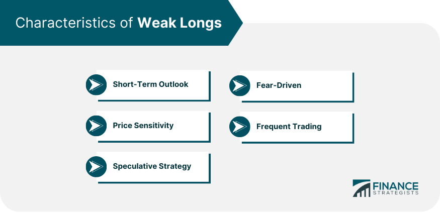

## Table of Contents

## What are weak longs in the context of financial markets?

In the context of financial markets, weak longs refer to investors who have bought a stock or other financial asset but are not strongly committed to holding it for a long time. These investors might be easily scared off by small drops in the price or by negative news about the asset. They are called "weak" because they might sell their holdings quickly if things don't go as they hoped, which can lead to more selling and lower prices.

Weak longs can affect the market because when they start selling, it can create a domino effect. If many weak longs decide to sell at the same time, it can cause the price of the asset to fall even more. This can make other investors nervous, leading to more selling and potentially causing a bigger drop in the price. Understanding the presence of weak longs can be important for traders and investors trying to predict market movements.

## How can you identify weak longs in a trading chart?

To identify weak longs on a trading chart, you need to look for certain patterns that show investors are not very confident. One way to spot weak longs is by watching the price action after it reaches a new high. If the price quickly drops after hitting a new high, it might mean that many investors who bought the asset are selling it soon after. This quick drop can show that these investors, or weak longs, were not sure about holding onto the asset for a long time.

Another way to identify weak longs is by looking at the [volume](/wiki/volume-trading-strategy) of trades. If the volume is high when the price is going up, but then drops quickly when the price starts to fall, it can mean that the people who bought the asset are selling it fast. This high volume on the way up and low volume on the way down can be a sign of weak longs who are not committed to keeping their investment. By paying attention to these patterns, you can get a better idea of whether weak longs are influencing the market.

## What causes the formation of weak longs?

Weak longs form when people buy a stock or asset but are not very sure about it. They might buy because they see the price going up and want to join in, but they don't really believe the price will keep going up. These people are easily scared by small drops in the price or bad news about the asset. They might have bought it without doing much research, just following what others are doing.

When a lot of weak longs are in the market, it can make the price go up quickly because many people are buying. But if something goes wrong, like a small drop in the price or some bad news, these weak longs might start selling their shares fast. This can cause the price to fall even more, making other investors nervous and leading to more selling. So, weak longs can make the market more unstable because they are not committed to holding onto their investments for a long time.

## What are the risks associated with weak longs for investors?

Weak longs can be risky for investors because they can make the market go up and down a lot. When a lot of weak longs buy a stock, the price can go up quickly. But if something bad happens, like a small drop in the price or some bad news, these weak longs might start selling their shares fast. This can make the price fall even more, which can scare other investors and lead to more selling. So, if you are an investor, you might see the price of your stock go down a lot because of weak longs.

Another risk is that weak longs can make it hard to know if a stock is really doing well. If the price goes up because a lot of weak longs are buying, it might not mean the stock is actually doing well. It could just mean a lot of people are buying without really believing in the stock. This can trick other investors into thinking the stock is a good buy when it might not be. So, it's important for investors to be careful and do their own research, not just follow what weak longs are doing.

## How do weak longs impact market trends and price movements?

Weak longs can make the market go up and down a lot. When a lot of weak longs buy a stock, the price can go up quickly because many people are buying. But weak longs are not very sure about the stock, so if something bad happens, like a small drop in the price or some bad news, they might start selling their shares fast. This can make the price fall even more, which can scare other investors and lead to more selling. So, weak longs can make the market more unstable because they are not committed to holding onto their investments for a long time.

Because of weak longs, it can be hard to know if a stock is really doing well. If the price goes up because a lot of weak longs are buying, it might not mean the stock is actually doing well. It could just mean a lot of people are buying without really believing in the stock. This can trick other investors into thinking the stock is a good buy when it might not be. So, weak longs can make it hard for investors to make good decisions because the price movements might not show what is really happening with the stock.

## What strategies can traders use to exploit weak longs?

Traders can use a strategy called "short selling" to take advantage of weak longs. When traders see that a lot of weak longs are buying a stock and making the price go up, they might think the price will soon go down. So, they can borrow shares of the stock and sell them at the high price. When the weak longs start selling and the price drops, the traders can buy back the shares at the lower price, return them to the person they borrowed from, and keep the difference as profit.

Another strategy is to use "stop-loss orders." Traders can watch the price of a stock that weak longs are buying. If they think the price will go down because of weak longs selling, they can set a stop-loss order to sell their own shares if the price drops to a certain level. This way, they can protect themselves from losing too much money if the price falls quickly. By using these strategies, traders can try to make money from the ups and downs caused by weak longs.

## How do weak longs differ from strong longs?

Weak longs and strong longs are different kinds of investors. Weak longs are people who buy a stock but are not very sure about it. They might buy because they see the price going up and want to join in, but they don't really believe the price will keep going up. These people are easily scared by small drops in the price or bad news about the stock. They might have bought it without doing much research, just following what others are doing.

On the other hand, strong longs are investors who are very sure about the stock they buy. They believe in the company and think the stock will do well over a long time. Strong longs do a lot of research before they buy and are not easily scared by small drops in the price or bad news. They are committed to holding onto their investment for a long time, even if the market goes up and down.

## Can weak longs be a signal for potential market reversals?

Yes, weak longs can be a signal for potential market reversals. When a lot of weak longs buy a stock, the price can go up quickly. But weak longs are not very sure about the stock, so if something bad happens, like a small drop in the price or some bad news, they might start selling their shares fast. This can make the price fall even more, which can scare other investors and lead to more selling. So, if you see a lot of weak longs in the market, it might mean the price could soon go down.

This is because weak longs can make the market go up and down a lot. If the price goes up because a lot of weak longs are buying, it might not mean the stock is actually doing well. It could just mean a lot of people are buying without really believing in the stock. When these weak longs start selling, it can cause a big drop in the price, which can be a sign that the market is about to reverse. So, watching for weak longs can help investors and traders predict when the market might change direction.

## What role do weak longs play in technical analysis?

In technical analysis, weak longs are important because they can help traders see when the market might change direction. When a lot of weak longs buy a stock, the price can go up quickly. But weak longs are not very sure about the stock, so if something bad happens, like a small drop in the price or some bad news, they might start selling their shares fast. This can make the price fall even more, which can scare other investors and lead to more selling. So, if you see a lot of weak longs in the market, it might mean the price could soon go down.

Traders use charts to spot weak longs. They look for patterns that show investors are not very confident. For example, if the price quickly drops after hitting a new high, it might mean that many investors who bought the stock are selling it soon after. This quick drop can show that these investors, or weak longs, were not sure about holding onto the stock for a long time. By paying attention to these patterns, traders can get a better idea of whether weak longs are influencing the market and if a reversal might be coming.

## How can one measure the strength of longs in a market?

To measure the strength of longs in a market, you can look at how the price moves and how many people are trading. If the price keeps going up and stays up even when there is bad news or small drops, it means the longs are strong. They believe in the stock and are not easily scared. You can also look at the trading volume. If a lot of people are buying and the volume stays high even when the price goes down a little, it shows that the longs are strong and committed to holding onto their investment.

Another way to measure the strength of longs is by watching for patterns on a trading chart. If the price goes up and then stays up without big drops, it can mean the longs are strong. But if the price goes up and then quickly drops after hitting a new high, it might mean there are a lot of weak longs who are not sure about the stock. By looking at these things, you can get a good idea of whether the longs in the market are strong or weak.

## What are the psychological factors contributing to weak longs?

Weak longs often come from people feeling excited or scared about the market. When people see a stock price going up fast, they might get excited and want to buy it too. They think they can make money quickly without really understanding the stock. But they are not very sure about it. They might not have done much research and are just following what others are doing. This excitement can make them buy the stock, but it also makes them weak longs because they are not really sure about it.

Another big feeling that makes weak longs is fear. If the stock price starts to drop a little, weak longs can get scared easily. They worry about losing money, so they sell their shares fast. This fear can make the price drop even more, which scares other investors too. So, weak longs are often driven by excitement when buying and fear when selling. These feelings can make the market go up and down a lot.

## How do institutional investors handle positions that are identified as weak longs?

Institutional investors, like big banks or investment firms, are usually very careful about weak longs. They do a lot of research before they buy a stock and try to avoid being weak longs themselves. If they see that a lot of weak longs are buying a stock and making the price go up, they might think the price will soon go down. So, they might decide to sell their own shares before the price drops or even use a strategy called short selling. Short selling means they borrow shares of the stock and sell them at the high price. When the weak longs start selling and the price drops, the institutional investors can buy back the shares at the lower price, return them to the person they borrowed from, and keep the difference as profit.

Institutional investors also use other ways to protect themselves from weak longs. They might set up stop-loss orders, which are instructions to sell their shares if the price drops to a certain level. This way, they can avoid losing too much money if the price falls quickly because of weak longs selling. By watching the market closely and using these strategies, institutional investors can handle positions that are identified as weak longs and try to make money from the ups and downs caused by them.

## References & Further Reading

[1]: Barca, A. M., & Duran, T. (2018). ["The Role of Algorithmic Trading in Financial Stability: A Literature Review."](https://www.researchgate.net/publication/378287610_Machine_learning_in_financial_markets_A_critical_review_of_algorithmic_trading_and_risk_management) European Systemic Risk Board.

[2]: Chaboud, A. P., Chiquoine, B., Hjalmarsson, E., & Vega, C. (2014). ["Rise of the Machines: Algorithmic Trading in the Foreign Exchange Market."](https://papers.ssrn.com/sol3/papers.cfm?abstract_id=1501135) Journal of Finance, 69(5), 2045–2084.

[3]: Lopez de Prado, M. (2018). ["Advances in Financial Machine Learning."](https://www.amazon.com/Advances-Financial-Machine-Learning-Marcos/dp/1119482089) Wiley.

[4]: Hendershott, T., Jones, C. M., & Menkveld, A. J. (2011). ["Does Algorithmic Trading Improve Liquidity?"](https://onlinelibrary.wiley.com/doi/full/10.1111/j.1540-6261.2010.01624.x) The Quarterly Journal of Economics, 126(1), 1-39.

[5]: Kissell, R. (2013). ["The Science of Algorithmic Trading and Portfolio Management."](https://www.sciencedirect.com/book/9780124016897/the-science-of-algorithmic-trading-and-portfolio-management) Academic Press.

[6]: Chan, E. P. (2008). ["Quantitative Trading: How to Build Your Own Algorithmic Trading Business."](https://github.com/ftvision/quant_trading_echan_book) Wiley Trading.