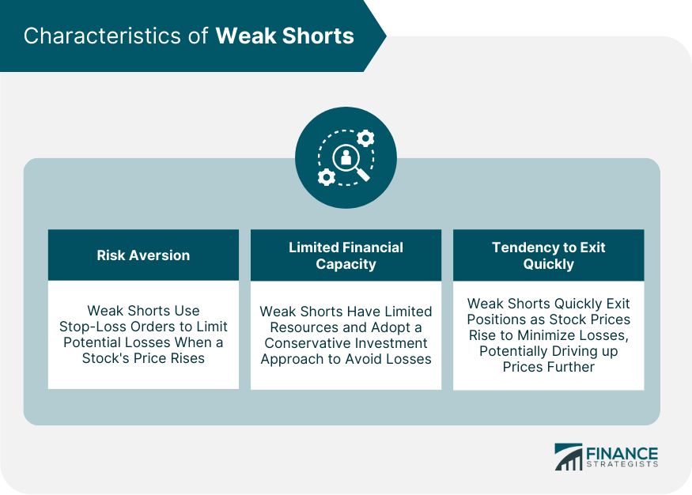

## Table of Contents

## What are weak shorts in the context of investment?

Weak shorts in the context of investment refer to investors who have borrowed and sold a stock, hoping its price will fall so they can buy it back at a lower price and make a profit. These investors are called "weak" because they might not have a strong conviction in their bearish outlook or may not have enough resources to hold onto their short position if the stock price starts to rise instead of fall.

When a stock starts to rise, weak shorts may panic and rush to buy back the shares they borrowed to cover their positions, which can drive the stock price even higher. This situation can lead to a short squeeze, where the rising price forces more short sellers to cover their positions, further pushing up the stock price. Understanding weak shorts can be important for investors, as their actions can significantly impact stock prices and market volatility.

## How do weak shorts differ from strong shorts?

Weak shorts and strong shorts are two types of investors who bet that a stock's price will go down. Weak shorts are investors who might not believe strongly that the stock will fall. They might not have a lot of money or resources to keep their bet going if the stock price starts to go up instead of down. Because they are not sure and might not have much money, they can get scared easily if the stock price rises. When this happens, they might quickly buy back the stock they borrowed to sell, which can make the stock price go up even more.

Strong shorts, on the other hand, are investors who have a strong belief that the stock will go down. They have done a lot of research and are confident in their prediction. They also have more money and resources, so they can wait longer and keep their bet going even if the stock price goes up for a while. Because they are more sure and have more resources, they are less likely to panic and sell quickly if the stock price rises. This makes them less likely to cause a big jump in the stock price like weak shorts might.

## What are the common indicators of weak shorts?

Weak shorts can be spotted by looking at how the stock is behaving. If a stock's price starts to go up quickly, and there's a lot of trading happening, it might mean that weak shorts are getting scared and buying back the stock they borrowed. This can make the stock price go up even more because everyone is trying to buy at the same time. Also, if the stock price is going up and down a lot, it could be a sign that weak shorts are not sure what to do and are making quick decisions.

Another way to see if there are weak shorts is by looking at how much of the stock is being shorted. If a lot of people are betting that the stock will go down, but the price starts to go up, it might mean that those weak shorts are starting to give up and buy back the stock. This can be seen in reports that show how many shares are being shorted. If the number of shorted shares goes down quickly when the price goes up, it's a good sign that weak shorts are covering their positions.

## How can investors identify weak shorts in the market?

Investors can spot weak shorts by watching how a stock's price moves. If the price of a stock starts to go up fast and there's a lot of trading happening, it might mean that weak shorts are getting scared. They might be buying back the stock they borrowed to sell because they're worried the price will keep going up. This buying can make the stock price go up even more because everyone is trying to buy at the same time. If the stock price is also going up and down a lot, it could be a sign that weak shorts are not sure what to do and are making quick decisions.

Another way to see if there are weak shorts is by looking at how many shares of the stock are being shorted. If a lot of people have bet that the stock will go down, but the price starts to go up, it might mean that those weak shorts are starting to give up and buy back the stock. This can be seen in reports that show how many shares are being shorted. If the number of shorted shares goes down quickly when the price goes up, it's a good sign that weak shorts are covering their positions.

## What are the risks associated with targeting weak shorts?

Trying to take advantage of weak shorts can be risky. When weak shorts start to buy back the stocks they borrowed, it can make the stock price go up very fast. This might seem like a good time to buy the stock too, hoping to sell it later at a higher price. But if you're wrong and the stock price goes down instead, you could lose money. Also, if a lot of people are trying to do the same thing, it can make the stock price go up even more, but then it might fall quickly if everyone decides to sell at the same time.

Another risk is that it's hard to know for sure if the shorts are really weak. Sometimes what looks like weak shorts might just be a short-term change in the stock price. If you guess wrong and the shorts are actually strong, they might keep betting against the stock and push the price down. This means you could end up buying the stock at a high price and then see it go down, losing money. So, it's important to be careful and do a lot of research before trying to make money from weak shorts.

## Can weak shorts be beneficial for long-term investment strategies?

Weak shorts can sometimes help long-term investors. When weak shorts start to buy back the stocks they borrowed, it can make the stock price go up. If a long-term investor believes in the company and thinks the stock will keep going up over time, they might see this as a good chance to buy the stock at a lower price before it goes up more. This can help them make more money in the long run if the stock keeps going up after the weak shorts are done buying back.

But, it's important for long-term investors to be careful. Just because weak shorts are buying back stocks doesn't always mean the stock will keep going up. Sometimes, the price might go up for a short time and then go back down. Long-term investors need to look at the company's overall health and future plans, not just what the weak shorts are doing. If they focus too much on weak shorts, they might make a bad decision and lose money in the long run.

## How do market conditions affect the prevalence of weak shorts?

Market conditions can make weak shorts more common or less common. When the market is going up a lot, and people feel good about buying stocks, weak shorts might get scared faster. They might think the stock prices will keep going up, so they rush to buy back the stocks they borrowed to sell. This can happen more often when there's a lot of news about the market doing well or when a lot of people are buying stocks. On the other hand, if the market is going down and people are worried, weak shorts might feel more confident that the stock prices will keep falling. So, they might not rush to buy back the stocks they borrowed, and there might be fewer weak shorts.

Sometimes, big events like economic reports or company news can change how many weak shorts there are. If a company says it's doing better than expected, the stock price might go up a lot, and weak shorts might panic and buy back their stocks. But if the news is bad, weak shorts might feel okay about keeping their bets that the stock will go down. Overall, market conditions can make weak shorts more or less common depending on whether people feel good or bad about the market and the news they hear.

## What are some historical examples of weak shorts and their outcomes?

One famous example of weak shorts happened with the stock of GameStop in early 2021. A lot of people thought GameStop's stock would go down, so they borrowed and sold the stock, hoping to buy it back cheaper later. But then, a group of people on the internet decided to buy a lot of GameStop stock because they thought it was undervalued. This made the stock price go up very fast, and the weak shorts got scared. They started buying back the stock to cover their bets, which made the price go up even more. Some weak shorts lost a lot of money, and it showed how powerful a group of people can be when they work together to push a stock price up.

Another example is the case of Volkswagen in 2008. A lot of investors thought Volkswagen's stock would go down because of the financial crisis happening at the time. So, they shorted the stock, betting it would fall. But then, Porsche announced it had bought a lot of Volkswagen stock, which made the stock price shoot up. The weak shorts panicked and started buying back the stock to cover their positions, which caused the price to go up even more. This short squeeze made some weak shorts lose a lot of money, and it showed how unexpected news can make weak shorts rush to cover their bets, pushing the stock price up quickly.

## What strategies can investors use to capitalize on weak shorts?

Investors can try to make money from weak shorts by buying a stock when they think weak shorts are about to give up and buy it back. If an investor sees a stock going up fast and a lot of people are trading it, they might think weak shorts are getting scared. So, they could buy the stock hoping that the weak shorts will keep pushing the price up as they buy back the shares they borrowed. This can be a good way to make money if the investor is right, but it's risky because the stock price might go down instead if the weak shorts don't panic.

Another way to take advantage of weak shorts is by looking at how many shares of a stock are being shorted. If a lot of shares are shorted and the stock price starts to go up, it might mean weak shorts are starting to buy back the stock. An investor could buy the stock at this time, hoping to sell it later at a higher price. But, it's important for investors to do a lot of research and not just guess. If they're wrong about the weak shorts, they could lose money if the stock price goes down instead of up.

## How do regulatory environments impact the dynamics of weak shorts?

The rules and laws that govern the stock market can change how weak shorts act. In some places, there are rules that make it harder for people to short stocks. For example, some countries have rules that say you can't short a stock if it's already going down a lot. These rules can make weak shorts more scared because they might not be able to keep their bets going if the stock price starts to go up. When weak shorts are more scared, they might rush to buy back the stock they borrowed, which can make the stock price go up even more.

On the other hand, if the rules are not so strict, weak shorts might feel more okay about keeping their bets that the stock will go down. They might wait longer before they decide to buy back the stock they borrowed. This can mean that the stock price might not go up as fast, even if some weak shorts start to get scared. So, the rules about short selling can really change how weak shorts act and how much they affect the stock price.

## What advanced tools and analytics are used to assess weak shorts?

To find out about weak shorts, investors use special tools and ways of looking at data. One way is by using something called "short interest data," which tells them how many shares of a stock are being shorted. If this number goes down fast when the stock price goes up, it might mean weak shorts are buying back the stock they borrowed. Another tool is "short interest ratio," which shows how many days it would take for all the shorted shares to be bought back. If this number is high and the stock price starts to go up, it could be a sign that weak shorts are in trouble and might start to panic.

There are also more advanced tools like "short squeeze indicators" that look at things like how much the stock price is moving and how many people are trading it. These indicators can help investors see if weak shorts are starting to get scared and buy back the stock. Also, "sentiment analysis" tools can look at what people are saying online about a stock. If a lot of people are talking about a stock in a positive way, it might make weak shorts more worried and push them to cover their positions. These tools and ways of looking at data can help investors understand if weak shorts are likely to affect a stock's price.

## How can portfolio diversification strategies incorporate considerations of weak shorts?

When building a diverse portfolio, investors can think about weak shorts to help manage risk. Weak shorts are people who bet that a stock's price will go down but might get scared if the price starts to go up. If an investor knows about weak shorts, they can choose to buy stocks that might go up because weak shorts are buying back the shares they borrowed. This can help balance out other parts of their portfolio that might not be doing as well. By paying attention to weak shorts, an investor can make smarter choices about which stocks to add to their portfolio, helping to spread out risk and possibly make more money.

Diversification means not putting all your money in one place, and considering weak shorts can be part of that. For example, if an investor has a lot of stocks that might be affected by weak shorts, they might want to add some stocks that are less likely to be shorted. This way, if the weak shorts cause the price of some stocks to go up or down a lot, the other stocks in the portfolio can help keep things steady. By thinking about weak shorts, an investor can make their portfolio stronger and more able to handle changes in the market.

## What is the concept of Understanding Weak Shorts?

Weak shorts are market participants who rapidly close their short positions when they detect any indication of a stock's price increasing. The primary characteristic of weak shorts is their limited financial capacity to endure extended adverse movements against their positions. As a result, they are more prone to exiting positions swiftly to mitigate potential losses. This behavior distinguishes weak shorts from more robust and capital-equipped investors, who can weather short-term price movements without feeling pressured to cover their shorts prematurely.

The identification of weak shorts can typically be achieved through two critical metrics: stock [volatility](/wiki/volatility-trading-strategies) and high short interest. Volatility is a statistical measure that represents the degree of variation in a trading price series over time. High volatility suggests rapid and significant price changes, which can perturb weak shorts into quick exits. The formula for calculating volatility is based on the standard deviation of the stock's returns:

$$
\sigma = \sqrt{\frac{1}{N-1} \sum_{i=1}^{N} (R_i - \bar{R})^2}
$$

where:
- $\sigma$ is the standard deviation,
- $N$ is the number of observations,
- $R_i$ is the return at time $i$,
- $\bar{R}$ is the average return over $N$ periods.

High short interest refers to the percentage of a stock's floated shares that have been sold short but not yet covered. A significant level of short interest can indicate a bearish sentiment, but it can also set the stage for a short squeeze if the stock's price begins to rise sharply. A short squeeze occurs when short sellers collectively rush to cover their positions, which can drive the stock's price even higher. Stocks with high short interest, therefore, represent an environment where weak shorts are particularly vulnerable due to the potential for amplified upward price pressures.

Identifying weak shorts involves monitoring these two metrics comprehensively, which can alert traders to stocks that are hypersensitive to sudden price increases. This sensitivity provides crucial insights into market dynamics and guides strategic decision-making, especially in tailoring [algorithmic trading](/wiki/algorithmic-trading) systems to benefit from weak shorts' tendencies.

## What are the challenges and limitations?

Predicting the behavior of weak shorts involves intrinsic challenges largely due to the unpredictable nature of financial markets and their inherent volatility. Market dynamics are influenced by a multitude of variables, ranging from macroeconomic factors to momentary news events, all of which can have significant impacts on stock prices. Therefore, traders implementing a weak shorts strategy must contend with these uncertainties.

One prominent risk is the occurrence of a short squeeze. A short squeeze happens when a heavily shorted stock's price begins to rise, prompting short sellers to cover their positions, which further accelerates the price increase. This phenomenon can be particularly disruptive for weak shorts as it creates a scenario where the rapid increase in stock price can lead to substantial losses if their positions are not covered in time. Short squeezes can result from unexpected buying pressure, such as positive earnings reports or broader market rallies, and are exemplified by mathematical expressions such as:

$$
P(t) = P(t-1) + \Delta BU - \Delta SD
$$

where $P$ represents the stock price, $BU$ the buying urgency, and $SD$ the selling demand. In this equation, a significant increase in buying urgency ($\Delta BU$) relative to selling demand ($\Delta SD$) results in upward pressure on the price.

Algorithmic trading systems that aim to exploit weak shorts must be meticulously adaptive and responsive. These systems require sophisticated programming to analyze and react to real-time market data swiftly. Algorithms could be designed using languages such as Python, leveraging libraries like pandas for data manipulation and scikit-learn for [machine learning](/wiki/machine-learning) applications to forecast market behaviors:

```python
import pandas as pd
from sklearn.ensemble import RandomForestClassifier

# Example: Training an algorithm to predict potential squeezes
data = pd.read_csv('stock_data.csv')
features = data[['volatility', 'short_interest', 'market_sentiment']]
target = data['price_movement']

model = RandomForestClassifier(n_estimators=100, random_state=42)
model.fit(features, target)

def predict_squeeze(features):
    return model.predict(features)
```

This code outlines a conceptual framework for creating an algorithm. It doesn't guarantee prediction accuracy but illustrates the integration of machine learning to anticipate market movements. The real challenge lies in the model's capacity to adjust its parameters dynamically in response to evolving market conditions.

Given these challenges, traders and their systems must maintain a high level of flexibility. They should monitor technical indicators and market signals constantly, adapting strategies quickly in response to emerging trends, to mitigate potential losses or capitalize on unforeseen opportunities. Robust [backtesting](/wiki/backtesting), continuous learning, and incremental model refinement become fundamental as traders seek an edge in the highly competitive environment of stock market investments.

## References & Further Reading

[1]: Bergstra, J., Bardenet, R., Bengio, Y., & Kégl, B. (2011). ["Algorithms for Hyper-Parameter Optimization."](https://dl.acm.org/doi/10.5555/2986459.2986743) Advances in Neural Information Processing Systems 24.

[2]: ["Advances in Financial Machine Learning"](https://www.amazon.com/Advances-Financial-Machine-Learning-Marcos/dp/1119482089) by Marcos Lopez de Prado

[3]: ["Evidence-Based Technical Analysis: Applying the Scientific Method and Statistical Inference to Trading Signals"](https://www.amazon.com/Evidence-Based-Technical-Analysis-Scientific-Statistical/dp/0470008741) by David Aronson

[4]: ["Machine Learning for Algorithmic Trading"](https://github.com/stefan-jansen/machine-learning-for-trading) by Stefan Jansen

[5]: ["Quantitative Trading: How to Build Your Own Algorithmic Trading Business"](https://www.amazon.com/Quantitative-Trading-Build-Algorithmic-Business/dp/1119800064) by Ernest P. Chan