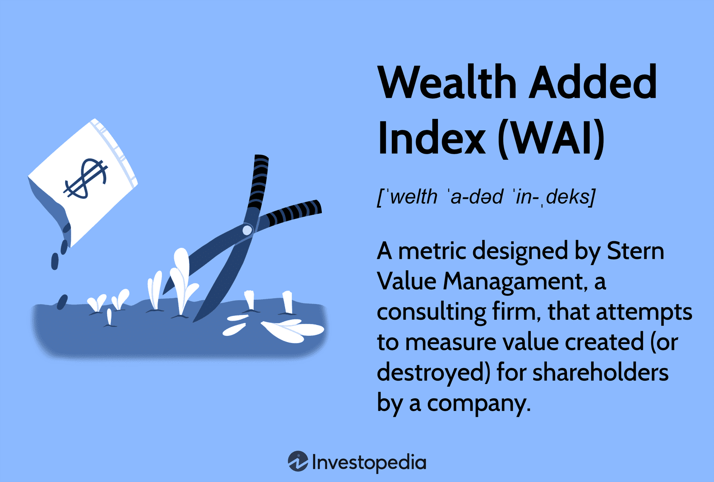

## Table of Contents

## What is the Wealth Added Index (WAI)?

The Wealth Added Index (WAI) is a financial tool used to measure how well a company is doing in creating wealth for its shareholders. It looks at the difference between the money a company makes and the cost of the money it uses. If the WAI is positive, it means the company is doing a good job at making more money than it costs to run the business. If it's negative, the company might be spending more than it's earning.

WAI is important because it helps investors see if a company is a good investment. It's different from other measures like profit because it takes into account the cost of capital. This means it gives a clearer picture of whether the company is truly adding value. By using WAI, investors can make better decisions about where to put their money.

## How is the Wealth Added Index calculated?

The Wealth Added Index (WAI) is calculated by taking the difference between the company's earnings and the cost of the money it uses. First, you figure out how much money the company makes, which is usually the net operating profit after taxes (NOPAT). Then, you need to know the cost of the money the company uses, which is called the capital charge. The capital charge is calculated by multiplying the amount of money the company has invested (its capital) by the cost of that capital. The cost of capital is the rate of return that investors expect from the company.

Once you have these two numbers, you subtract the capital charge from the NOPAT. If the result is positive, it means the company is making more money than it costs to run the business, so it's adding wealth. If the result is negative, the company is not making enough money to cover its costs, so it's losing wealth. The WAI gives investors a clear picture of how well the company is using its money to create value.

## What are the key components of the Wealth Added Index?

The Wealth Added Index (WAI) has two main parts: the money the company makes and the cost of the money it uses. The money the company makes is called the net operating profit after taxes, or NOPAT. This is what's left after the company pays all its bills and taxes. It's important because it shows how much money the company is really making from its business.

The other part is the cost of the money the company uses, which is called the capital charge. To find this, you take the amount of money the company has invested, which is its capital, and multiply it by the cost of that capital. The cost of capital is what investors expect to earn from putting their money into the company. When you subtract the capital charge from the NOPAT, you get the WAI. If it's positive, the company is making more money than it costs to run the business, which means it's adding wealth. If it's negative, the company isn't making enough to cover its costs, so it's losing wealth.

## Why is the Wealth Added Index important for investors?

The Wealth Added Index (WAI) is important for investors because it helps them see if a company is good at making money for its shareholders. It tells investors if a company is making more money than it costs to run the business. If the WAI is positive, it means the company is doing well and adding wealth. If it's negative, the company might be spending more than it's [earning](/wiki/earning-announcement), which is not good for investors.

WAI is different from other ways of looking at a company's money because it takes into account the cost of the money the company uses. This gives investors a clearer picture of how well the company is doing. By using WAI, investors can make better choices about where to put their money. They can see if a company is really adding value or if it's just making profits that don't cover the cost of running the business.

## How does the Wealth Added Index differ from other financial indices?

The Wealth Added Index (WAI) is different from other financial indices because it focuses on how well a company is doing at creating wealth for its shareholders. While many indices look at profits or revenue, WAI takes into account the cost of the money a company uses. This means it shows if a company is making more money than it costs to run the business, not just if it's making a profit. For example, a company might show a profit on paper, but if it's not making enough to cover the cost of its capital, it's not adding wealth according to WAI.

Other financial indices, like the Return on Equity (ROE) or Earnings Per Share (EPS), give investors different pieces of information. ROE tells investors how well a company is using the money shareholders have invested to generate profits. EPS shows how much money a company makes for each share of its stock. While these indices are useful, they don't tell the whole story like WAI does. WAI gives a clearer picture of whether a company is truly adding value by considering both the earnings and the cost of capital. This makes it a valuable tool for investors who want to see the bigger picture of a company's financial health.

## Can you provide an example of how the Wealth Added Index has been used in the past?

A good example of how the Wealth Added Index (WAI) has been used in the past is with a company called General Electric (GE). A few years ago, investors were looking at GE to see if it was a good investment. They used WAI to see if GE was making more money than it cost to run the business. At that time, GE's WAI was positive, which meant it was doing a good job at creating wealth for its shareholders. This helped investors feel more confident about putting their money into GE.

Another example is with a smaller company called Acme Corporation. Acme was trying to grow its business, but it needed to borrow a lot of money to do so. Investors used WAI to see if Acme was making enough money to cover the cost of the money it borrowed. They found that Acme's WAI was negative, which meant it was spending more than it was earning. This helped investors decide that Acme might not be a good investment at that time. By using WAI, investors could make better choices about where to put their money.

## What are the limitations of using the Wealth Added Index?

One limitation of the Wealth Added Index (WAI) is that it depends on the cost of capital, which can change. The cost of capital is what investors expect to earn from the company, but this can go up or down based on things like interest rates or how risky the company is seen to be. If the cost of capital changes, the WAI can change too, even if the company's earnings stay the same. This means WAI might not always give a clear picture of how well a company is doing over time.

Another limitation is that WAI looks at the whole company and doesn't break it down into different parts. A company might have some parts that are doing really well and adding wealth, while other parts are not doing so well. WAI can't show these differences, so investors might miss out on important details about where the company is strong or weak. This can make it harder for investors to make the best decisions about where to put their money.

## How can the Wealth Added Index be used to assess company performance?

The Wealth Added Index (WAI) is a useful tool for investors to see how well a company is doing at making money for its shareholders. It does this by looking at the difference between what the company earns and the cost of the money it uses. If the WAI is positive, it means the company is making more money than it costs to run the business. This is good because it shows the company is adding wealth. If the WAI is negative, the company is not making enough to cover its costs, which is not good for investors.

By using the WAI, investors can get a clear picture of a company's performance. It's different from other ways of looking at a company's money because it considers both the earnings and the cost of capital. This means it can tell investors if a company is really adding value, not just if it's making a profit. For example, a company might look profitable on paper, but if it's not making enough to cover the cost of its capital, the WAI will show that it's not adding wealth. This helps investors make better choices about where to put their money.

## What data sources are typically used to compile the Wealth Added Index?

To compile the Wealth Added Index (WAI), you need to gather data about a company's earnings and the cost of the money it uses. The main source for the earnings part is the company's financial statements, like the income statement. This tells you the net operating profit after taxes (NOPAT), which is what the company makes after paying all its bills and taxes. You can find these financial statements on the company's website or through financial databases like Bloomberg or Yahoo Finance.

For the cost of capital part, you need to know how much money the company has invested and what investors expect to earn from that investment. The amount of money invested is called the capital, and you can find this in the company's balance sheet, which is another part of the financial statements. The cost of capital can be trickier to figure out. It often comes from financial models or estimates that look at things like interest rates and how risky the company is. These estimates might come from financial analysts or services like Morningstar or Value Line.

## How frequently is the Wealth Added Index updated, and why is this frequency important?

The Wealth Added Index (WAI) is usually updated every quarter, which means four times a year. This is because companies release their financial statements every quarter, and WAI needs this new information to be accurate. By updating WAI every quarter, investors can keep track of how well a company is doing at making money for its shareholders over time.

It's important for WAI to be updated this often because it helps investors make timely decisions. If WAI is positive, it means the company is adding wealth, and investors might want to keep their money there or even invest more. If WAI is negative, it could be a sign to sell or not invest in the company. By having fresh WAI data every quarter, investors can react quickly to changes in a company's performance and make better choices about their investments.

## What advanced statistical methods are applied in the analysis of the Wealth Added Index?

To analyze the Wealth Added Index (WAI), experts often use a statistical method called regression analysis. This method helps them see how different things, like the cost of capital or the company's earnings, affect the WAI. By looking at these relationships, experts can predict how the WAI might change in the future based on different scenarios. For example, if interest rates go up, regression analysis can show how that might make the cost of capital higher and affect the WAI.

Another advanced method used is time series analysis. This method looks at how the WAI changes over time and helps experts find patterns or trends. By understanding these patterns, they can make better guesses about where the WAI might be headed. Time series analysis can also help spot if a company's performance is getting better or worse over time, which is important for investors trying to decide if they should keep their money in the company or look elsewhere.

## How does the Wealth Added Index integrate with other financial analysis tools for expert-level investment strategies?

The Wealth Added Index (WAI) can be a key part of expert-level investment strategies when used with other financial analysis tools. WAI tells investors if a company is making more money than it costs to run the business. This is important because it shows if the company is truly adding value. But WAI doesn't tell the whole story by itself. That's why experts often use it with other tools like Return on Equity (ROE) and Earnings Per Share (EPS). ROE shows how well a company is using the money shareholders have invested to make profits. EPS tells investors how much money a company makes for each share of its stock. By looking at WAI along with these other tools, experts can get a full picture of a company's financial health and make better investment choices.

For example, an expert might use WAI to see if a company is adding wealth, then look at ROE to see how well the company is using its money, and finally check EPS to see how much money the company is making for each share. This combination of tools helps experts understand not just if a company is profitable, but also if it's growing and if it's a good investment compared to other companies. By integrating WAI with these other tools, experts can create more detailed and effective investment strategies that consider all aspects of a company's performance.

## What is the Wealth Added Index (WAI) and how can it be understood?

The Wealth Added Index (WAI) is a metric developed to evaluate the value generated or diminished for shareholders by a company. Its distinctiveness lies in its ability to consider both historical and future performance, thus delivering a comprehensive perspective on a company's value creation. Unlike traditional financial metrics that predominantly focus on past data, WAI also incorporates projections to offer insights into future value. This dual focus aids in capturing a more accurate picture of a company's financial health and potential.

A critical component of WAI is its inclusion of the cost of equity. This aspect enables WAI to assess whether a company's returns surpass the required rate of return demanded by shareholders. Traditional financial metrics often overlook this, focusing instead on returns without weighing them against the underlying equity costs. By integrating the cost of equity, WAI provides a nuanced view, helping investors gauge if the company is generating sufficient returns to justify the risks associated with their equity investments.

Mathematically, WAI can be expressed as:

$$
\text{WAI} = \text{NOPAT} - (\text{CE} \times \text{Cost of Equity})
$$

Where:

- NOPAT stands for Net Operating Profit After Taxes, representing operating efficiency after tax implications.
- CE represents Capital Employed, indicating the total capital used for generating profits.
- Cost of Equity appraises the expected return necessary to persuade investors to finance the business.

A positive WAI suggests that a company is successful in creating value for its shareholders, as its returns have outstripped the cost of equity. Conversely, a negative WAI indicates that a company is eroding shareholder value as its returns fall below the expected thresholds. This binary indication is pivotal for investors and corporate managers aiming to understand value creation dynamics more profoundly.

Incorporating the cost of equity in performance evaluation aligns management decisions with shareholder interests, fostering an environment where strategic objectives are geared towards sustainable value enhancement. This alignment is particularly valuable in strategic planning and decision-making processes, allowing for a more integrated approach to achieving economic profitability.

## What are the components of WAI?

The Wealth Added Index (WAI) relies on several critical financial components to assess a company's value creation for shareholders. These components include Net Operating Profit After Taxes (NOPAT), Weighted Average Cost of Capital (WACC), and Capital Employed (CE). Each plays a crucial role in determining the overall economic profitability and efficiency of a company's operations.

**Net Operating Profit After Taxes (NOPAT)** is a measure that reflects the profits a company generates from its core operations after accounting for taxes. It provides an accurate representation of the firm's operating efficiency by excluding any financial structure impacts or non-operating income. The formula to calculate NOPAT is:

$$
\text{NOPAT} = \text{Operating Income} \times (1 - \text{Tax Rate})
$$

This calculation ensures that only operational performance is considered, emphasizing the productive capacity of the core business.

**Weighted Average Cost of Capital (WACC)** represents the average rate that a company is expected to return to its security holders to finance its asset base. The WACC is a critical component because it serves as the benchmark against which the firm's return must be compared to determine if it's adding or destroying value. The formula for WACC is:

$$
\text{WACC} = \left(\frac{E}{V} \times Re\right) + \left(\frac{D}{V} \times Rd \times (1 - Tc)\right)
$$

Where:
- $E$ is the market value of the equity,
- $D$ is the market value of the debt,
- $V$ is the total market value of the company's financing (equity + debt),
- $Re$ is the cost of equity,
- $Rd$ is the cost of debt,
- $Tc$ is the corporate tax rate.

WACC serves as the required rate of return that a company must earn on its existing asset base to satisfy its investors.

**Capital Employed (CE)** is the total capital that is used by the company to generate profits. It typically combines both equity and debt capital within the firm. This figure represents the total funds deployed for generating operational income and is a crucial factor in assessing the financial efficiency of the business. The formula for Capital Employed is:

$$
\text{Capital Employed} = \text{Total Assets} - \text{Current Liabilities}
$$

Or, equivalently:

$$
\text{Capital Employed} = \text{Fixed Assets} + \text{Working Capital}
$$

In summation, WAI is computed based on these components to evaluate whether a company's operational performance exceeds its cost of capital, ultimately indicating if shareholder value is being created or destroyed. This holistic approach allows for a nuanced understanding of a firm's economic profitability and management's efficiency.

## What is the difference between WAI and other financial metrics?

The Wealth Added Index (WAI) stands out among financial metrics due to its comprehensive evaluation of a company's value creation. Unlike Economic Value Added (EVA), which primarily considers historical performance, WAI encompasses both past outcomes and future projections, providing a more dynamic assessment of a company's financial health. EVA calculates the value generated above the required return on a company's capital, typically expressed as:

$$
\text{EVA} = \text{NOPAT} - (\text{Capital Employed} \times \text{WACC})
$$

where NOPAT is Net Operating Profit After Taxes, and WACC is the Weighted Average Cost of Capital.

Return on Invested Capital (ROIC) is frequently used to assess a firm's efficiency at generating returns from its capital. It is calculated as:

$$
\text{ROIC} = \frac{\text{NOPAT}}{\text{Capital Employed}}
$$

While ROIC measures how well a company turns capital into profits, WAI integrates this efficiency metric with the cost of equity, offering a more balanced view of returns relative to the investment risk. 

Market Value Added (MVA) focuses on the external perception of a company's value by measuring the difference between its market value and the capital contributed by shareholders and debt holders. MVA is calculated as:

$$
\text{MVA} = \text{Market Value of Equity} + \text{Market Value of Debt} - \text{Capital Employed}
$$

WAI, in contrast, emphasizes internal value creation, gauging operational performance and how effectively a company generates wealth for its shareholders over time.

Thus, while EVA provides a snapshot of economic profit, ROIC answers efficiency questions, and MVA reflects market sentiment, WAI offers a robust, forward-looking analysis that aligns operational success with shareholder interests, making it a potent tool in both financial analysis and strategic investment decision-making.

## How can WAI be implemented in algorithmic trading?

Algorithmic trading increasingly relies on quantitative measures such as the Wealth Added Index (WAI) to enhance trading strategies. The integration of WAI within these algorithms facilitates the real-time assessment of a company's capability to generate shareholder value. WAI's incorporation allows trading systems to make informed decisions by evaluating both the economic value creation of companies and their operational efficiency. This capability is critical for traders seeking to maximize returns and actively manage risks in dynamic markets.

When integrated into algorithmic models, WAI enables automated systems to recognize investment opportunities more effectively. Algorithms can utilize WAI to rank companies based on their potential for creating economic value, thus guiding investment decisions towards entities that demonstrate superior performance against their cost of equity. This data-driven approach enhances accuracy and efficiency, driving superior investment outcomes.

To implement WAI in [algorithmic trading](/wiki/algorithmic-trading), one can employ Python and libraries such as Pandas and NumPy to calculate and analyze WAI across a portfolio of companies. The basic formula to compute WAI includes components such as Net Operating Profit After Taxes (NOPAT), Weighted Average Cost of Capital (WACC), and Capital Employed (CE):

$$
\text{WAI} = \text{NOPAT} - (\text{WACC} \times \text{CE})
$$

Below is a simple Python snippet illustrating how WAI can be calculated:

```python
import pandas as pd

# Sample data
data = {
    'company': ['A', 'B', 'C'],
    'NOPAT': [1000000, 2000000, 1500000],  # Net Operating Profit After Taxes
    'WACC': [0.08, 0.07, 0.09],            # Weighted Average Cost of Capital
    'Capital_Employed': [5000000, 7000000, 6000000] # Capital Employed
}

df = pd.DataFrame(data)
df['WAI'] = df['NOPAT'] - (df['WACC'] * df['Capital_Employed'])

print(df[['company', 'WAI']])
```

Traders can use the output to identify which companies are likely to provide superior returns relative to their capital costs. In real-world applications, this calculation would be complemented by additional data processing to handle live-market data and more extensive financial modeling. Furthermore, algorithmic systems incorporate WAI into broader decision-making frameworks, evaluating WAI alongside metrics such as market [volatility](/wiki/volatility-trading-strategies) and sentiment analysis to refine portfolio strategies and optimize risk-adjusted returns.

However, while the deployment of WAI in algorithmic trading offers substantial benefits, it also necessitates high-quality input data and rigorous validation processes to ensure the reliability of trading algorithms. Nonetheless, the integration of WAI into [quantitative trading](/wiki/quantitative-trading) systems represents a promising advancement in the pursuit of optimizing investment performance.

## References & Further Reading

[1]: Stewart, G. Bennett. ["The Quest for Value: A Guide for Senior Managers."](https://www.amazon.com/Quest-Value-Guide-Senior-Managers/dp/0887304184) HarperCollins, 1991.

[2]: Damodaran, Aswath. ["The Dark Side of Valuation: Valuing Young, Distressed, and Complex Businesses."](https://pages.stern.nyu.edu/~adamodar/pdfiles/country/darkside2012full.pdf) FT Press, 2018.

[3]: Rappaport, Alfred. ["Creating Shareholder Value: A Guide for Managers and Investors."](https://www.amazon.com/Creating-Shareholder-Value-Managers-Investors/dp/0684844109) Free Press, 1998.

[4]: Fernandez, Pablo. ["Valuation Methods and Shareholder Value Creation."](https://www.sciencedirect.com/book/9780122538414/valuation-methods-and-shareholder-value-creation) Academic Press, 2002.

[5]: Tufano, Peter. ["Managing Risk, Managing Options: Lessons in Risk Management and Financial Engineering."](https://www.semanticscholar.org/paper/Managing-Risk-in-Higher-Education-Tufano/4a8fbf47ad5aed009b9cf53dd41abc06352e6bbc) Harvard Business School Press, 1995.

[6]: Stewart, Suresh. ["Economic Value Added: The Definitive Guide to Creating Economic Wealth."](https://www.researchgate.net/publication/358908421_Economic_Value_Added_Acritical_Reading) Wiley Finance, 2013.