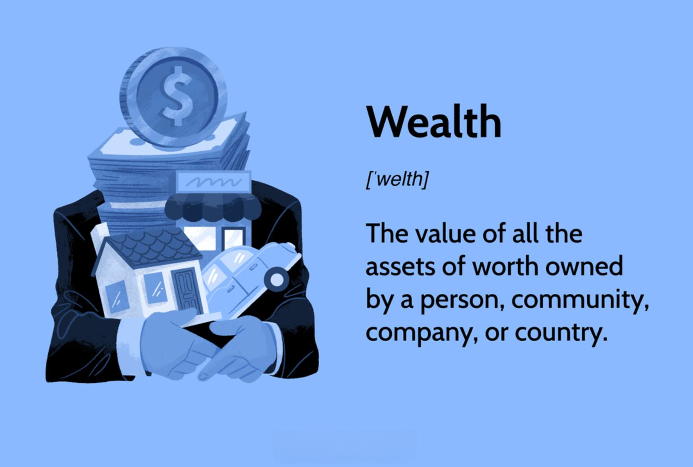

## Table of Contents

## What is wealth?

Wealth is the total value of all the money and things a person owns. This can include cash, savings, investments like stocks and bonds, property like houses and land, and other valuable items like cars and jewelry. Wealth is different from income, which is the money a person earns from working or other sources. While income is what you earn over time, wealth is what you have at a specific moment.

Having wealth can provide a sense of security and freedom. It allows people to live comfortably, buy things they need or want, and not worry about money as much. Wealth can also be used to help others, like giving to charity or supporting family members. However, wealth is not just about having a lot of money; it's also about managing it wisely and using it in ways that bring happiness and fulfillment.

## How is wealth different from income?

Wealth and income are two different things. Income is the money you get regularly, like from your job or maybe from renting out a house. It's what comes into your pocket over time. Wealth, on the other hand, is everything you own that has value at a certain time. This can be money in the bank, a house, stocks, or even a car. Wealth is like a snapshot of what you have right now.

Think of it this way: income is like the water flowing into a bucket, while wealth is the amount of water in the bucket at any given moment. You can use your income to increase your wealth by saving or investing it. But if you spend all your income, your wealth won't grow. So, income helps you build wealth, but they are not the same thing.

## What are the common ways to measure wealth?

One common way to measure wealth is by looking at net worth. Net worth is what you get when you add up everything you own, like your house, car, savings, and investments, and then subtract what you owe, like loans and credit card debt. If you have more things than debts, you have a positive net worth. If you owe more than you own, your net worth is negative. It's a simple way to see if you're doing well financially.

Another way to measure wealth is by looking at assets. Assets are things you own that have value, like real estate, stocks, and savings accounts. Some people focus on the total value of their assets to see how wealthy they are. But just looking at assets can be misleading if you have a lot of debt, because you might have a high asset value but still be struggling financially. So, it's important to consider both assets and debts when measuring wealth.

A third way to measure wealth is through income and investment returns. While income itself isn't wealth, it can help you build wealth over time. If you save or invest your income wisely, it can grow into wealth. Investment returns, like dividends from stocks or rental income from properties, also add to your wealth. So, by looking at how much money you're making and how well your investments are doing, you can get a good idea of your financial health and wealth.

## Can wealth be negative? How?

Yes, wealth can be negative. This happens when someone owes more money than they have. Think of it like this: if you add up everything you own, like your house, car, and savings, and then subtract all the money you owe, like loans and credit card debt, and the result is less than zero, then you have negative wealth.

Having negative wealth usually means you're in debt. It's not a good situation to be in because it means you owe more than you have. But it's not the end of the world. You can work to pay off your debts and increase your wealth over time. It's all about managing your money well and making smart choices.

## What are the differences between personal and national wealth?

Personal wealth is about what one person or family owns. It's like adding up all the money and things you have, like your house, car, and savings, and then taking away what you owe, like loans and credit card debt. If you have more things than debts, your personal wealth is positive. If you owe more than you own, it's negative. Personal wealth is important because it shows how well you're doing financially and can affect how you live your life.

National wealth, on the other hand, is about what a whole country owns. It includes everything from the money in the government's bank accounts to the value of all the buildings, roads, and natural resources like forests and minerals. National wealth also takes into account what the country owes to other countries or international organizations. It's a big picture of how rich a country is and can influence things like how much the government can spend on schools and hospitals. Both personal and national wealth are important, but they measure different things and affect people in different ways.

## How do financial assets contribute to wealth?

Financial assets are things like money in the bank, stocks, bonds, and mutual funds. They are important because they can grow in value over time, which helps increase your wealth. For example, if you buy stocks and the company does well, the value of your stocks can go up. This means your wealth goes up too. Also, some financial assets, like savings accounts and bonds, give you interest or dividends, which is extra money you can use to buy more assets or spend on things you need.

Financial assets are also easy to turn into cash if you need money quickly. This is called liquidity. If you have a lot of financial assets, you can sell them to pay for things like a new house or an emergency. This makes financial assets a big part of your wealth because they give you flexibility and security. So, by saving and investing in financial assets, you can build your wealth over time and have more money to use when you need it.

## What role do non-financial assets play in wealth calculation?

Non-financial assets are things you own that you can't easily turn into cash, like your house, car, and jewelry. They are important because they add to your wealth. When you calculate your wealth, you add up the value of these things along with your financial assets, like money in the bank and stocks. If you own a house worth a lot of money, it can make your wealth much higher, even if you don't have a lot of cash.

These non-financial assets can also help you build wealth over time. For example, if you buy a house and it goes up in value, you can sell it later for more money than you paid. This means your wealth grows. But non-financial assets can also be tricky because they might not be easy to sell quickly if you need money. So, they are an important part of your wealth, but you need to think carefully about how to use them to keep growing your wealth.

## How does debt affect the measurement of wealth?

Debt affects the measurement of wealth because it is what you owe, and you need to subtract it from what you own to find your true wealth. When you add up everything you own, like your house, car, and savings, and then subtract all the money you owe, like loans and credit card debt, you get your net worth. If you owe a lot of money, your net worth can be lower, or even negative, which means you have negative wealth.

Having a lot of debt can make it hard to build wealth because you have to use your money to pay off what you owe instead of saving or investing it. For example, if you have a big loan for your house, you might have to pay a lot of money every month, and that money can't be used to buy stocks or put into your savings account. So, managing debt well is important for growing your wealth over time.

## What are the global standards for measuring wealth?

There are a few global standards for measuring wealth that many countries and organizations use. One common way is to look at net worth, which is what you get when you add up everything you own, like your house, car, and savings, and then subtract what you owe, like loans and credit card debt. This gives a clear picture of how much wealth a person or a country has at a specific time. Many financial institutions and governments use this method because it's simple and gives a good overall view of wealth.

Another global standard is the use of Gross National Income (GNI) per capita, which measures the total income earned by a country's residents, including money made from working, investments, and other sources, divided by the population. This helps compare the wealth of different countries. The World Bank and other international organizations often use GNI per capita to rank countries by wealth and to see how well they are doing economically. Both net worth and GNI per capita are important because they give different but useful information about wealth on a global scale.

## How do economic theories influence the definition of wealth?

Economic theories can change how we think about wealth. For example, some economists say wealth is just about money and things you can own, like houses and cars. They think of wealth as something you can see and touch. This is called a materialistic view of wealth. It's like saying wealth is all about having a lot of stuff and money in the bank. These economists focus on how much people own and how they can use it to buy more things or invest.

Other economists have a different idea. They think wealth is also about things you can't see, like happiness and well-being. This view is called a non-materialistic or holistic view of wealth. They say that having a lot of money and things is good, but it's also important to feel good and be happy. These economists look at how wealth affects people's lives in ways that go beyond just money and stuff. So, economic theories can make us see wealth in different ways, depending on what we think is important.

## What are the criticisms of traditional wealth measurement methods?

Some people say that traditional ways of measuring wealth, like adding up money and things and then taking away what you owe, are too simple. They think this method misses out on important things like how happy or healthy people are. For example, if someone has a lot of money but is always stressed and unhappy, they might not feel wealthy even though their bank account says they are. Also, these methods don't look at how evenly wealth is spread out in a country. If a few people have most of the wealth and everyone else has very little, the country might seem rich, but many people are struggling.

Another criticism is that traditional wealth measures don't think about the future. They only look at what people have right now and don't consider things like the environment or how sustainable the wealth is. For example, if a country is rich because it's using up all its natural resources, that wealth might not last long. The environment could get worse, and then the country might not be able to keep being wealthy. So, some people think we need new ways to measure wealth that look at more than just money and things.

## How can advancements in data analytics improve wealth measurement accuracy?

Advancements in data analytics can help make measuring wealth more accurate by looking at more information and finding patterns that we might miss otherwise. For example, data analytics can look at lots of different things at the same time, like how much money people have, what they own, and even how happy they are. This can give a fuller picture of wealth, not just in terms of money and things but also in terms of well-being. By using computers and special math, data analytics can find connections between these different pieces of information and give us a better idea of what wealth really means for different people.

Another way data analytics can improve wealth measurement is by making it easier to keep track of changes over time. Traditional methods might only look at wealth at one moment, but data analytics can follow how wealth grows or shrinks over months or years. This can help us see if the wealth people have is lasting or if it's going up and down a lot. By understanding these patterns, we can make better decisions about how to help people build and keep their wealth. So, using data analytics can make our understanding of wealth more complete and more helpful for everyone.

## What is the importance of understanding financial assessment in wealth management?

Financial assessment serves as a crucial foundation for gauging the economic health of both individuals and institutions. This process allows stakeholders to determine net worth, explore potential growth strategies, and ultimately make informed financial decisions. A comprehensive financial assessment considers various elements including asset valuation, debt evaluation, and liquidity analysis.

Net worth, a key measure within financial assessment, is the difference between total assets and liabilities. The formula for net worth is:

$$
\text{Net Worth} = \text{Total Assets} - \text{Total Liabilities}
$$

Assets encompass everything owned that has value, such as real estate, stocks, bonds, and cash. Accurate asset valuation is essential in determining their fair market value, which often varies over time due to market conditions. Valuation methods can include comparable sales for real estate, market price for publicly traded assets, and present value calculations for bonds.

Debt evaluation, another critical component, involves analyzing outstanding liabilities like mortgages, loans, and credit card balances. Assessing the cost of debt, including interest rates and repayment terms, provides insights into financial leverage and risk exposure. The debt-to-equity ratio, a common metric in this regard, is calculated as follows:

$$
\text{Debt-to-Equity Ratio} = \frac{\text{Total Liabilities}}{\text{Shareholder's Equity}}
$$

A financial assessment also includes examining [liquidity](/wiki/liquidity-risk-premium) metrics, such as the current ratio, which measures the ability of individuals or organizations to cover short-term obligations. The current ratio formula is:

$$
\text{Current Ratio} = \frac{\text{Current Assets}}{\text{Current Liabilities}}
$$

This ratio provides insight into the short-term financial health and operational efficiency of a subject.

In summary, a robust financial assessment encompasses asset valuation, debt evaluation, and other quantitative analyses that are vital for understanding economic health. Through these assessments, individuals and institutions can identify areas for potential growth and develop strategies to achieve financial stability and expansion.

## What are the tools and techniques for measuring wealth?

Wealth measurement encompasses various methodologies, reflecting both historical approaches and modern financial insights. Traditional methods often focused on tangible asset accumulation, such as land, real estate, and livestock, to determine an individual's or entity's wealth. These assets provided not just value, but also utility and security in pre-industrial economies. In contrast, contemporary wealth measurement incorporates a diverse array of economic indicators and financial metrics.

One of the primary metrics for wealth measurement today is net worth, defined as the total assets minus total liabilities. Assets can include cash, investments, real estate, and personal property, while liabilities encompass debts and obligations. Net worth serves as a comprehensive indicator of financial health, offering a snapshot of economic standing at any given time.

$$
\text{Net Worth} = \text{Total Assets} - \text{Total Liabilities}
$$

Market capitalization, primarily used for companies, is another critical metric. It represents the total market value of a company's outstanding shares of stock. Calculating market capitalization involves multiplying the company's share price by its total number of outstanding shares. This measurement is essential for investors to assess the company's size and investment value relative to others in the market. 

$$
\text{Market Capitalization} = \text{Share Price} \times \text{Number of Outstanding Shares}
$$

Shareholder equity, also known as stockholders' equity, represents the owners' claim after all liabilities are settled. It provides insight into a company's financial health and stability and is crucial for assessing potential returns on investments. Shareholder equity can be calculated from the balance sheet as the difference between total assets and total liabilities.

$$
\text{Shareholder Equity} = \text{Total Assets} - \text{Total Liabilities}
$$

Historically, wealth assessment included valuing assets manually, which was often subjective and limited to immediate usefulness and tangibility. Contemporary methods leverage advanced financial models and statistical tools to provide more objective and comprehensive evaluations. Technology has facilitated the inclusion of intangible assets, such as intellectual property and brand value, into wealth measurement, reflecting a broader economic landscape where such factors significantly influence valuation.

In conclusion, wealth measurement has evolved significantly from simple asset accumulation to include sophisticated financial metrics and indicators. This progression is essential in today's complex financial environment, enabling more accurate assessments of economic standing and decision-making relative to personal and institutional financial strategies.

## What are the key indicators of economic measurement and what impact do they have?

Economic measurement plays a fundamental role in deciphering market dynamics and assessing overall economic conditions. These measurements employ a range of indicators that provide essential insights into the performance and health of economies at various scales. Among these indicators, Gross Domestic Product (GDP), inflation rates, and consumer price indexes (CPI) stand out for their widespread use and significance.

Gross Domestic Product (GDP) is the total monetary value of all finished goods and services produced within a country's borders in a specific time period. It serves as a comprehensive scorecard of a country's economic health, often used to gauge the size and growth rate of an economy. GDP can be calculated using the formula: 

$$
\text{GDP} = C + I + G + (X - M)
$$

where $C$ is consumption, $I$ is investment, $G$ is government spending, and $(X - M)$ is net exports (exports minus imports).

Inflation rate is another critical economic indicator that measures the rate at which the general level of prices for goods and services is rising, and subsequently, how purchasing power is eroded. It is often calculated based on the consumer price index (CPI), which tracks changes in the price level of a market basket of consumer goods and services. Inflation rate is expressed as a percentage increase per annum and can be calculated using:

$$
\text{Inflation Rate} = \left( \frac{\text{CPI}_{\text{end}} - \text{CPI}_{\text{start}}}{\text{CPI}_{\text{start}}} \right) \times 100
$$

Tracking inflation is vital for economic strategies, as high inflation can erode currency value, affect interest rates, and influence investment decisions.

The Consumer Price Index (CPI) is a crucial tool for tracking inflation, representing the annual change in prices paid by urban consumers for a basket of goods and services. By tracking CPI, policymakers and economists can assess the cost of living and make informed decisions about monetary and fiscal policies.

Understanding these economic indicators is essential for developing strategic plans in both public and private sectors. They provide valuable data that inform decisions on interest rates, taxation policies, and public spending. Analysis of GDP, inflation rates, and CPI equips stakeholders with the understanding necessary to anticipate economic shifts and tailor strategies to maximize potential benefits or mitigate risks. Furthermore, these metrics are interconnected and often influence one another, requiring comprehensive analysis for effective planning. For instance, a rising GDP might lead to increased inflation, prompting adjustments in interest rates to manage economic stability. 

Overall, grasping the importance and impact of these economic indicators is a prerequisite for effective economic analysis and strategic decision-making. They offer quantifiable data that support the evaluation of economic health and the formulation of economic policies aimed at fostering growth and stability.

## How is Algorithmic Trading Revolutionizing Financial Markets?

Algorithmic trading has emerged as a pivotal force in modern financial markets, utilizing advanced computational techniques to execute trades with precision and speed that outpaces manual trading methods. At its core, [algorithmic trading](/wiki/algorithmic-trading) employs pre-programmed instructions concerning time, price, and [volume](/wiki/volume-trading-strategy) to automate trading decisions. This automation allows traders to capitalize on market movements instantaneously, ensuring that they can respond to changes with far greater efficiency than traditional methods permit.

Fundamentally, algorithmic trading leverages computational power to achieve market efficiency by processing large datasets and performing complex calculations rapidly. This capability enables the identification of trading opportunities across various financial instruments in real-time. Algorithms can be designed to execute orders when certain market conditions are met, reducing the influence of human emotions and biases on trading decisions.

One of the key elements in algorithmic trading is the use of technical indicators, which provide quantitative assessments of market conditions. Indicators such as the Relative Strength Index (RSI), Exponential Moving Averages (EMA), and Moving Average Convergence Divergence (MACD) play a significant role in shaping trading strategies.

1. **Relative Strength Index (RSI):** RSI is a momentum oscillator that measures the speed and change of price movements. It oscillates between 0 and 100, typically using a 14-day timeframe. An asset is generally considered overbought when the RSI is above 70 and oversold when below 30. This indicator helps traders identify potential reversals in market trends.

   The formula to calculate RSI is:
$$
   RSI = 100 - \left( \frac{100}{1 + RS} \right)

$$

   where $RS$ (Relative Strength) is the average gain over the average loss in the period being considered.

2. **Exponential Moving Averages (EMA):** Unlike simple moving averages, EMAs give more weight to recent prices, making them more responsive to new information. EMAs are crucial in identifying the direction of the trend and are often used in crossover strategies (e.g., buying when a short-term EMA crosses above a long-term EMA).

   The formula for EMA is:
$$
   EMA_{\text{today}} = \left( \text{Price}_{\text{today}} \times \frac{2}{n+1} \right) + \left( EMA_{\text{yesterday}} \times \left( 1 - \frac{2}{n+1} \right) \right)

$$

   where $n$ is the number of days in the EMA period.

3. **Moving Average Convergence Divergence (MACD):** MACD is a trend-following momentum indicator that shows the relationship between two moving averages of a security’s price. The MACD is calculated by subtracting the 26-period EMA from the 12-period EMA. The result of this calculation is the MACD line. A nine-day EMA of the MACD, called the "signal line," is then plotted on top of the MACD line, which can function as a trigger for buy and sell signals.

Algorithmic trading strategies integrating these indicators often incorporate additional parameters, such as stop-loss and take-profit levels, to manage risk efficiently. The implementation of algorithmic trading can be demonstrated through a simple Python script that uses libraries such as Pandas for data manipulation and TA-Lib for technical analysis. For instance, a trader might write a script to apply an EMA crossover strategy:

```python
import pandas as pd
import talib

# Sample Data
data = pd.read_csv('market_data.csv')  # assumes 'Close' column

# Calculate EMAs
data['EMA12'] = talib.EMA(data['Close'], timeperiod=12)
data['EMA26'] = talib.EMA(data['Close'], timeperiod=26)

# Determine Buy and Sell Signals
data['Signal'] = 0
data.loc[data['EMA12'] > data['EMA26'], 'Signal'] = 1  # Buy Signal
data.loc[data['EMA12'] < data['EMA26'], 'Signal'] = -1 # Sell Signal

# Visualize or backtest strategy using 'Signal' column
```

In conclusion, algorithmic trading has transformed the financial trading landscape, providing enhanced accuracy and market responsiveness. By leveraging computational power to integrate technical indicators, traders can deploy robust strategies that efficiently identify and exploit market inefficiencies. As technological advancements continue to evolve, the potential for further innovations in algorithmic trading remains significant.

## References & Further Reading

[1]: Bergstra, J., Bardenet, R., Bengio, Y., & Kégl, B. (2011). ["Algorithms for Hyper-Parameter Optimization."](https://dl.acm.org/doi/10.5555/2986459.2986743) Advances in Neural Information Processing Systems 24.

[2]: ["Advances in Financial Machine Learning"](https://www.amazon.com/Advances-Financial-Machine-Learning-Marcos/dp/1119482089) by Marcos Lopez de Prado

[3]: ["Evidence-Based Technical Analysis: Applying the Scientific Method and Statistical Inference to Trading Signals"](https://www.amazon.com/Evidence-Based-Technical-Analysis-Scientific-Statistical/dp/0470008741) by David Aronson

[4]: ["Machine Learning for Algorithmic Trading"](https://github.com/PacktPublishing/Machine-Learning-for-Algorithmic-Trading-Second-Edition) by Stefan Jansen

[5]: ["Quantitative Trading: How to Build Your Own Algorithmic Trading Business"](https://www.amazon.com/Quantitative-Trading-Build-Algorithmic-Business/dp/1119800064) by Ernest P. Chan