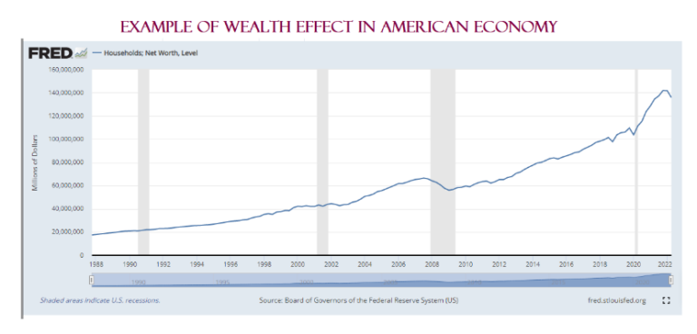

This article explores the intricate relationship between financial markets, the economic impact of wealth effects, and the pivotal role of algorithmic trading. Changes in asset values can significantly influence consumer behavior through what is known as the wealth effect. This phenomenon occurs when individuals, feeling wealthier due to an increase in the value of their assets—such as real estate or stock portfolios—tend to increase their consumption, thereby driving economic activity. Understanding this behavior is crucial for economists and policymakers as they gauge the broader implications of asset value fluctuations on economic stability.

In parallel, algorithmic trading introduces a transformative influence on market operations, characterized by the use of sophisticated computer algorithms to execute trades at speeds and volumes beyond human capability. Algorithmic strategies can affect market dynamics, including price formation and liquidity. While these algorithms have the potential to enhance market efficiency, they also present challenges, such as increased market volatility and potential destabilization, especially during periods of rapid economic change.



This article will closely examine the economic implications arising from the nexus of the wealth effect and algorithmic trading. Insights from this analysis aim to assist policymakers, investors, and stakeholders in making informed decisions to navigate this continually evolving financial landscape. With financial markets more interconnected and technology-driven than ever before, understanding these factors is imperative for crafting regulations and policies that balance innovation with economic security.

## Table of Contents

## Understanding the Wealth Effect

The wealth effect is a concept within behavioral economics that elucidates the way perceived changes in wealth influence consumer spending behavior. This effect posits that when individuals observe an increase in their wealth, especially through the appreciation of assets such as real estate or stock investments, there is a tendency for them to spend more, even if their actual income remains unchanged. This propensity to spend more in response to perceived wealth increases stems from the psychological impact of feeling wealthier, thereby prompting consumers to loosen their financial constraints and increase their consumption levels.

This phenomenon is especially prevalent during times when asset values are rising, such as during bull markets or real estate booms. As asset prices increase, the balance sheets of individuals also improve, which can lead to a boost in consumer confidence and a willingness to spend more. This psychological response can significantly impact overall economic activity, as increased consumer spending can fuel further economic growth.

Understanding the wealth effect is essential for policymakers, as it plays a crucial role in both fiscal and monetary policy decision-making. By comprehending how changes in asset values can influence consumer behavior, policymakers can better anticipate shifts in economic activity and tailor their policies accordingly. For instance, during periods of rapid asset growth, there might be a need for tighter monetary policies to curb potential inflationary pressures, whereas periods of declining asset values might require stimulus measures to support consumer spending.

A key area of research related to the wealth effect is the marginal propensity to consume (MPC) out of wealth. MPC measures the likelihood of an individual to increase consumption following an increase in their wealth. This metric is vital for understanding the magnitude of the wealth effect in different economic environments and can be represented using a simple function:

$$
\Delta C = MPC_w \times \Delta W
$$

Where $\Delta C$ represents the change in consumption, $MPC_w$ is the marginal propensity to consume out of wealth, and $\Delta W$ stands for the change in perceived wealth. A higher MPC value would indicate a stronger wealth effect, meaning that an increase in perceived wealth would more significantly boost consumer spending. This measurement helps economists quantify the impact of wealth changes on spending behavior, facilitating more accurate predictions of economic activity and better-informed policy adjustments.

## Impact of the Wealth Effect on Consumer Behavior

Consumer behavior is notably influenced by an increase in asset values, a phenomenon closely linked to the wealth effect. This effect posits that individuals, when perceiving an increase in their wealth, are more inclined to spend, even if their actual income remains unchanged. During periods of economic growth, especially bull markets, this propensity to spend rises as asset values appreciate, augmenting consumer confidence and willingness to engage in economic activity.

Employment trends and the rising cost of living significantly mediate this process. While increased asset values may bolster perceived wealth, the actual impact on consumption is often tempered by current employment conditions and inflation rates. When employment is robust, and wages rise, the wealth effect is strengthened as consumers feel more confident in their financial security. Conversely, if living costs outpace income growth, the additional spending buoyed by perceived wealth may be restrained as consumers prioritize essential expenditures.

Understanding the wealth effect requires a nuanced analysis of various economic factors. While asset appreciation plays a central role, other dynamics such as disposable income and cost of living are integral in shaping consumer behavior. For instance, if the increase in perceived wealth is accompanied by significant inflationary pressures, the actual change in consumer spending may be less pronounced.

Economic models that explain the wealth effect often incorporate these variables to predict consumer behavior more accurately. For example, the marginal propensity to consume (MPC) can be used to estimate how changes in perceived wealth translate into spending. In Python, this relationship might be expressed through the following simple model:

```python
def marginal_propensity_to_consume(wealth_increase, consumption_rate):
    return wealth_increase * consumption_rate

# Example usage
wealth_increase = 1000  # hypothetical increase in wealth
consumption_rate = 0.05  # assume 5% of additional wealth is spent
additional_spending = marginal_propensity_to_consume(wealth_increase, consumption_rate)
print(f'Additional Spending: ${additional_spending}')
```

This script calculates additional spending based on an assumed consumption rate from increased wealth, illustrating how perceived wealth can influence economic activity. The wealth effect, therefore, is not merely the result of rising asset values but rather a complex interplay of economic conditions influencing consumer decisions.

## Algorithmic Trading and Its Influence on Markets

Algorithmic trading, commonly referred to as algo-trading, employs computer algorithms to execute financial trades at high speed and volumes, revolutionizing traditional trading approaches. Introduced in the financial markets to facilitate strategic buying and selling of financial instruments, it aims to maximize profits by capitalizing on minute price discrepancies.

At the core, [algorithmic trading](/wiki/algorithmic-trading) significantly influences market dynamics, primarily impacting price formation and [liquidity](/wiki/liquidity-risk-premium). The algorithms analyze vast datasets at unprecedented speeds, facilitating [arbitrage](/wiki/arbitrage) opportunities by identifying and exploiting temporary market inefficiencies. For instance, they can engage in [statistical arbitrage](/wiki/statistical-arbitrage), a strategy that relies on statistical and econometric techniques to identify price discrepancies between related securities. This precision enables trades to occur within fractions of a second, leading to more efficient price discovery.

However, while algo-trading can enhance market liquidity by tightening bid-ask spreads and increasing trading volumes, it may also introduce instability. Algorithms are capable of executing orders in milliseconds that humans would take minutes to process, which can lead to rapid changes in asset prices. This high-frequency nature can cause temporary price dislocations or, in extreme cases, flash crashes, where stock prices plummet and recover in a brief time span, often attributed to cascading algorithms.

The integration of [artificial intelligence](/wiki/ai-artificial-intelligence) (AI) into algorithms further compounds their influence. AI-driven models enhance pattern recognition capabilities, allowing for complex predictive analytics and decision-making processes. These models can identify emerging trends from massive datasets, determining optimal trading opportunities. The AI’s ability to adapt to new data patterns can stabilize certain market conditions by providing consistent liquidity and reducing the [volatility](/wiki/volatility-trading-strategies) arising from sharp, unexplained market movements. Conversely, the self-learning aspect of AI models could inadvertently magnify market volatility if they misinterpret noise in data as actionable signals.

Understanding the intricacies of algorithmic trading methods is crucial for effectively managing their market impact. Financial regulators and market participants endeavor to create a balanced environment where the benefits of algorithmic efficiencies do not lead to excessive volatility or unfair advantages. Enhanced oversight and regulation are central to this endeavor, aimed at maintaining market integrity while promoting innovation. By comprehensively analyzing these systems, stakeholders can implement strategic frameworks to mitigate potential adverse effects while maximizing the inherent efficiencies of algorithmic trading.

## The Interplay Between Algorithmic Trading and the Wealth Effect

Algorithmic trading, utilizing computer-driven models to execute trades at high speed and [volume](/wiki/volume-trading-strategy), has introduced significant shifts in market operations, particularly influencing asset price dynamics. By affecting how asset values are perceived, algorithmic trading can alter the wealth effect, which reflects the behavioral changes in consumer spending prompted by perceived changes in wealth.

During periods of asset booms, algorithmic trading can magnify the wealth effect. Algorithms often follow [momentum](/wiki/momentum) strategies, buying assets as their prices rise, which may lead to rapid price escalations. This increase in asset prices can enhance investor wealth perceptions, encouraging heightened consumer spending and further contributing to economic cycles. For example, if a momentum trading algorithm identifies an upward trend in a stock's value, it may initiate a series of buy orders that push the price even higher. This algorithmic behavior can reinforce investor confidence and perceived wealth, thus intensifying the wealth effect.

Conversely, in downturns, high-frequency trading algorithms can exacerbate market declines. Large-scale sell orders triggered by algorithms in response to market signals can lead to a downward spiral in asset prices. This precipitous fall affects the wealth perception of investors, potentially diminishing consumer confidence and curbing spending. For instance, during a sudden market dip, algorithms optimized for trend reversal may initiate sell-offs, contributing to sharp decreases in asset valuations, thereby reducing perceived wealth and affecting consumption behavior negatively.

Understanding these dynamics necessitates robust analysis and continuous monitoring of algorithmic trading systems. In practice, this involves real-time data analysis and the application of mathematical models to predict and assess the impact of algorithmic trades on market volatility. Python, equipped with libraries such as NumPy and pandas, is often used for such tasks due to its efficiency in handling large datasets and performing complex calculations. 

```python
import numpy as np
import pandas as pd

# Sample code to analyze market trend data
def analyze_market_trend(data):
    # Calculate moving average as a simple trend indicator
    data['Moving_Average'] = data['Asset_Price'].rolling(window=5).mean()
    # Identify buy/sell signals based on moving average
    data['Signal'] = np.where(data['Asset_Price'] > data['Moving_Average'], 'Buy', 'Sell')
    return data

# Example dataframe
data = pd.DataFrame({
    'Asset_Price': [100, 102, 105, 107, 110, 108, 107, 105, 106, 109]
})

trend_analysis = analyze_market_trend(data)
print(trend_analysis)
```

The interplay between algorithmic trading and the wealth effect emphasizes the need for vigilant oversight and sophisticated analytical approaches to manage market stability effectively. By advancing our understanding of these interactions, stakeholders can develop strategies to harness the efficiencies offered by algorithmic trading while mitigating the risks associated with increased volatility and distorted asset valuations.

## Economic Implications and Future Considerations

Algorithmic trading and the wealth effect hold significant implications for economic policy and regulation. As financial markets increasingly rely on algorithmic strategies, the efficiencies they provide must be carefully balanced against the potential risks of market distortion or manipulation. Algorithmic trading, characterized by its ability to execute trades at high speed and volume, enhances market efficiency and liquidity. However, it can also introduce challenges, such as increased volatility and the potential for flash crashes, which arise from rapid, automated sell-offs.

The fast-paced nature of algorithmic trading necessitates the development of robust regulatory frameworks to maintain stability in financial markets. Regulators must ensure that trading systems do not contribute to market malfunctions, which can lead to substantial financial losses for investors and undermine confidence in market integrity. This involves monitoring algorithmic trading activities and implementing safeguards to prevent excessive market disruptions.

Future research is crucial to better understand the economic impacts of algorithmic trading systems, particularly concerning their influence on the wealth effect. The wealth effect, which describes how changes in asset values can affect consumer behavior, can be amplified or dampened by the rapid price changes induced by algorithmic trading. Research focusing on the interaction between these trades and consumer perceptions of wealth will provide insights necessary for designing policies that address these complexities.

Collaborations among economists, data scientists, and policymakers are essential in creating effective strategies to navigate this evolving landscape. Data scientists can offer expertise in analyzing large datasets to identify patterns and predict market behaviors, while economists can interpret these findings to propose comprehensive policy recommendations. Policymakers, in turn, can legislate and enforce regulations that strike a balance between fostering innovation and protecting market stability. By working together, these stakeholders can ensure that algorithmic trading systems are integrated into financial markets safely and effectively, maximizing their benefits while minimizing potential risks.

## Conclusion

The complex relationship between wealth effects, consumer behavior, and algorithmic trading is fundamental to understanding modern economic systems. As asset values shift, they directly influence consumer spending patterns through the wealth effect, where perceived increases in wealth lead to greater consumption. This effect plays a crucial role in driving economic activity and shaping market operations. 

Algorithmic trading, with its capacity for high-speed and high-volume transactions, has brought significant changes to market dynamics. It enhances efficiency and liquidity but also introduces potential volatility and instability. These trading practices can amplify the wealth effect, causing swift changes in asset values that affect consumer confidence and, subsequently, economic growth.

Policymakers face the challenge of crafting guidelines that reconcile the benefits of technological advancements with the need to safeguard market stability. Ensuring that algorithmic trading systems do not undermine market integrity is essential. Regulatory frameworks must evolve to address the complexities introduced by these technologies, preventing market distortions and potential manipulations.

Continuous analysis is imperative as financial markets increasingly integrate advanced technologies. By monitoring the interactions between technological innovations and economic variables, stakeholders can better anticipate shifts in market operations and consumer behavior. Strategic planning is needed to harness the advantages of algorithmic trading, optimizing its impact while minimizing risks to market stability. Collaboration among economists, technologists, and regulators will be vital in developing strategies that protect and promote economic growth in a rapidly changing landscape.

## References & Further Reading

[1]: Case, K. E., Quigley, J. M., & Shiller, R. J. (2005). ["Comparing Wealth Effects: The Stock Market versus the Housing Market."](http://www.econ.yale.edu/~shiller/pubs/p1181.pdf) Advances in Macroeconomics.

[2]: Lo, A. W. (2012). ["Algorithmic Trading and its Implications on Capital Markets."](https://wp0.vanderbilt.edu/lawreview/wp-content/uploads/sites/278/2015/11/How-Algorithmic-Trading-Undermines-Efficiency-in-Capital-Markets.pdf) Journal of Economic Perspectives.

[3]: Dufour, A., & Engle, R. F. (2000). ["Time and the Price Impact of a Trade."](https://onlinelibrary.wiley.com/doi/abs/10.1111/0022-1082.00297) The Journal of Finance, 55(6), 2467-2498.

[4]: Barberis, N., & Shleifer, A. (2003). ["Style Investing."](https://scholar.harvard.edu/files/shleifer/files/style_investing.pdf) The Quarterly Journal of Economics, 116(1), 1-27.

[5]: Aldridge, I. (2013). ["High-Frequency Trading: A Practical Guide to Algorithmic Strategies and Trading Systems."](https://www.amazon.com/High-Frequency-Trading-Practical-Algorithmic-Strategies/dp/1118343506) Wiley.