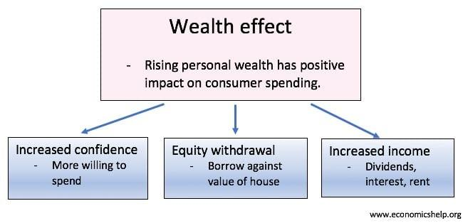

## Table of Contents

## What is the wealth effect?

The wealth effect is when people feel richer because the value of their assets, like their homes or stocks, goes up. When this happens, they might spend more money because they feel like they have more wealth. For example, if the price of a person's house increases, they might feel more comfortable buying a new car or going on a vacation.

This effect can influence the whole economy. When many people start spending more because they feel wealthier, it can help businesses grow and create more jobs. However, if asset prices drop suddenly, people might feel poorer and cut back on spending, which can slow down the economy. So, the wealth effect can make economic cycles stronger, both on the way up and on the way down.

## How does the wealth effect influence consumer spending?

The wealth effect influences consumer spending by making people feel richer when the value of their assets, like homes or stocks, goes up. When people feel wealthier, they tend to spend more money. For example, if someone's house value increases, they might feel confident enough to buy a new car or go on a vacation. This increase in spending happens because people think they have more money to spend, even if their income hasn't changed.

This change in spending can have a big impact on the whole economy. When lots of people start spending more because they feel richer, businesses can grow and create more jobs. This can make the economy stronger. But if asset prices suddenly drop, people might feel poorer and start spending less. This can slow down the economy because businesses might sell less and have to cut jobs. So, the wealth effect can make economic ups and downs more extreme.

## Can you explain the relationship between stock market performance and the wealth effect?

The stock market performance can have a big impact on the wealth effect. When the stock market goes up, people who own stocks see the value of their investments increase. This makes them feel richer, even if they haven't sold their stocks yet. Feeling wealthier can lead people to spend more money on things like new cars, vacations, or home improvements. This increase in spending can help the economy grow because businesses sell more and might hire more workers.

On the other hand, if the stock market goes down, people can feel poorer because their investments are worth less. This can make them spend less money, which can slow down the economy. For example, if someone sees their stock portfolio lose value, they might decide to delay buying a new TV or going out to eat. When many people do this at the same time, businesses can suffer, leading to fewer jobs and a weaker economy. So, the performance of the stock market can greatly influence how people feel about their wealth and how much they choose to spend.

## What are the different types of assets that contribute to the wealth effect?

Different types of assets can make people feel richer and cause the wealth effect. One big type of asset is a person's home. When the price of homes goes up, people who own homes feel like they have more money, even if they don't plan to sell their house. Another type of asset is stocks. If someone owns stocks and the stock market goes up, they feel richer because their investments are worth more. These are the two main types of assets that can make people feel wealthier and spend more money.

Other types of assets can also contribute to the wealth effect. For example, if someone has money in a savings account and the interest rates go up, they might feel richer because their savings are growing faster. Another example is if someone owns a business and the business becomes more valuable, they might feel wealthier. All these different types of assets can make people feel like they have more money, which can lead them to spend more and help the economy grow.

## How does the wealth effect impact the overall economy?

The wealth effect can make the whole economy grow or shrink. When people feel richer because the value of their homes or stocks goes up, they spend more money. This extra spending helps businesses sell more stuff and might make them hire more workers. When lots of people spend more, it can make the economy stronger and help it grow. This is good for everyone because more people have jobs and money to spend.

But if the value of homes or stocks goes down, people can feel poorer. When this happens, they might spend less money because they're worried about having enough. If many people start spending less, businesses might sell less and have to let workers go. This can make the economy weaker and slow down. So, the wealth effect can make the ups and downs of the economy bigger, both when things are going well and when they're not.

## What are some historical examples of the wealth effect in action?

One big example of the wealth effect happened during the housing boom in the United States in the early 2000s. As home prices went up a lot, people felt richer because their houses were worth more. This made them spend more money on things like cars, vacations, and home improvements. This extra spending helped the economy grow and more people had jobs. But when the housing market crashed in 2007, home values dropped a lot. People felt poorer and started spending less. This made the economy slow down and led to the Great Recession.

Another example is the stock market boom in the late 1990s during the dot-com bubble. When stock prices were going up fast, people who owned stocks felt richer. They spent more money because they thought they had more wealth. This helped the economy grow during that time. But when the dot-com bubble burst in 2000, stock prices fell a lot. People felt poorer and cut back on spending. This slowdown in spending helped push the economy into a recession in the early 2000s.

## How do changes in housing prices affect the wealth effect?

When housing prices go up, people who own homes feel richer because their homes are worth more. This makes them feel like they have more money to spend, even if they don't plan to sell their house. They might buy new cars, go on vacations, or spend money on home improvements. When lots of people start spending more because they feel richer, it can help the economy grow. Businesses sell more stuff and might hire more workers, which is good for everyone.

But if housing prices go down, people can feel poorer because their homes are worth less. This can make them worried about money and they might spend less. When many people cut back on spending, it can make the economy slower. Businesses might sell less and have to let workers go. So, changes in housing prices can make big changes in how people feel about their wealth and how much they spend, which can affect the whole economy.

## What role does consumer confidence play in the wealth effect?

Consumer confidence is really important for the wealth effect. When people feel good about their money and the economy, they are more likely to spend more when their assets, like their homes or stocks, go up in value. If they think things are going well, they might buy a new car or go on a vacation because they feel richer. This extra spending can help the economy grow because businesses sell more and might hire more people.

But if people don't feel confident about their money or the economy, they might not spend more even if their assets go up in value. They might be worried about the future and decide to save their money instead. When lots of people do this, it can make the economy slower because businesses sell less and might have to let workers go. So, consumer confidence can make the wealth effect stronger or weaker depending on how people feel about their money and the economy.

## How can the wealth effect lead to economic bubbles?

The wealth effect can lead to economic bubbles when people feel richer because their assets, like houses or stocks, go up a lot. When this happens, they might spend more money and even borrow more to buy more of those assets. This can make prices go up even higher because lots of people want to buy them. It's like a big game of follow-the-leader where everyone wants to get in on the action because they think the prices will keep going up.

But this can create a bubble, which is when prices get too high and don't match what the assets are really worth. If something changes and people start to think the prices won't keep going up, they might try to sell their assets quickly. When lots of people do this at the same time, prices can fall fast. This can make the bubble burst, and people who bought at high prices can lose a lot of money. So, the wealth effect can make bubbles grow big and then pop, causing big problems for the economy.

## What are the potential negative consequences of the wealth effect on economic stability?

The wealth effect can make the economy less stable because it can lead to big ups and downs. When people feel richer because their homes or stocks go up in value, they might spend a lot more money. This can make the economy grow fast, but it can also make prices go up too high and create bubbles. Bubbles happen when prices get too high and don't match what things are really worth. If the bubble bursts, prices can fall fast, and people who bought at high prices can lose a lot of money. This can make the economy slow down quickly and cause problems like people losing jobs.

Another problem is that the wealth effect can make people spend too much and save too little. If people think their wealth will keep going up, they might borrow more money to buy things now instead of saving for later. This can make them more likely to get into debt. When the value of their assets goes down, they might not be able to pay back what they owe. This can make banks and other lenders worried, and they might stop lending money. When people can't borrow, they might have to spend less, which can slow down the economy even more. So, the wealth effect can make the economy go through big swings and make it harder to stay stable.

## How do policymakers respond to the wealth effect to manage economic growth?

Policymakers try to manage the wealth effect to keep the economy growing in a steady way. They do this by watching how people are spending and how much their homes and stocks are worth. If they see that people are spending a lot more because they feel richer, policymakers might decide to raise interest rates. Higher interest rates can make borrowing money more expensive, which can slow down spending and help stop prices from going up too fast. This can help prevent bubbles from forming and keep the economy from growing too quickly.

On the other hand, if people start feeling poorer because their homes or stocks go down in value, policymakers might lower interest rates. Lower interest rates make borrowing cheaper, which can encourage people to spend more money again. This can help the economy keep growing even when people feel less wealthy. By adjusting interest rates and other policies, policymakers try to balance the wealth effect so that it helps the economy grow without causing big problems like bubbles or slowdowns.

## What advanced economic models are used to predict and analyze the wealth effect?

Economists use different models to understand and predict how the wealth effect works. One model they use is called the Life-Cycle Hypothesis. This model says that people try to keep their spending smooth over their whole life. When they feel richer because their homes or stocks go up in value, they might spend more money now because they think they'll have more money in the future too. Economists use this model to guess how much people will spend when their wealth changes. Another model is the Permanent Income Hypothesis, which says people spend based on what they think their income will be over a long time, not just right now. If people think their wealth will stay high, they'll spend more.

Another model economists use is called the Behavioral Life-Cycle Hypothesis. This one looks at how people's feelings and habits affect their spending. For example, if people see their friends buying new cars or going on trips because they feel richer, they might do the same thing. This model helps economists predict how people will act when their wealth goes up or down. By using these models, economists can better understand the wealth effect and help policymakers make good choices to keep the economy stable.

## What is the Wealth Effect and how can it be understood?

The wealth effect is a concept within behavioral economics that elucidates the way perceived changes in wealth influence consumer spending behavior. This effect posits that when individuals observe an increase in their wealth, especially through the appreciation of assets such as real estate or stock investments, there is a tendency for them to spend more, even if their actual income remains unchanged. This propensity to spend more in response to perceived wealth increases stems from the psychological impact of feeling wealthier, thereby prompting consumers to loosen their financial constraints and increase their consumption levels.

This phenomenon is especially prevalent during times when asset values are rising, such as during bull markets or real estate booms. As asset prices increase, the balance sheets of individuals also improve, which can lead to a boost in consumer confidence and a willingness to spend more. This psychological response can significantly impact overall economic activity, as increased consumer spending can fuel further economic growth.

Understanding the wealth effect is essential for policymakers, as it plays a crucial role in both fiscal and monetary policy decision-making. By comprehending how changes in asset values can influence consumer behavior, policymakers can better anticipate shifts in economic activity and tailor their policies accordingly. For instance, during periods of rapid asset growth, there might be a need for tighter monetary policies to curb potential inflationary pressures, whereas periods of declining asset values might require stimulus measures to support consumer spending.

A key area of research related to the wealth effect is the marginal propensity to consume (MPC) out of wealth. MPC measures the likelihood of an individual to increase consumption following an increase in their wealth. This metric is vital for understanding the magnitude of the wealth effect in different economic environments and can be represented using a simple function:

$$
\Delta C = MPC_w \times \Delta W
$$

Where $\Delta C$ represents the change in consumption, $MPC_w$ is the marginal propensity to consume out of wealth, and $\Delta W$ stands for the change in perceived wealth. A higher MPC value would indicate a stronger wealth effect, meaning that an increase in perceived wealth would more significantly boost consumer spending. This measurement helps economists quantify the impact of wealth changes on spending behavior, facilitating more accurate predictions of economic activity and better-informed policy adjustments.

## References & Further Reading

[1]: Case, K. E., Quigley, J. M., & Shiller, R. J. (2005). ["Comparing Wealth Effects: The Stock Market versus the Housing Market."](http://www.econ.yale.edu/~shiller/pubs/p1181.pdf) Advances in Macroeconomics.

[2]: Lo, A. W. (2012). ["Algorithmic Trading and its Implications on Capital Markets."](https://wp0.vanderbilt.edu/lawreview/wp-content/uploads/sites/278/2015/11/How-Algorithmic-Trading-Undermines-Efficiency-in-Capital-Markets.pdf) Journal of Economic Perspectives.

[3]: Dufour, A., & Engle, R. F. (2000). ["Time and the Price Impact of a Trade."](https://onlinelibrary.wiley.com/doi/abs/10.1111/0022-1082.00297) The Journal of Finance, 55(6), 2467-2498.

[4]: Barberis, N., & Shleifer, A. (2003). ["Style Investing."](https://scholar.harvard.edu/files/shleifer/files/style_investing.pdf) The Quarterly Journal of Economics, 116(1), 1-27.

[5]: Aldridge, I. (2013). ["High-Frequency Trading: A Practical Guide to Algorithmic Strategies and Trading Systems."](https://www.amazon.com/High-Frequency-Trading-Practical-Algorithmic-Strategies/dp/1118343506) Wiley.