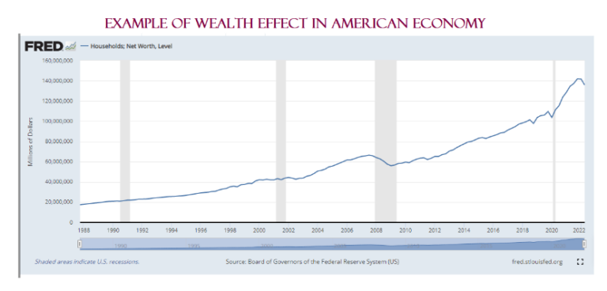

The intersection of consumer behavior, the wealth effect, and algorithmic trading creates a complex landscape in the modern economic environment. Consumer behavior is significantly swayed by variations in asset values, a shift that often results in a phenomenon known as the wealth effect. This concept suggests that as the value of an individual's assets, whether real estate, stocks, or other investments, increases, so too does their propensity to spend more. This perceived augmentation in wealth often leads to enhanced consumer confidence and escalated spending patterns, even when disposable income remains static.

In parallel, algorithmic trading has emerged as a transformative force in financial markets. Utilizing advanced artificial intelligence, these algorithms execute trades at speeds and volumes beyond human capability. By employing complex strategies, algorithmic trading can modify market dynamics, potentially influencing price discovery and liquidity. The intricacy of this trading form lies in its ability to process vast quantities of financial data and identify trading opportunities almost instantaneously. This, in turn, may redefine traditional wealth perceptions, consequently shifting consumer confidence in unpredictable ways. 



This article seeks to explore the interconnections between these elements—consumer behavior, the wealth effect, and algorithmic trading—and the broader implications they hold for the economy. By examining these intertwined factors, we aim to uncover their potential impact on economic stability and growth, thereby providing a nuanced understanding for policymakers, investors, and stakeholders who navigate this evolving economic terrain.

## Table of Contents

## Understanding the Wealth Effect

The wealth effect is a behavioral economic theory that illustrates how changes in perceived wealth can influence consumer spending behaviors. At its core, the wealth effect suggests that when individuals perceive an increase in their wealth, particularly through the appreciation of assets such as real estate or investments, they are likely to spend more. This perception of increased wealth instills a greater sense of financial security and consumer confidence. For instance, when the housing market experiences a boom, homeowners might feel wealthier due to the increased value of their properties, leading them to spend more on goods and services. This behavior can result in a positive feedback loop that stimulates economic activity.

The mechanics of the wealth effect can be illustrated through basic consumer behavior models. Consider a household whose utility $U$ depends on consumption $C$ and wealth $W$: 

$$
U = f(C, W)
$$

When the perceived wealth $W$ rises, individuals may opt to increase their consumption $C$ even if their actual income $Y$ remains constant. This increase in consumption can significantly contribute to economic growth by enhancing aggregate demand.

Despite the intuitive appeal of the wealth effect, its practical significance is a subject of debate. Critics argue that other factors such as disposable income and tax levels might play a more substantial role in influencing consumer spending. For instance, an increase in disposable income could have a more direct impact on consumer expenditure than wealth gains that do not immediately convert into liquid resources. Additionally, changes in taxation can alter disposable income and incentives for saving versus spending.

The wealth effect is often measured by the marginal propensity to consume (MPC) out of wealth, which indicates how much additional consumption is generated by an increase in wealth. Research in this area explores the variance of MPC across different asset types and demographic groups, acknowledging that not all forms of wealth may equally influence spending behavior.

Understanding how asset wealth impacts consumption patterns is crucial for policy-making, particularly in crafting fiscal and monetary strategies intended to manage economic cycles. By acknowledging the wealth effect, policymakers can better predict consumer responses to changes in asset prices and tailor interventions that stabilize economic fluctuations.

## Impact of the Wealth Effect on Consumer Behavior

The wealth effect significantly impacts consumer behavior, often leading to increased spending when asset values rise, even if income levels do not experience corresponding growth. This phenomenon arises due to a perceived increase in wealth, which bolsters consumer confidence and encourages expenditures. This boost in spending can contribute to economic growth, particularly during periods of bull markets when asset prices are climbing, positively affecting Gross Domestic Product (GDP).

In practical terms, the wealth effect tends to emerge in phases where financial markets are robust. When individuals see the value of their investments or real estate appreciate, the ensuing sense of financial security typically propels higher levels of consumption. This form of consumer behavior not only stimulates demand for goods and services but also serves as a catalyst for broader economic activity, fueling job creation and business expansion.

Nevertheless, the relationship between consumer spending and asset value appreciation is multifaceted, influenced by various economic factors beyond mere asset valuation. Employment trends, for instance, play a crucial role; stable or improving job markets may enhance disposable incomes, which, together with an increase in perceived wealth, amplifies consumer spending patterns. Conversely, if asset values swell amidst stagnant or declining employment prospects, the psychological boost provided by asset appreciation might be insufficient to spur significant changes in consumption.

Moreover, household expenses concurrently mediate the extent of the wealth effect. Rising costs in essential sectors such as healthcare, education, or housing can offset perceived gains from asset appreciation, potentially dampening the positive impact on spending. In scenarios where living costs escalate alongside asset values, households may prioritize saving or debt repayment over discretionary spending, thereby diluting the wealth effect's influence on overall economic growth.

To illustrate the interaction between asset values and spending, consider the hypothetical scenario following simplified linear functions:

1. Wealth Perception $W = \alpha \times V + \beta \times Y$

   Where:
   - $W$ represents the perceived wealth.
   - $V$ is the value of assets.
   - $Y$ is the disposable income.
   - $\alpha$ and $\beta$ are weights.

2. Spending $S = \gamma \times W - \delta \times C$

   Where:
   - $S$ denotes consumer spending.
   - $C$ encapsulates the cost of living.
   - $\gamma$ and $\delta$ are other weights defining sensitivity to changes.

In this model, the perceived wealth $W$ modulates spending $S$, demonstrating the dual impact of asset values and income on consumer behavior, counterbalanced by living expenses. Understanding these dynamics enables economists and policymakers to better anticipate the broader economic implications of asset market fluctuations, allowing for more precise economic forecasting and policy formulation.

## Algorithmic Trading and Its Influence on Markets

Algorithmic trading entails the use of sophisticated computer algorithms to perform trades at remarkable speeds and high volumes. This method has revolutionized traditional trading practices by integrating complex strategies to optimize trading outcomes. These algorithms leverage quantitative analysis to make rapid trading decisions, often executing thousands of transactions in milliseconds. As such, they hold a substantial influence over market dynamics, particularly in the areas of price formation and [liquidity](/wiki/liquidity-risk-premium).

The impact on price formation is significant. As [algorithmic trading](/wiki/algorithmic-trading) systems react to market conditions instantaneously, they can introduce new layers of complexity to how buyers and sellers determine fair prices. The bid-ask spread, a crucial metric in price discovery, can be affected by the high-frequency nature of algorithmic trades. For instance, if algorithms detect favorable conditions, they might induce rapid buy or sell orders, momentarily affecting stock prices and potentially creating short-lived price disparities.

Moreover, market liquidity—defined as the ease with which an asset can be bought or sold without affecting its price—is profoundly influenced by algorithmic trading. On one hand, the presence of these automated systems can enhance liquidity by ensuring constant participation in the market. On the other hand, algorithms could also withdraw from the market during periods of high [volatility](/wiki/volatility-trading-strategies), exacerbating liquidity shortages.

The integration of [artificial intelligence](/wiki/ai-artificial-intelligence) (AI) into these algorithms adds further complexity. AI-driven algorithms are designed to identify patterns and trends that human traders might overlook. They have the capacity to learn and optimize their trading strategies continuously. This adaptability allows algorithms to coordinate actions that might amplify the wealth effect. For example, if AI algorithms collectively recognize a trend of rising asset values, they might initiate trades that could further inflate asset prices, reinforcing the perception of increased wealth among consumers.

However, the potential for algorithms to introduce new market behaviors does exist. For instance, AI models can engage in predictive modeling to anticipate price movements based on historical trading data. Such capabilities might lead to anticipatory trading activities, which can either stabilize or destabilize market conditions, depending on their accuracy and execution.

In summary, algorithmic trading profoundly shapes market operations through its effects on price formation and liquidity. The use of AI within these systems adds another layer of influence, as algorithms continuously adapt and potentially alter traditional market behaviors. As such, their role in financial markets remains a critical area for ongoing analysis and regulation.

## The Interplay Between Algorithmic Trading and the Wealth Effect

The integration of algorithmic trading in financial markets may substantially influence how wealth effects manifest, introducing both nuanced opportunities and challenges. AI-powered algorithms, with their capability to process vast amounts of data and execute trades at incredible speeds, have the potential to alter the perception of asset values. This, in turn, could impact consumer confidence in ways distinct from traditional market mechanisms.

Primarily, algorithmic trading can enhance market efficiency by narrowing bid-ask spreads and increasing liquidity. However, the way these algorithms react to market signals might amplify market volatility. For instance, during periods of asset appreciation, algorithms that are designed to identify and capitalize on upward trends might contribute to a more robust wealth effect by quickly driving up prices, creating a feedback loop that bolsters consumer confidence and spending.

Conversely, AI's ability to manipulate order flows and market prices could weaken the wealth effect. For example, if an AI-driven trading strategy predicts an imminent downturn and reacts by executing large sell orders, it could artificially depress asset prices. Such actions might prematurely deflate consumer confidence, thereby dampening the perceived increases in wealth and consequently the associated spending behaviors.

The dual-edged nature of algorithmic trading indicates a complex interplay where AI could either reinforce or mitigate the wealth effect, depending on the prevailing market conditions and the specific configurations of trading algorithms. Understanding this dynamic requires continuous monitoring and analysis, as the algorithms themselves evolve and adapt based on new data inputs and technological advancements.

Furthermore, there is a need for regulatory frameworks that can keep pace with such rapid technological developments to ensure that the benefits of increased efficiency through algorithmic trading do not come at the cost of market stability and fairness. This balance is pivotal in maintaining the integrity and predictive reliability of financial markets and their broader economic implications.

## Economic Implications and Future Considerations

The interaction between algorithmic trading and the wealth effect is a critical topic for economic policymaking and financial regulation. Algorithmic trading's increasing prevalence poses significant challenges and opportunities for regulating market dynamics and understanding their impacts on consumer behavior. As AI technologies and complex algorithms expand their reach, their influence on market conditions and, indirectly, on the wealth effect becomes more pronounced.

Algorithmic trading can improve market efficiency by facilitating quick execution of trades and reducing transaction costs. These efficiencies can ultimately benefit the broader economy by enhancing liquidity and potentially leading to better asset price discovery. However, the automation and speed involved in algorithmic trading also harbor risks, such as market manipulation or flash crashes, which could negatively impact investor confidence and consumer spending.

As AI technologies evolve, constant monitoring and assessment of their impacts on both markets and consumer behavior are essential. Policymakers and regulators must keep abreast of how these technological advancements alter trading behaviors and market responses. This involves deploying data analytics to monitor algorithmic trading patterns, deploying advanced tools to identify potential anomalies, and developing frameworks to ensure market stability and transparency.

Future research should aim to balance the benefits of algorithmic trading with its inherent risks. This involves implementing regulations that mitigate the risks of market manipulation without stifling innovation. For instance, establishing scrutiny mechanisms and regulatory sandboxes where algorithms can be tested before being fully deployed can ensure they adhere to market integrity standards.

Economists and policymakers must collaborate to generate insights into the relationship between algorithmic trading and economic indicators like the wealth effect. An improved understanding of this relationship can help refine economic forecasting models and enhance policy decisions regarding financial regulation. Additionally, fostering interdisciplinary research between economists, data scientists, and financial technology experts will be crucial in developing comprehensive strategies to harness the benefits of algorithmic trading while minimizing associated risks. 

In conclusion, as financial markets continue to integrate advanced technologies, the continuous analysis of their socio-economic impacts will be paramount in fostering a stable and equitable economic environment. Proactive policy adjustments and rigorous research are vital components in navigating the complexities introduced by algorithmic trading and its influence on the wealth effect.

## Conclusion

The interaction between the wealth effect, consumer behavior, and algorithmic trading is complex and carries significant weight in economic studies and policymaking. These interconnected components form a pivotal area of investigation for key stakeholders such as policymakers, investors, and regulators. Understanding the relationships among these elements is crucial to ensuring a stable and equitable financial environment. Policymakers can use insights from these studies to craft regulations that balance encouraging technological innovation with protecting consumers and investors from potential market volatility.

Algorithmic trading, powered by advances in artificial intelligence, introduces new dynamics into financial markets, potentially influencing both asset prices and consumer perceptions of wealth. This, in turn, can trigger behavioral changes in spending, thereby impacting economic growth and stability. By understanding these effects, regulators can better anticipate market shifts and enact timely interventions when necessary.

As technology continues to evolve, the financial markets are likely to become increasingly complicated. This underscores the need for ongoing analysis and the development of proactive strategies to capitalize on technological benefits while mitigating associated risks. For example, coding algorithms in Python to simulate trading scenarios can provide insights into how algorithmic strategies affect price movements and liquidity in real-time. Here's a simple example of how such simulation might be set up:

```python
import numpy as np

def simulate_trading(prices, strategy):
    for price in prices:
        decision = strategy(price)
        # process trade based on decision
        # Example: 'buy', 'sell', 'hold'
        print(f"Price: {price}, Decision: {decision}")

def simple_strategy(price):
    # A basic strategy that makes decisions based on moving average
    threshold = 100  # just a placeholder value
    if price > threshold:
        return 'sell'
    elif price < threshold:
        return 'buy'
    else:
        return 'hold'

prices = np.random.normal(100, 10, 100)  # Simulated price data
simulate_trading(prices, simple_strategy)
```

Continual monitoring of algorithmic influences and consumer responses will help maintain market integrity and economic reliability. Thus, the dialogue surrounding the wealth effect and its interaction with algorithmic trading is not only vital but also demands constant attention from those shaping the financial future. This ongoing effort will be instrumental in navigating the dual challenges of leveraging modern technology's efficiencies and safeguarding against risks of market distortion and instability.

## References & Further Reading

[1]: Bergstra, J., Bardenet, R., Bengio, Y., & Kégl, B. (2011). ["Algorithms for Hyper-Parameter Optimization."](https://papers.nips.cc/paper/4443-algorithms-for-hyper-parameter-optimization) Advances in Neural Information Processing Systems 24.

[2]: ["Advances in Financial Machine Learning"](https://www.amazon.com/Advances-Financial-Machine-Learning-Marcos/dp/1119482089) by Marcos Lopez de Prado

[3]: ["Evidence-Based Technical Analysis: Applying the Scientific Method and Statistical Inference to Trading Signals"](https://www.amazon.com/Evidence-Based-Technical-Analysis-Scientific-Statistical/dp/0470008741) by David Aronson

[4]: ["Machine Learning for Algorithmic Trading"](https://github.com/PacktPublishing/Machine-Learning-for-Algorithmic-Trading-Second-Edition) by Stefan Jansen

[5]: ["Quantitative Trading: How to Build Your Own Algorithmic Trading Business"](https://books.google.com/books/about/Quantitative_Trading.html?id=j70yEAAAQBAJ) by Ernest P. Chan