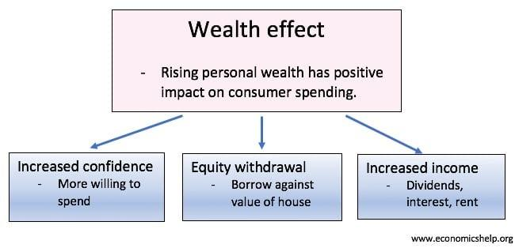

## Table of Contents

## What is the wealth effect in economics?

The wealth effect is an economic concept that describes how changes in people's wealth can influence their spending habits. When people feel richer because the value of their assets, like houses or stocks, goes up, they tend to spend more money. This increase in spending can help boost the economy because more money is circulating.

However, the wealth effect can also work in reverse. If the value of people's assets goes down, they might feel poorer and decide to spend less. This reduction in spending can slow down the economy, as less money is being used for buying things. Understanding the wealth effect is important for economists and policymakers because it helps them predict how changes in asset values might affect overall economic activity.

## How does the wealth effect influence consumer spending?

The wealth effect can make people spend more when they feel richer. If the value of things they own, like their house or stocks, goes up, they might think they have more money. This can make them feel confident and happy, so they decide to buy more things. When lots of people do this, it can help the economy grow because more money is being spent on goods and services.

On the other hand, the wealth effect can also make people spend less if they feel poorer. If the value of their assets goes down, they might worry about having less money. This can make them cut back on spending and save more instead. When many people do this, it can slow down the economy because less money is being used to buy things.

## Can you explain the relationship between asset prices and the wealth effect?

Asset prices are the values of things like houses, stocks, or savings accounts. When these prices go up, people feel like they have more money, even if they haven't sold those assets yet. This feeling of having more money is what we call the wealth effect. For example, if the price of a person's house goes up, they might feel richer and decide to spend more money on things they want or need.

On the other hand, if asset prices go down, people can feel like they have less money. This can make them worried and lead them to spend less. For instance, if the stock market drops and the value of a person's investments goes down, they might decide to save more and cut back on buying things. This change in spending because of asset prices is a big part of how the wealth effect works.

## What are some common examples of assets that contribute to the wealth effect?

Some common assets that contribute to the wealth effect are houses and stocks. When the price of a house goes up, the people who own it feel richer. They might decide to spend more money on things like new furniture or a vacation because they feel like they have more money, even if they haven't sold the house yet. This feeling of being wealthier can lead to more spending, which helps the economy.

Another common asset is stocks. If the stock market goes up and the value of someone's investments increases, they might feel like they have more money. This can make them more likely to spend on things they want, like a new car or a fancy dinner. On the flip side, if the stock market goes down, people might feel poorer and decide to spend less, which can slow down the economy.

## How does the wealth effect impact the overall economy?

The wealth effect can help the economy grow when people feel richer because their assets, like houses or stocks, go up in value. When this happens, people often spend more money on things they want or need. This extra spending means more money is moving around in the economy. Businesses sell more, they might hire more people, and this can lead to more jobs and higher wages. So, the wealth effect can create a positive cycle where more spending leads to a stronger economy.

However, the wealth effect can also hurt the economy if asset prices go down. When people feel poorer because their assets lose value, they might spend less money. This can lead to less money circulating in the economy, which can cause businesses to sell less and maybe even lay off workers. When people spend less, it can start a negative cycle where the economy slows down, and this can affect everyone, not just the people who own the assets.

## What is the difference between the wealth effect and the income effect?

The wealth effect and the income effect are two different ways that changes in money can affect how much people spend. The wealth effect happens when the value of things people own, like their house or stocks, goes up or down. If these things go up in value, people feel richer and might spend more money. But if they go down in value, people feel poorer and might spend less. This is all about how people feel about their wealth, even if they don't actually sell those things.

The income effect, on the other hand, is about changes in how much money people earn. If someone gets a raise at work or starts [earning](/wiki/earning-announcement) more money, they might spend more because they have more money coming in. If they lose their job or their salary goes down, they might spend less because they have less money to spend. The income effect is more about the actual money people get in their paychecks, rather than the value of things they own.

Both the wealth effect and the income effect can change how people spend their money, but they work in different ways. The wealth effect is about feeling richer or poorer because of changes in asset values, while the income effect is about changes in actual earnings. Understanding both can help us see why people might spend more or less at different times.

## How do economists measure the wealth effect?

Economists measure the wealth effect by looking at how changes in the value of things people own, like houses or stocks, affect how much they spend. They use data from surveys and financial reports to see if people spend more when their assets go up in value. For example, they might look at how much people are spending on things like cars or vacations after the stock market goes up. They also use statistical models to figure out how big of an impact the wealth effect has on spending. These models help economists predict how changes in asset values might affect the overall economy.

Another way economists measure the wealth effect is by studying how people react to changes in the housing market. If house prices go up, economists might look at spending data to see if people who own homes are buying more things. They can also compare spending patterns in different areas where house prices have changed differently. By doing this, economists can get a better idea of how the wealth effect works and how important it is for the economy. This helps them make better predictions and give advice to policymakers.

## What role does consumer confidence play in the wealth effect?

Consumer confidence is a big part of the wealth effect. When people feel good about their money and the economy, they are more likely to spend more. If the value of their house or stocks goes up, they might feel richer and think it's a good time to buy things they want. This feeling of confidence can make the wealth effect stronger because people are more willing to spend money when they feel good about their financial situation.

On the other hand, if people are not confident, the wealth effect might not work as well. If they are worried about the economy or think their money might not be safe, they might not spend more even if their assets go up in value. They might choose to save their money instead. So, how confident people feel can make a big difference in how much the wealth effect influences their spending and the overall economy.

## Can the wealth effect lead to economic bubbles?

The wealth effect can sometimes help create economic bubbles. When the value of things like houses or stocks goes up a lot, people might feel much richer. This can make them spend more money and even borrow more to buy more of these things, thinking the prices will keep going up. If lots of people do this, it can push prices up even more, creating a bubble. A bubble is when prices are much higher than what the things are really worth, and it can't last forever.

Eventually, the bubble can burst. When people realize the prices are too high, they might start selling their houses or stocks. This can make the prices fall quickly, and people can lose a lot of money. When this happens, the wealth effect can work in reverse. People feel poorer because their assets are worth less, so they spend less money. This can slow down the economy and even lead to a recession. So, the wealth effect can play a big role in creating and bursting economic bubbles.

## How does the wealth effect vary across different income groups?

The wealth effect can be different for people with different amounts of money. For rich people, the wealth effect might be bigger because they own more things like houses and stocks. When these things go up in value, rich people might feel a lot richer and decide to spend a lot more money. This can help the economy grow because more money is being spent. But if the value of their assets goes down, rich people might cut back on spending a lot, which can hurt the economy.

For people with less money, the wealth effect might not be as strong. They might not own as many things that go up or down in value, so changes in the stock market or housing prices might not affect them as much. When their assets do go up in value, they might spend a bit more, but not as much as rich people. And if their assets go down in value, they might already be spending less because they don't have a lot of money to begin with. So, the wealth effect can be different for people depending on how much money they have.

## What are the criticisms of the wealth effect theory?

Some people think the wealth effect theory has problems. They say it's hard to know how much people will spend just because their house or stocks go up in value. People might feel richer but still not spend more money. They might save it instead or use it to pay off debts. Also, not everyone owns things like houses or stocks, so the wealth effect might not affect them at all. This makes it hard to say how big of an impact the wealth effect really has on the whole economy.

Another criticism is that the wealth effect can make the rich spend more, but it might not help people with less money as much. Rich people own more things that can go up in value, so they feel the wealth effect more. But people with less money might not own those things, so they don't feel richer when prices go up. This can make the gap between rich and poor even bigger. Critics worry that the wealth effect might make the economy seem better than it really is for everyone.

## How have recent economic policies attempted to influence the wealth effect?

Recent economic policies have tried to influence the wealth effect by making changes that affect the value of people's assets. For example, some governments and central banks have lowered interest rates to make borrowing money cheaper. When interest rates are low, people might borrow more money to buy houses or invest in stocks. This can make the prices of these things go up, making people feel richer and encouraging them to spend more. Another policy is to give people money directly, like through stimulus checks. When people get extra money, they might spend it on things they want or need, which can help the economy grow.

However, these policies can also have downsides. If interest rates are too low for too long, it can lead to too much borrowing and spending, which might create bubbles in the housing or stock markets. When these bubbles burst, people can lose a lot of money and start spending less, which can hurt the economy. Also, giving people money directly might not help everyone equally. Rich people might save the money or invest it, while people with less money might spend it right away. This can make the wealth effect stronger for some people but not as strong for others, which can affect how well these policies work.

## What is the Wealth Effect and how can it be understood?

The wealth effect is a behavioral economic theory that illustrates how changes in perceived wealth can influence consumer spending behaviors. At its core, the wealth effect suggests that when individuals perceive an increase in their wealth, particularly through the appreciation of assets such as real estate or investments, they are likely to spend more. This perception of increased wealth instills a greater sense of financial security and consumer confidence. For instance, when the housing market experiences a boom, homeowners might feel wealthier due to the increased value of their properties, leading them to spend more on goods and services. This behavior can result in a positive feedback loop that stimulates economic activity.

The mechanics of the wealth effect can be illustrated through basic consumer behavior models. Consider a household whose utility $U$ depends on consumption $C$ and wealth $W$: 

$$
U = f(C, W)
$$

When the perceived wealth $W$ rises, individuals may opt to increase their consumption $C$ even if their actual income $Y$ remains constant. This increase in consumption can significantly contribute to economic growth by enhancing aggregate demand.

Despite the intuitive appeal of the wealth effect, its practical significance is a subject of debate. Critics argue that other factors such as disposable income and tax levels might play a more substantial role in influencing consumer spending. For instance, an increase in disposable income could have a more direct impact on consumer expenditure than wealth gains that do not immediately convert into liquid resources. Additionally, changes in taxation can alter disposable income and incentives for saving versus spending.

The wealth effect is often measured by the marginal propensity to consume (MPC) out of wealth, which indicates how much additional consumption is generated by an increase in wealth. Research in this area explores the variance of MPC across different asset types and demographic groups, acknowledging that not all forms of wealth may equally influence spending behavior.

Understanding how asset wealth impacts consumption patterns is crucial for policy-making, particularly in crafting fiscal and monetary strategies intended to manage economic cycles. By acknowledging the wealth effect, policymakers can better predict consumer responses to changes in asset prices and tailor interventions that stabilize economic fluctuations.

## References & Further Reading

[1]: Bergstra, J., Bardenet, R., Bengio, Y., & Kégl, B. (2011). ["Algorithms for Hyper-Parameter Optimization."](https://papers.nips.cc/paper/4443-algorithms-for-hyper-parameter-optimization) Advances in Neural Information Processing Systems 24.

[2]: ["Advances in Financial Machine Learning"](https://www.amazon.com/Advances-Financial-Machine-Learning-Marcos/dp/1119482089) by Marcos Lopez de Prado

[3]: ["Evidence-Based Technical Analysis: Applying the Scientific Method and Statistical Inference to Trading Signals"](https://www.amazon.com/Evidence-Based-Technical-Analysis-Scientific-Statistical/dp/0470008741) by David Aronson

[4]: ["Machine Learning for Algorithmic Trading"](https://github.com/PacktPublishing/Machine-Learning-for-Algorithmic-Trading-Second-Edition) by Stefan Jansen

[5]: ["Quantitative Trading: How to Build Your Own Algorithmic Trading Business"](https://books.google.com/books/about/Quantitative_Trading.html?id=j70yEAAAQBAJ) by Ernest P. Chan