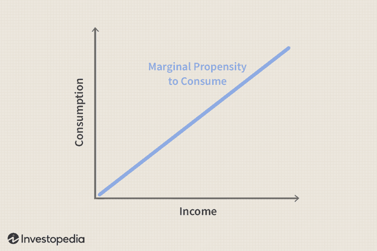

In the modern economic landscape, understanding the interplay among the Marginal Propensity to Consume (MPC), the wealth effect, and algorithmic trading is becoming increasingly essential. The MPC, a key concept rooted in Keynesian economic theory, measures the proportion of additional income that a household is likely to spend on consumption rather than saving. This metric is fundamental for economists to analyze consumer behavior and its subsequent impact on economic growth.

Meanwhile, the wealth effect indicates changes in consumer spending patterns that are driven by perceived increases in wealth rather than actual changes in income. As asset values rise, such as through stock market gains or real estate appreciation, consumers tend to feel wealthier and consequently increase their consumption — even if their actual income hasn't changed. This phenomenon can significantly influence aggregate demand, providing crucial insight for economic policy-making and forecasting.



On a different frontier, algorithmic trading utilizes computer algorithms to execute trading decisions at speeds and frequencies that are impossible for human traders. By leveraging economic indicators like MPC and incorporating them into trading algorithms, investors seek to predict market trends and capitalize on fleeting opportunities. This computational approach allows for the swift processing and interpretation of vast amounts of economic data, enabling traders to anticipate and react to market shifts more efficiently.

Understanding the connections between MPC, the wealth effect, and algorithmic trading is crucial for not just economists, but also policymakers and investors. These concepts impact economic forecasting, inform fiscal and monetary policy decisions, and guide strategic investment decisions. Moreover, the integration of traditional economic metrics with modern technology, such as algorithmic trading systems, presents new opportunities for optimizing investment returns and fostering economic growth. By grasping these interactions, readers can gain a comprehensive understanding of their influence on market dynamics and emerging economic trends.

## Table of Contents

## Understanding Marginal Propensity to Consume (MPC)

The Marginal Propensity to Consume (MPC) is a crucial concept in economics that quantifies the proportion of additional income that individuals are likely to spend as opposed to saving it. It is rooted in Keynesian macroeconomic theory, which underscores the significance of consumer behavior in driving economic activity. The formula for calculating MPC is:

$$
\text{MPC} = \frac{\Delta C}{\Delta Y}
$$

where $\Delta C$ represents the change in consumption, and $\Delta Y$ denotes the change in income. An MPC value closer to 1 indicates a higher tendency for additional income to be consumed, while a value closer to 0 suggests a larger inclination to save.

Understanding MPC is essential for evaluating consumer spending patterns and their broader implications on economic growth. High MPC values typically signal robust consumer spending, which can lead to increased demand for goods and services, stimulating production and potentially prompting economic expansion. Conversely, low MPC values may indicate a greater propensity to save, resulting in reduced aggregate demand and potential economic stagnation.

MPC also serves as a vital component in economic modeling and forecasting. It influences fiscal policy decisions, especially in the formulation of stimulus packages. For instance, if a government seeks to invigorate economic activity during a recession, understanding the prevailing MPC can aid in determining the likely effectiveness of direct cash transfers to households. A higher MPC suggests that such transfers will lead to significant increases in consumption, boosting demand and accelerating recovery.

MPC varies across different income levels and countries. Individuals in lower-income brackets often exhibit higher MPCs since a larger portion of their income is directed towards essential consumption. In contrast, wealthier individuals may have a lower MPC as they allocate additional income towards savings or investments. This disparity underscores the targeted nature of fiscal policies designed to maximize their impact on economic activity.

Cross-country variations in MPC are influenced by cultural, economic, and policy factors. Countries with strong social safety nets may have citizens with a lower MPC due to the assurance of economic stability, whereas nations with less comprehensive welfare systems might exhibit higher MPCs as individuals prioritize immediate consumption over savings.

In conclusion, the Marginal Propensity to Consume is an indispensable tool in understanding and forecasting consumer behavior and economic trends. Its role in shaping fiscal policy and economic modeling highlights its significance in both macroeconomic theory and practice.

## The Wealth Effect and Its Impact on MPC

The wealth effect describes the phenomenon where an increase in an individual's wealth leads to higher levels of consumption, even if there is no direct change in income. This effect is pivotal for understanding shifts in the Marginal Propensity to Consume (MPC), as individuals tend to adjust their consumption patterns based on perceived increases in their wealth. MPC, defined as the fraction of additional income that is spent on consumption, can be influenced by changes in asset values such as real estate and stock investments.

Several psychological and economic factors underpin the wealth effect. Psychologically, an increase in perceived wealth boosts consumer confidence, making individuals more likely to increase their spending. Economically, the rise in asset values enhances the balance sheets of households, leading them to feel wealthier and more financially secure, thus encouraging greater expenditure.

The relationship between the wealth effect and MPC is reflected in various economic studies and historical data analyses. For example, research indicates that when national housing prices or stock market values rise, there is often a simultaneous increase in consumer spending, as households feel the effects of increased net worth. This increase in consumption, in turn, can lead to a higher MPC among those experiencing gains in asset values.

Moreover, understanding the wealth effect is essential for policymakers aiming to predict changes in consumer behavior and the effectiveness of fiscal policies. By analyzing shifts in wealth and their impact on MPC, economists can better gauge the potential multiplier effects of government spending and tax changes. For instance, a policy that inadvertently boosts asset prices could simultaneously improve economic growth prospects through enhanced consumer spending driven by the wealth effect.

In summary, the wealth effect plays a significant role in shaping the marginal propensity to consume by altering consumer spending behaviors when wealth changes, independent of direct income alterations. Recognizing these dynamics allows for improved economic forecasting and policy evaluation, emphasizing the need for strategic measures that consider asset-induced shifts in consumer confidence and expenditure.

## Algorithmic Trading: Leveraging Economic Indicators

Algorithmic trading, a hallmark of modern finance, leverages computer algorithms to execute trades by analyzing vast amounts of data far more swiftly and efficiently than human traders. At the core of [algorithmic trading](/wiki/algorithmic-trading) is the ability to integrate various economic indicators, such as the Marginal Propensity to Consume (MPC), which helps in anticipating market trends and refining trading strategies.

### Overview of Algorithmic Trading

Algorithmic trading involves the use of predefined rules and processes to automatically execute trade orders, based on quantitative models and historical market data. The primary aim is to optimize trading outcomes by minimizing human errors, reducing transaction costs, and exploiting short-lived trading opportunities that arise from market inefficiencies.

The benefits of algorithmic trading are profound. It can process and analyze enormous datasets in fractions of a second, allowing for rapid decision-making that capitalizes on fleeting opportunities. Furthermore, by eliminating emotional biases typical of human decision-making, algorithms can maintain rigorous adherence to strategy parameters.

### Incorporating MPC into Trading Strategies

Algorithmic systems often incorporate economic indicators to guide their trading logic. One such indicator is the Marginal Propensity to Consume, which reflects consumer spending in reaction to income changes. By integrating MPC data, algorithms can forecast shifts in consumer demand and adjust trading strategies accordingly. For example, a high MPC might indicate robust consumer spending, suggesting potential bullish trends in sectors like retail.

Python, being the preferred language for many algorithmic traders, serves as an excellent tool for implementing such strategies. Consider a simple Python code snippet that uses MPC data to influence trading decisions:

```python
import pandas as pd

# Load MPC data and historical price data
mpc_data = pd.read_csv("mpc_data.csv")
price_data = pd.read_csv("market_data.csv")

# Simple trading logic based on MPC
def trading_signal(mpc, price_change):
    if mpc > 0.7 and price_change > 0:
        return "BUY"
    elif mpc < 0.4 and price_change < 0:
        return "SELL"
    else:
        return "HOLD"

# Apply the trading strategy
price_data['Signal'] = price_data.apply(
    lambda row: trading_signal(mpc_data.loc[row.name, 'MPC'], row['Price_Change']),
    axis=1
)

print(price_data[['Date', 'Price', 'Signal']])
```

In this example, the algorithm checks the MPC and price change to assign a trading signal (BUY, SELL, or HOLD), showcasing how MPC simplistically feeds into trading logic.

### Role in Modern Finance

Algorithmic trading, with its reliance on economic indicators, has reshaped the financial landscape. It forms a partnership between economic theory and technology, where economic metrics provide predictive insight into market behavior, allowing algorithms to react in real-time to economic developments. This synergy results in enhanced market efficiency, tightening spreads, and increased [liquidity](/wiki/liquidity-risk-premium).

By employing economic indicators like MPC, algorithmic trading bridges traditional economic analysis and cutting-edge technological practice. It underscores the importance of quantitative literacy in finance and the continued evolution of trading as it more closely aligns with economic fundamentals. As algorithms advance, incorporating more complex metrics and data sources, the interplay between economic insights and automated trading strategies will only intensify, driving further innovation and evolution within financial markets.

## Integrating MPC into Algorithmic Trading Strategies

Integrating marginal propensity to consume (MPC) data into algorithmic trading models presents a compelling avenue for enhancing trading strategies. This approach allows traders to harness economic indicators traditionally used in macroeconomic analyses, improving responsiveness to market conditions and fiscal policy changes.

Traders can utilize real-time MPC data to refine their decision-making processes. When MPC is high, consumers are spending a larger proportion of their additional income, suggesting increased economic activity. Conversely, a low MPC may indicate increased savings and subdued consumer spending. These insights can guide adaptive trading strategies, particularly during fiscal policy changes that influence disposable income. For instance, tax cuts generally increase disposable income, which, if the MPC is significant, translates into more robust consumer spending. Traders can anticipate sectors likely to benefit from increased consumer expenditure, adjusting their portfolios accordingly.

Case studies have shown that integrating MPC-based indicators can lead to improved trading outcomes. For example, during periods of economic stimulus, sectors related to consumer goods often see increased activity. Algorithmic trading systems that incorporate MPC data can identify these opportunities more accurately and efficiently than traditional approaches. By analyzing shifts in consumer spending, algorithms can adjust their strategies to optimize returns.

Python provides a flexible platform for developing trading algorithms that integrate MPC data. Below is a simple Python code snippet illustrating how traders might implement an MPC-influenced trading signal:

```python
import pandas as pd
import numpy as np

# Hypothetical Data: MPC and Stock Prices
# MPC values for illustrative purposes
mpc_data = pd.Series([0.6, 0.65, 0.55, 0.7, 0.6])
stock_prices = pd.Series([100, 105, 95, 110, 100])

# Calculate percentage change in stock prices
price_change = stock_prices.pct_change()

# Generate Trading Signal based on MPC changes
# If increase in MPC, buy signal; if decrease, sell signal
trading_signal = []

for i in range(1, len(mpc_data)):
    if mpc_data[i] > mpc_data[i - 1]:
        trading_signal.append('Buy')
    else:
        trading_signal.append('Sell')

# Display trading signals aligned to the correct dates
trading_dates = stock_prices.index[1:]  # aligning with pct_change index
signal_series = pd.Series(trading_signal, index=trading_dates)
print(signal_series)
```

This code identifies trends in MPC data and generates corresponding buy or sell signals for stock prices, demonstrating the potential for integrating economic metrics in trading models.

The synergy between MPC data and algorithmic trading emphasizes the need for economic literacy within technology-driven finance. By understanding economic indicators and their implications, traders can enhance the precision and efficacy of their algorithmic strategies. As financial markets grow increasingly complex, this integration becomes essential, empowering traders to make informed decisions aligned with economic realities.

## Conclusion

The interaction between Marginal Propensity to Consume (MPC), the wealth effect, and algorithmic trading emphasizes the significant role of integrating economic theory with cutting-edge trading technologies. By effectively understanding and applying these concepts, policymakers and traders can make more informed decisions, ultimately driving economic growth and optimizing returns on investments. This article has showcased the transformative power that arises from merging traditional economic metrics, such as MPC, with modern advancements in algorithmic trading.

Ongoing research at the convergence of economics and technology is vital to keep pace with the rapidly evolving global financial landscape. Such research ensures that both economic forecasting and financial decision-making processes are well-informed and adapted to current conditions. For instance, the inclusion of real-time economic indicators in trading algorithms can enhance the predictive accuracy, enabling traders to anticipate market movements and policy effects more effectively.

As we move forward, future studies will likely continue to bolster the integration of economic insights with financial technologies. This ongoing synergy will provide new avenues for innovation, enabling more sophisticated and responsive trading strategies. For example, the development of Python-based trading models that incorporate MPC and wealth effect data can lead to significant competitive advantages in the financial markets. In this context, the potential for improved economic and investment outcomes is substantial, making the case for continuous exploration and development at the intersection of these disciplines.

## References and Further Reading

This section provides curated resources for those interested in further exploring the Marginal Propensity to Consume (MPC), the wealth effect, and algorithmic trading. These materials are essential for deepening your understanding of how these economic indicators and trading strategies interact.

1. **Academic Journals and Economic Research Papers:**
   - *The Economic Journal*: Frequently publishes articles on consumer behavior and macroeconomic policy analysis, focusing on metrics like MPC.
   - *Journal of Financial Economics*: Offers in-depth studies on the wealth effect and its implications on spending and investment behaviors.
   - *Algorithmic Finance*: A source for understanding how algorithmic mechanisms influence financial markets and trading strategies.

2. **Books:**
   - "Essays in Persuasion" by John Maynard Keynes: A foundational text for understanding concepts like MPC within Keynesian economics.
   - "Behavioral Finance and Wealth Management" by Michael M. Pompian: Explores the psychological aspects influencing consumer spending and investment.
   - "Algorithmic Trading and DMA: An Introduction to Direct Access Trading Strategies" by Barry Johnson: A comprehensive guide to the basics and nuances of algorithmic trading.

3. **Online Resources:**
   - [NBER Working Papers](https://www.nber.org/papers): Includes research on the wealth effect and consumer spending dynamics.
   - [Investopedia](https://www.investopedia.com): Offers accessible articles on MPC, wealth effect, and the basics of algorithmic trading.
   - [QuantStart](https://www.quantstart.com): A website dedicated to algorithmic trading, providing tutorials and code examples for implementing trading algorithms.

4. **Notable Economists and Technologists:**
   - John Maynard Keynes: Pioneered theories on consumer spending and economic cycles.
   - Robert J. Shiller: Notable for work on the wealth effect and its influence on financial markets.
   - Eugene Fama: Known for his research on market efficiency, essential for algorithmic trading.

5. **Further Engagement:**
   - Attend workshops or courses offered by institutions like MIT or Stanford, which often cover topics such as algorithmic trading and macroeconomic indicators.
   - Participate in webinars and online forums (e.g., Stack Exchange) to discuss recent developments and applications of these concepts in real-world trading scenarios.

By engaging with these materials, readers will enhance their comprehension of the complex interactions between economic indicators like MPC and algorithmic trading methodologies, fostering an informed approach to economic analysis and financial decision-making.

## References & Further Reading

[1]: Keynes, J. M. (1936). "The General Theory of Employment, Interest, and Money." Palgrave Macmillan.

[2]: Pompian, M. M. (2006). ["Behavioral Finance and Wealth Management: How to Build Optimal Portfolios That Account for Investor Biases."](https://archive.org/details/behavioralfinanc0000pomp) Wiley.

[3]: Shiller, R. J. (2000). ["Irrational Exuberance."](https://www.jstor.org/stable/j.ctt7st4s) Princeton University Press.

[4]: Johnson, B. (2010). ["Algorithmic Trading & DMA: An Introduction to Direct Access Trading Strategies."](https://archive.org/details/algorithmictradi0000john) 4Myeloma Press.

[5]: Fama, E. F., & French, K. R. (1993). ["Common Risk Factors in the Returns on Stocks and Bonds."](https://www.sciencedirect.com/science/article/pii/0304405X93900235) Journal of Financial Economics, 33(1), 3-56.

[6]: Lopez de Prado, M. (2018). ["Advances in Financial Machine Learning."](https://www.amazon.com/Advances-Financial-Machine-Learning-Marcos/dp/1119482089) Wiley.

[7]: Jansen, S. (2018). ["Machine Learning for Algorithmic Trading: Predictive Models to Extract Signals from Market and Alternative Data for Systematic Trading Strategies."](https://github.com/stefan-jansen/machine-learning-for-trading) Packt Publishing.

[8]: Stattman, D. (1980). "Book Review: Essays in Persuasion by John Maynard Keynes." Journal of Financial and Quantitative Analysis, 15(3), 847-848.