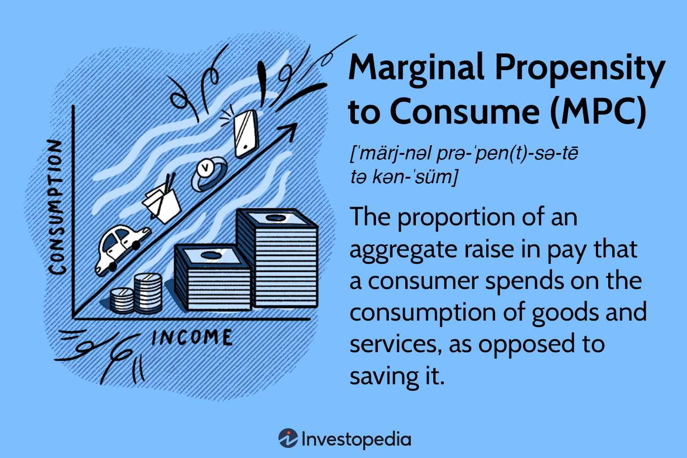

## Table of Contents

## What is the wealth effect?

The wealth effect is a simple idea that says when people feel richer, they tend to spend more money. Imagine you own a house and its value goes up a lot. Suddenly, you feel like you have more money, even if you haven't sold the house. This feeling of being wealthier might make you more likely to go out and buy things you wouldn't have bought before, like a new TV or a vacation.

This effect can also work the other way around. If the value of your house or your investments goes down, you might feel less wealthy. This could make you more careful with your money, and you might decide to spend less. The wealth effect is important because it can influence the whole economy. When lots of people feel richer and spend more, it can help the economy grow. But if many people feel poorer and cut back on spending, it can slow down the economy.

## How does the wealth effect influence consumer behavior?

The wealth effect changes how people spend their money. When people feel richer because their assets, like houses or stocks, go up in value, they tend to spend more. For example, if your house's value increases, you might feel like you have more money even though you haven't sold it. This feeling can make you more likely to buy things you want, like new clothes or a nice dinner out. It's like getting a bonus that makes you feel good about spending a bit more.

On the other hand, if the value of your assets goes down, you might feel less wealthy. This can make you more cautious with your money. You might decide to spend less on things you don't really need, like eating out or buying new gadgets. This change in spending behavior can affect the whole economy. When many people feel less wealthy and spend less, it can slow down economic growth. So, the wealth effect is important because it shows how people's feelings about their wealth can change what they buy and how much they spend.

## What is the marginal propensity to consume (MPC)?

The marginal propensity to consume (MPC) is a simple idea that tells us how much of extra money people will spend. Imagine you get an extra $100. The MPC is the part of that $100 you decide to spend instead of saving. For example, if you spend $80 out of that $100, your MPC is 0.8. This number helps economists understand how changes in income affect spending in the economy.

MPC is important because it shows how money moves around in the economy. When people get more money and have a high MPC, they spend a lot of it. This spending can help the economy grow because businesses sell more and might hire more people. On the other hand, if people have a low MPC and save most of their extra money, it can slow down the economy because less money is being spent on goods and services.

## How is the marginal propensity to consume calculated?

The marginal propensity to consume (MPC) is calculated by looking at how much of an extra amount of money people choose to spend. If you get an extra $100 and you spend $80 of it, your MPC is 0.8. You find this number by dividing the amount you spend by the total extra money you got. So, in this case, it's $80 divided by $100, which equals 0.8. This simple calculation helps economists understand how people react to changes in their income.

MPC is useful because it shows how money moves through the economy. When people have a high MPC, they spend most of their extra money, which can help the economy grow. Businesses sell more products and might hire more workers. But if people have a low MPC and save most of their extra money instead of spending it, it can slow down the economy because there's less money being used to buy things.

## Can you explain the relationship between the wealth effect and the marginal propensity to consume?

The wealth effect and the marginal propensity to consume (MPC) are closely linked because they both deal with how people spend money. The wealth effect happens when people feel richer because the value of their assets, like their house or stocks, goes up. This feeling of being wealthier can make them more likely to spend more money. On the other hand, if their assets lose value, they might feel less wealthy and spend less. The wealth effect is all about how people's feelings about their wealth change their spending habits.

The marginal propensity to consume (MPC) is a number that tells us how much of any extra money people will spend. If someone gets an extra $100 and spends $80 of it, their MPC is 0.8. When people feel richer because of the wealth effect, their MPC might go up. They might spend a bigger part of any extra money they get because they feel more confident about their finances. So, the wealth effect can push the MPC higher, leading to more spending in the economy. This connection shows how important it is to understand both concepts when looking at how the economy works.

## What are some examples of how the wealth effect impacts MPC?

When people feel richer because their house or stocks go up in value, they might start spending more of any extra money they get. For example, if someone's house value jumps from $200,000 to $250,000, they might feel like they have more money even though they haven't sold the house. If this person gets a $1,000 bonus at work, they might decide to spend $800 of it instead of their usual $600. This means their marginal propensity to consume (MPC) goes up from 0.6 to 0.8 because they're spending a bigger part of their extra money.

On the other hand, if the value of people's assets goes down, they might feel less wealthy and spend less of their extra money. Imagine the stock market crashes and someone's investments lose a lot of value. If this person usually spends $500 out of a $1,000 bonus, they might now only spend $300 because they're worried about their finances. This would lower their MPC from 0.5 to 0.3. The wealth effect shows how changes in how rich people feel can make them spend more or less of any extra money they get, which changes their MPC.

## How does the wealth effect vary across different income groups?

The wealth effect can work differently for people with different amounts of money. For people who have a lot of money, like rich people, the wealth effect can be big. When their house or stocks go up in value, they might feel even richer and spend a lot more money. They might buy a new car or go on a fancy vacation because they feel like they can afford it. But if their investments lose value, they might still spend a lot because they have other money to fall back on.

For people who don't have as much money, the wealth effect can be smaller but still important. If their house goes up in value, they might feel a bit richer and spend a little more, maybe on some new clothes or a small treat. But if their house or other investments lose value, they might get worried and spend a lot less because they don't have as much money to begin with. So, the wealth effect can change how people spend, but it might affect rich people more because they have more money to spend in the first place.

## What role does asset price volatility play in the wealth effect and MPC?

Asset price volatility, which means how much the value of things like houses or stocks goes up and down, can make the wealth effect stronger or weaker. When asset prices are going up and down a lot, it can make people feel richer or poorer very quickly. If the prices go up a lot, people might feel like they have more money and decide to spend more of any extra cash they get. This means their marginal propensity to consume (MPC) could go up because they're spending more of their money. But if the prices drop suddenly, people might feel like they have less money and start spending less, which would lower their MPC.

This volatility can affect different people in different ways. For someone with a lot of money, big swings in asset prices might not change their spending habits as much because they have other money to rely on. But for someone with less money, these big changes can make a big difference. If their house or investments lose value, they might get really worried and cut back on spending a lot, making their MPC go down. So, how much asset prices move around can really change how people feel about their wealth and how much they choose to spend.

## How do economic policies affect the wealth effect and MPC?

Economic policies can change how people feel about their wealth and how much they spend. For example, if the government lowers taxes, people might feel like they have more money. This can make them spend more of any extra money they get, which means their marginal propensity to consume (MPC) goes up. On the other hand, if the government raises taxes, people might feel like they have less money and decide to spend less, making their MPC go down. Policies like interest rates also matter. If interest rates go down, borrowing money becomes cheaper, and people might feel richer and spend more, boosting the wealth effect and raising their MPC.

Another way economic policies affect the wealth effect and MPC is through things like stimulus checks or unemployment benefits. When the government gives people extra money, like during a crisis, people might feel richer and spend more of that money. This can increase the wealth effect and raise the MPC because people are spending a bigger part of their extra money. But if the government cuts back on these benefits, people might feel less wealthy and spend less, which would lower the wealth effect and their MPC. So, economic policies can really change how people feel about their money and how much they choose to spend.

## What are the long-term implications of the wealth effect on economic growth?

The wealth effect can have big impacts on how the economy grows over a long time. When people feel richer because their houses or stocks go up in value, they spend more money. This extra spending helps businesses sell more stuff, which can make them grow and hire more people. More jobs mean more people earning money, which can lead to even more spending. This cycle can help the economy keep growing. But if people feel less rich because their assets lose value, they might spend less. This can slow down the economy because businesses sell less and might have to let people go. So, the wealth effect can either help the economy grow or make it shrink, depending on how people feel about their wealth.

Over many years, the wealth effect can also change how much people save and invest. If people feel rich and spend a lot, they might not save as much money for the future. This could mean less money is available for investments that help the economy grow, like starting new businesses or building new factories. On the other hand, if people feel less wealthy and spend less, they might save more money. This extra saving can be used for investments that create jobs and help the economy grow in the long run. So, the wealth effect can influence not just immediate spending but also how much money is saved and invested, which plays a big role in long-term economic growth.

## How do international factors influence the wealth effect and MPC in a globalized economy?

In a globalized economy, what happens in other countries can change how people feel about their wealth and how much they spend. For example, if the stock market in another country goes up a lot, it might make the stock market in your country go up too. This can make people feel richer because their investments are worth more. They might then spend more of any extra money they get, which means their marginal propensity to consume (MPC) goes up. But if there's a big problem in another country, like a financial crisis, it can make the stock market in your country go down. This can make people feel less wealthy, and they might spend less, lowering their MPC.

Another way international factors can affect the wealth effect and MPC is through changes in currency values. If the money in your country becomes worth more compared to other countries, it can make things from other places cheaper. This might make people feel richer because they can buy more with their money, and they might spend more, raising their MPC. But if your country's money becomes worth less, things from other places get more expensive. This can make people feel poorer, and they might spend less, lowering their MPC. So, what happens around the world can really change how people feel about their money and how much they choose to spend.

## What are the criticisms and limitations of using the wealth effect and MPC in economic modeling?

Using the wealth effect and the marginal propensity to consume (MPC) in economic models can be helpful, but they also have some problems. One big issue is that these ideas assume people always act the same way when they feel richer or poorer. But in real life, people can be very different. Some might spend more when they feel richer, while others might save more because they're worried about the future. Also, the wealth effect and MPC can be hard to measure accurately. It's tough to know exactly how much more someone will spend if their house goes up in value, because everyone's situation is different.

Another limitation is that these concepts don't always take into account other big things that can affect how people spend money. For example, if there's a lot of uncertainty in the world, like during a war or a big health crisis, people might not spend more even if they feel richer. They might save their money instead because they're worried about what might happen next. Also, the wealth effect and MPC might not work the same way in different countries or for people in different income groups. Rich people might not change their spending much if their wealth goes up a little, while people with less money might change their spending a lot if their wealth changes even a bit. So, while the wealth effect and MPC can help us understand some things about the economy, they don't tell the whole story.

## What is the Understanding of Marginal Propensity to Consume (MPC)?

The Marginal Propensity to Consume (MPC) is a crucial concept in economics that quantifies the proportion of additional income that individuals are likely to spend as opposed to saving it. It is rooted in Keynesian macroeconomic theory, which underscores the significance of consumer behavior in driving economic activity. The formula for calculating MPC is:

$$
\text{MPC} = \frac{\Delta C}{\Delta Y}
$$

where $\Delta C$ represents the change in consumption, and $\Delta Y$ denotes the change in income. An MPC value closer to 1 indicates a higher tendency for additional income to be consumed, while a value closer to 0 suggests a larger inclination to save.

Understanding MPC is essential for evaluating consumer spending patterns and their broader implications on economic growth. High MPC values typically signal robust consumer spending, which can lead to increased demand for goods and services, stimulating production and potentially prompting economic expansion. Conversely, low MPC values may indicate a greater propensity to save, resulting in reduced aggregate demand and potential economic stagnation.

MPC also serves as a vital component in economic modeling and forecasting. It influences fiscal policy decisions, especially in the formulation of stimulus packages. For instance, if a government seeks to invigorate economic activity during a recession, understanding the prevailing MPC can aid in determining the likely effectiveness of direct cash transfers to households. A higher MPC suggests that such transfers will lead to significant increases in consumption, boosting demand and accelerating recovery.

MPC varies across different income levels and countries. Individuals in lower-income brackets often exhibit higher MPCs since a larger portion of their income is directed towards essential consumption. In contrast, wealthier individuals may have a lower MPC as they allocate additional income towards savings or investments. This disparity underscores the targeted nature of fiscal policies designed to maximize their impact on economic activity.

Cross-country variations in MPC are influenced by cultural, economic, and policy factors. Countries with strong social safety nets may have citizens with a lower MPC due to the assurance of economic stability, whereas nations with less comprehensive welfare systems might exhibit higher MPCs as individuals prioritize immediate consumption over savings.

In conclusion, the Marginal Propensity to Consume is an indispensable tool in understanding and forecasting consumer behavior and economic trends. Its role in shaping fiscal policy and economic modeling highlights its significance in both macroeconomic theory and practice.

## References & Further Reading

[1]: Keynes, J. M. (1936). "The General Theory of Employment, Interest, and Money." Palgrave Macmillan.

[2]: Pompian, M. M. (2006). ["Behavioral Finance and Wealth Management: How to Build Optimal Portfolios That Account for Investor Biases."](https://archive.org/details/behavioralfinanc0000pomp) Wiley.

[3]: Shiller, R. J. (2000). ["Irrational Exuberance."](https://www.jstor.org/stable/j.ctt7st4s) Princeton University Press.

[4]: Johnson, B. (2010). ["Algorithmic Trading & DMA: An Introduction to Direct Access Trading Strategies."](https://archive.org/details/algorithmictradi0000john) 4Myeloma Press.

[5]: Fama, E. F., & French, K. R. (1993). ["Common Risk Factors in the Returns on Stocks and Bonds."](https://www.sciencedirect.com/science/article/pii/0304405X93900235) Journal of Financial Economics, 33(1), 3-56.

[6]: Lopez de Prado, M. (2018). ["Advances in Financial Machine Learning."](https://www.amazon.com/Advances-Financial-Machine-Learning-Marcos/dp/1119482089) Wiley.

[7]: Jansen, S. (2018). ["Machine Learning for Algorithmic Trading: Predictive Models to Extract Signals from Market and Alternative Data for Systematic Trading Strategies."](https://github.com/stefan-jansen/machine-learning-for-trading) Packt Publishing.

[8]: Stattman, D. (1980). "Book Review: Essays in Persuasion by John Maynard Keynes." Journal of Financial and Quantitative Analysis, 15(3), 847-848.