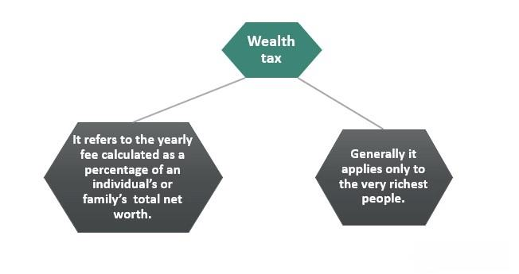

Wealth tax is a levy imposed on the net wealth of individuals, which typically includes assets such as real estate, financial securities, and private businesses, minus liabilities. Unlike income or capital gains taxes, which target earnings or profits, wealth tax directly targets the accumulated assets of an individual. It is considered significant in today's economic landscape due to rising economic inequality and the increased concentration of wealth among a small fraction of the population. As such, it is seen as a potential tool for redistributing wealth and addressing these disparities. The debate surrounding wealth tax has gained prominence as governments seek equitable ways to fund public services and welfare programs without heavily burdening low and middle-income groups.

Algorithmic trading involves the use of complex algorithms to conduct trading at speeds and frequencies beyond human capabilities. It has become an integral part of modern financial markets, allowing for rapid execution of trades, effective processing of large volumes, and the implementation of sophisticated trading strategies. This rise is facilitated by advancements in computing power and data analytics, enabling traders to exploit market inefficiencies. Algorithmic trading plays a pivotal role in enhancing market liquidity and minimizing transaction costs, making financial markets more efficient. However, it has also introduced challenges such as market volatility and flash crashes, prompting discussions on its regulation.

Tax policies encompass a range of legislative measures that governments implement to collect revenue, influence economic behavior, and achieve social equity objectives. These policies impact wealth generation, distribution, and how market operations function by setting the fiscal framework within which economies operate. They dictate who pays taxes, how much, and the form those taxes take—be it on income, consumption, or wealth. The design of tax policies can significantly influence investment decisions, the allocation of resources, and overall economic growth.

The purpose of this article is to explore the nuanced advantages and disadvantages of wealth tax, algorithmic trading, and accompanying tax policies. By examining their pros and cons, the discussion aims to shed light on how these financial mechanisms intersect to shape modern economies. This article seeks to provide a comprehensive analysis that aids policymakers, financial experts, and stakeholders in making informed decisions regarding the adoption and regulation of these tools.

Overall, the article sets the stage for an informative examination of these financial topics, considering their implications for economic equality, market efficiency, and policy decision-making. Through this exploration, the article encourages a deeper understanding of how wealth tax and algorithmic trading can be optimized to foster balanced and sustainable economic growth.

## Table of Contents

## Understanding Wealth Tax

A wealth tax is a levy on the total value of personal assets, including real estate, stocks, bonds, and other financial instruments, minus liabilities. Unlike income tax, which is imposed on individual or corporate earnings, or capital gains tax, which is levied on the profit from the sale of an asset, wealth tax directly targets the net wealth of an individual or entity. Its primary focus is on accumulated wealth and the assets owned, not the income generated by those assets.

Historically, wealth taxes have been implemented in different forms across various countries. The concept dates back to ancient civilizations, but modern implementations gained traction in the early 20th century. Countries such as France and Switzerland have had longstanding wealth tax policies, though their structures and effectiveness vary. For instance, France's wealth tax, known as "Impôt de Solidarité sur la Fortune" (ISF), was replaced in 2018 by "Impôt sur la Fortune Immobilière" (IFI), which covers only real estate wealth. Similarly, Sweden employed a wealth tax from 1947 until its abolition in 2007, citing concerns over capital flight and investment deterrence.

Currently, a few major economies continue to implement wealth taxes with distinct approaches. Norway imposes a net wealth tax with a relatively moderate rate, targeting residents with substantial assets. Spain applies its wealth tax primarily on net worth exceeding a specific threshold, with varying rates depending on the region. Such policies aim to address economic inequalities and provide additional revenue streams for governments. For example, Spain's approach allows regional governments to set different rates, reflecting a degree of fiscal decentralization. 

The intended goals of wealth tax policies center around reducing wealth concentration and economic inequality, generating government revenue, and incentivizing the productive use of assets. By targeting accumulated wealth, these taxes aim to create a more equitable society and finance public spending on social services, education, and infrastructure. Proponents argue that wealth taxes can serve as a tool for redistribution, aligning with broader economic objectives of social equity and fiscal responsibility.

In recent years, proposals for wealth taxes have emerged in several prominent economies, particularly as wealth inequality gains attention on the global stage. In the United States, for example, policymakers and economists have debated the introduction of a federal wealth tax as a means to address the widening wealth gap. The debate intensified alongside economic challenges exacerbated by the COVID-19 pandemic, prompting reconsideration of progressive tax policies to support recovery efforts.

As economic landscapes evolve, wealth tax proposals and implementations remain subject to ongoing discourse among policymakers, economists, and the public. Despite their contentious nature, wealth taxes continue to be a significant instrument in discussions on fiscal policy and wealth redistribution.

## Pros of Implementing a Wealth Tax

Wealth tax, an annual tax levied on the net assets owned by individuals, is often heralded as a mechanism to diminish economic inequality and foster a more equitable distribution of wealth. A principal argument for the implementation of a wealth tax is its potential to directly curtail the wealth gap by redistributing a portion of the accumulated wealth from affluent individuals to broader society.

### Reducing Economic Inequality and Redistributing Wealth

Wealth tax has the capacity to address economic inequality by imposing a levy on the net worth of individuals, typically above a defined threshold. This redistribution mechanism ensures that those with substantial wealth contribute a fairer share to public revenues, potentially funding social services and public goods that benefit the wider population. This approach aligns with progressive taxation principles, promoting social equity by lightening the tax burden on lower-income groups.

### Generation of Government Revenue

An effective wealth tax can serve as a substantial revenue stream for governments. By taxing net assets such as real estate, investments, and other forms of property, wealth taxes can provide governments with funds necessary to support public expenditures, infrastructure development, social welfare programs, and healthcare systems. By expanding the tax base through the inclusion of net wealth, governments can alleviate reliance on income or consumption taxes, thereby diversifying their revenue streams.

### Encouraging Responsible Financial Practices

Wealth taxes may also catalyze more responsible financial practices among the wealthy by discouraging the hoarding of resources and prompting investment in productive ventures. The prospect of annual taxation on wealth may motivate affluent individuals to allocate their wealth more efficiently, whether through reinvestment in businesses, philanthropy, or other socially beneficial activities. This behavioral shift could stimulate economic activity and foster innovation.

### Supporting Evidence and Case Studies

Empirical studies from regions where wealth taxes have been implemented provide insight into their efficacy. For example, in France, where a wealth tax existed until 2017, analyses indicated that it contributed to reducing the wealth gap, although its impact was moderately constrained by factors such as tax evasion and the flight of high-net-worth individuals. Similar results have been observed in Nordic countries, where wealth taxes have historically played a role in funding robust social welfare systems.

### Expert Opinions and Reports

Proponents of wealth tax include prominent economists and policy analysts who argue that it is a necessary tool to combat rising inequality. For instance, Thomas Piketty, in his influential work "Capital in the Twenty-First Century," advocates for a global wealth tax as a means to preserve democratic institutions and diminish wealth concentration. Various reports from international bodies, such as the OECD and the IMF, have discussed the potential of wealth taxes as part of comprehensive tax reform efforts aimed at achieving fiscal sustainability and economic fairness.

In conclusion, while the implementation of a wealth tax comes with its challenges, its potential benefits in reducing economic inequality, generating government revenue, and promoting responsible financial behavior among the wealthy make it a potent tool worth considering. Further research and refinement of wealth tax policies could enhance their efficacy and acceptance, contributing to more equitable economic systems worldwide.

## Cons of Implementing a Wealth Tax

Wealth tax, while aimed at reducing economic inequality and generating government revenue, presents several notable challenges and criticisms regarding its implementation. These complexities often deter its effective deployment and raise concerns about its broader economic implications.

One primary challenge is the administrative complexity involved in effectively implementing a wealth tax. Accurately assessing and valuing assets can be an arduous process for tax authorities. Unlike income or sales tax, which are based on more straightforward transactions or earnings, wealth tax requires a detailed, accurate valuation of individual and corporate assets, which can vary significantly and may not be easily accessible or transparent. Assets like real estate, artwork, stocks, bonds, and business interests require distinct approaches to valuation, potentially leading to discrepancies and disputes. Additionally, there is the ongoing challenge of regularly reassessing these assets, which requires substantial administrative resources and expertise, often leading to inefficiencies and increased costs for tax authorities.

Economic impacts, such as capital flight and reduced investment, are frequently cited concerns. Wealthy individuals, facing increased tax burdens, may seek to relocate their assets or themselves to jurisdictions with more favorable tax conditions. This capital flight can result in decreased domestic investment, adversely affecting economic growth and employment. Notably, studies have indicated that wealth taxes in some regions have coincided with an exodus of high-net-worth individuals, prompting governments to reconsider these policies. The Swiss wealth tax, for instance, has had varying impacts across its cantons, reflecting differing levels of effectiveness based on local administration and compliance strategies.

Critics also argue about the fairness and practicality of assessing and valuing assets under a wealth tax. The subjective nature of asset valuation could lead to inconsistencies in tax liability assessments, raising questions about the equitable treatment of taxpayers. The valuation of non-liquid assets presents particular challenges, as market prices may not be readily available or may fluctuate significantly, potentially leading to perceptions of unfairness and resistance among taxpayers.

Entrepreneurship and innovation might face negative effects due to wealth tax policies. Start-ups and innovative firms often require substantial reinvestment of earnings into business growth and development. Taxing this reinvested wealth could discourage the creation of new ventures or hinder the scaling of existing ones, ultimately stifling innovation. High taxation could dissuade entrepreneurs from taking the risks necessary to drive technological advancements and economic dynamism.

Perspectives from economists and policymakers often highlight these downsides of wealth taxes. Prominent critics, such as former U.S. Treasury Secretary Larry Summers, argue that wealth taxes could disrupt economic incentives and lead to inefficient capital allocation. They contend that the potential revenue from wealth taxes might not justify the economic distortions and administrative burdens they introduce.

In conclusion, while the wealth tax aims to target inequality and bolster public revenues, its implementation poses significant challenges and criticisms, ranging from administrative burdens to broader economic impacts. These concerns underscore the need for policymakers to weigh the potential benefits against the complexities and risks of such a taxation approach.

 to Algorithmic Trading

Algorithmic trading refers to the use of computer algorithms to manage the buying and selling of financial securities at high speeds and with minimal human intervention. These algorithms are designed to execute trades based on defined parameters, such as timing, price, or market conditions, allowing traders to capitalize on profitable opportunities in a fraction of a second. This form of trading plays a significant role in modern financial markets, accounting for a substantial share of trading [volume](/wiki/volume-trading-strategy) on exchanges worldwide.

Technologically, [algorithmic trading](/wiki/algorithmic-trading) relies on complex mathematical models and high-speed systems capable of processing vast amounts of market data in real-time. Over the years, the underlying technology has evolved significantly, driven by advances in computing power, data analytics, and software engineering. Early iterations focused on basic strategies like statistical [arbitrage](/wiki/arbitrage), where algorithms would exploit pricing inefficiencies between correlated assets. Nowadays, these systems incorporate [machine learning](/wiki/machine-learning) and [artificial intelligence](/wiki/ai-artificial-intelligence) to enhance decision-making processes, adapting dynamically to market trends.

Different players and stakeholders are involved in algorithmic trading, including investment banks, hedge funds, proprietary trading firms, and institutional investors. Each employs specialized teams of quantitative analysts and developers who design and maintain the trading models and systems. Retail investors are also increasingly entering this space, thanks to the proliferation of trading platforms that offer algorithmic trading features.

Algorithmic trading brings notable benefits to financial markets, chiefly through increased speed, efficiency, and accuracy. Trades executed faster than human capabilities can lead to improved market [liquidity](/wiki/liquidity-risk-premium), reducing transaction costs for all participants. Moreover, algorithms minimize the risk of human error, ensuring trades are conducted according to the pre-set strategy, without emotional bias.

The regulatory environment for algorithmic trading is continually adapting to keep pace with technological advancements. Regulatory bodies such as the United States Securities and Exchange Commission (SEC) and the European Securities and Markets Authority (ESMA) have established frameworks to oversee these activities. Regulations often focus on ensuring market stability and fairness, addressing concerns such as market manipulation and systemic risk posed by high-frequency trading. For instance, the EU's Markets in Financial Instruments Directive II (MiFID II) includes specific provisions for algorithmic trading, requiring firms to implement risk controls and report trading activities to regulators.

Overall, algorithmic trading represents a dynamic and integral component of today's financial ecosystems, offering both challenges and opportunities for market participants and regulators alike.

## Pros of Algorithmic Trading

Algorithmic trading has become a cornerstone of modern financial markets, providing substantial benefits that enhance market efficiency and effectiveness. By utilizing complex algorithms to automate trading decisions, this method significantly improves market liquidity. With algorithms constantly scanning market conditions, trades are executed swiftly, ensuring that buy and sell orders are matched with minimal delay. This rapid execution enhances liquidity by ensuring that there are always enough buyers and sellers, reducing bid-ask spreads and stabilizing prices.

An integral benefit of algorithmic trading is the reduction in transaction costs. Algorithms can execute trades at the most opportune moments, identifying the best prices and minimizing costs associated with manual trades, such as human error and emotional decision-making. This precision ensures more accurate trade execution, as algorithms can analyze vast amounts of data to make informed decisions, reducing the likelihood of costly mistakes that might occur in manual trading scenarios.

Furthermore, algorithmic trading facilitates the seamless execution of complex strategies that would be challenging or impossible for human traders to perform in real-time. Strategies such as [statistical arbitrage](/wiki/statistical-arbitrage), [trend following](/wiki/trend-following), and market-making can be executed with high precision across various markets and securities. For instance, statistical arbitrage involves exploiting price differences between correlated assets, requiring rapid computation and execution that algorithms are ideally equipped to handle.

Studies have consistently demonstrated the positive impact of algorithmic trading on market efficiency. Research published in the "Journal of Finance" showed that high-frequency trading, a subset of algorithmic trading, contributes to improved price discovery and reduced [volatility](/wiki/volatility-trading-strategies). The ability of algorithms to respond rapidly to new market information ensures that prices reflect available information promptly, thus enhancing the informative efficiency of markets.

Another significant advantage of algorithmic trading is its scalability. Algorithms can be deployed across multiple markets and asset classes simultaneously, executing thousands of trades in parallel to exploit diverse opportunities. This scalability is not feasible with human traders due to cognitive and physical limitations. As a result, trading firms can efficiently manage larger portfolios and execute high-volume trades without compromising accuracy or speed.

In conclusion, the advantages of algorithmic trading are profound, offering increased market liquidity, reduced transaction costs, and enhanced market precision. Its capacity for executing complex strategies and scalability further cements its role in modern finance, continually driving improvements in market efficiency and effectiveness.

## Cons of Algorithmic Trading

Algorithmic trading, while lauded for its efficiency and speed, also presents a multitude of challenges that have garnered significant attention from market participants and regulators alike. One of the foremost concerns is the risk associated with high-frequency trading ([HFT](/wiki/high-frequency-trading-strategies)) and its contribution to market volatility. High-frequency trading firms use sophisticated algorithms to execute a large number of orders at extremely high speeds, often holding positions for mere seconds. The rapid nature of these trades can exacerbate market movements, leading to sudden spikes or drops in stock prices, commonly referred to as 'flash crashes'. A notable example is the Flash Crash of May 6, 2010, which saw the Dow Jones Industrial Average plummet nearly 1,000 points within minutes before recovering just as quickly. This event highlighted the destabilizing potential of HFT when algorithms interact in unforeseen ways, triggering widespread sell-offs and buy-ins.

Technological failures also pose significant risks to market stability. Algorithmic trading relies heavily on computer systems and networks, making it susceptible to technical glitches. For example, Knight Capital's trading disaster in August 2012, where a software bug led to the company's loss of $440 million in just 45 minutes, underscores the potential catastrophic impacts of technological malfunctions. These incidents not only threaten the firms involved but can also have broader repercussions on market confidence and integrity.

Concerns about fairness arise due to the immense advantage algorithmic trading provides to large financial institutions over smaller market participants. These institutions invest heavily in technology and infrastructure to minimize latency, thereby executing orders faster than human traders. This speed differential can result in unfair trading conditions, as retail investors may find themselves at a disadvantage, unable to react to market changes with the same swiftness. This imbalance raises ethical questions about the inclusivity and fairness of modern financial markets.

The regulatory landscape struggles to keep pace with the rapid evolution of trading algorithms. Regulators face challenges in monitoring and controlling the sheer volume and complexity of transactions executed by these algorithms. Creating a robust regulatory framework that ensures market integrity without stifling innovation is a delicate balancing act. The difficulty lies in implementing rules that mitigate risks without imposing onerous restrictions that could dampen technological advancements and market liquidity.

Financial experts have voiced various criticisms regarding the potential downsides of automated trading. Some argue that heavy reliance on algorithms diminishes the role of human judgment and intuition in trading, which can be crucial during turbulent market conditions. Others caution against the systemic risks posed by the interconnectedness of algorithmic strategies, where a failure in one part of the system could lead to cascading effects across global markets. Overall, while algorithmic trading offers substantial benefits, its risks call for careful consideration and proactive measures to ensure that its integration into financial markets promotes stability and equity.

## Conclusion

The examination of wealth tax and algorithmic trading reveals a complex interplay of benefits and drawbacks that shape modern economies. Wealth tax is often lauded for its potential to reduce economic inequality and generate substantial government revenue. By targeting accumulated wealth rather than income, it aims to redistribute resources more equitably. However, its critics highlight the administrative difficulties and potential adverse effects on entrepreneurship and investment.

On the other hand, algorithmic trading is celebrated for enhancing market liquidity, reducing transaction costs, and improving the precision of trades. It benefits from technological advancements, allowing for the execution of complex trading strategies with speed and accuracy. Despite these advantages, concerns persist over increased market volatility, the technological edge it provides to large institutions, and regulatory challenges.

The future of policy-making in taxation and financial markets will likely need to account for the intersection of these two areas. Policymakers must weigh the benefits of wealth redistribution against the potential for capital flight and consider how to harness technological advancements in trading while ensuring fairness and stability in financial markets. The balanced integration of wealth tax and algorithmic trading could potentially yield more equitable economic outcomes, but this requires careful consideration of their respective impacts.

Encouraging further debate and research on these financial tools is crucial to optimizing their contributions to equitable growth. Policymakers, financial experts, and investors should adopt holistic approaches, integrating insights from diverse perspectives to craft policies that foster sustainable and inclusive economic development.

## References & Further Reading

[1]: Piketty, T. (2014). ["Capital in the Twenty-First Century"](https://www.jstor.org/stable/j.ctt6wpqbc). Harvard University Press.

[2]: Summers, L. H. (2019). ["Progressive Wealth Taxation"](https://www.brookings.edu/articles/progressive-wealth-taxation/). Brookings Institution.

[3]: Yadav, P. K., & Kirilenko, A. A. (2012). ["The Flash Crash: The Impact of High Frequency Trading on an Electronic Market"](https://onlinelibrary.wiley.com/doi/abs/10.1111/jofi.12498). Social Science Research Network.

[4]: European Securities and Markets Authority (2017). ["MiFID II/MiFIR"](https://www.esma.europa.eu/trading/mifid-ii-and-mifir-review).

[5]: Bergstra, J., Bardenet, R., Bengio, Y., & Kégl, B. (2011). ["Algorithms for Hyper-Parameter Optimization."](https://dl.acm.org/doi/10.5555/2986459.2986743) Advances in Neural Information Processing Systems.