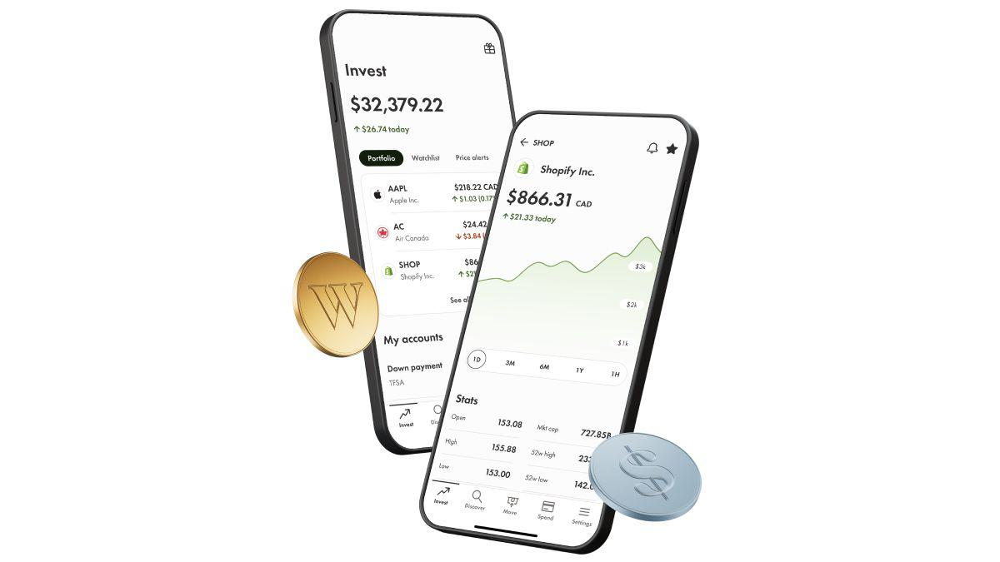

Wealthsimple, a burgeoning name in financial technology, is reshaping the investment landscape by fusing advanced technological innovations with traditional investment strategies. As a platform, it deftly marries the concepts of algorithmic trading with robo-advisory services, leveraging modern advancements to meet the dynamic needs of today's investors. This article aims to offer an extensive examination of Wealthsimple’s array of services, with a particular focus on how these digital transformations are making investing more approachable and efficient for the average user.

The journey into Wealthsimple’s methodology reveals much about the progressive trends in automated investing and the broader fintech innovation wave currently sweeping the industry. By automating complex trading processes and providing intuitive investment solutions, Wealthsimple is at the cutting edge, transforming how users engage with their financial portfolios. Such a technological approach not only enhances efficiency but also opens up investment opportunities to a wider audience, breaking traditional barriers that have long existed in the financial services world.

For those keen to understand the evolution of investing through digital lenses, Wealthsimple offers a case study in how technology and finance can synergize to create user-friendly investing landscapes. The insights provided by Wealthsimple's approach are crucial for grasping the potential trajectories of the fintech sector and understanding how these innovations continue to imitate and depart from established investing frameworks.

As we explore the varied offerings of Wealthsimple's financial services, this analysis will help illustrate how the platform is setting benchmarks in the industry by providing low-maintenance, automated solutions that align with diverse investment goals and ethical considerations. Whether for novice investors seeking simplicity or for seasoned ones looking for sophisticated financial tools, Wealthsimple encapsulates the future of investing with a commitment to innovation and customer-centric services.

## Table of Contents

## Overview of Wealthsimple

Wealthsimple, established in 2014 and headquartered in Toronto, has swiftly become a significant player in the financial technology sector, offering a broad array of investment services. Initially, the platform made a mark in the investment landscape by implementing a zero account minimum policy alongside competitive management fees. This strategy effectively attracted a younger demographic and novice investors who were previously deterred by the barriers associated with traditional investing.

As the company expanded its horizons beyond fundamental investing solutions, it developed an extensive suite of services, including tax-efficient wealth management strategies and options for socially responsible investing. These advancements have allowed Wealthsimple to appeal to a growing cohort of investors interested in aligning their financial portfolios with personal values, such as environmental sustainability and ethical governance.

The progression of Wealthsimple from a simple robo-advisor to a dynamic and comprehensive financial service provider highlights its robustness and adaptability. This evolution underscores Wealthsimple's ability to respond to the varied and changing needs of investors, providing a platform that is both reliable and innovative. A detailed understanding of Wealthsimple’s growth trajectory offers insights into its structural makeup and ethos, revealing a commitment to making investing more accessible, straightforward, and aligned with modern financial principles.

As Wealthsimple continues to innovate, it maintains a focus on ensuring an inclusive investment experience. Its services are designed to accommodate diverse investor profiles, making the platform a versatile tool for both new and seasoned investors. Wealthsimple’s dynamic adaptation to market demands and investment trends positions it well within the competitive landscape of financial technology companies.

## Algorithmic Trading and Robo-Advisory

Wealthsimple leverages [algorithmic trading](/wiki/algorithmic-trading) and robo-advisory services to optimize portfolio management effectively, embracing the principles of modern portfolio theory (MPT). MPT suggests that investors can construct an optimal portfolio that maximizes expected return for a given level of risk by carefully selecting the proportions of various assets. Wealthsimple's robo-advisory services are designed to manage portfolios automatically, eliminating the need for constant hands-on oversight from investors.

Algorithmic trading systems employed by Wealthsimple utilize complex algorithms to analyze vast amounts of market data swiftly. These systems are adept at identifying trends, recognizing patterns, and making informed investment decisions based on quantitative data gleaned from financial markets. This capability is facilitated by dynamic models which incorporate market analyses and real-time data to adjust investment strategies rapidly.

By automating these intricate investment strategies, Wealthsimple empowers investors to focus on broader financial goals, removing the complexities typically associated with active portfolio management. This hands-off approach is beneficial for investors who prefer a simpler, less involved method for managing their investments.

A significant aspect of Wealthsimple's approach lies in its integration of [artificial intelligence](/wiki/ai-artificial-intelligence) (AI) and [machine learning](/wiki/machine-learning) technologies. These technologies contribute to the continual improvement of investment strategies through adaptive learning processes. Machine learning algorithms, for instance, can learn from historical data, adjust to new information, and predict future market movements more accurately over time. This application of AI not only automates decision-making processes but also enhances the precision and reliability of investment management.

The potential future of investment management, as exemplified by Wealthsimple, indicates a move towards increasingly sophisticated, AI-driven platforms that provide personalized and data-driven investment strategies. As these technologies continue to evolve, the landscape of portfolio management will likely undergo substantial transformation, offering even greater accessibility and efficiency to investors worldwide.

## Financial Services Offered by Wealthsimple

Wealthsimple provides a comprehensive array of financial services designed to meet diverse investor needs. Among its offerings, the platform supports a variety of accounts like Tax-Free Savings Accounts (TFSAs), Registered Retirement Savings Plans (RRSPs), and Registered Education Savings Plans (RESPs), among others. These accounts cater to a broad spectrum of investment goals, allowing individuals to save, grow, and manage their wealth efficiently. Wealthsimple's commitment to inclusivity is underscored by its unique investment options, such as socially responsible investing (SRI) and Halal investment portfolios. These features allow investors to align their financial activities with personal values and ethical considerations.

The socially responsible investing options provided by Wealthsimple enable users to invest in companies and funds that meet specific environmental, social, and governance ([ESG](/wiki/esg-investing)) criteria. This aligns with the growing demand for investments that contribute positively to society while generating potential returns. Similarly, Halal investment options are crafted to comply with Islamic finance principles, ensuring that portfolios are free from interest-bearing and non-compliant activities like gambling and alcohol.

Beyond investment accounts, Wealthsimple extends its services to self-directed trading, where users can independently trade stocks and exchange-traded funds (ETFs) while having access to a wealth of educational resources and tools. This empowers individuals who prefer a more hands-on approach to investing.

Moreover, Wealthsimple has expanded its suite of services to include tax filing assistance, reducing the complexities associated with managing and filing taxes. This feature is particularly advantageous for Canadian clients looking to ensure accuracy and efficiency in their tax submissions. 

The platform's extensive product offerings illustrate its dedication to providing versatile, user-centered financial solutions. By addressing varied financial goals and ethical preferences, Wealthsimple maintains a robust and evolving service model that appeals to a wide range of investors, from novice savers to seasoned traders, ensuring each can find a fitting investment pathway.

## Wealthsimple's Approach to Portfolio Management

Wealthsimple's portfolio management is strategically structured to cater to varying investment preferences, classified into three primary approaches: conservative, balanced, and growth-oriented strategies. This categorization allows the platform to align closely with clients' financial objectives and risk tolerance.

The platform employs a curated selection of Exchange-Traded Funds (ETFs) that span across multiple asset classes, thereby ensuring robust portfolio diversification. This diversity is key to mitigating risks associated with investment fluctuations in any single asset category. By harnessing a range of ETFs, Wealthsimple can offer clients exposure to equities, bonds, and other securities, adhering to the fundamental investment principle of not putting all eggs in one basket.

Wealthsimple further enhances portfolio performance through tax-loss harvesting and automatic rebalancing techniques. Tax-loss harvesting involves selling securities at a loss to offset capital gains, thereby reducing the investor's taxable income. This process is integral in improving after-tax returns without altering the overall risk profile.

Automatic rebalancing is another pivotal feature employed to maintain the desired asset allocation within a portfolio. Over time, market movements can lead to drift from the original investment strategy, thereby altering the risk-return balance. Wealthsimple's automated systems periodically review and adjust the portfolio composition, realigning it with the investor’s predefined strategy. This systematic approach ensures that portfolios remain consistent with the client’s long-term goals and risk tolerance.

A rigorous, data-driven process underpins Wealthsimple's portfolio management techniques. The platform utilizes advanced algorithms to analyze financial data and trends, optimizing investment decisions. This analytical acumen is complemented by modern portfolio theory (MPT) principles, which emphasize maximizing expected return for a given amount of risk through diversification.

Through these sophisticated management techniques, Wealthsimple offers a comprehensive investment solution that not only aligns with individual investor goals but also adapts dynamically to changing market conditions.

## Security and User Experience

Wealthsimple prioritizes user experience and security to enhance investor satisfaction and trust. The platform’s design is intuitive, ensuring that users, regardless of their tech-savviness, can navigate easily. Interfaces are streamlined across both mobile and desktop applications, offering seamless account management. This allows users to access their financial information in real time, fostering a more interactive investment experience.

The company places a strong emphasis on customer support, integrating chatbots to provide immediate responses to common inquiries. A comprehensive FAQ section is also available, addressing a wide array of topics to assist users in finding solutions without delay. Such features highlight Wealthsimple’s commitment to maintaining an accessible and responsive support structure.

Security is paramount, and Wealthsimple implements several measures to safeguard user data and investments. Two-[factor](/wiki/factor-investing) authentication (2FA) is standard, adding an extra layer of protection. This security mechanism requires users to verify their identities via a second factor, usually a mobile device, alongside their password. Encryption protocols further secure data, ensuring that sensitive information remains confidential and protected from unauthorized access.

In balancing advanced technology with user-friendly design, Wealthsimple demonstrates an emphasis on providing a superior investing experience. The thoughtful integration of security features, coupled with an intuitive user interface and robust support system, underscores Wealthsimple’s dedication to attracting and retaining a diverse user base, ranging from novice investors to experienced traders.

## Pros and Cons of Wealthsimple

Wealthsimple has positioned itself as a significant player in the fintech landscape, offering a range of compelling features and services that appeal to a wide demographic of investors. Examining the strengths and weaknesses of Wealthsimple reveals its unique value proposition and potential limitations, providing clarity on whether it suits an individual's investment needs.

A primary advantage of Wealthsimple is its accessibility; the platform operates with no account minimum requirement. This feature distinctly benefits beginner investors or those with limited capital, eliminating barriers to entry that are often imposed by traditional investment services. Additionally, the user interface is designed to be intuitive and straightforward, catering to users who prioritize ease of navigation and simplicity in managing their investments.

Moreover, Wealthsimple champions diversity and ethical investing. The platform offers an array of investment options including socially responsible portfolios and Halal investing, appealing to individuals who aim to align their financial activities with their personal values and ethical standards. This inclusivity ensures that a broad spectrum of users can find a tailored investment opportunity that resonates with their beliefs.

However, there are certain drawbacks associated with Wealthsimple that potential investors should consider. One such concern is the fee structure. While Wealthsimple is competitive, its fees may be slightly higher compared to some other robo-advisors and traditional services, particularly for lower-balance accounts. This difference can impact the overall cost-effectiveness for frugal investors or those managing smaller portfolios.

Additionally, Wealthsimple's platform might not fully cater to investors seeking detailed control and customization. The limited toolsets available for active trading and the absence of advanced analytical tools may not satisfy those who prefer a more hands-on approach to managing their investments. Investors who like to engage deeply with their portfolio management might find themselves constrained by the automated nature of Wealthsimple's offerings.

Wealthsimple's market position is solidified by its commitment to innovation and customer-focused solutions. It has demonstrated adaptability by continually integrating new technologies and refining its services in response to user feedback and evolving market trends.

In conclusion, Wealthsimple is an excellent choice for investors who prioritize a low-maintenance investment strategy, value ethical investment options, and appreciate a user-friendly platform. However, those who seek lower fees or more personalized investment management may need to weigh these aspects carefully when deciding if Wealthsimple aligns with their investment goals and preferences.

## Conclusion

Wealthsimple has emerged as a prominent figure in the robo-advisory sector, primarily through its adept integration of sophisticated technological solutions aimed at simplifying the investment process. This innovative approach addresses the needs of modern investors who often prioritize convenience and minimal intervention. By automating investment strategies and including options for socially responsible and Halal portfolios, Wealthsimple presents a particularly attractive package for those seeking ethical investment opportunities alongside a low-maintenance financial strategy.

As the landscape of automated investing continues to develop, Wealthsimple's commitment to technological enhancement positions it as a likely enduring leader in the sector. Its ability to incorporate new advancements while maintaining a user-friendly platform speaks to its potential for sustained market presence. This article has examined how Wealthsimple balances fintech innovation with elements of traditional portfolio management, offering insights into the mechanisms that drive its services.

Ultimately, the decision to choose Wealthsimple as an investment platform should be based on individual financial goals and contexts. Investors are encouraged to consider their priorities, whether they relate to ethical considerations, fee structures, or level of engagement. This personalized approach ensures that Wealthsimple's offerings are tailored to suit diverse investor needs, aligning with both contemporary demands and evolving financial landscapes.

## References & Further Reading

[1]: Bergstra, J., Bardenet, R., Bengio, Y., & Kégl, B. (2011). ["Algorithms for Hyper-Parameter Optimization."](https://papers.nips.cc/paper/4443-algorithms-for-hyper-parameter-optimization) Advances in Neural Information Processing Systems 24.

[2]: ["Advances in Financial Machine Learning"](https://www.amazon.com/Advances-Financial-Machine-Learning-Marcos/dp/1119482089) by Marcos Lopez de Prado

[3]: ["Evidence-Based Technical Analysis: Applying the Scientific Method and Statistical Inference to Trading Signals"](https://www.amazon.com/Evidence-Based-Technical-Analysis-Scientific-Statistical/dp/0470008741) by David Aronson

[4]: ["Machine Learning for Algorithmic Trading"](https://github.com/stefan-jansen/machine-learning-for-trading) by Stefan Jansen

[5]: ["Quantitative Trading: How to Build Your Own Algorithmic Trading Business"](https://www.amazon.com/Quantitative-Trading-Build-Algorithmic-Business/dp/1119800064) by Ernest P. Chan