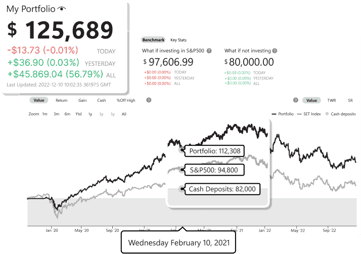

## Table of Contents

## What is Wealthsimple and what services do they offer?

Wealthsimple is a Canadian company that helps people invest their money easily. They started in 2014 and have become popular because they make investing simple and affordable. Wealthsimple uses technology to manage your investments for you, so you don't need to be an expert to start investing. They offer different types of accounts, like personal accounts, accounts for kids, and even accounts for businesses.

Wealthsimple offers several services to help you grow your money. One of their main services is called Wealthsimple Invest, where they automatically invest your money in a mix of stocks and bonds based on your goals and how much risk you're willing to take. They also have Wealthsimple Trade, which lets you buy and sell individual stocks and exchange-traded funds (ETFs) on your own. Another service is Wealthsimple Cash, which is a high-interest savings account that helps your money grow faster than in a regular bank account.

## How does Wealthsimple make money?

Wealthsimple makes money by charging fees for the services they offer. For their Wealthsimple Invest service, they charge a management fee, which is a small percentage of the money you have invested with them. This fee is how they pay for managing your investments and making sure your money is working hard for you. The more money you have invested, the less the percentage fee becomes, which means Wealthsimple rewards you for investing more.

For Wealthsimple Trade, they make money in a different way. They charge a small fee when you trade stocks or ETFs, but only if you use their premium service called Wealthsimple Trade Plus. If you use the regular Wealthsimple Trade service, there are no trading fees, but Wealthsimple still makes money through something called the "spread," which is the difference between the price you buy a stock at and the price someone else is willing to sell it for. This spread is very small, but it adds up when a lot of people are trading.

Wealthsimple Cash, their high-interest savings account, also helps them make money. They pay you interest on the money you keep in the account, but they invest that money in other ways to earn even more interest. The difference between what they pay you and what they earn is how they make money from this service. So, Wealthsimple uses a mix of fees and interest to keep their business running and growing.

## What are the different types of accounts available at Wealthsimple?

Wealthsimple offers different types of accounts to help people save and invest their money. They have personal accounts for adults who want to invest for their future. These accounts can be used to save for things like buying a house, retirement, or just growing your money over time. Wealthsimple also has accounts for kids, called Wealthsimple Save, where parents can start investing for their children's future. This can help kids learn about money and have a head start on saving for things like college.

Another type of account Wealthsimple offers is for businesses. These accounts help companies manage their money and invest it to grow their business. Wealthsimple also has special accounts called Tax-Free Savings Accounts (TFSAs) and Registered Retirement Savings Plans (RRSPs). TFSAs let you invest money without paying taxes on the money you earn, while RRSPs help you save for retirement with tax benefits. All these accounts are designed to make investing easy and help you reach your financial goals.

## How does Wealthsimple's investment strategy work?

Wealthsimple's investment strategy is all about making investing easy for everyone. They use something called "passive investing," which means they don't try to guess which stocks will do well. Instead, they put your money into a mix of stocks and bonds that matches your goals and how much risk you're okay with. This mix is called a portfolio, and Wealthsimple takes care of it for you. They use computer programs to keep your portfolio balanced, so you don't have to worry about it.

When you start with Wealthsimple, you answer some questions about your money goals and how much risk you want to take. Based on your answers, Wealthsimple picks the right mix of investments for you. They use low-cost index funds and ETFs, which are groups of stocks and bonds that track the overall market. This way, your money grows over time without you having to do much work. Wealthsimple keeps an eye on your investments and makes small changes to keep everything on track, so you can focus on other things in life.

## What are the fees associated with using Wealthsimple?

Wealthsimple charges different fees depending on which service you use. For Wealthsimple Invest, they charge a management fee based on how much money you have invested. If you have less than $100,000, the fee is 0.5% of your money each year. If you have more than $100,000, the fee goes down to 0.4%. And if you have over $500,000, it's even lower at 0.3%. This fee is how Wealthsimple pays for managing your investments and making sure your money is growing.

For Wealthsimple Trade, the fees are different. If you use the regular Wealthsimple Trade service, there are no fees for buying or selling stocks and ETFs. But if you want to use Wealthsimple Trade Plus, which gives you more features like instant deposits and better customer support, you have to pay a monthly fee of $10. Wealthsimple also makes a little bit of money from the "spread," which is the small difference between the price you buy a stock at and the price someone else is willing to sell it for.

## How does Wealthsimple compare to other robo-advisors in terms of performance and cost?

Wealthsimple is a popular robo-advisor in Canada, and it's known for its simple and affordable way to invest. When it comes to cost, Wealthsimple's fees are competitive. For Wealthsimple Invest, they charge between 0.3% and 0.5% of your money each year, depending on how much you have invested. This is in line with other robo-advisors like Questwealth Portfolios, which charges 0.2% to 0.25%, and BMO SmartFolio, which charges 0.4% to 0.7%. Wealthsimple also offers a free trading service called Wealthsimple Trade, but if you want more features, you can pay $10 a month for Wealthsimple Trade Plus. Overall, Wealthsimple's fees are reasonable and make it easy for people to start investing without spending a lot of money.

When it comes to performance, robo-advisors like Wealthsimple aim to match the overall market's performance rather than trying to beat it. Wealthsimple uses a mix of low-cost index funds and ETFs to build your portfolio, which helps keep costs down and can lead to good long-term growth. Compared to other robo-advisors, Wealthsimple's performance is generally in line with what you'd expect from passive investing. For example, Questwealth Portfolios and BMO SmartFolio also use similar strategies and have similar performance results. The key thing to remember is that robo-advisors like Wealthsimple are designed to be easy to use and help you grow your money over time, not to make quick profits.

## What are the benefits of using Wealthsimple for someone new to investing?

Wealthsimple is a great choice for someone new to investing because it makes the whole process simple and easy to understand. When you start with Wealthsimple, you just need to answer a few questions about your goals and how much risk you're okay with. Wealthsimple then takes care of everything else, [picking](/wiki/asset-class-picking) the right mix of investments for you and managing your money. This means you don't need to be an expert or spend a lot of time figuring out what to invest in. Wealthsimple does all the hard work for you, so you can focus on other things in your life.

Another big benefit of using Wealthsimple is that it's affordable. They charge low fees, which means more of your money can grow over time. Plus, Wealthsimple offers different types of accounts, like personal accounts, accounts for kids, and even accounts that help you save on taxes. This makes it easy for new investors to find the right account for their needs. With Wealthsimple, you can start investing with just a little bit of money and feel confident that you're making smart choices for your future.

## How secure is Wealthsimple and what measures do they take to protect user data and investments?

Wealthsimple takes security very seriously to keep your money and personal information safe. They use strong encryption to protect your data when it's being sent over the internet. This means that even if someone tried to steal your information, they wouldn't be able to understand it. Wealthsimple also follows strict rules set by the government to keep your money safe. They keep your money in separate accounts at big banks, so even if something bad happened to Wealthsimple, your money would still be safe.

On top of that, Wealthsimple has a team that watches for anything strange happening with your account. If they see something that doesn't look right, they'll let you know right away. They also make sure to follow all the rules about keeping your information private. This means they won't share your personal details with anyone without your permission. So, you can feel confident that Wealthsimple is doing everything they can to keep your investments and personal information secure.

## Can you explain Wealthsimple's approach to socially responsible investing?

Wealthsimple cares about making the world a better place, so they offer a way to invest in companies that are good for the environment and society. This is called socially responsible investing. With Wealthsimple, you can choose to put your money into a special portfolio called Wealthsimple SRI. This portfolio avoids companies that do things like harm the environment, make weapons, or use child labor. Instead, it focuses on companies that are trying to make a positive impact, like those working on clean energy or fair labor practices.

When you invest with Wealthsimple SRI, you're not just growing your money; you're also helping to support companies that are doing good things. Wealthsimple makes sure that the companies in the SRI portfolio meet high standards for social and environmental responsibility. This way, you can feel good about where your money is going and know that you're helping to make a difference in the world while still working towards your financial goals.

## What advanced features does Wealthsimple offer for experienced investors?

Wealthsimple has some cool features for people who know a lot about investing. One of these is Wealthsimple Trade Plus. This is a special version of their trading service that costs $10 a month. With Trade Plus, you get things like instant deposits, which means you can add money to your account and start trading right away without waiting. You also get better customer support and access to more advanced data and charts. This can help experienced investors make smarter choices about when to buy and sell stocks.

Another advanced feature is Wealthsimple Black. This is a premium version of their Wealthsimple Invest service. It's for people who have a lot of money to invest, at least $100,000. With Wealthsimple Black, you get a lower management fee, which means you keep more of your money. You also get a personal financial advisor who can give you advice and help you plan for things like buying a house or retiring. Plus, you get access to special investment options that aren't available in the regular Wealthsimple Invest service. These features can help experienced investors get the most out of their money and reach their financial goals faster.

## How does Wealthsimple's tax strategy work, particularly with regards to tax-loss harvesting?

Wealthsimple helps you save money on taxes with something called tax-loss harvesting. This is a smart way to lower the taxes you pay on your investments. When you invest, you might make money or lose money. If you lose money on some investments, Wealthsimple can use those losses to reduce the taxes you owe on the money you made from other investments. They do this by selling the investments that lost value and then buying similar ones. This way, your portfolio stays the same, but you get to save on taxes.

Wealthsimple does this tax-loss harvesting automatically for you, so you don't have to do anything. They keep an eye on your investments all the time and look for chances to save you money on taxes. This is especially helpful if you have a lot of money invested or if you're in a high tax bracket. By using tax-loss harvesting, Wealthsimple helps you keep more of your money and grow your investments faster.

## What are some expert opinions and analyses on Wealthsimple's long-term viability and market position?

Experts think Wealthsimple has a good chance of doing well in the future because they make investing easy and affordable. They've grown a lot since they started in 2014 and now have a lot of customers. Wealthsimple is known for being user-friendly and having low fees, which is why many people like them. They also keep adding new features, like trading stocks and socially responsible investing, which helps them stay ahead of other companies. Experts believe that as more people want to invest without spending a lot of time or money, Wealthsimple will keep getting bigger and stronger.

Some experts also say that Wealthsimple's focus on technology and automation is a big plus. They use computer programs to manage investments, which means they can offer their services at a lower cost than traditional investment companies. This makes them attractive to young people and those new to investing. However, some experts worry about competition from other robo-advisors and big banks that are also getting into the market. Still, many believe that Wealthsimple's strong brand and customer loyalty will help them stay a leader in the industry for a long time.

## References & Further Reading

[1]: Bergstra, J., Bardenet, R., Bengio, Y., & Kégl, B. (2011). ["Algorithms for Hyper-Parameter Optimization."](https://papers.nips.cc/paper/4443-algorithms-for-hyper-parameter-optimization) Advances in Neural Information Processing Systems 24.

[2]: ["Advances in Financial Machine Learning"](https://www.amazon.com/Advances-Financial-Machine-Learning-Marcos/dp/1119482089) by Marcos Lopez de Prado

[3]: ["Evidence-Based Technical Analysis: Applying the Scientific Method and Statistical Inference to Trading Signals"](https://www.amazon.com/Evidence-Based-Technical-Analysis-Scientific-Statistical/dp/0470008741) by David Aronson

[4]: ["Machine Learning for Algorithmic Trading"](https://github.com/stefan-jansen/machine-learning-for-trading) by Stefan Jansen

[5]: ["Quantitative Trading: How to Build Your Own Algorithmic Trading Business"](https://www.amazon.com/Quantitative-Trading-Build-Algorithmic-Business/dp/1119800064) by Ernest P. Chan