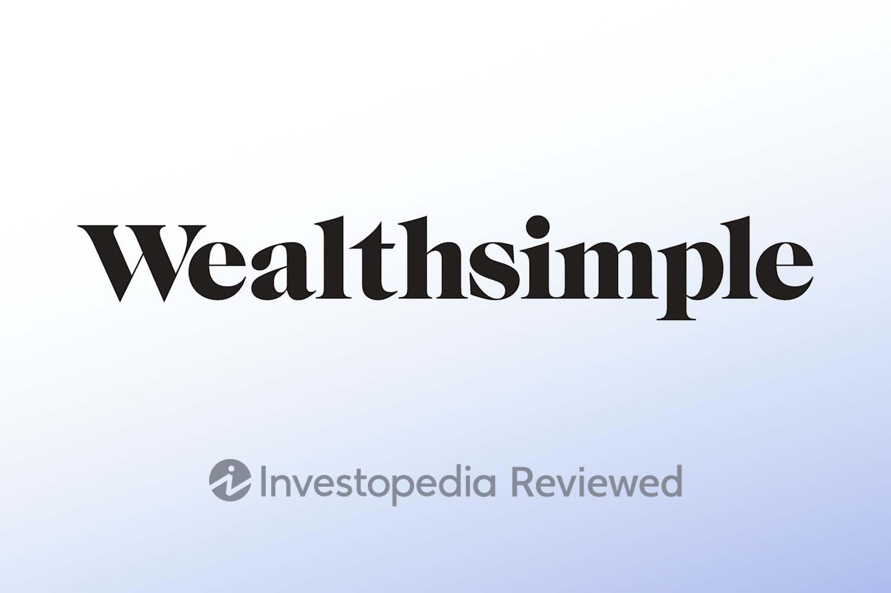

Wealthsimple is a notable entity in the online financial services sector, particularly recognized in Canada for its pioneering investment strategies. Established in 2014 in Toronto, Wealthsimple has rapidly evolved into a leading financial technology firm, placing a significant emphasis on simplicity and client accessibility. This focus has made it easier for individuals to engage with investing, especially those who may be new to the financial world.

Initially operating across North America and the United Kingdom, Wealthsimple has since streamlined its operations by phasing out its presence in the American and UK markets. This strategic shift allows the company to concentrate intensely on the Canadian market, which is vital due to its substantial client base and the significant assets it manages within this region. By tailoring its services specifically for Canadian investors, Wealthsimple ensures that it meets the unique needs of its client demographic.

This article provides a comprehensive overview of Wealthsimple's offerings. It evaluates the platform’s effectiveness for various investor types, focusing specifically on its self-directed investing platform and automated trading capabilities. Wealthsimple’s platform is particularly noted for its user-friendly design and innovative features, which cater to both novice and seasoned investors seeking efficient investment solutions. Through this analysis, potential and current investors can better understand Wealthsimple's potential to enhance their investment strategies within a simplified and accessible framework.

## Table of Contents

## Understanding Wealthsimple's Self-Directed Investing

Wealthsimple's self-directed investing platform is designed to provide clients with the ability to trade stocks and exchange-traded funds (ETFs) without incurring commission fees, which serves as a significant advantage for cost-conscious investors. This commission-free trading structure allows individuals to maximize their investment returns by minimizing the costs typically associated with stock and ETF transactions.

The platform emphasizes usability, particularly catering to beginners and passive investors. With an interface that prioritizes simplicity, Wealthsimple enables users to navigate confidently without needing extensive prior knowledge of financial markets. The onboarding process and account setup require minimal effort, ensuring that new investors can commence trading swiftly.

One notable feature is Wealthsimple's provision for fractional share trading. This feature empowers investors to buy portions of stocks, thereby enhancing portfolio diversification even when the investor has limited capital. Fractional shares allow individuals to invest in high-value stocks traditionally out of reach due to their price, fostering inclusivity in the financial markets for smaller investors.

However, the platform presents certain limitations, particularly the absence of advanced trading tools and functionalities. While Wealthsimple's streamlined approach is beneficial for novices, more sophisticated or active traders may find the lack of comprehensive trading features, such as complex order types or advanced charting tools, restrictive. This limitation could drive active traders to seek alternative platforms offering robust tools tailored to intricate trading strategies.

In summary, Wealthsimple's self-directed investing platform provides a practical and cost-effective solution for individuals seeking to enter the world of investing without extensive financial barriers. Nonetheless, its minimalist approach may prompt more experienced traders to consider other platforms better equipped to support advanced trading operations.

## Key Features and Usability

Wealthsimple's web and mobile platforms are designed with simplicity and ease of access in mind, making investing approachable for users, particularly those new to the world of finance. The design philosophy focuses on an intuitive user interface, which allows clients to navigate effortlessly through various features and tools. This straightforward approach ensures that users can concentrate on investing rather than getting bogged down by complex functionalities.

Despite the platform's user-friendly design, it lacks certain complex order types, such as stop-loss and limit orders, which are typically favored by more sophisticated traders. Additionally, Wealthsimple does not offer advanced charting tools, features that are often essential for professionals who rely on technical analysis to guide their investment strategies. This limitation might deter investors seeking a platform with comprehensive trading capabilities.

However, the absence of these advanced features is offset by key offerings appealing to new and passive investors. One such attraction is the absence of account minimums, allowing anyone to start investing without a significant upfront financial commitment. Furthermore, Wealthsimple's commission-free stock and [ETF](/wiki/etf-trading-strategies) trading model significantly reduces the cost of investment, promoting wider access to market participation.

For those who opt for Wealthsimple's premium subscription service, the platform provides real-time stock quotes and the ability to hold a USD account. These enhancements can be particularly beneficial for active investors who require up-to-the-minute data to make timely decisions. While these features incur a monthly fee, they offer added value by enabling more dynamic portfolio management and currency flexibility, which could be advantageous for parts of an investment strategy involving international or rapid trades.

In conclusion, while Wealthsimple’s platforms may not cater to the demands of seasoned traders due to their lack of certain advanced features, their simple and straightforward approach has positioned them as an attractive option for beginners and passive investors, emphasizing accessibility and cost-effectiveness in the investment process.

## Automated Trading with Wealthsimple

Wealthsimple's automated trading platform, known as Wealthsimple Managed Investing, utilizes robo-advisors to facilitate a streamlined and personalized investment experience. These robo-advisors leverage modern algorithms and financial theories to craft investment portfolios tailored to each client's specific risk tolerance and financial objectives.

The customization process begins with an assessment that determines a client's risk appetite, financial goals, and investment timeline. Typically, this involves a questionnaire that evaluates various factors such as age, income, net worth, and the client's comfort level with market [volatility](/wiki/volatility-trading-strategies). Based on this data, the robo-advisor allocates assets across a diversified portfolio, primarily composed of exchange-traded funds (ETFs) that are balanced between equities, bonds, and sometimes other asset classes. This diversified approach aims to optimize returns while managing risk, adhering to the principles of Modern Portfolio Theory.

Wealthsimple Managed Investing charges a management fee that varies depending on the total assets managed. As of the latest data, the fee structure generally consists of a tiered rate that decreases as the asset size increases, providing an incentive for clients to invest more. Typically, fees might start around 0.5% annually for portfolios under a certain threshold and decrease to around 0.4% for larger balances. This fee is inclusive of the services provided by the robo-advisor, portfolio rebalancing, and any tax-loss harvesting strategies that might be employed.

When compared to other automated trading and robo-advisor platforms, Wealthsimple's fees are competitive. For instance, many similar platforms charge fees ranging from 0.25% to 0.75%. The value proposition offered by Wealthsimple lies in its comprehensive service that includes not just portfolio management but also access to human advisors for personalized financial advice, a feature that enhances its appeal, especially for those new to investing.

The role of these management fees is crucial in Wealthsimple’s profit model as they constitute the primary revenue stream for the automated investing service. By maintaining a cost-effective structure, Wealthsimple can attract a diverse client base, ranging from novice investors to those with substantial assets seeking a hands-off investment approach. 

In summary, Wealthsimple Managed Investing provides a sophisticated yet accessible approach to automated trading, effectively balancing cost, customization, and the strategic allocation of client assets, making it a robust option for users seeking automated portfolio management solutions.

## Wealthsimple's Trading Technology and Security

Wealthsimple ensures the security and reliability of its trading technology through adherence to the strict guidelines set by the Investment Industry Regulatory Organization of Canada (IIROC). This regulatory framework provides a foundation for secure transaction processing and builds trust with investors by safeguarding user data and assets.

To enhance security, Wealthsimple implements a range of measures designed to protect client information and investments effectively. These measures include biometric logins, which add an additional layer of security by requiring physical attributes like fingerprints or facial recognition for account access. Encryption further contributes to data protection by converting user data into a secure format that is unreadable to unauthorized entities. Two-[factor](/wiki/factor-investing) authentication (2FA) is another critical security feature Wealthsimple employs. 2FA requires users to provide two different types of information before accessing their accounts, typically a password and a code sent to a registered device, significantly reducing the risk of unauthorized access.

Despite the limitations of the financial tools offered, Wealthsimple places significant emphasis on the secure execution of trades and the protection of client investments. This commitment is evident in the way transactions are handled, ensuring that even with basic financial instruments, users can trade confidently knowing their investments are secure. The secure infrastructure supports uninterrupted trading activities and enhances investor confidence in Wealthsimple's capabilities as a reliable financial service provider.

Through these security enhancements, Wealthsimple not only complies with regulatory standards but also prioritizes user security and peace of mind, making it a trusted platform among investors who value the protection of their financial assets.

## Costs and Fees

Wealthsimple offers a competitive fee structure, particularly appealing to cost-sensitive investors. Central to its offering is commission-free trading on stocks and ETFs, which significantly reduces transaction costs for users trading on the platform. This absence of commission charges enables investors to execute trades without incurring additional fees, thereby maximizing the potential returns on their investments. 

However, when trading American stocks, users should be aware of the currency conversion fees that apply. Wealthsimple charges a currency conversion fee when converting Canadian dollars (CAD) to US dollars (USD) or vice versa during transactions involving American equities. This fee is a critical consideration for Canadian investors trading in the US market since it can impact the overall cost and net returns of these trades.

Wealthsimple also provides a premium subscription service known as "Wealthsimple Plus," which includes added features like a USD account and real-time pricing for a monthly fee. The USD account feature allows investors to hold and trade US equities without repetitive currency conversion, potentially offering significant savings for those frequently engaging in cross-border equity trading. Real-time pricing ensures investors have access to the latest market data, facilitating more informed transaction decisions. The subscription fee's value ultimately depends on the frequency and [volume](/wiki/volume-trading-strategy) of the investor's cross-border trading activities and their need for timely market information.

Comparatively, Wealthsimple's costs stand out from other brokerage firms by offering a zero-commission model. Traditional brokers often charge a commission for each trade, which can accumulate over time, especially for active traders. Wealthsimple's model can be particularly beneficial for strategies involving frequent trading or dollar-cost averaging, where investors make regular purchases regardless of a stock's price.

Despite its advantages, investors must carefully consider how Wealthsimple's additional fees, such as currency conversion and optional premium services, align with their investment needs and strategies. For many, the commission-free trading model might present a compelling opportunity to minimize costs, while others may prefer traditional platforms with different fee structures and additional features.

## Education and Customer Service

Wealthsimple provides a robust selection of educational resources aimed primarily at new investors. These resources include a range of articles, podcasts, and video content designed to familiarize users with basic investing concepts and the functionalities of the Wealthsimple platform. The accessible format of these resources makes them particularly valuable for individuals who are just beginning to explore investment opportunities, offering clear and straightforward insights into the principles of trading and financial planning.

Customer service at Wealthsimple is relatively comprehensive, featuring support options through phone, chat, and email to assist users with any queries or issues they may encounter. This multi-channel approach ensures that clients can receive help in a timely and convenient manner. However, for broker-assisted trades, fees may apply, which could lead to additional costs for users who require personalized trading support. This aspect underscores the importance for investors to be fully informed of the potential costs associated with certain transactions through Wealthsimple's customer service offerings.

Despite the breadth of Wealthsimple's educational materials, the resources available might not fully satisfy the needs of more advanced or active traders who are seeking deeper analyses or insights into complex market trends and strategies. The emphasis on foundational knowledge means that sophisticated tools and detailed market analytics, which are crucial for experienced traders, are somewhat lacking. Consequently, investors with a keen interest in advanced trading techniques or strategic market evaluations may need to supplement their learning with external resources or platforms that provide richer, more detailed insights into market movements and advanced investment strategies.

## Conclusion

Wealthsimple provides a straightforward and user-friendly platform that is particularly suitable for passive investors and those who are new to trading. The platform's design focuses on simplicity, making it accessible to individuals who may find traditional investing complex. Although it lacks advanced features that cater to active traders, such as complex order types or comprehensive analytical tools, Wealthsimple's commission-free trading and robust security measures offer a viable foundation for those seeking automated or self-directed investment solutions.

Wealthsimple's commitment to demystifying the investment process is evident as it became the first online broker in Canada to offer commission-free trading. This pioneering move has significantly lowered the barrier to entry for many potential investors, contributing to financial inclusion by enabling a broader audience to participate in the market. The platform's focus on ease of access and minimal setup requirements aligns with its mission to promote financial literacy and freedom through uncomplicated digital tools.

## References & Further Reading

[1]: Wealthsimple. ["About Wealthsimple."](https://www.wealthsimple.com/en-ca/about) Wealthsimple.

[2]: Canadian Investment Regulatory Organization (CIRO). ["Wealthsimple Online Brokerage Review."](https://www.ciro.ca/) 

[3]: Canadian Securities Administrators. ["Fractional Shares."](https://www.securities-administrators.ca/) Canadian Securities Administrators.

[4]: McLaughlin, Tim. ["Secure Online Trading: Tips and Best Practices."](https://www.chartguys.com/articles/the-ultimate-day-trading-beginners-guide-mastering-the-art-of-trading) Investopedia.

[5]: Hodge, Alan. ["The Rise of Robo-Advisors: Automated, Algorithm-Driven Financial Planning Services."](https://www.researchgate.net/publication/375867066_The_Rise_of_Robo-Advisory_in_Investment_Management_An_Individual_Investors'_Perspective) Forbes.