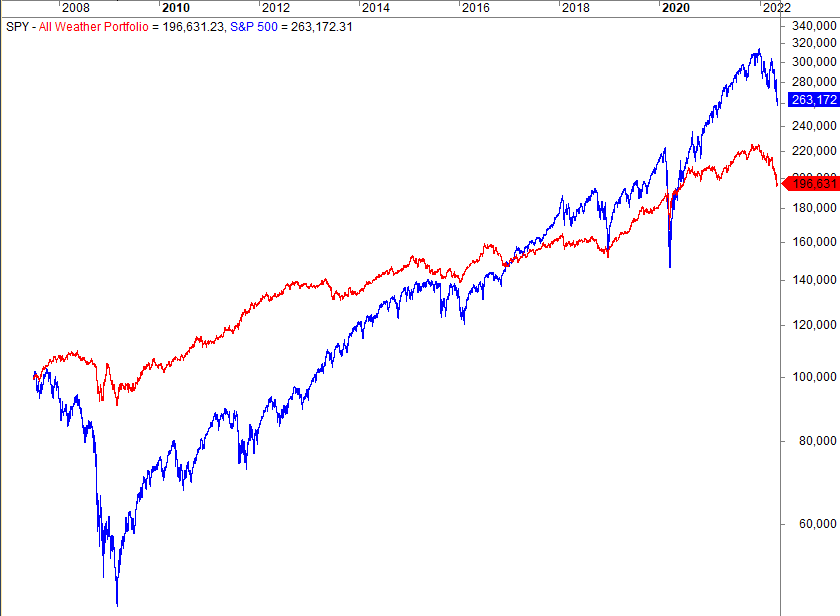

The evolution of algorithmic trading has significantly transformed the financial markets by incorporating a wide array of data sources to refine investment strategies. Traditional data sources, such as financial statements and analyst reports, have long been essential to traders. However, as markets have become increasingly efficient, the demand for alternative data has surged. This demand is driven by the need for more nuanced insights and has prompted traders to seek innovative data sources. 

Alternative data encompasses a variety of non-traditional datasets that extend beyond conventional financial information. Among these, weather data has emerged as a noteworthy factor influencing the financial markets. With its pervasive impact on sectors such as agriculture, retail, and energy, weather data offers a unique perspective on market dynamics. For instance, unexpected climatic changes can disrupt supply chains or alter consumer behavior, providing traders with valuable foresight into potential market movements.



This article explores the role of weather alternative data in algorithmic trading, highlighting its significance in shaping investment decisions. As traders leverage this data, they gain a strategic advantage, enabling them to predict market fluctuations and optimize algorithmic models. By integrating weather data into their analytical frameworks, traders can better navigate market volatility and enhance the accuracy of their forecasts, ultimately leading to improved investment outcomes.

## Table of Contents

## Understanding Alternative Data

Alternative data encompasses the non-traditional datasets increasingly utilized by investors to derive insights that provide a competitive edge over those still relying solely on conventional data sources. This data category breaks away from the traditional financial statements, economic indicators, and stock prices that have long been the focal point for traders and analysts. Instead, it comprises a diverse array of datasets such as satellite images, social media sentiment, transaction data, and notably, weather information.

The inclusion of such varied datasets serves to enhance investment strategies by offering broader and sometimes more nuanced insights into market trends and potential opportunities. For instance, social media sentiment analysis can provide real-time insights into public opinion about a company, which could, in turn, impact its stock price. Transaction data offers granular insights into consumer behavior and spending patterns, which can be critical for retail investment strategies.

Weather data has emerged as a particularly vital component of [alternative data](/wiki/best-alternative-data) due to its ability to significantly affect a variety of sectors. Agriculture, retail, and energy are among the most impacted industries. For example, adverse weather conditions can devastate crop yields, thereby influencing commodity prices. Retail businesses might see fluctuations in consumer demand based on weather-related events (e.g., increased demand for winter clothing during unexpected cold spells). Similarly, energy consumption and prices can be heavily influenced by temperature changes, affecting both demand and supply in the market.

Investors have recognized the potential of alternative data in sharpening their analytical tools and strategies. As global markets increase in complexity and interconnectedness, the ability to interpret diverse and multifaceted data sources becomes ever more crucial. The integration of these non-traditional data points allows for more comprehensive market analyses, potentially leading to better-informed investment decisions. Subsequently, the adoption of alternative data continues to rise, driven by technological advancements that facilitate its capture and analysis. As markets grow more efficient, maintaining a competitive advantage increasingly relies on the adept use of these innovative data sources.

## The Role of Weather Data in Algo Trading

Weather data significantly influences [algorithmic trading](/wiki/algorithmic-trading) by affecting supply chains, consumer behavior, and energy consumption. Traders use weather data to predict how climatic changes might impact various economic sectors, which in turn allows them to make informed investment decisions. For example, adverse weather conditions such as droughts or excessive rainfall can drastically impact crop yields, thus influencing commodity futures. Agricultural traders may analyze precipitation and temperature forecasts to anticipate crop shortages or surpluses, allowing them to take positions in futures markets accordingly.

Similarly, weather patterns have a notable impact on energy markets. For instance, colder-than-average temperatures often lead to increased energy consumption for heating, while hot weather can drive demand for air conditioning. Utility stocks and energy futures are thus sensitive to weather fluctuations. Traders can incorporate this data into their algorithms to predict spikes in energy prices or changes in energy stock values. Real-time weather data allows these traders to dynamically adjust their strategies, capitalizing on sudden market [volatility](/wiki/volatility-trading-strategies). 

The use of real-time data is essential, as it enables traders to react swiftly to emerging trends. With access to live forecasts and historical weather patterns, algorithms can be fine-tuned to detect and exploit market inefficiencies caused by weather-related events. This capability to swiftly adjust to new information ensures that strategies remain effective amidst changing market conditions. The integration of weather data into trading algorithms underscores its crucial role, helping traders optimize their portfolios and enhance predictive accuracy in an ever-evolving trading landscape.

## Sources of Weather Alternative Data

Numerous providers offer weather data tailored for algorithmic trading, including industry leaders like Advan, WXshift, and Understory. These providers supply a diverse array of datasets that cater to the varying needs of traders, from long-term historical climate trends to hyper-local, real-time weather monitoring.

**Data Quality, Granularity, and Timeliness:**

One of the most critical aspects when selecting a weather data provider is the quality of the data offered. High-quality data is essential for making informed trading decisions, as inaccuracies can lead to significant financial losses. Data granularity, which refers to the level of detail provided, is another important consideration. For example, hyper-local weather conditions, such as those affecting a single region or city, can be crucial for certain trading strategies. Timeliness is equally important, as real-time data enables traders to react swiftly to sudden weather changes, potentially capitalizing on market movements.

**Evaluating Providers:**

Investors should thoroughly evaluate potential providers by examining their ability to deliver actionable insights and how well they integrate with trading platforms. A provider that offers seamless integration capabilities can save time and reduce the complexity of incorporating weather data into trading algorithms. Additionally, the ability to provide actionable insights means that the data is not only available but also directly useful for making trading decisions. This often involves advanced analytics or additional services, such as predictive modeling and scenario analysis, which can transform raw data into valuable information.

In summary, the selection of a weather data provider demands careful consideration of data quality, granularity, and timeliness. Investors must ensure that the provider they choose can deliver actionable insights and integrate effectively with their existing trading systems to optimize the use of weather data in algorithmic trading strategies.

## Implementation Strategies in Trading Algorithms

Integrating weather data into trading algorithms involves sophisticated data processing and modeling techniques to leverage this dynamic information effectively. The first step is to develop models that can correlate weather data with historical market performance. This requires an understanding of how weather events impact various asset classes. For example, a sudden cold snap might increase the demand for heating oil, reflecting potential opportunities in commodity markets. 

A typical approach to developing these models involves statistical analysis and [machine learning](/wiki/machine-learning). Statistical methods may include regression analysis where historical weather variables are independent variables predicting market outcomes. However, machine learning offers more advanced capabilities by enabling the discovery of non-linear relationships between weather data and market trends.

Machine learning algorithms can automate decision-making processes by extracting patterns from vast datasets. For instance, a Long Short-Term Memory (LSTM) [neural network](/wiki/neural-network) can be employed to predict time-series data like market prices influenced by weather patterns. LSTM's recurrent architecture is particularly useful for sequential data, capturing dependencies and variations induced by weather anomalies.

Here is a basic Python implementation using TensorFlow for a weather-influenced trading decision model:

```python
import numpy as np
import tensorflow as tf
from tensorflow.keras.models import Sequential
from tensorflow.keras.layers import LSTM, Dense

# Sample data generation
weather_data = np.random.random((1000, 10))  # 1000 samples, 10 features
market_performance = np.random.random((1000, 1))  # 1000 samples

# LSTM Model
model = Sequential()
model.add(LSTM(50, input_shape=(weather_data.shape[1], 1)))
model.add(Dense(1))

model.compile(optimizer='adam', loss='mean_squared_error')
model.fit(weather_data, market_performance, epochs=100, batch_size=32)

# Predict using new weather data
new_weather_data = np.random.random((1, 10))
predicted_performance = model.predict(new_weather_data)
```

Continuous testing and optimization are crucial to refine these models and enhance predictive accuracy. This process often involves [backtesting](/wiki/backtesting), where models are evaluated against historical data to verify their reliability under different weather scenarios. The complexity of weather impacts necessitates frequent updates to the model's parameters and structure, adapting to new data inputs and market conditions.

Furthermore, traders should consider the use of ensemble learning techniques, which combine predictions from multiple models to improve robustness and accuracy. Techniques such as random forests or gradient boosting can integrate various weather influences and market reactions, providing comprehensive insights into potential trading opportunities.

In conclusion, integrating weather data into trading algorithms is a complex yet powerful strategy that requires a blend of modeling prowess and machine learning insights. Its success depends on the continuous evaluation and refinement of predictive models to navigate the ever-changing landscape of financial markets influenced by weather patterns.

## Case Studies and Real-world Applications

Several hedge funds and asset managers have adopted weather data to gain strategic advantages in the financial markets. The utilization of accurate weather predictions has notably enhanced the ability of trading desks to hedge risks effectively, demonstrating the practical value of weather analytics in financial decision-making.

One prominent example can be observed in the energy sector. Energy companies and traders utilize weather forecasts to adjust their energy portfolios, aligning electricity production and distribution with anticipated demand fluctuations. Weather conditions, such as extreme temperatures or storms, can significantly affect energy consumption patterns. By incorporating detailed weather data, traders can predict spikes in demand, particularly during extreme weather conditions like heatwaves or cold snaps, and adjust their trading strategies accordingly. These strategic adjustments not only optimize energy production but also stabilize prices, mitigating potential losses.

Additionally, the agricultural investment sector has greatly benefited from weather data. Weather conditions directly impact crop yields, influencing commodity futures markets. Accurate weather forecasts allow traders to react proactively to potential disruptions in crop production caused by adverse weather, such as droughts or floods. By aligning their investment strategies with weather predictions, traders can hedge against potential losses and capitalize on favorable conditions that may lead to increased agricultural productivity.

Case studies illustrate the tangible returns achieved through informed decision-making facilitated by weather analytics. For instance, some hedge funds have reported significant gains by leveraging hyper-local weather data to refine their market-entry and [exit](/wiki/exit-strategy) strategies, particularly in sectors heavily influenced by weather conditions. The granularity and accuracy of these forecasts enable traders to make more precise predictions and informed decisions, maximizing returns on investment.

In conclusion, the integration of weather data into trading strategies offers clear strategic benefits across various sectors. From adjusting energy portfolios to optimizing agricultural investments, the application of weather analytics has proven to enhance the effectiveness of risk management and improve financial outcomes for market participants. As technology and data collection methods continue to advance, the strategic use of weather data is poised to become even more integral to the success of algorithmic trading strategies.

## Challenges and Considerations

Utilizing weather data in algorithmic trading presents various challenges that traders must navigate carefully. The primary concern lies in data reliability and integration complexity. Weather data, originating from diverse sources like satellite imagery and ground sensors, may vary in precision and consistency. This variability can affect trading algorithms that rely on accurate inputs for forecasting and decision-making. To address this, traders must meticulously select high-quality data providers, ensuring that the data's granularity and timeliness meet their analytical needs.

The inherent unpredictability of weather adds another layer of complexity. Weather patterns can change rapidly, and their effects on financial markets are often non-linear and multifaceted. For example, a sudden storm may impact agricultural production, transportation, and energy demand simultaneously. Traders must implement robust risk management protocols to accommodate such volatility. This could involve employing stochastic models that account for random variations in weather or probabilistic forecasting methods to anticipate a range of possible outcomes.

Regulatory and ethical considerations also play a critical role in the utilization of alternative data, including weather information. As the landscape of algorithmic trading evolves, financial regulatory bodies are increasingly scrutinizing the use of non-traditional data sources. Traders must ensure that their use of weather data complies with relevant regulations and ethical standards, avoiding any competitive practices that might be deemed unfair or exploitative.

Moreover, understanding the limitations and biases inherent in weather data is crucial. These biases may stem from data sampling errors, discrepancies in data collection methods, or historical inaccuracies. For instance, weather data might disproportionately represent certain geographical areas or fail to capture microclimatic variations. Traders should conduct thorough data validation processes, possibly integrating multiple data sources to offset individual biases.

In conclusion, while weather alternative data offers significant potential for enhancing trading strategies, these challenges and considerations underscore the importance of diligent risk management, regulatory compliance, and data integrity. By addressing these aspects effectively, traders can better optimize their algorithms and investment outcomes.

## Future Trends and Outlook

The future of algorithmic trading is poised for transformation through advanced data capture technologies that promise to enhance the granularity and accuracy of weather data. These advancements are expected to refine predictive capabilities and optimize decision-making processes within financial markets. Enhanced sensors, satellite systems, and IoT devices are set to provide more precise and real-time weather information, enabling traders to better anticipate market fluctuations driven by climatic factors.

As climate patterns continue to shift, the financial markets are taking notice of the increasing relevance of weather data in trading strategies. This shift carries implications for sectors such as agriculture, energy, and insurance, where the financial exposure to weather-related events can be significant. Investors and traders are likely to extend their focus on climate analytics to fortify their portfolios against potential climate-related risks and to exploit new market opportunities that arise as a consequence of weather changes.

Furthermore, the integration of [artificial intelligence](/wiki/ai-artificial-intelligence) (AI) and machine learning (ML) technologies is set to refine trading strategies and predictive models. These technologies can process large volumes of complex weather data to identify patterns and correlations that might not be immediately apparent through conventional analysis. For instance, a machine learning model might employ a multi-variable regression to predict commodity prices based on temperature and precipitation forecasts, optimizing trading outcomes.

```python
import numpy as np
from sklearn.linear_model import LinearRegression

# Sample weather and commodity price data
temp = np.array([22, 25, 27, 23, 20]).reshape((-1, 1))
precipitation = np.array([5, 3, 0, 7, 10])
price = np.array([100, 110, 120, 105, 95])

# Model using temperature and precipitation as predictors
X = np.column_stack((temp, precipitation))
model = LinearRegression().fit(X, price)

# Predict the price for new weather data
new_temp = np.array([24]).reshape((-1, 1))
new_precipitation = np.array([8])
new_X = np.column_stack((new_temp, new_precipitation))
predicted_price = model.predict(new_X)
```

In this code, a basic linear regression model is used to predict commodity prices using temperature and precipitation as input features. This demonstrates the potential of machine learning to enhance predictive accuracy using weather variables.

The trajectory of algorithmic trading is increasingly directed toward adapting to novel data sources and technological innovations. As these data capture methods evolve, weather data is expected to play an increasingly pivotal role in crafting sophisticated and responsive trading models. Traders who embrace these changes will be better positioned to gain a competitive edge in the dynamic financial landscape. Future advancements in technology and data collection methods will empower traders to fully leverage the potential of weather data, further integrating it into the fabric of investment decision-making.

## Conclusion

Weather alternative data is transforming the landscape of algorithmic trading, providing new avenues for market analysis and strategic development. The integration of this non-traditional data into trading algorithms enhances predictive accuracy, allowing investors to refine their investment outcomes significantly. By capturing real-time weather conditions and their impact on various market segments, traders can develop more informed and dynamic trading strategies.

As the trading environment grows increasingly complex, maintaining a competitive edge necessitates the continuous adoption of novel data insights. Weather-related insights offer a unique advantage in predicting market movements, particularly in sectors directly influenced by climate variations such as agriculture, energy, and commodities. This capability to anticipate and react swiftly to market changes can lead to more effective risk management and profit maximization.

The future of algorithmic trading is intertwined with advancements in technology and data collection methods. Innovations such as machine learning, artificial intelligence, and enhanced sensor networks are expected to improve the granularity and accuracy of weather data. These developments will enable traders to exploit the full potential of weather data, creating algorithms that are not only adaptive but also proactive in addressing market volatility. As a result, weather alternative data will continue to serve as a crucial instrument in shaping investment strategies and ensuring sustained success in the financial markets.

## References & Further Reading

[1]: Bergstra, J., Bardenet, R., Bengio, Y., & Kégl, B. (2011). ["Algorithms for Hyper-Parameter Optimization."](https://papers.nips.cc/paper/4443-algorithms-for-hyper-parameter-optimization) Advances in Neural Information Processing Systems 24.

[2]: ["Advances in Financial Machine Learning"](https://www.amazon.com/Advances-Financial-Machine-Learning-Marcos/dp/1119482089) by Marcos Lopez de Prado

[3]: ["Evidence-Based Technical Analysis: Applying the Scientific Method and Statistical Inference to Trading Signals"](https://www.amazon.com/Evidence-Based-Technical-Analysis-Scientific-Statistical/dp/0470008741) by David Aronson

[4]: ["Machine Learning for Algorithmic Trading"](https://github.com/stefan-jansen/machine-learning-for-trading) by Stefan Jansen

[5]: ["Quantitative Trading: How to Build Your Own Algorithmic Trading Business"](https://books.google.com/books/about/Quantitative_Trading.html?id=j70yEAAAQBAJ) by Ernest P. Chan