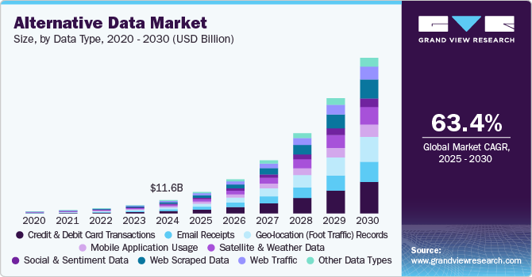

## Table of Contents

## What is alternative data in the context of weather?

Alternative data in the context of weather refers to information that comes from sources other than traditional weather stations and government agencies. This can include data from sensors on smartphones, satellite imagery, social media posts, and even data from connected devices like smart thermostats. These sources provide a different perspective on weather conditions and can help fill in gaps where traditional data might be missing or delayed.

Using alternative data can improve the accuracy and timeliness of weather forecasts. For example, if many people in a certain area are posting about heavy rain on social media, this can quickly tell meteorologists that a storm is happening, even if the nearest weather station hasn't reported it yet. This kind of real-time information can be very useful for making quick decisions, like warning people about dangerous weather conditions.

## How does weather alternative data differ from traditional weather data?

Weather alternative data comes from different places than traditional weather data. Traditional weather data is collected by weather stations and government agencies. These places use tools like thermometers, rain gauges, and wind sensors to measure things like temperature, rain, and wind speed. This data is usually very accurate but can take time to collect and report.

On the other hand, alternative data comes from sources like smartphones, satellites, and social media. For example, if lots of people are posting about a sudden storm on social media, that's alternative data. It can give a quick picture of what's happening right now, even if it's not as precise as traditional data. This kind of data can help fill in the gaps where traditional data might be missing or slow to arrive.

Using both types of data together can make weather forecasts better. Traditional data gives a solid, reliable base, while alternative data adds real-time information. This combination helps meteorologists understand the weather more quickly and accurately, which is important for keeping people safe and informed.

## What are the primary sources of weather alternative data?

The main sources of weather alternative data include smartphones, satellites, and social media. Smartphones have sensors that can measure things like temperature and humidity. When many people's phones report similar data from the same area, it can show what the weather is like there. Satellites take pictures of the Earth from space, which can show clouds, storms, and other weather patterns. This helps meteorologists see what's happening over large areas.

Social media is another big source of alternative data. When people post about the weather, like heavy rain or snow, it gives a quick idea of what's happening in different places. This can be especially useful in areas where there are no weather stations nearby. Companies and researchers can look at these posts to understand the weather in real-time.

Other sources include connected devices like smart thermostats and weather apps. These devices can send data about the weather inside and outside homes. Weather apps on smartphones can also collect data from users who agree to share it. All these sources together help create a fuller picture of the weather, making forecasts more accurate and timely.

## How can weather alternative data be used to improve weather forecasting?

Weather alternative data can make weather forecasts better by giving more information from different places. Traditional weather data comes from weather stations and government agencies, but it can take time to collect and report. Alternative data, like what people share on social media or what sensors on smartphones measure, can tell us what's happening right now. For example, if many people in an area are posting about a sudden storm, meteorologists can see that a storm is happening even if the nearest weather station hasn't reported it yet. This real-time information helps make quick decisions, like warning people about dangerous weather.

Using both traditional and alternative data together helps fill in gaps where traditional data might be missing. For instance, in places without weather stations, data from smartphones and social media can show what the weather is like. Satellites can also provide pictures of large areas, helping to see where storms are moving. By combining all these sources, meteorologists can get a fuller picture of the weather. This makes their forecasts more accurate and timely, which is important for keeping people safe and informed about the weather.

## What are the benefits of using weather alternative data for businesses?

Using weather alternative data can help businesses in many ways. For example, companies that deliver goods can use real-time weather information from smartphones and social media to plan their routes better. If they know about a sudden storm in an area, they can change their delivery plans to avoid delays. This can save them time and money, and make their customers happier because their orders arrive on time.

Also, businesses like farms and construction companies can use this data to make better decisions. Farmers can use weather information from satellites and connected devices to know when to plant or harvest their crops. Construction companies can plan their work around the weather, so they don't waste time and money working in bad conditions. By using weather alternative data, these businesses can work more efficiently and be more successful.

## What are the challenges and limitations of using weather alternative data?

Using weather alternative data can be tricky because it's not always as accurate as traditional data. For example, when people post about the weather on social media, they might not be very precise. They might say it's raining when it's just a light drizzle, or they might not mention the wind at all. Also, not everyone has a smartphone or uses social media, so the data might not cover all areas equally. This can make it hard to trust the information and use it to make good decisions.

Another challenge is that alternative data can be hard to manage and analyze. There's a lot of it, and it comes from many different places. Companies need special tools and skills to sort through all this data and make sense of it. It can take a lot of time and money to set up systems that can handle this kind of information. Even then, there's always a chance that the data might be wrong or outdated, which can lead to mistakes in planning and decision-making.

## How is weather alternative data collected and processed?

Weather alternative data is collected from many different places like smartphones, satellites, and social media. Smartphones have sensors that can measure things like temperature and humidity. When lots of people's phones in the same area report similar data, it can show what the weather is like there. Satellites take pictures of the Earth from space, which can show clouds, storms, and other weather patterns. On social media, people post about the weather, like heavy rain or snow, which gives a quick idea of what's happening in different places. All these sources together help create a fuller picture of the weather.

Once the data is collected, it needs to be processed to be useful. This means using special tools and computers to sort through all the information and make sense of it. For example, if many people are posting about a storm on social media, the system can figure out where the storm is and how big it is. This data is then combined with traditional weather data to make better forecasts. It can take a lot of time and money to set up these systems, but they help meteorologists understand the weather more quickly and accurately.

## Can you provide examples of successful applications of weather alternative data?

One successful use of weather alternative data is by companies like Uber and Lyft. They use real-time weather information from smartphones and social media to plan their rides better. If there's a sudden storm in an area, they can change their routes to avoid it. This helps them pick up and drop off passengers faster, making their service better and keeping their drivers and riders safe.

Another example is how farmers use weather alternative data. They can use information from satellites and connected devices to know when to plant or harvest their crops. If the data shows that rain is coming soon, they can plan their work around it. This helps them grow more food and make more money because they're not caught off guard by bad weather.

Also, weather apps like Dark Sky use alternative data to give very accurate, real-time weather updates. They collect data from many smartphones and combine it with traditional weather data. This lets them tell users about rain or snow just minutes before it happens. People can use this information to plan their day better, like deciding when to go outside or if they need to carry an umbrella.

## What technologies are used to analyze weather alternative data?

To analyze weather alternative data, special computer programs and tools are used. These tools can look at lots of information from smartphones, satellites, and social media all at once. They sort through this data to find patterns and make sense of it. For example, if many people are posting about a storm on social media, the program can figure out where the storm is and how big it is. This helps meteorologists understand the weather better and make more accurate forecasts.

Another important technology is machine learning. This is a type of computer program that can learn from the data it sees. It can get better at understanding weather patterns over time. For instance, machine learning can look at pictures from satellites and learn to spot clouds and storms. It can also read social media posts and figure out if people are talking about rain or snow. By using machine learning, companies and researchers can make better use of weather alternative data to help people plan their days and stay safe.

## How does weather alternative data contribute to climate change research?

Weather alternative data helps climate change research by giving scientists more information about what's happening with the weather all over the world. Traditional weather data comes from weather stations, but these stations are not everywhere. Alternative data, like what people share on social media or what sensors on smartphones measure, can fill in the gaps. For example, if many people in a certain area are posting about heavy rain or unusual heat, scientists can use this information to understand how the climate is changing in places where there are no weather stations.

This kind of data also helps scientists see patterns and changes over time. By looking at lots of information from smartphones, satellites, and social media, researchers can learn more about how the weather is changing and why. This can help them predict future climate changes better. For instance, if satellite pictures show that storms are getting bigger and more frequent in certain areas, scientists can use this to study how climate change might be affecting those places. Using alternative data alongside traditional data gives a fuller picture of the climate, which is important for understanding and fighting climate change.

## What are the ethical considerations when using weather alternative data?

When using weather alternative data, it's important to think about privacy. This data often comes from people's smartphones and social media posts. Companies need to make sure they are not using personal information in a way that could harm or upset people. They should ask for permission before using someone's data and be clear about how it will be used. If they don't do this, people might feel their privacy is being invaded, which can lead to trust issues.

Another ethical concern is making sure the data is used fairly. Not everyone has a smartphone or uses social media, so the data might not represent all people equally. This can lead to decisions that only help some groups and leave others out. Companies and researchers need to be careful to use the data in a way that benefits everyone, not just those who are more likely to share their information. By thinking about these ethical issues, we can use weather alternative data in a way that is good for everyone.

## What future trends can we expect in the field of weather alternative data?

In the future, we can expect more and more people to use weather alternative data. As more people use smartphones and social media, there will be even more information to collect. This will help make weather forecasts even better and more accurate. Companies might also start using new kinds of sensors, like those in cars or on drones, to gather even more data. This will give us a fuller picture of the weather and help us understand it better.

Another trend we might see is the use of artificial intelligence (AI) to make sense of all this data. AI can learn from the information it sees and get better at understanding weather patterns over time. This could help us predict the weather more accurately and even help with climate change research. By using AI, we can make the most of all the weather alternative data we collect and use it to help people plan their lives better and stay safe.

## References & Further Reading

[1]: Bergstra, J., Bardenet, R., Bengio, Y., & Kégl, B. (2011). ["Algorithms for Hyper-Parameter Optimization."](https://papers.nips.cc/paper/4443-algorithms-for-hyper-parameter-optimization) Advances in Neural Information Processing Systems 24.

[2]: ["Advances in Financial Machine Learning"](https://www.amazon.com/Advances-Financial-Machine-Learning-Marcos/dp/1119482089) by Marcos Lopez de Prado

[3]: ["Evidence-Based Technical Analysis: Applying the Scientific Method and Statistical Inference to Trading Signals"](https://www.amazon.com/Evidence-Based-Technical-Analysis-Scientific-Statistical/dp/0470008741) by David Aronson

[4]: ["Machine Learning for Algorithmic Trading"](https://github.com/stefan-jansen/machine-learning-for-trading) by Stefan Jansen

[5]: ["Quantitative Trading: How to Build Your Own Algorithmic Trading Business"](https://books.google.com/books/about/Quantitative_Trading.html?id=j70yEAAAQBAJ) by Ernest P. Chan