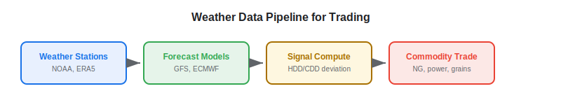
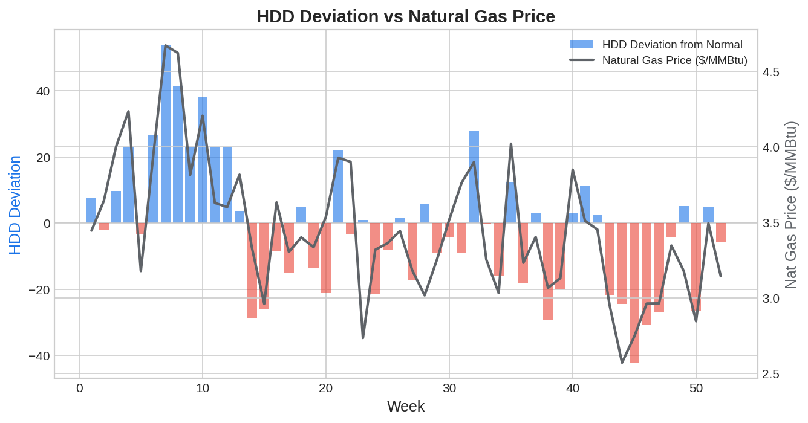

Weather data is one of the oldest and most established forms of [alternative data](https://paperswithbacktest.com/wiki/best-alternative-data) in trading. Temperature, precipitation, wind speed, and extreme weather events directly impact commodity prices, energy demand, agricultural yields, and retail sales. For algo traders, the advantage lies in systematically processing weather forecasts and observations into quantitative signals — faster and more consistently than discretionary traders who read weather reports.

## What Is Weather Data in Trading?

Weather data for trading encompasses observational records (historical temperature, rainfall, snowfall), forecast models (numerical weather prediction outputs), reanalysis datasets (ERA5, MERRA-2), satellite-derived climate indicators, and extreme event databases (hurricanes, droughts, floods).

The trading thesis varies by asset class. For energy, temperature drives heating and cooling demand — a colder-than-expected winter in the US Northeast spikes natural gas prices. For agriculture, rainfall and temperature during growing seasons determine crop yields, directly affecting grain and soft commodity futures. For retail, weather affects [foot traffic](https://paperswithbacktest.com/wiki/geolocation-foot-traffic-trading) and seasonal purchasing patterns.

## Core Use Cases

### Energy Trading

Natural gas and electricity prices are highly weather-sensitive. The key metric is Heating Degree Days (HDD) and Cooling Degree Days (CDD):

$$HDD = \max(0, 65°F - T_{avg})$$
$$CDD = \max(0, T_{avg} - 65°F)$$

Where $T_{avg}$ is the daily average temperature. Cumulative HDD/CDD deviations from seasonal norms predict natural gas storage draws and power demand.

### Agricultural Commodities

Crop yields depend on growing-season weather. Key signals include cumulative rainfall during planting and growing seasons, temperature stress days (days above crop-specific thresholds), drought indices (Palmer Drought Severity Index, SPI), and growing degree days (GDD) accumulated over the season.

These weather variables feed into crop yield models that predict USDA report outcomes — a direct complement to [satellite-derived NDVI](https://paperswithbacktest.com/wiki/satellite-imagery-trading).

### Retail and Consumer

Extreme cold boosts sales of winter apparel and heating supplies. Extreme heat drives beverage and ice cream sales. Unseasonable weather can disrupt retail forecasts — a warm December hurts winter clothing retailers.



## Key Weather Data Sources

| Source | Coverage | Resolution | Cost |
|---|---|---|---|
| NOAA (NCEI) | US + global | Station-level, hourly | Free |
| ERA5 (ECMWF) | Global reanalysis | 0.25° grid, hourly | Free |
| GFS / ECMWF Forecasts | Global forecasts | 0.25°–0.5° grid | Free (GFS) / paid (ECMWF) |
| Weather Company (IBM) | Global, enhanced | Sub-km, 15-min | $50K–$500K/year |
| DTN | Agriculture-focused | US farm-level | $20K–$100K/year |
| Maxar Weather | Premium forecasts | Global, sub-hourly | $50K–$200K/year |

For algo traders, NOAA and ERA5 data are freely available and sufficient for most commodity strategies.

## Python Implementation: HDD/CDD Trading Signal

```python
import numpy as np
import pandas as pd

def compute_hdd_cdd(temp_f: pd.Series, base: float = 65.0) -> tuple:
    """Compute Heating and Cooling Degree Days from Fahrenheit temps."""
    hdd = np.maximum(0, base - temp_f)
    cdd = np.maximum(0, temp_f - base)
    return hdd, cdd

def weather_energy_signal(
    daily_temps: pd.DataFrame,
    region: str,
    lookback_days: int = 14
) -> dict:
    """
    Compute energy trading signal from temperature deviations.
    
    Parameters:
    - daily_temps: DataFrame [date, region, temp_avg_f, temp_normal_f]
    - region: Geographic region to analyze
    - lookback_days: Recent period for signal
    """
    df = daily_temps[daily_temps["region"] == region].sort_values("date")
    recent = df.tail(lookback_days)
    
    # Compute actual vs normal HDD/CDD
    actual_hdd, actual_cdd = compute_hdd_cdd(recent["temp_avg_f"])
    normal_hdd, normal_cdd = compute_hdd_cdd(recent["temp_normal_f"])
    
    hdd_deviation = actual_hdd.sum() - normal_hdd.sum()
    cdd_deviation = actual_cdd.sum() - normal_cdd.sum()
    
    # Colder than normal → bullish nat gas; hotter → bullish power
    nat_gas_signal = "BULLISH" if hdd_deviation > 20 else "BEARISH" if hdd_deviation < -20 else "NEUTRAL"
    power_signal = "BULLISH" if cdd_deviation > 15 else "BEARISH" if cdd_deviation < -15 else "NEUTRAL"
    
    return {
        "region": region,
        "period": f"{lookback_days} days",
        "hdd_deviation": f"{hdd_deviation:+.1f}",
        "cdd_deviation": f"{cdd_deviation:+.1f}",
        "nat_gas_signal": nat_gas_signal,
        "power_signal": power_signal,
    }

# Simulated winter temperature data (Northeast US)
np.random.seed(42)
dates = pd.date_range("2025-12-01", periods=30, freq="D")
data = pd.DataFrame({
    "date": dates, "region": "NE_US",
    "temp_avg_f": np.random.normal(28, 8, 30),  # Cold winter
    "temp_normal_f": np.full(30, 35),            # Normal is 35°F
})

result = weather_energy_signal(data, "NE_US")
for k, v in result.items():
    print(f"  {k}: {v}")
```



## Limitations and Risks

**Forecast uncertainty**: Weather forecasts degrade rapidly beyond 7–10 days. Trading on 14-day forecasts carries substantial model risk.

**Priced-in effect**: Major weather events (hurricanes, polar vortex) are often priced into commodities within hours of forecast updates. The alpha is in the early forecast interpretation, not the event itself.

**Climate non-stationarity**: Historical weather patterns may not predict future conditions as climate change shifts baselines. Long-horizon models need climate adjustment.

## Conclusion

Weather data is a proven, high-signal alternative data source for commodity and energy trading. The key advantage for algo traders is systematic, automated processing of weather forecasts and observations — computing HDD/CDD deviations, crop stress indices, and extreme event probabilities faster than the market can absorb the information.

---

**Explore further on PapersWithBacktest:**
- Browse [backtested commodity strategies](https://paperswithbacktest.com/strategies) with Python code and performance metrics
- Access [clean historical market data](https://paperswithbacktest.com/datasets) for equities, crypto, and futures
- Take the [algo trading course](https://paperswithbacktest.com/course) — 60+ video lessons and notebooks
- Related wiki pages: [Satellite Imagery for Trading](https://paperswithbacktest.com/wiki/satellite-imagery-trading) · [Best Alternative Data Sources](https://paperswithbacktest.com/wiki/best-alternative-data)
