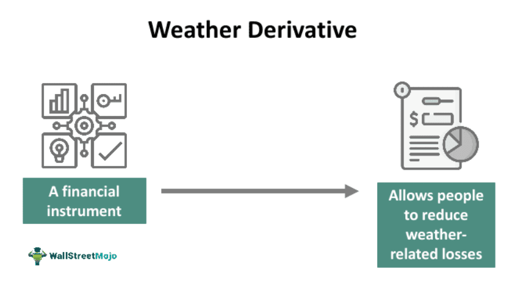

The financial landscape is continuously undergoing transformation, bringing into play a variety of advanced instruments and methodologies aimed at enhancing risk management strategies. Among these innovative tools, weather derivatives and algorithmic trading have emerged as prominent mechanisms with significant potential for managing risk. Weather derivatives are financial contracts that provide payouts based on specific weather indices, such as temperature or rainfall variations. Primarily utilized by industries like agriculture and energy, these derivatives offer protection against financial losses caused by adverse weather conditions. Unlike traditional insurance, which covers catastrophic weather events, weather derivatives address high-probability, non-catastrophic occurrences, thereby offering a different layer of risk management.

Algorithmic trading, on the other hand, represents the use of computer algorithms to execute trading orders at speeds and precisions unattainable by human traders. By leveraging pre-defined strategies, algorithmic trading systems can process large volumes of data, enabling precise and timely trading decisions. This approach significantly curtails the risk of human error in trading processes, particularly in volatile market environments.

The intersection of these two mechanisms can profoundly enhance risk management strategies across various industries. For instance, in sectors like agriculture, energy, and finance—which are susceptible to the uncertainties of weather and market volatility—weather derivatives, combined with the analytical prowess of algorithmic trading, offer a robust framework for anticipating and managing potential disruptions. By integrating these tools, industries can develop comprehensive strategies to navigate the complexities and uncertainties inherent in today's financial markets.

## Table of Contents

## Overview of Financial Instruments in Risk Management

Financial instruments are pivotal for companies aiming to shield themselves from market unpredictability. These tools play a critical role in risk management by enabling businesses to hedge against potential losses associated with fluctuating market conditions. Traditionally, risk management has relied on options and futures, which are contracts allowing the buying or selling of an asset at a predetermined price either at or before a specified date. These traditional instruments provide a level of security by setting prices beforehand, which can be beneficial amidst market volatility.

Options give holders the right, but not the obligation, to buy or sell an asset, typically a stock, at an agreed-upon price before the option expires. Futures, on the other hand, bind both the buyer and seller to execute the transaction at the specified future date and price, making them a bit more rigid but effective as a hedging mechanism.

Beyond these traditional contracts, companies are increasingly turning to more sophisticated derivatives, including swaps, forward contracts, and the like. Derivatives derive their value from the performance of an underlying entity, such as an asset, [interest rate](/wiki/interest-rate-trading-strategies), or index, allowing investors to hedge against risks without necessarily owning the asset.

With the rapid advancement of technology, innovative instruments like weather derivatives and [algorithmic trading](/wiki/algorithmic-trading) are gaining prominence. Weather derivatives, for example, are contracts that provide payouts based on weather indices, helping industries such as agriculture and energy manage risks associated with adverse weather conditions. Unlike traditional insurance, they cover high-probability, non-catastrophic events, offering businesses a more flexible tool for financial risk management.

Algorithmic trading is another innovative instrument that leverages computer algorithms to execute trades according to predetermined criteria. This method enhances trading efficiency by executing trades at optimal times and prices while significantly reducing human error. Algorithmic trading can handle vast amounts of data to make informed decisions quickly, proving invaluable in volatile markets where rapid response times are essential.

The rise of weather derivatives and algorithmic trading is indicative of the broader shift towards integrating technology into financial risk management strategies. These instruments provide companies with advanced tools to forecast financial outcomes more accurately and mitigate risks effectively. As technological capabilities continue to evolve, these and other innovative financial instruments will likely play an even more significant role in helping businesses navigate the complexities of modern financial markets.

## Understanding Weather Derivatives

Weather derivatives are specialized financial instruments used to manage risk associated with unpredictable weather conditions. These contracts provide payouts based on specific weather indices, such as temperature, rainfall, or snowfall, rather than the underlying commodities themselves. Companies that are heavily dependent on weather conditions, like those in the agriculture and energy sectors, utilize these derivatives to hedge against financial losses stemming from unfavorable weather events.

Unlike traditional insurance, which compensates for catastrophic events, weather derivatives target non-catastrophic, high-probability weather variations. This distinction makes them particularly useful for mitigating risks from weather phenomena that are frequent and expected but can still have significant economic impacts. For example, a cooler-than-average summer could affect demand for energy or agricultural products, leading to potential financial losses that a weather derivative could offset.

Weather derivatives are available both over-the-counter (OTC) and through organized exchanges like the Chicago Mercantile Exchange (CME). In OTC markets, contracts are tailored to the specific needs of the buyers and sellers, resulting in diverse and customizable solutions. On exchanges like the CME, weather derivatives follow standardized formats, enabling greater [liquidity](/wiki/liquidity-risk-premium) and accessibility for a broader range of market participants.

The mechanics of weather derivatives involve the specification of weather indices and thresholds. For example, a heating degree day (HDD) contract would specify a payout if the average temperature falls below a certain threshold over a designated period. The formula for calculating HDD is:

$$
\text{HDD} = \max(0, T_{base} - T_{mean})
$$

where $T_{base}$ is the base temperature (commonly 65°F in the U.S.), and $T_{mean}$ is the average daily temperature. The resulting number indicates the energy required to heat a building, guiding utility companies in financial adjustments.

The integration of weather data analytics and financial modeling in weather derivatives offers powerful risk management tools for businesses. By aligning financial interests with weather patterns, companies can stabilize their revenues despite climatic uncertainties, leading to enhanced operational and strategic capabilities.

## Algorithmic Trading in Risk Management

Algorithmic trading, also known as algo trading, employs automated systems to execute trades in financial markets based on predefined strategies. This approach leverages computer algorithms to make rapid trading decisions, minimizing the possibility of human error. By automating the trading process, algorithmic trading enables the execution of trades with increased speed and precision. 

One of the most significant advantages of algorithmic trading is its ability to manage risks in volatile markets. Volatility can result in rapid price changes that are difficult for human traders to respond to quickly. Algorithmic trading systems, however, can process vast amounts of market data in milliseconds, enabling them to react almost instantaneously to market fluctuations. This speed and accuracy help mitigate the risks associated with price [volatility](/wiki/volatility-trading-strategies). 

Furthermore, algorithmic trading provides a systematic approach to trading by utilizing complex mathematical models and statistical analysis. These models often involve the use of quantitative techniques to identify market trends and predict future price movements. For example, a basic algorithm might be programmed to execute a buy order when a stock's price falls below its moving average and sell when it rises above the moving average. This systematic approach allows for consistent execution of trading strategies, reducing the likelihood of errors caused by emotional decision-making. 

Algorithmic trading strategies can also incorporate [machine learning](/wiki/machine-learning) and [artificial intelligence](/wiki/ai-artificial-intelligence) to enhance decision-making processes. These technologies enable algorithms to learn from historical data and improve their predictions over time, leading to more informed trading decisions.

In practice, algorithmic trading strategies can handle large volumes of data to identify opportunities and risks that may not be immediately apparent to human traders. This capability is crucial in today's data-driven financial environment, where vast amounts of information are continuously generated and need to be processed. Python, widely used in financial technology, provides powerful libraries such as NumPy and Pandas for data analysis, making it a popular choice for developing algorithmic trading systems.

Algorithmic trading has transformed the landscape of risk management in financial markets. By utilizing advanced mathematical models and automated systems, it offers a means to manage risks more effectively and capitalize on market opportunities with greater efficiency. As technology continues to evolve, the role of algorithmic trading in risk management is likely to become increasingly significant.

## The Role of Weather Derivatives and Algo Trading Combined

Integrating weather derivatives with algorithmic trading offers enhanced precision and efficiency in risk mitigation strategies. Weather derivatives provide financial coverage against specific weather conditions, such as temperature or rainfall variations, which directly impact sectors like agriculture, energy, and tourism. When combined with algorithmic trading, which automates and optimizes trading decisions based on a massive array of data inputs, these tools significantly improve the capacity to predict financial outcomes tied to weather events.

Algorithmic trading systems can be designed to swiftly analyze weather forecasts, market data, and historical trends to make informed trading decisions. For instance, an energy company might face fluctuating demand based on predicted weather changes. By utilizing algorithmic trading strategies, the company could dynamically adjust its energy purchasing or selling decisions, aligning supply with expected demand patterns. This automated precision enables companies to capitalize on market opportunities while minimizing potential losses due to adverse weather impacts.

Consider the example of an energy company facing an unusually cold winter forecast, which might increase the demand for heating. An algorithmic trading system could instantaneously analyze the forecast and historical consumption patterns to buy energy contracts at optimal times, ensuring sufficient supply while controlling costs. As a result, companies employing these strategies can react faster than their competitors, maintaining stability in an unpredictable climate.

Moreover, this integration facilitates the development of robust risk management frameworks. By synthesizing predictive analytics from weather derivatives with the high-speed execution capabilities of algorithmic trading, businesses can design strategies that anticipate weather-related risks and respond to them effectively. This holistic approach not only safeguards against potential financial losses but also enhances overall operational resilience in volatile climates.

In conclusion, the synergy of weather derivatives and algorithmic trading exemplifies how modern financial tools can transcend traditional risk management boundaries. As technology continues to advance, these combined tools will become increasingly instrumental in navigating the complexities of weather-dependent economic environments.

## Case Studies and Applications

Agricultural firms have increasingly turned to weather derivatives to maintain stable revenue streams in the face of unpredictable weather. These financial instruments offer a mechanism to hedge against adverse weather conditions without the need to rely solely on conventional insurance methods. For example, a company operating in the agricultural sector can utilize weather derivatives to protect against temperature fluctuations that could negatively impact crop yield. If the temperature exceeds a certain threshold, triggering the derivative contract, the firm receives a payout that compensates for potential losses, thereby ensuring financial stability.

In the energy sector, algorithmic trading serves as a crucial tool for managing financial risk associated with climate variability. Energy companies use sophisticated algorithms to analyze vast datasets, which include weather forecasts, to make informed trading decisions. By anticipating changes in supply and demand due to forecasted climate conditions, these companies can adjust their trading strategies in real-time. For instance, an algorithm might identify a trend of decreasing temperatures, which typically leads to increased energy consumption. Consequently, the firm might decide to buy additional energy futures to balance the anticipated rise in demand, thus optimizing their market position.

The tourism industry also benefits from the integration of weather derivatives and algorithmic trading. Tourism businesses are often sensitive to seasonal weather changes, which can significantly affect tourist numbers and revenue. By employing weather derivatives, these businesses can manage the financial risks posed by these seasonal variations. A ski resort, for example, might use weather derivatives to guard against a warm winter with insufficient snowfall, securing a financial payout that offsets lower-than-expected visitor numbers. Additionally, algorithmic trading can help tourism companies optimize their resource allocation and pricing strategies based on predictive weather models, ensuring they remain competitive and financially viable even in less favorable conditions.

These case studies underscore the practical applications and tangible benefits of weather derivatives and algorithmic trading. By leveraging these financial tools, companies across diverse sectors can not only protect their revenue against weather-related risks but also enhance their strategic decision-making capabilities. This synergy allows businesses to attain greater financial resilience and adaptability in the face of environmental uncertainties.

## Future Trends and Emerging Opportunities

As climate change progresses, resulting in more unpredictable weather patterns, the importance of weather derivatives is expected to grow significantly. Industries that are highly sensitive to weather fluctuations, such as agriculture, energy, and tourism, will increasingly rely on these financial instruments to stabilize revenues and manage risks associated with changing weather conditions. This trend will drive the development of more nuanced and tailored weather derivative products to cater to the unique needs of different sectors.

Simultaneously, advancements in artificial intelligence (AI) and machine learning are pushing the boundaries of algorithmic trading capabilities. These technologies enable the processing of massive datasets to identify patterns and make predictions with a level of precision unattainable through traditional methods. For instance, machine learning algorithms can analyze historical weather data, current forecasts, and market conditions to make real-time trading decisions that optimize a portfolio's risk-return profile.

The integration of these two areas—weather derivatives and algorithmic trading—into financial markets is likely to increase. This integration will enhance risk management practices by allowing for dynamic adjustments to trading strategies based on real-time weather data and forecasts. Traders will be able to leverage predictive analytics to anticipate market movements and mitigate risks more effectively. For example, Python libraries such as SciKit-Learn and TensorFlow can be employed to develop sophisticated predictive models that assess the impact of weather patterns on commodity prices.

Furthermore, the future promises the development of even more advanced tools that harness big data for predictive analysis. As data collection technologies improve and computational power increases, financial markets can expect to see tools that provide even greater accuracy in forecasting and decision-making. The advent of quantum computing may further revolutionize this field by enabling the processing of complex risk scenarios at unprecedented speeds.

In conclusion, the convergence of weather derivatives with cutting-edge technologies like AI and machine learning is poised to transform risk management strategies in the financial sector, providing a buffer against the uncertainties of climate change and volatile markets. As these trends continue, the potential for innovation and enhanced market efficiencies grows, positioning companies to better navigate the challenges of an uncertain future.

## Conclusion

Managing financial risks effectively necessitates the adoption of diverse and innovative financial instruments that address specific types of risk. Weather derivatives and algorithmic trading are two such tools that offer significant benefits in managing uncertainties, particularly in volatile sectors like agriculture, energy, and finance.

Weather derivatives provide companies with the ability to hedge against risks associated with adverse weather conditions. By offering payouts based on weather indices, these instruments allow businesses to stabilize revenues and manage potential losses proactively. Unlike traditional insurance, which typically covers only catastrophic events, weather derivatives cater to high-probability, non-catastrophic occurrences, providing a more comprehensive risk management strategy.

Algorithmic trading complements this by leveraging computerized systems to execute trades with greater precision and speed. By reducing human error and managing large volumes of data, algorithms enable companies to respond quickly to market changes. This systematic approach is particularly effective in volatile markets, where rapid decision-making is crucial.

The integration of weather derivatives and algorithmic trading within risk management strategies enhances a company's ability to predict and react to financial outcomes. For instance, an energy company can use algorithms to adjust trading strategies based on weather forecasts, optimizing supply and demand operations and minimizing potential financial impacts.

Continued advancements in these tools promise to drive market efficiencies and resilience. With the growing influence of climate change and the acceleration of technological innovations such as artificial intelligence and machine learning, weather derivatives and algorithmic trading are set to play increasingly central roles.

Embracing these instruments not only prepares companies for existing challenges but also positions them to capitalize on emerging opportunities. As financial markets evolve, the strategic application of weather derivatives and algo trading will be instrumental in safeguarding against uncertainties and fostering sustainable economic growth.

## References & Further Reading

[1]: Dischel, R. S. (Editor). (2002). ["Climate Risk and the Weather Market: Financial Risk Management with Weather Hedges"](https://www.semanticscholar.org/paper/Climate-Risk-and-the-Weather-Market%3A-Financial-Risk-Dischel/f8cd52bc445c7ff845f3119b80b8d4b5023c533b). CRC Press.

[2]: Jewson, S., Brix, A., & Ziehmann, C. (2005). ["Weather Derivative Valuation: The Meteorological, Statistical, Financial and Mathematical Foundations"](https://www.semanticscholar.org/paper/Weather-Derivative-Valuation%3A-The-Meteorological%2C-Jewson-Brix/d5a35ba58867aae2544063ab47f8a88a10abfec6). Cambridge University Press.

[3]: López de Prado, Marcos. (2018). ["Advances in Financial Machine Learning"](https://www.amazon.com/Advances-Financial-Machine-Learning-Marcos/dp/1119482089). John Wiley & Sons.

[4]: Chan, Ernest P. (2009). ["Quantitative Trading: How to Build Your Own Algorithmic Trading Business"](https://github.com/ftvision/quant_trading_echan_book). John Wiley & Sons.

[5]: Hull, John C. (2012). ["Options, Futures, and Other Derivatives"](https://www.scribd.com/document/375769211/John-C-Hull-Options-futures-and-other-derivatives-Pearson-Education-Limited-2012-pdf). Pearson.