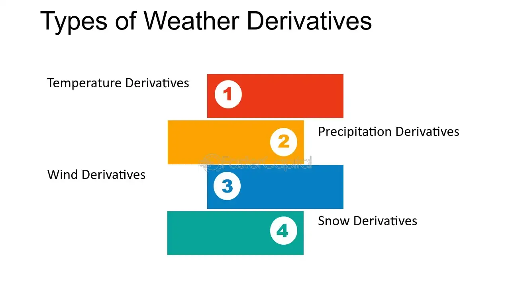

## Table of Contents

## What are weather derivatives?

Weather derivatives are financial instruments that help businesses manage risks related to weather conditions. They work like insurance, but instead of paying out when something bad happens, they pay based on specific weather events, like how much it rains or how hot it gets. Companies like farms, ski resorts, and energy providers use them to protect against losing money because of unexpected weather changes.

For example, a farmer might buy a weather derivative to cover losses if there's too little rain during the growing season. If it doesn't rain enough, the derivative pays the farmer money to help cover the costs. This way, the farmer can plan better and not worry as much about the weather ruining their crops. Weather derivatives are traded on special markets, just like stocks or other financial products.

## How do weather derivatives function as financial instruments?

Weather derivatives are like special contracts that businesses can buy to protect themselves from bad weather. They work by setting specific weather conditions, like temperature or rainfall, that trigger a payment if they happen. For example, if a company buys a derivative that pays out if it rains more than 10 inches in a month, and it actually rains 12 inches, the company gets money to help cover any losses caused by the extra rain.

These derivatives are traded on special markets, similar to how stocks are traded. Companies can buy them to reduce the risk of losing money because of the weather. It's like buying insurance, but instead of paying for damage after it happens, the payment depends on the weather reaching certain levels. This helps businesses plan better and not worry as much about the weather messing up their plans.

## What are the main types of weather derivatives?

Weather derivatives come in different forms, but the main types are temperature-based and precipitation-based derivatives. Temperature-based derivatives, like heating degree days (HDD) and cooling degree days (CDD), are used to manage risks related to how hot or cold it gets. For example, a company might use HDD derivatives to protect against colder-than-expected winters that could increase heating costs. On the other hand, CDD derivatives help with warmer-than-expected summers that might increase cooling costs.

Precipitation-based derivatives focus on how much it rains or snows. These are important for businesses like farms or event organizers that can be affected by too much or too little rain. For instance, a farmer might buy a derivative that pays out if there's less rain than expected during the growing season, helping to cover losses from a dry spell. These derivatives allow businesses to plan better and manage the financial risks that come with unpredictable weather.

## Can you explain the difference between weather options and weather futures?

Weather options and weather futures are both types of weather derivatives, but they work a bit differently. A weather option gives the buyer the right, but not the obligation, to get paid if certain weather conditions happen. For example, if you buy an option that pays out if it rains more than 10 inches in a month, you can choose to use it if it actually rains that much, or you can just let it go if it doesn't. This means you only have to pay for the option upfront, and you might get money back if the weather hits the right mark.

On the other hand, a weather future is a bit more straightforward. When you buy a weather future, you agree to get paid based on the weather conditions, no matter what. For instance, if you buy a future that pays out based on the average temperature in a month, you'll get money whether it's hot or cold, depending on how the contract is set up. Futures are usually traded on special markets, and they can help businesses plan better because they know they'll get paid one way or another.

## What are some common weather indices used in weather derivatives?

Weather derivatives use special weather indices to decide when to pay out money. Some common ones are heating degree days (HDD) and cooling degree days (CDD). HDD measures how cold it gets compared to a comfy 65 degrees Fahrenheit. If it's colder than that, the difference is added up over time. This helps businesses like energy companies plan for higher heating costs in winter. CDD works the same way but for hot weather. It adds up the difference when it's warmer than 65 degrees, which can help with planning for cooling costs in summer.

Another common index is cumulative rainfall, which just adds up how much it rains over a certain time. This is really useful for farmers who need enough rain for their crops, or for event organizers who don't want too much rain spoiling their plans. There's also cumulative snowfall, which adds up how much snow falls. This can be important for ski resorts that need enough snow to stay open, or for cities that need to plan for snow removal costs. These indices help businesses manage the risks that come with unpredictable weather.

## How are weather derivatives priced?

Weather derivatives are priced based on how likely certain weather conditions are to happen. People who study weather patterns and data use special math models to figure out these chances. They look at past weather data and current weather forecasts to guess what might happen in the future. The more likely a weather event is, the more it will cost to buy a derivative that pays out if that event happens. For example, if it's usually very rainy in a certain month, a derivative that pays out if it rains a lot that month will be more expensive.

The price also depends on how much money the derivative will pay if the weather event happens. If a derivative pays out a lot of money, it will cost more to buy. This is because the person selling the derivative is taking on more risk. So, the price of a weather derivative is a mix of how likely the weather event is and how much money is at stake. This helps make sure that both the buyer and the seller feel like the price is fair based on the risks they're taking.

## What are the typical uses of weather derivatives for businesses?

Businesses use weather derivatives to protect themselves from losing money because of bad weather. For example, a farm might buy a derivative to get money if it doesn't rain enough during the growing season. This helps the farm cover the cost of the crops not growing well. Energy companies also use weather derivatives. They can buy them to help pay for higher heating or cooling costs if the weather gets really cold or hot. This way, they can plan better and not worry as much about unexpected weather changes.

Event organizers and ski resorts also find weather derivatives useful. An event organizer might buy a derivative to get money if it rains too much on the day of their event. This helps them cover the costs if fewer people come because of the rain. Ski resorts use derivatives to protect against not having enough snow. If it doesn't snow enough, the derivative can pay them money to help with lost business. By using weather derivatives, these businesses can manage the risks that come with unpredictable weather and keep their plans on track.

## Can individuals use weather derivatives, and if so, how?

Yes, individuals can use weather derivatives, but it's not as common as businesses using them. If you're someone who might lose money because of the weather, like if you're planning a big outdoor event or you own a small farm, you might want to buy a weather derivative. For example, if you're planning a wedding outside and you're worried about rain ruining it, you could buy a derivative that pays you money if it rains a lot on your wedding day. This way, you can use that money to help cover the costs if the rain messes up your plans.

To use weather derivatives, you would need to work with a special market or a broker who deals with these kinds of financial products. It's not something you can just buy at a regular bank or store. You'd have to do some research to find the right place to buy them, and you might need to understand a bit about how they work and how much they cost. It's like buying insurance, but instead of paying for damage after it happens, you get money based on the weather reaching certain levels. So, while individuals can use weather derivatives, it's a bit more complicated and might need some help from experts.

## What are some historical examples of weather derivatives being used?

One of the first big uses of weather derivatives happened in 1997 when a company called Aquila Energy bought a weather derivative from another company called Enron. They did this to protect themselves from losing money if the weather got too cold or too hot. This was a big deal because it showed that businesses could use these new financial tools to manage the risks that come with unpredictable weather. After that, more and more companies started using weather derivatives to help them plan better and not worry as much about the weather messing up their plans.

Another good example is from 2003 when the city of Chicago used a weather derivative to protect against a really hot summer. They bought a derivative that would pay them money if the summer was hotter than usual. This helped them cover the extra costs of running cooling centers and other services to help people stay cool. It showed that even cities and governments could use weather derivatives to manage the financial risks that come with bad weather. Since then, weather derivatives have become more common and are used by all sorts of businesses and organizations to help them deal with the ups and downs of the weather.

## How do weather derivatives help in managing risk?

Weather derivatives help businesses manage risk by letting them protect against money losses caused by bad weather. For example, a farmer might buy a weather derivative that pays out if there's not enough rain during the growing season. If it doesn't rain enough, the farmer gets money from the derivative to help cover the cost of the crops not growing well. This way, the farmer doesn't have to worry as much about losing money because of the weather. It's like buying insurance, but instead of paying for damage after it happens, the payment depends on the weather reaching certain levels.

Energy companies also use weather derivatives to manage the risk of higher heating or cooling costs. If the weather gets really cold or hot, these companies might have to spend more money to keep people's homes warm or cool. By buying a weather derivative, they can get money to help cover these extra costs. This helps them plan better and not worry as much about unexpected weather changes messing up their plans. Weather derivatives give businesses a way to manage the financial risks that come with unpredictable weather, making it easier for them to stay on track.

## What are the challenges and limitations of using weather derivatives?

Using weather derivatives can be tricky because they're based on weather forecasts and past data, which aren't always right. If the weather doesn't turn out the way people thought it would, the derivative might not pay out when you need it. This can make it hard for businesses to plan and can leave them with unexpected costs. Also, weather derivatives can be expensive, and not all businesses can afford them. The cost depends on how likely the weather event is and how much money the derivative will pay if it happens. This means some businesses might find it too pricey to use weather derivatives to manage their risks.

Another challenge is that weather derivatives are complicated financial products. You need to understand how they work and how to buy them, which can be tough for some people. They're not something you can just pick up at a regular bank or store. You have to work with special markets or brokers who deal with these kinds of products. This can make it harder for small businesses or individuals to use them. Plus, the markets for weather derivatives can be small and not very liquid, which means it might be hard to find someone to buy or sell them to when you need to. All these things can make it challenging to use weather derivatives effectively to manage weather-related risks.

## What future trends can we expect in the weather derivatives market?

In the future, we might see more people and businesses using weather derivatives as they become more popular. As more people learn about them and how they can help manage the risks of bad weather, the market for weather derivatives could grow bigger. This means more types of weather derivatives might be created, like ones based on wind or humidity, not just temperature and rain. Also, with better technology and more accurate weather forecasts, weather derivatives could become more useful and easier to use for everyone.

Another trend we might see is weather derivatives being used in new ways. For example, cities and governments might use them more to help plan for things like snow removal or heat waves. With climate change making the weather more unpredictable, weather derivatives could become even more important for managing the risks that come with it. As the market grows, it might also become easier for small businesses and even individuals to buy weather derivatives, making them a common tool for managing weather-related risks.

## What are Weather Derivatives and How Do They Work?

Weather derivatives are specialized financial instruments used to manage risk associated with unpredictable weather conditions. These contracts provide payouts based on specific weather indices, such as temperature, rainfall, or snowfall, rather than the underlying commodities themselves. Companies that are heavily dependent on weather conditions, like those in the agriculture and energy sectors, utilize these derivatives to hedge against financial losses stemming from unfavorable weather events.

Unlike traditional insurance, which compensates for catastrophic events, weather derivatives target non-catastrophic, high-probability weather variations. This distinction makes them particularly useful for mitigating risks from weather phenomena that are frequent and expected but can still have significant economic impacts. For example, a cooler-than-average summer could affect demand for energy or agricultural products, leading to potential financial losses that a weather derivative could offset.

Weather derivatives are available both over-the-counter (OTC) and through organized exchanges like the Chicago Mercantile Exchange (CME). In OTC markets, contracts are tailored to the specific needs of the buyers and sellers, resulting in diverse and customizable solutions. On exchanges like the CME, weather derivatives follow standardized formats, enabling greater [liquidity](/wiki/liquidity-risk-premium) and accessibility for a broader range of market participants.

The mechanics of weather derivatives involve the specification of weather indices and thresholds. For example, a heating degree day (HDD) contract would specify a payout if the average temperature falls below a certain threshold over a designated period. The formula for calculating HDD is:

$$
\text{HDD} = \max(0, T_{base} - T_{mean})
$$

where $T_{base}$ is the base temperature (commonly 65°F in the U.S.), and $T_{mean}$ is the average daily temperature. The resulting number indicates the energy required to heat a building, guiding utility companies in financial adjustments.

The integration of weather data analytics and financial modeling in weather derivatives offers powerful risk management tools for businesses. By aligning financial interests with weather patterns, companies can stabilize their revenues despite climatic uncertainties, leading to enhanced operational and strategic capabilities.

## References & Further Reading

[1]: Dischel, R. S. (Editor). (2002). ["Climate Risk and the Weather Market: Financial Risk Management with Weather Hedges"](https://www.semanticscholar.org/paper/Climate-Risk-and-the-Weather-Market%3A-Financial-Risk-Dischel/f8cd52bc445c7ff845f3119b80b8d4b5023c533b). CRC Press.

[2]: Jewson, S., Brix, A., & Ziehmann, C. (2005). ["Weather Derivative Valuation: The Meteorological, Statistical, Financial and Mathematical Foundations"](https://www.semanticscholar.org/paper/Weather-Derivative-Valuation%3A-The-Meteorological%2C-Jewson-Brix/d5a35ba58867aae2544063ab47f8a88a10abfec6). Cambridge University Press.

[3]: López de Prado, Marcos. (2018). ["Advances in Financial Machine Learning"](https://www.amazon.com/Advances-Financial-Machine-Learning-Marcos/dp/1119482089). John Wiley & Sons.

[4]: Chan, Ernest P. (2009). ["Quantitative Trading: How to Build Your Own Algorithmic Trading Business"](https://github.com/ftvision/quant_trading_echan_book). John Wiley & Sons.

[5]: Hull, John C. (2012). ["Options, Futures, and Other Derivatives"](https://www.scribd.com/document/375769211/John-C-Hull-Options-futures-and-other-derivatives-Pearson-Education-Limited-2012-pdf). Pearson.