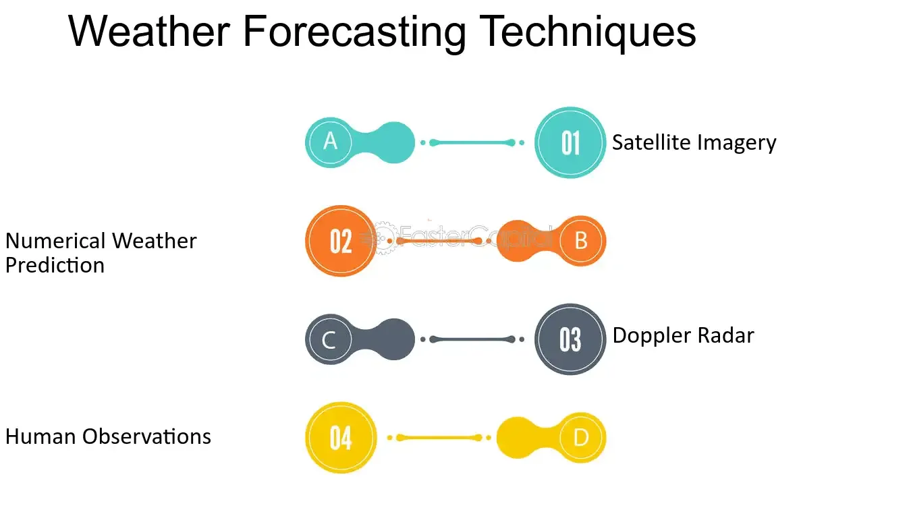

## Table of Contents

## What is meant by 'weather future'?

'Weather future' refers to the predictions and forecasts about what the weather will be like in the coming days, weeks, or even months. It involves using scientific methods and tools to guess how the weather might change. People use weather future information to plan their activities, like farmers deciding when to plant crops or people planning a picnic.

Weather forecasts are made by meteorologists, who are scientists that study the atmosphere. They use data from satellites, weather stations, and computer models to make their predictions. While short-term forecasts for the next few days are usually quite accurate, long-term forecasts for weeks or months ahead can be less reliable because the weather can change a lot over time.

## How does climate change affect future weather patterns?

Climate change makes future weather patterns harder to predict and more extreme. It's like the weather is getting a bit wilder. When the Earth gets warmer because of things like cars and factories putting gases into the air, it changes how the air moves around the planet. This can make storms bigger and more powerful, and it can make some places much hotter or much wetter than before.

Because of climate change, we might see more heatwaves, where it's really hot for a long time. We might also see more heavy rain and floods in some areas, and longer dry spells in others. This means that when we try to guess what the weather will be like in the future, it's trickier because the weather is not behaving the same way it used to. So, planning for the future becomes more challenging for everyone, from farmers to city planners.

## What are the basic mechanisms that drive weather changes?

Weather changes because of how the sun heats the Earth and how the air moves around. The sun heats the Earth unevenly, making some places warmer than others. This causes the air to move from hot areas to cooler ones, creating wind. When the air moves, it can [carry](/wiki/carry-trading) water vapor with it. If the air rises and cools down, the water vapor can turn into clouds and eventually rain or snow.

Another thing that drives weather changes is the Earth's rotation. It makes the air move in big circles called high and low pressure systems. High pressure usually means nice weather, while low pressure can bring storms. Oceans also play a big role because they can store heat and release it slowly, affecting the air above them. So, the mix of sun, Earth's spin, and oceans all work together to make the weather change day by day.

## Can weather be predicted accurately for the future? If so, how far in advance?

Weather can be predicted accurately for the future, but how far in advance depends on the time frame. For the next few days, weather forecasts are usually pretty good. Meteorologists use lots of information from satellites, weather stations, and computer models to guess what the weather will be like. This short-term prediction is helpful for planning things like outdoor events or travel.

For longer periods, like a week or more, the predictions become less accurate. The weather can change a lot over time, and small changes can lead to big differences later on. This is why forecasts for a month or a season ahead are more like guesses than exact predictions. Still, they can give us an idea of what might happen, which is useful for planning things like farming or preparing for possible weather extremes.

## What are the current technologies used for weather forecasting?

People use lots of cool technology to guess what the weather will be like. One big tool is satellites that float way up in the sky. They take pictures of the Earth and can see clouds, storms, and even how hot or cold the ground is. On the ground, there are weather stations with special tools like thermometers to measure temperature, and anemometers to check wind speed. These stations send their data to computers, which help make the weather forecast.

Another important tool is called radar. It sends out radio waves that can bounce off rain, snow, or even bugs in the air. By looking at how these waves come back, scientists can tell where it's raining or snowing and how heavy it is. Computers also play a big role. They use special math formulas to make models of the weather. These models take all the data from satellites, weather stations, and radar, and try to predict what the weather will do next. It's like a big puzzle that the computers help solve.

## How do global atmospheric circulation patterns influence future weather?

Global atmospheric circulation patterns are like big highways in the sky that move air around the Earth. They help decide what the weather will be like in different places. For example, there are big winds called jet streams that can push storms along, making some places wetter or drier than others. These patterns can also bring hot air from the tropics to cooler places, changing the temperature and maybe even causing heatwaves.

These circulation patterns can change over time, which makes it harder to predict the weather far into the future. When things like El Niño happen, it can mess with these patterns and make the weather do unexpected things. For instance, El Niño can make some places much wetter and others much drier than usual. So, understanding these big air movements helps us guess what the weather might be like, but they can also make those guesses less sure the further into the future we look.

## What role do ocean currents play in shaping future weather?

Ocean currents are like rivers in the sea that move water around the world. They can carry warm water from the equator to colder places near the poles, and cold water back to the equator. This moving water can change the temperature of the air above it, which affects the weather. For example, the Gulf Stream brings warm water from the Gulf of Mexico to Europe, making Europe warmer than it would be otherwise. When these currents change, they can make the weather change too, sometimes causing it to be colder or warmer than usual.

These ocean currents also carry water that has a lot of heat and moisture. When this water evaporates, it turns into water vapor in the air, which can form clouds and eventually rain or snow. This means that ocean currents can influence where it's going to rain or snow. For instance, the El Niño and La Niña events, which are changes in the Pacific Ocean currents, can make some places much wetter or much drier. So, understanding how ocean currents move can help us guess what the weather might be like in the future, but it's tricky because the oceans are always changing.

## How might extreme weather events change in frequency and intensity in the future?

Extreme weather events like hurricanes, heatwaves, and heavy rain might happen more often and be stronger in the future because of climate change. When the Earth gets warmer, it can make storms bigger and more powerful. For example, warmer ocean water can fuel bigger hurricanes. Also, when it's hotter, the air can hold more water, which can lead to heavier rain and more flooding. So, places that used to have a big storm every few years might start seeing them every year, or even more often.

Heatwaves are also expected to become more common and last longer. As the planet gets warmer, it's easier for the temperature to stay high for days or weeks at a time. This can be really tough on people, animals, and plants. Droughts might also happen more often in some places, making it hard to grow food and find water. Overall, the weather is getting more unpredictable and extreme, which makes it harder to plan for the future and stay safe.

## What are the socio-economic implications of changing weather patterns?

Changing weather patterns can have big effects on how people live and work. When the weather gets more extreme, it can hurt farming. Farmers might find it harder to grow food because of more droughts or floods. This can make food more expensive and harder to find. Also, when there are more storms or heatwaves, it can damage homes and buildings. People might have to spend a lot of money to fix things or move to safer places. This can be tough on families and communities, especially if they don't have a lot of money to start with.

These changes can also affect jobs and the economy. For example, if it's too hot or too wet, people might not want to go outside to shop or eat at restaurants. This can hurt businesses that depend on people coming in. Insurance companies might have to pay more for storm damage, which can make insurance more expensive for everyone. Governments might need to spend more money to help people after disasters, which can mean less money for other important things like schools or hospitals. Overall, changing weather patterns can make life harder and more expensive for a lot of people.

## How can societies adapt to the predicted changes in future weather?

Societies can adapt to changing weather by making smart plans and using new technology. One way is to build stronger buildings and better roads that can handle more storms and floods. This means using materials that don't get damaged easily and designing cities so water can drain away quickly. Another way is to change how we farm. Farmers can use new methods and tools to save water and grow crops that can survive in hotter or drier weather. Also, having good warning systems can help people get ready for bad weather and stay safe.

Another important way to adapt is by working together as a community. People can share resources and help each other out during tough times. For example, setting up places where people can go to stay cool during heatwaves or having plans to help those who lose their homes in storms. Governments can also make rules to protect the environment, like planting more trees or reducing pollution, which can help make the weather less extreme over time. By working together and using smart ideas, societies can better handle the changes in future weather.

## What are the latest advancements in weather modeling and prediction?

The latest advancements in weather modeling and prediction have made forecasts more accurate and detailed. One big improvement is in computer models, which now use more data and better math to predict the weather. These models can handle more information from satellites, weather stations, and even social media to get a better picture of what's happening. They can also look at smaller areas and shorter time periods, which helps with predicting things like sudden storms or local weather changes. Another cool thing is the use of [artificial intelligence](/wiki/ai-artificial-intelligence) (AI). AI can find patterns in the data that humans might miss, making predictions even better.

Another advancement is in the technology used to gather weather data. New satellites can see more details about the Earth's atmosphere, like how much water vapor is in the air or how clouds are moving. On the ground, weather stations now have better sensors that can measure things like temperature and wind more accurately. Also, weather balloons and drones are being used more to get data from places that are hard to reach. All this new information helps make weather models more reliable, so people can plan better for the future.

## How do international policies and agreements impact weather research and future weather management?

International policies and agreements help countries work together on weather research and managing future weather. When countries agree to share information and resources, scientists can learn more about the weather and how it might change. For example, the World Meteorological Organization (WMO) helps countries share weather data and work on projects together. This means that if a big storm is coming, countries can warn each other and get ready. Agreements like the Paris Agreement also help by setting goals to reduce pollution, which can make the weather less extreme over time.

These agreements also help with planning for the future. When countries agree on how to handle things like climate change, they can make plans to protect people from bad weather. For instance, they might decide to build stronger buildings or help farmers use new methods to grow food in changing weather. By working together, countries can share the cost and the work of dealing with weather problems. This makes it easier for everyone to adapt to the changes and stay safe.

## What are Weather Derivatives and Hedging Strategies?

Weather derivatives and hedging strategies have emerged as vital financial instruments designed to mitigate risks associated with unpredictable weather patterns. These tools are particularly valuable for industries heavily impacted by weather variances, such as agriculture, energy, and tourism, providing a means to manage the economic uncertainty that arises from weather fluctuations.

Weather futures and derivatives function similarly to other derivatives, allowing businesses to hedge against potential financial losses due to adverse weather conditions. The core idea behind these instruments is the transfer of weather risk from one party to another, enabling firms to stabilize revenues and plan more effectively.

### Understanding Degree Days

Central to weather derivatives is the concept of degree days, which serves as a measure to evaluate energy consumption needs based on temperature variations. Two commonly used metrics are Heating Degree Days (HDD) and Cooling Degree Days (CDD):

- **Heating Degree Days (HDD):** HDD is calculated when the daily average temperature falls below a base threshold, typically 65°F (18°C) in the U.S. The formula for heating degree days for a single day can be expressed as:
$$
  \text{HDD} = \max(0, 65 - \text{Average Daily Temperature})

$$
  HDD values are used to estimate energy demands for heating purposes, as cooler weather increases the need for heating.

- **Cooling Degree Days (CDD):** Conversely, CDD is relevant when the average daily temperature exceeds the base threshold of 65°F. It calculates the demand for cooling as temperatures rise:
$$
  \text{CDD} = \max(0, \text{Average Daily Temperature} - 65)

$$
  Higher CDD values indicate a greater need for air conditioning and other cooling solutions.

Businesses, particularly in the energy sector, utilize HDD and CDD to anticipate energy consumption trends, which subsequently informs their trading and hedging strategies. By purchasing weather derivatives tied to HDD or CDD metrics, companies can manage potential increases in energy costs or revenue fluctuations triggered by anomalous weather patterns.

### Implementing Weather Derivatives

The practical application of weather derivatives involves contracts that settle based on the observed weather index, such as HDD or CDD, over a specified period. If a company's operations are negatively impacted by the recorded weather metrics, they receive compensation, mitigating financial losses.

For instance, an energy company might enter a CDD-based contract to cover the summer months. If the season is hotter than normal, surpassing the anticipated CDD levels, the payout from the derivative offsets the additional costs incurred for increased energy production.

In conclusion, weather derivatives serve as a strategic tool for businesses seeking to safeguard against the unpredictable nature of weather. By leveraging statistical measures like HDD and CDD, companies can establish robust hedging mechanisms, ensuring financial stability amid the uncertainties of climate variability. This approach not only enhances economic resilience but also supports strategic decision-making in weather-sensitive industries.

## References & Further Reading

[1]: ECMWF. ["European Centre for Medium-Range Weather Forecasts (ECMWF)."](https://www.ecmwf.int/) 

[2]: NOAA. ["Global Forecast System (GFS)."](https://www.ncei.noaa.gov/products/weather-climate-models/global-forecast)

[3]: Goodfellow, I., Bengio, Y., & Courville, A. (2016). ["Deep Learning."](https://www.deeplearningbook.org/) MIT Press.

[4]: Google AI Blog. ["GraphCast: A Graph-Based Weather Forecasting Model."](https://deepmind.google/discover/blog/graphcast-ai-model-for-faster-and-more-accurate-global-weather-forecasting/)

[5]: World Bank. ["Shock Waves: Managing the Impacts of Climate Change on Poverty."](https://www.worldbank.org/en/topic/climatechange/brief/shock-waves-managing-the-impacts-of-climate-change-on-poverty-background-papers) 

[6]: Hull, J. C. (2018). ["Options, Futures, and Other Derivatives."](https://www.semanticscholar.org/paper/Options%2C-Futures%2C-and-Other-Derivatives-Hull/89bdee500c8623864fc9eb7a471546aa713acc44) Pearson.

[7]: Jansen, S. (2020). ["Machine Learning for Algorithmic Trading."](https://github.com/stefan-jansen/machine-learning-for-trading) Packt Publishing.