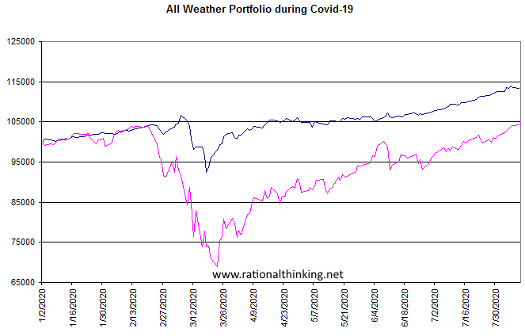

Understanding financial markets necessitates familiarity with various derivatives, among which weather derivatives stand out due to their specialized nature and importance. These financial instruments play a critical role in mitigating risks associated with unpredictable weather patterns, thus offering substantial value to diversified investment portfolios. Unlike traditional derivatives that deal with financial assets, weather derivatives are structured around weather indices such as temperature, precipitation, or wind speed, providing a mechanism to hedge against weather-related risks without relying on insurance policies.

Weather significantly impacts numerous sectors, notably agriculture, energy, and finance. For instance, agriculture is directly affected by weather conditions, making income susceptible to the vagaries of nature. Similarly, energy companies, particularly those dealing in utilities, face fluctuating demand tied to weather changes, such as increased heating needs during cold spells or cooling demands during heatwaves. These sectors' reliance on predictable weather conditions has necessitated the development of innovative financial instruments like weather derivatives. As a result, these derivatives contribute to financial stability by offering a hedge against potential losses due to adverse weather events.



In the context of financial markets, weather derivatives introduce a novel dimension, intersecting with areas such as algorithmic trading. By integrating meteorological data with financial strategies, weather derivatives facilitate informed decision-making and risk management in trading markets. This article aims to provide a comprehensive overview of weather derivatives, illustrating their role, usage scenarios, and integration into algorithmic trading, while addressing the challenges and advancements shaping their future outlook.

## Table of Contents

## Understanding Weather Derivatives

Weather derivatives are specialized financial instruments designed to manage the financial risk associated with variable weather conditions. These contracts specify payouts based on predetermined weather parameters, offering a hedge against adverse weather rather than compensating for actual physical damages like traditional insurance. The primary purpose of weather derivatives is to provide businesses affected by weather volatility a means to stabilize their income streams despite fluctuating climatic conditions.

The payout of a weather derivative is typically indexed against specific measures of weather conditions. For example, common indices include Heating Degree Days (HDD) and Cooling Degree Days (CDD). Heating Degree Days are calculated by taking the average daily temperature below a standard base temperature, often 65°F in the U.S., reflecting the demand for heating. Mathematically, HDD can be represented as:

$$
\text{HDD} = \max(0, \text{Base Temperature} - \text{Average Daily Temperature})
$$

Conversely, Cooling Degree Days, used to measure the need for cooling, are calculated as:

$$
\text{CDD} = \max(0, \text{Average Daily Temperature} - \text{Base Temperature})
$$

These indices serve as the settlement basis for weather derivatives, making them crucial for structuring contracts and determining payouts.

The application of these instruments is particularly prevalent in sectors where income is intricately linked to weather patterns. In the energy sector, companies use weather derivatives to hedge against the financial impact of anomalously warm winters or cool summers, which can lower the demand for heating and cooling, respectively. Similarly, in agriculture, these derivatives help manage the risk of poor yields due to excessive or insufficient rainfall.

By commodifying weather factors, weather derivatives bridge the gap between meteorology and finance, providing entities a sophisticated tool to mitigate risks associated with weather uncertainties. As businesses continue to face challenges posed by unpredictable weather, the strategic use of weather derivatives becomes increasingly vital in ensuring financial stability and operational continuity.

## Role of Weather Derivatives in Financial Markets

Weather derivatives play a critical role in financial markets by providing a unique form of risk management against the unpredictable nature of weather conditions. Unlike traditional financial instruments, these derivatives are specifically designed to address uncertainties related to weather, thereby offering crucial protection for industries heavily reliant on meteorological predictability. 

One of the primary advantages of weather derivatives is their ability to serve as a non-traditional hedge, offering financial security without needing to assess specific damages. This aspect distinguishes them from conventional insurance policies. Traditional insurance typically requires a demonstration of loss due to specific incidents, such as storms or floods. In contrast, weather derivatives pay out based on the occurrence of predefined weather conditions or indices, such as the number of Heating Degree Days (HDD) or Cooling Degree Days (CDD), without the need for actual damage assessment. This capability allows businesses to stabilize revenue streams impacted by weather fluctuations.

The integration of weather derivatives into financial markets has resulted in the commodification of weather factors, turning meteorological data into tradeable economic value. This transformation creates [liquidity](/wiki/liquidity-risk-premium) and market opportunities, allowing a diverse array of market participants to engage in the trading of weather derivatives. Sectors such as agriculture and energy, which are particularly sensitive to weather changes, benefit significantly from these instruments, as they enable the anticipation and mitigation of weather-induced financial impacts.

Through the commodification process, weather derivatives not only enable risk transfer between market participants but also enhance market efficiency and depth. By enabling businesses to hedge against weather risks, they facilitate smoother financial planning and operational execution, thus stabilizing sectors that might otherwise be vulnerable to weather [volatility](/wiki/volatility-trading-strategies).

The increasing acceptance and integration of weather derivatives into diversified portfolios highlight their growing importance in financial strategies. As such, weather derivatives represent an innovative intersection of finance and meteorology, where the quantitative assessment of weather risks is translated into measurable economic terms, providing novel avenues for risk management and investment.

## Usage Scenarios and Examples

Farming enterprises frequently utilize weather derivatives to manage risks associated with unfavorable weather conditions such as drought or excessive rainfall, which can significantly impact crop yield. By purchasing weather derivatives based on temperature or precipitation indices, agricultural businesses can stabilize their financial outcomes. For example, a farmer concerned about insufficient rainfall affecting crop production might purchase a derivative tied to rainfall levels. If the actual rainfall falls below a predetermined threshold, the payout from the derivative helps compensate for the potential loss in yield.

Utility companies also utilize weather derivatives to stabilize revenues affected by fluctuating demand due to weather anomalies. Weather conditions can directly influence the consumption of energy; for instance, colder winters increase the demand for heating, thereby escalating energy consumption, while milder winters may decrease this demand, impacting revenue projections. To mitigate these uncertainties, utilities often engage in contracts like Heating Degree Days (HDD) or Cooling Degree Days (CDD) derivatives. These derivatives provide financial payouts that help offset revenue reductions caused by deviations from expected weather patterns.

Ski resorts provide a direct example of businesses purchasing snowfall options to hedge against the risk of low snowfall seasons, which can lead to reduced visitor numbers and revenue. By purchasing these derivatives, ski resorts secure financial compensation if snowfall amounts do not meet specified levels, thereby ensuring more predictable income flows regardless of snow conditions. Similarly, agricultural stakeholders might invest in temperature derivatives to protect against weather-induced volatility that affects growth cycles or harvest times.

Overall, the strategic use of weather derivatives across various sectors illustrates their capacity to not only mitigate weather-related financial risks but also to ensure stability in operational revenues. By providing a mechanism to transfer risk, these instruments enable a more predictable financial landscape amidst the uncertainties posed by weather changes.

## Algorithmic and Algo-Trading in Weather Markets

Algorithmic trading, also known as algo-trading, has increasingly utilized weather-dependent data to refine strategies within the derivative markets. This approach involves leveraging advanced algorithms to process vast quantities of meteorological information, enabling traders to discern patterns and make informed decisions. Unlike traditional methods, [algorithmic trading](/wiki/algorithmic-trading) brings a level of speed and efficiency essential for responding to the rapid fluctuations inherent in weather-affected markets. As a result, it allows traders to capitalize on fleeting opportunities and hedge against potential losses more effectively.

The integration of [artificial intelligence](/wiki/ai-artificial-intelligence) (AI) and [machine learning](/wiki/machine-learning) into these trading algorithms further enhances predictive capabilities. By employing AI models, traders can forecast weather conditions and correlate them with market movements, thereby optimizing their trading strategies. Machine learning algorithms, trained on historical weather and market data, can automatically adapt to new patterns, providing a dynamic and responsive trading framework. This capability is crucial for effective decision-making, given the complex and unpredictable relationship between weather events and their economic impacts.

Moreover, algo-trading systems can autonomously execute trades based on pre-set parameters and real-time data analysis, minimizing the latency between decision-making and execution. This automated process not only improves the precision of trades but also reduces the risk of human error, which can be detrimental in fast-paced markets. By analyzing extensive datasets, machine learning models can identify subtle indicators that might elude human analysts, offering a competitive edge in the derivatives market tied to weather.

In practice, such systems might use Python libraries like pandas and NumPy for data manipulation, while machine learning models may be built with frameworks like TensorFlow or scikit-learn. For instance, a simple linear regression model could be employed to predict temperature trends based on historical data:

```python
import numpy as np
from sklearn.linear_model import LinearRegression

# Assume X is the array of dates and y is the corresponding temperature values
X = np.array([[1], [2], [3], [4], [5]])  # example dates converted to ordinal for simplicity
y = np.array([30, 32, 35, 40, 45])      # example temperatures

model = LinearRegression().fit(X, y)

# Predict future temperatures
future_date = np.array([[6]])
predicted_temp = model.predict(future_date)
print(f"Predicted Temperature: {predicted_temp[0]}")
```

This simple model demonstrates how historical weather data can inform predictive strategies, though in real-world scenarios, far more sophisticated models and larger datasets would be employed. The synergy between algorithmic trading and weather data analytics promises a profound transformation in how financial markets manage weather-related risks, ensuring greater resiliency and optimized financial outcomes.

## Challenges and Limitations

Weather derivatives, despite their growing significance, face several challenges and limitations. A major challenge is basis risk, which arises when the weather index used in a derivative contract does not perfectly correlate with the actual financial impact on the underlying business operations. Basis risk can occur in various forms, such as geographical, seasonal, or measurement discrepancies. For example, a farming entity might face losses due to inadequate rainfall at its specific location, while the index is based on broader regional rainfall data, leading to a mismatch between the payout and the incurred financial burden. 

Liquidity issues are another significant barrier, with many weather derivative markets still pursuing maturity. Liquidity pertains to the ability to easily buy or sell large quantities of a financial instrument without causing drastic price changes. Insufficient liquidity can result in higher costs for entering or exiting positions in weather derivatives, limiting their attractiveness as risk management tools. This issue is notable in nascent markets where trading volumes are not yet substantial enough to ensure deep and liquid markets. 

Additionally, weather prediction and modeling continue to pose challenges. Accurate weather forecasting is pivotal in constructing reliable weather indices, which form the basis for derivative contracts. However, meteorology, despite advanced methodologies and technologies, remains an inherently uncertain science, often due to chaotic weather systems, complex environmental interactions, and data limitations. As such, inaccuracies in weather modeling can lead to inappropriate pricing, reduced confidence in weather derivatives, and operational difficulties in effectively using these contracts for hedging purposes. 

Addressing these challenges requires ongoing advancements in meteorological sciences, enhanced market infrastructure to boost liquidity, and innovative financial engineering to reduce basis risk.

## Technological Advancements and Future Outlook

Advancements in artificial intelligence (AI), the Internet of Things (IoT), and big data analytics are revolutionizing the landscape of weather forecasting, providing the foundation for more accurate predictions and, consequently, more precise weather derivatives. These technological developments are crucial in transforming raw meteorological data into actionable insights, which are vital for issuing and managing weather derivative products.

AI technologies are employed to enhance pattern recognition in complex weather systems through machine learning algorithms. These algorithms excel at processing vast datasets to identify trends and anomalies that may influence weather conditions. For instance, neural networks can be used to model non-linear relationships in climate data, enabling deeper insights into how certain weather parameters may develop over time.

IoT contributes by significantly expanding the [volume](/wiki/volume-trading-strategy) and granularity of weather data available for analysis. Networks of sensors distributed across various geographic locations collect data on temperature, humidity, wind speed, and other meteorological variables in real-time. This enhanced data collection enables more accurate and localized weather forecasts, which are essential for calculating precise payouts for weather derivatives.

Big data analytics, meanwhile, provides the computational power necessary to analyze and interpret these large datasets. Advanced statistical tools and frameworks can process the incoming data, optimizing models used in both prediction and risk assessment. This ability to handle large volumes of data in real-time significantly improves the accuracy of weather-related predictions.

As awareness and concern about climate change continue to rise, there is an increasing emphasis on understanding and mitigating its financial impact. This has led to a heightened demand for instruments such as weather derivatives, which provide financial strategies to cope with climatic variability. New technologies are expected to support a broader range of derivative products tailored to specific climate risks, offering new avenues for mitigating financial exposure.

In conclusion, the convergence of AI, IoT, and big data analytics is driving significant advancements in weather forecasting accuracy, thereby enhancing the sophistication and utility of weather derivatives. These innovations not only facilitate more effective risk management solutions but also align with a growing imperative to address the economic ramifications of climate change in financial markets worldwide.

## Conclusion

Weather derivatives have emerged as a critical component in the intersection of finance and meteorology, crystallizing into a pivotal market instrument that addresses the challenges posed by climatic variability. These financial tools offer businesses and investors the ability to hedge against the unpredictability of weather conditions, facilitating a strategic shift in how financial risks associated with climate are managed. As industries increasingly recognize the significance of addressing weather-related financial impacts, the adoption of weather derivatives has surged, prompting transformative adjustments in corporate and investment strategies.

The integration of cutting-edge technology, including artificial intelligence (AI), the Internet of Things (IoT), and big data analytics, is greatly enhancing the precision and efficacy of weather derivatives. These technological advancements enable more accurate weather forecasting, leading to the development of sophisticated derivative products that more closely align with the specific needs of various sectors. Such improvements not only bolster market confidence but also enhance the ability of market participants to effectively manage weather-related risks.

As the global climate continues to exhibit increased volatility, the role of weather derivatives is set to expand significantly. These instruments offer a vital layer of financial stability, allowing businesses to mitigate potential losses and maintain operational continuity amidst adverse weather conditions. The evolution of weather derivatives reflects an important progression in financial markets, underscoring the necessity for innovative solutions to navigate the complexities introduced by climate change. As a result, weather derivatives are poised to remain an essential tool in the financial landscape, offering both protection and opportunity in the face of an uncertain climate future.

## References & Further Reading

[1]: Dischel, R. S. (2002). ["Climate Risk and the Weather Market: Financial Risk Management with Weather Hedges"](https://www.semanticscholar.org/paper/Climate-Risk-and-the-Weather-Market%3A-Financial-Risk-Dischel/f8cd52bc445c7ff845f3119b80b8d4b5023c533b). Risk Books.

[2]: Jewson, S., Brix, A., & Ziehmann, C. (2005). ["Weather Derivative Valuation: The Meteorological, Statistical, Financial and Mathematical Foundations"](https://www.semanticscholar.org/paper/Weather-Derivative-Valuation%3A-The-Meteorological%2C-Jewson-Brix/d5a35ba58867aae2544063ab47f8a88a10abfec6). Cambridge University Press.

[3]: Cao, M., & Wei, J. (2004). ["Weather Derivatives: A New Class of Financial Instruments"](https://www.yorku.ca/mcao/cao_wei_weather_CIR.pdf). Review of Financial Economics, 13(3), 221-228.

[4]: Turvey, C. G. (2001). ["Weather Derivatives for Specific Event Risks in Agriculture."](https://onlinelibrary.wiley.com/doi/10.1111/1467-9353.00065) Review of Agricultural Economics, 23(2), 333-351.

[5]: Alexandridis, A. & Zapranis, A. (2013). ["Weather Derivatives: Modeling and Pricing Weather-Related Risk"](https://link.springer.com/book/10.1007/978-1-4614-6071-8). Springer.