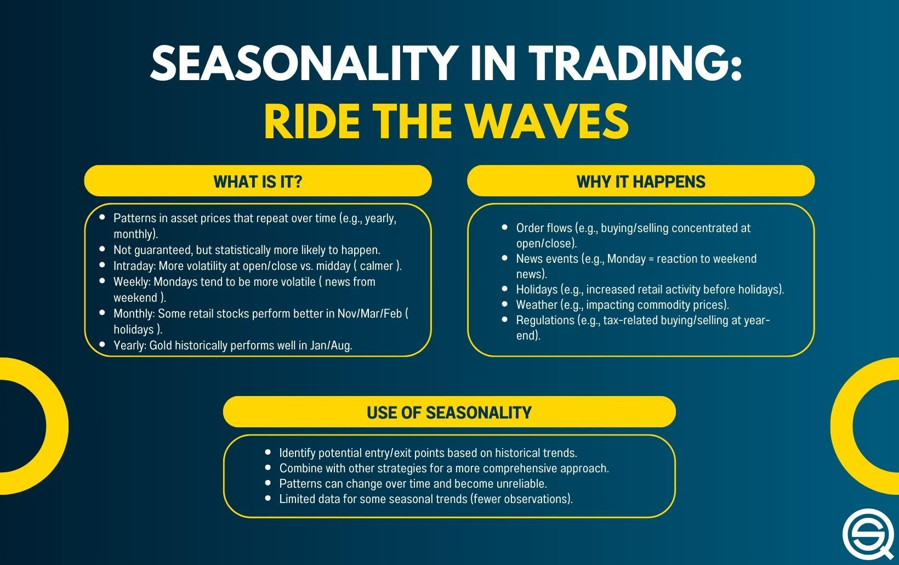

## Table of Contents

## What is weather trading and how does it work?

Weather trading involves buying and selling financial products that are based on weather conditions. These products, called weather derivatives, help businesses manage risks related to weather changes. For example, a ski resort might use weather derivatives to protect against a season with less snow than expected. The value of these derivatives depends on weather data, like temperature or rainfall, measured at specific locations over a set time.

The process of weather trading works like this: companies can buy or sell weather derivatives on special markets. These markets use weather data from trusted sources to decide the value of the derivatives. If the weather turns out as expected, the company might not gain or lose much. But if the weather is very different from what was predicted, the company could make money or lose money depending on whether they bought or sold the derivative. This way, businesses can plan better and protect themselves from unexpected weather changes.

## What are the basic weather instruments used in trading?

The main tools used in weather trading are thermometers, rain gauges, and weather stations. A thermometer measures temperature, which is important because many weather derivatives are based on how hot or cold it gets. A rain gauge measures how much rain falls, which is useful for derivatives that depend on rainfall. Weather stations collect all sorts of weather data, like wind speed and humidity, and send it to traders to help them make decisions.

These instruments are placed at specific locations chosen by the weather derivative contract. The data they collect is very important because it decides how much the derivatives are worth. For example, if a contract says it will pay out based on the average temperature in a city, the thermometer in that city will tell traders if they need to pay out or not. By using these simple tools, traders can keep track of the weather and manage their risks better.

## How can beginners start trading based on weather forecasts?

To start trading based on weather forecasts, beginners need to learn about weather derivatives. These are special financial products that depend on weather conditions like temperature or rain. You can buy or sell these derivatives on markets where they are traded. It's important to understand how they work and what they are based on. For example, if you think it will be hotter than usual this summer, you might buy a derivative that pays out if the temperature is high. This way, you could make money if your weather forecast is right.

Getting started also means finding a good source for weather data. You'll need to know where to look for accurate weather information, like from official weather stations or reliable weather services. Once you have the data, you can use it to decide whether to buy or sell weather derivatives. It's a good idea to start small and learn as you go. Remember, weather trading can be risky, so it's important to only trade with money you can afford to lose. As you get more comfortable, you can try more complex strategies and increase your trading.

## What are the most common weather-related commodities traded?

The most common weather-related commodities traded are temperature and rainfall. Temperature is often traded through what are called degree days, which measure how far the daily temperature is above or below a certain level. For example, if it's colder than usual, businesses like energy companies might buy heating degree days to protect against higher heating costs. On the other hand, if it's warmer than usual, they might buy cooling degree days to cover the cost of more air conditioning.

Rainfall is another big commodity in weather trading. Companies that depend on rain, like farmers or water utilities, might trade rainfall derivatives to manage the risk of too much or too little rain. For instance, a farmer might buy a derivative that pays out if there's less rain than expected, helping them cover losses from a dry season. These commodities help businesses plan for and protect against the ups and downs of weather.

## How does weather impact different markets and sectors?

Weather has a big impact on many markets and sectors. For example, in agriculture, too much rain or too little rain can hurt crops and change how much food is available. This can make food prices go up or down. Energy companies also feel the weather's effects because people use more heat in winter and more air conditioning in summer. If it's colder than expected, energy companies might need to buy more fuel, which can make energy prices go up.

Another sector affected by weather is tourism. Bad weather can make fewer people want to travel, which hurts hotels, airlines, and other businesses that depend on tourists. On the other hand, good weather can bring more tourists and help these businesses make more money. Even the stock market can be influenced by weather. If a big company in an industry affected by weather does well or poorly because of the weather, its stock price can change, and this can affect the whole market.

## What are the key weather data sources for traders?

The main weather data sources for traders are official weather stations run by government agencies like the National Weather Service in the United States. These stations collect important information like temperature, rainfall, and wind speed. Traders trust this data because it's accurate and comes from reliable sources. They use it to make decisions about buying or selling weather derivatives, which are financial products based on weather conditions.

Another important source is private weather services, like AccuWeather or Weather Underground. These companies use their own weather stations and advanced technology to give detailed and up-to-date weather information. Traders might use these services to get a better understanding of the weather and make more accurate predictions. By combining data from both official and private sources, traders can have a complete picture of the weather and make smarter trading choices.

## How can traders analyze weather patterns to predict market movements?

Traders can analyze weather patterns to predict market movements by looking at past weather data and seeing how it affected different markets. For example, if they see that a cold winter always makes energy prices go up, they can guess that it might happen again next winter. They use tools like charts and graphs to spot these patterns. By understanding how the weather has changed prices in the past, traders can make better guesses about what might happen in the future. This can help them decide when to buy or sell weather derivatives, which are financial products that depend on the weather.

Another way traders analyze weather patterns is by using computer models that predict future weather. These models take in lots of data about things like temperature, rain, and wind, and then use math to guess what the weather will be like in the future. Traders can use these predictions to plan their trades. If a model says it will be a very hot summer, traders might buy derivatives that pay out if it's hot, hoping to make money if the prediction is right. By combining past data and future predictions, traders can make smarter decisions and try to stay ahead of the market.

## What are some advanced weather trading strategies used by experts?

Experts in weather trading often use a strategy called hedging. This means they buy or sell weather derivatives to protect their business from bad weather. For example, if a farmer thinks there might be less rain than usual, they could buy a rainfall derivative that pays out if it's dry. This way, if it really is a dry season, the farmer loses money on the crops but makes money from the derivative, so it balances out. Hedging helps businesses manage risks and plan for different weather scenarios without taking big losses.

Another advanced strategy is called speculation. This is when traders try to guess what the weather will be like and make trades based on those guesses. If they think it will be a hot summer, they might buy temperature derivatives that pay out if it's hot. If they're right, they can make a lot of money. But if they're wrong, they could lose money. Speculation is riskier than hedging, but it can also be more rewarding. Traders who are good at reading weather patterns and understanding market trends can use speculation to make big profits.

## How do seasonal weather patterns affect long-term trading strategies?

Seasonal weather patterns play a big role in long-term trading strategies because they help traders predict what might happen in the future. For example, if traders know that winters are usually cold in a certain area, they can plan to buy heating degree days in the fall. This way, they can protect their business from higher heating costs during the winter. By looking at past weather data, traders can see patterns and use them to make smart choices about what to buy or sell. This helps them manage risks and plan for the future.

Another way seasonal patterns affect long-term trading is by helping traders guess what might happen in the market. If summers are usually hot, traders might buy cooling degree days in the spring, hoping to make money if it's a hot summer. This kind of planning can help traders make more money over time. By understanding how the weather changes throughout the year, traders can create strategies that work well in the long run. This means they can be ready for different weather scenarios and make better trading decisions.

## What are the risks associated with weather trading and how can they be mitigated?

Weather trading can be risky because the weather is hard to predict. If a trader guesses wrong about the weather, they could lose a lot of money. For example, if someone buys a derivative thinking it will be a hot summer but it turns out to be cool, they might lose money. Also, weather data can sometimes be wrong or delayed, which can make it hard to make good trading decisions. Another risk is that weather trading is not as common as other types of trading, so the market can be less stable and harder to understand.

To lower these risks, traders can use a strategy called hedging. This means they buy or sell weather derivatives to protect their business from bad weather. For example, a farmer might buy a rainfall derivative to cover losses if it's a dry season. By doing this, they can balance out any losses from the weather with gains from the derivative. Traders can also use reliable sources of weather data and stay updated with the latest forecasts. By being careful and planning ahead, traders can manage the risks of weather trading and make smarter decisions.

## How can traders use weather derivatives to hedge against weather-related risks?

Traders can use weather derivatives to hedge against weather-related risks by buying or selling these financial products to protect their businesses from unexpected weather changes. For example, if a company thinks it might be a very hot summer, they could buy a temperature derivative that pays out if it gets really hot. This way, if the summer is indeed hot, the company might lose money on higher cooling costs but make money from the derivative, which helps balance things out. Hedging with weather derivatives helps businesses manage risks without taking big losses if the weather turns out differently than expected.

To use weather derivatives effectively for hedging, traders need to understand the specific weather risks their business faces. If a farmer is worried about a dry season, they might buy a rainfall derivative that pays out if there's less rain than usual. This can help cover the costs of lower crop yields due to drought. By carefully choosing the right derivatives based on their needs and the most reliable weather data, traders can create a safety net that protects their business from the ups and downs of the weather.

## What role does technology play in enhancing weather trading strategies?

Technology plays a big role in making weather trading strategies better. Traders use special computer programs and models to look at a lot of weather data quickly. These tools can help them see patterns and guess what the weather might be like in the future. For example, they can use weather apps and websites to get the latest weather information and make smart choices about buying or selling weather derivatives. By using technology, traders can make their decisions faster and with more information, which can help them make more money and take fewer risks.

Another way technology helps is by making it easier to trade on special markets where weather derivatives are bought and sold. With online trading platforms, traders can buy and sell these products from anywhere, at any time. This means they can react quickly to new weather data or changes in the market. Technology also helps traders keep track of their trades and see how well they are doing. By using these tools, traders can create better strategies and manage their risks more effectively, making weather trading easier and more successful.

## What are Weather Derivatives and How Do They Work?

Weather derivatives are specialized financial instruments designed to manage the financial risk associated with variable weather conditions. These contracts specify payouts based on predetermined weather parameters, offering a hedge against adverse weather rather than compensating for actual physical damages like traditional insurance. The primary purpose of weather derivatives is to provide businesses affected by weather [volatility](/wiki/volatility-trading-strategies) a means to stabilize their income streams despite fluctuating climatic conditions.

The payout of a weather derivative is typically indexed against specific measures of weather conditions. For example, common indices include Heating Degree Days (HDD) and Cooling Degree Days (CDD). Heating Degree Days are calculated by taking the average daily temperature below a standard base temperature, often 65°F in the U.S., reflecting the demand for heating. Mathematically, HDD can be represented as:

$$
\text{HDD} = \max(0, \text{Base Temperature} - \text{Average Daily Temperature})
$$

Conversely, Cooling Degree Days, used to measure the need for cooling, are calculated as:

$$
\text{CDD} = \max(0, \text{Average Daily Temperature} - \text{Base Temperature})
$$

These indices serve as the settlement basis for weather derivatives, making them crucial for structuring contracts and determining payouts.

The application of these instruments is particularly prevalent in sectors where income is intricately linked to weather patterns. In the energy sector, companies use weather derivatives to hedge against the financial impact of anomalously warm winters or cool summers, which can lower the demand for heating and cooling, respectively. Similarly, in agriculture, these derivatives help manage the risk of poor yields due to excessive or insufficient rainfall.

By commodifying weather factors, weather derivatives bridge the gap between meteorology and finance, providing entities a sophisticated tool to mitigate risks associated with weather uncertainties. As businesses continue to face challenges posed by unpredictable weather, the strategic use of weather derivatives becomes increasingly vital in ensuring financial stability and operational continuity.

## References & Further Reading

[1]: Dischel, R. S. (2002). ["Climate Risk and the Weather Market: Financial Risk Management with Weather Hedges"](https://www.semanticscholar.org/paper/Climate-Risk-and-the-Weather-Market%3A-Financial-Risk-Dischel/f8cd52bc445c7ff845f3119b80b8d4b5023c533b). Risk Books.

[2]: Jewson, S., Brix, A., & Ziehmann, C. (2005). ["Weather Derivative Valuation: The Meteorological, Statistical, Financial and Mathematical Foundations"](https://www.semanticscholar.org/paper/Weather-Derivative-Valuation%3A-The-Meteorological%2C-Jewson-Brix/d5a35ba58867aae2544063ab47f8a88a10abfec6). Cambridge University Press.

[3]: Cao, M., & Wei, J. (2004). ["Weather Derivatives: A New Class of Financial Instruments"](https://www.yorku.ca/mcao/cao_wei_weather_CIR.pdf). Review of Financial Economics, 13(3), 221-228.

[4]: Turvey, C. G. (2001). ["Weather Derivatives for Specific Event Risks in Agriculture."](https://onlinelibrary.wiley.com/doi/10.1111/1467-9353.00065) Review of Agricultural Economics, 23(2), 333-351.

[5]: Alexandridis, A. & Zapranis, A. (2013). ["Weather Derivatives: Modeling and Pricing Weather-Related Risk"](https://link.springer.com/book/10.1007/978-1-4614-6071-8). Springer.