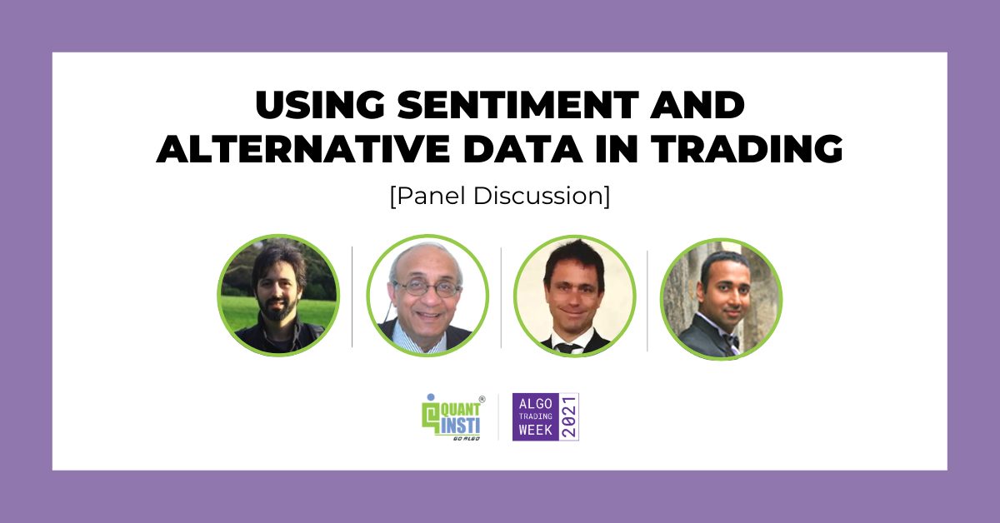

## Table of Contents

## What is web data alternative data?

Web data alternative data refers to information collected from the internet that businesses use to gain insights and make better decisions. This data can come from websites, social media, online forums, and other digital sources. It's called "alternative" because it's different from traditional data sources like financial reports or market research surveys. Companies use web data to understand trends, consumer behavior, and market conditions in ways that traditional data might not show.

For example, a company might look at social media posts to see what people are saying about their products or competitors. This can help them understand public opinion and adjust their strategies accordingly. Another use could be tracking online prices to see how they compare to competitors, which can help in setting their own prices. By using web data, businesses can get a more complete picture of the market and make smarter decisions.

## How is web data alternative data different from traditional data sources?

Web data alternative data is different from traditional data sources because it comes from the internet, like websites and social media, instead of from things like financial reports or surveys. Traditional data is usually collected in a structured way, like numbers from a company's financial statement or answers from a questionnaire. This kind of data is often used to make decisions based on past performance or specific questions asked.

On the other hand, web data [alternative data](/wiki/best-alternative-data) is more about what's happening right now on the internet. It can show what people are talking about, what they like or don't like, and how they behave online. This data is often less structured and can come from many different places at the same time. Companies use it to understand trends and public opinion in real-time, which can help them make quicker and more informed decisions.

In summary, while traditional data gives a detailed but sometimes slow-moving picture of the past, web data alternative data provides a fast, broad, and current view of what's happening online. Both types of data are important, but they help companies in different ways. Traditional data might be better for long-term planning, while web data alternative data is great for staying up-to-date and reacting to changes quickly.

## What are some common sources of web data alternative data?

Web data alternative data comes from many places on the internet. One common source is social media, like Twitter or Instagram. Companies look at what people are posting, liking, and sharing to see what's popular and what people think about different things. Another source is websites, where businesses can track things like how many people visit a site, what they click on, and how long they stay. This helps companies understand what people are interested in and how they use the internet.

Online forums and review sites are also big sources of web data alternative data. People often talk about products, services, and their experiences on these sites. Companies can read these discussions to learn what customers like or don't like. Another source is search engines, where businesses can see what people are searching for. This can show what people are curious about or what they might want to buy. All these sources help companies get a better picture of what's happening online and what people care about.

## How can businesses use web data alternative data to gain insights?

Businesses can use web data alternative data to learn a lot about what people want and what's happening right now. For example, if a company looks at what people are saying on social media, they can see if customers like their products or if there are problems they need to fix. By checking websites, they can see how many people visit and what they do on the site, which helps them understand what's popular. This kind of data helps businesses make quick decisions and keep up with what's happening in the market.

Another way businesses use web data alternative data is by looking at online reviews and forums. These places are full of people talking about their experiences with different products and services. Companies can read these comments to find out what customers really think and what they might want to change. Also, by looking at what people search for on the internet, businesses can see what people are interested in and what they might want to buy. This helps them plan better and make sure they're offering what people want.

## What are the challenges in collecting and analyzing web data alternative data?

Collecting and analyzing web data alternative data can be tricky because there's so much of it. The internet is full of information from all over the world, and it's hard to know what's important and what's not. Businesses have to figure out how to gather all this data without missing anything important. They also need to make sure they're not breaking any rules about privacy or data use, which can be complicated because laws are different in different places.

Once the data is collected, analyzing it is another challenge. Web data is often messy and not organized in a neat way like traditional data. It can be hard to make sense of it all and find the useful information. Businesses need special tools and smart people to help them sort through the data and understand what it means. This can take a lot of time and money, but it's important for making good decisions based on what's happening online.

## What tools and technologies are used to gather web data alternative data?

Businesses use special tools to gather web data alternative data. One common tool is web scraping software, which automatically collects information from websites. This software can pull data from pages like product listings, social media posts, and news articles. Another tool is APIs, which are like special doors that let businesses get data directly from websites and apps. For example, a company might use a social media API to see what people are saying about their products.

Once the data is collected, businesses use other technologies to make sense of it. Data analytics platforms help them organize and analyze the information. These platforms can show patterns and trends that would be hard to see otherwise. Machine learning and [artificial intelligence](/wiki/ai-artificial-intelligence) are also important. They can help find useful information in large amounts of data and even predict what might happen next. All these tools and technologies help businesses understand what's happening online and make better decisions.

## How can web data alternative data be integrated with existing data systems?

Web data alternative data can be added to a company's existing data systems by using special tools and technologies. First, the data needs to be collected from the internet using web scraping software or APIs. Once it's collected, it can be put into the company's data systems. This might mean adding it to a database or using data integration tools that help connect different kinds of data together. These tools make sure the new web data fits well with the old data, so everything works together smoothly.

After the web data is in the system, businesses can use data analytics platforms to look at it along with their other data. This helps them see the whole picture and make better decisions. For example, a company might combine web data about what people are saying on social media with their sales numbers to understand how online talk affects their business. By mixing web data with traditional data, companies can get a fuller understanding of what's happening and plan better for the future.

## What are the ethical considerations when using web data alternative data?

When businesses use web data alternative data, they need to think about ethical issues. One big concern is privacy. People might not know that their online posts or website visits are being used by companies. It's important for businesses to make sure they're not breaking any privacy laws and to be clear about what data they're collecting and why. They should also think about whether it's right to use someone's information without asking them first.

Another ethical issue is fairness. Web data can sometimes be biased because it comes from the internet, where not everyone has the same access or voice. If a company only looks at data from certain places or groups of people, they might miss out on important information from others. This can lead to decisions that aren't fair to everyone. Businesses need to be careful to use web data in a way that treats everyone equally and doesn't leave anyone out.

## Can you provide examples of successful applications of web data alternative data in various industries?

In the finance industry, web data alternative data helps investors make smarter choices. They look at things like social media posts and online reviews to see what people think about different companies. For example, if a lot of people are talking about a new product from a company, investors might think that company's stock will go up. This kind of information can give them an edge over others who only look at traditional data like financial reports.

In the retail world, web data alternative data helps companies understand what customers want. They track what people are searching for online and what they're saying on social media. For instance, if a lot of people are looking up "eco-friendly shoes," a shoe company might decide to make more of those. This helps them stay ahead of trends and sell more products by giving customers what they're looking for.

In the healthcare industry, web data alternative data can help improve patient care. Doctors and researchers look at online forums and social media to see what patients are saying about their treatments and experiences. This can help them find out about side effects or new symptoms that might not show up in traditional studies. By listening to what patients are saying online, healthcare providers can make better decisions and offer better care.

## How does web data alternative data impact data privacy and security?

Web data alternative data can affect data privacy and security because it involves collecting information from the internet. When businesses gather data from websites, social media, and other online sources, they might be looking at things people shared without knowing it would be used this way. This can make people feel like their privacy is being invaded. Companies need to be careful to follow privacy laws and make sure they're not using personal information in ways that could harm people. They should also be clear about what data they're collecting and why, so people can make informed choices about their online activities.

Security is another big concern with web data alternative data. When companies collect a lot of data from the internet, they need to keep it safe. If the data isn't protected well, it could be stolen or misused by hackers. This could lead to serious problems, like identity theft or fraud. Businesses must use strong security measures to protect the data they collect and make sure it doesn't fall into the wrong hands. By taking these steps, they can help keep people's information safe and maintain trust in how they use web data.

## What are the future trends in web data alternative data?

In the future, web data alternative data will become even more important for businesses. As more people use the internet and share information online, there will be a lot more data to look at. Companies will use smarter tools like artificial intelligence to quickly find useful information from all this data. They will also use web data to predict what people will want next, helping them make better products and services. This means businesses will be able to understand their customers better and make decisions faster than ever before.

Another trend will be a bigger focus on privacy and security. As people become more worried about how their data is used, laws will get stricter. Companies will need to be very careful about how they collect and use web data, making sure they follow all the rules. They will also need to use better security to keep the data safe from hackers. By doing this, businesses can keep people's trust and use web data in a way that helps everyone.

## How can one ensure the quality and reliability of web data alternative data?

To make sure web data alternative data is good and reliable, companies need to check where the data comes from. They should look at websites, social media, and other places to see if the information is from trusted sources. For example, if a lot of people are talking about a product on a popular website, that data might be more reliable than something from a small, unknown site. Companies can also use special tools to clean up the data and get rid of any mistakes or false information. This helps make sure the data they use is accurate and useful for making decisions.

Another way to ensure the quality of web data alternative data is by using smart technology like artificial intelligence. These tools can look at a lot of data quickly and find patterns that might be hard to see otherwise. They can also help figure out if the data is reliable by checking it against other information. By doing this, businesses can trust that the web data they use is good quality and will help them make the right choices.

## References & Further Reading

[1]: ["Advances in Financial Machine Learning"](https://www.amazon.com/Advances-Financial-Machine-Learning-Marcos/dp/1119482089) by Marcos Lopez de Prado

[2]: ["Algorithms for Hyper-Parameter Optimization"](https://dl.acm.org/doi/10.5555/2986459.2986743) by Bergstra, J., Bardenet, R., Bengio, Y., & Kégl, B. Advances in Neural Information Processing Systems 24.

[3]: ["Evidence-Based Technical Analysis: Applying the Scientific Method and Statistical Inference to Trading Signals"](https://www.amazon.com/Evidence-Based-Technical-Analysis-Scientific-Statistical/dp/0470008741) by David Aronson

[4]: ["Machine Learning for Algorithmic Trading"](https://github.com/PacktPublishing/Machine-Learning-for-Algorithmic-Trading-Second-Edition) by Stefan Jansen

[5]: ["Quantitative Trading: How to Build Your Own Algorithmic Trading Business"](https://books.google.com/books/about/Quantitative_Trading.html?id=j70yEAAAQBAJ) by Ernest P. Chan