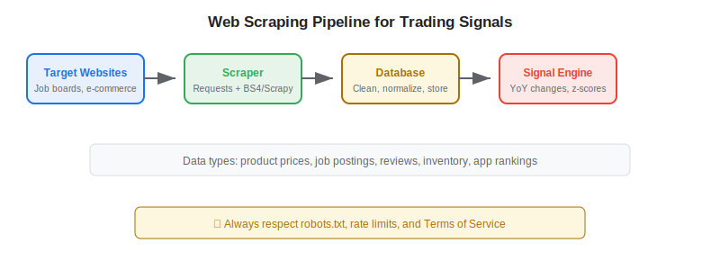
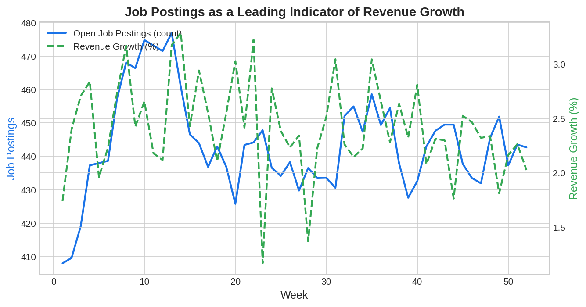

Web scraping is the foundational technique behind much of the [alternative data](https://paperswithbacktest.com/wiki/best-alternative-data) used in algorithmic trading. By programmatically extracting data from websites — product prices, job listings, review counts, inventory levels, app rankings — traders build proprietary datasets that provide informational edges unavailable through traditional financial data. This guide covers practical Python implementations, legal considerations, and production best practices.

## What Is Web Scraping in Trading?

Web scraping for trading is the automated extraction of structured data from websites to generate trading signals. The scraped data falls outside traditional financial databases and often captures real-time business activity before it appears in quarterly reports.

Common scraping targets for traders include e-commerce product prices and inventory levels, job posting counts by company as a growth indicator, app store ratings and download estimates, restaurant reservation availability, airline seat availability and pricing, and product review volumes and sentiment.

The value proposition is clear: while a vendor like Bloomberg Second Measure sells [transaction data](https://paperswithbacktest.com/wiki/credit-card-transaction-data-trading) for $100K+/year, a well-built scraper can capture complementary signals (product prices, inventory status) at a fraction of the cost.

Web scraping occupies a unique position in the alternative data ecosystem because it is both the most accessible entry point for new quant traders and one of the most engineering-intensive approaches at production scale. A graduate student with basic Python skills can build a price tracker for a handful of e-commerce products in an afternoon. But building a production system that reliably scrapes thousands of websites daily, handles anti-bot defenses, maintains data quality through site redesigns, and converts raw HTML into clean time series requires a dedicated engineering team.

The history of web scraping in finance goes back further than most realize. In the early 2000s, quant funds were already scraping job postings from Monster.com and CareerBuilder to estimate hiring trends at public companies. The Billion Prices Project at MIT, launched in 2008, demonstrated that daily web-scraped product prices from online retailers could [nowcast](https://paperswithbacktest.com/wiki/nowcasting-alternative-data) official inflation statistics with remarkable accuracy — weeks before the Bureau of Labor Statistics published the CPI. This research helped legitimize web scraping as a serious data source for institutional investors and spawned a generation of fintech startups offering scraped data as a service.

Today, the line between "web scraping" and "alternative data vendor" is often blurry. Many of the most popular alternative data products — job posting counts from LinkUp, product review sentiment from Thinknum, app store rankings from Sensor Tower — are fundamentally web scraping operations packaged with clean APIs, historical databases, and compliance wrappers. When a trader evaluates whether to build or buy a web-scraped data feed, they are really asking: is the engineering cost of maintaining my own scraper lower than the subscription fee, and is the proprietary customization worth the effort?

## Core Python Libraries for Web Scraping

| Library | Best For | JavaScript Support | Speed |
|---|---|---|---|
| `requests` + `BeautifulSoup` | Static HTML pages | No | Fast |
| `Scrapy` | Large-scale crawling | No (native) | Very fast |
| `Selenium` / `Playwright` | JavaScript-rendered pages | Yes | Slow |
| `httpx` | Async HTTP requests | No | Fast |
| `lxml` | XML/HTML parsing | No | Very fast |

## Python Implementation: E-Commerce Price Tracker

Here is a production-ready pattern for scraping product prices to detect inventory or pricing changes:

```python
import requests
from bs4 import BeautifulSoup
import pandas as pd
import time
import hashlib
from datetime import datetime

class PriceTracker:
    """Track product prices from e-commerce sites for trading signals."""
    
    def __init__(self, user_agent: str = "ResearchBot/1.0"):
        self.session = requests.Session()
        self.session.headers.update({"User-Agent": user_agent})
        self.history = []
    
    def fetch_page(self, url: str, delay: float = 2.0) -> BeautifulSoup:
        """Fetch and parse a web page with rate limiting."""
        time.sleep(delay)  # respect rate limits
        response = self.session.get(url, timeout=15)
        response.raise_for_status()
        return BeautifulSoup(response.text, "html.parser")
    
    def extract_price(self, soup: BeautifulSoup, 
                      css_selector: str) -> float | None:
        """Extract price from a parsed page using CSS selector."""
        element = soup.select_one(css_selector)
        if element:
            text = element.get_text(strip=True)
            # Remove currency symbols and commas
            clean = text.replace("$", "").replace(",", "").replace("£", "")
            try:
                return float(clean)
            except ValueError:
                return None
        return None
    
    def compute_signal(self, prices: list[float], 
                       lookback: int = 7) -> dict:
        """
        Compute trading signal from price history.
        Rising prices suggest strong demand; falling suggests weakness.
        """
        if len(prices) < lookback + 1:
            return {"signal": "INSUFFICIENT_DATA"}
        
        recent = prices[-lookback:]
        prior = prices[-(2*lookback):-lookback]
        
        avg_recent = sum(recent) / len(recent)
        avg_prior = sum(prior) / len(prior)
        pct_change = (avg_recent - avg_prior) / avg_prior
        
        return {
            "avg_recent_price": round(avg_recent, 2),
            "avg_prior_price": round(avg_prior, 2),
            "price_change_pct": f"{pct_change:+.2%}",
            "signal": "BULLISH" if pct_change > 0.02 else "BEARISH" if pct_change < -0.02 else "NEUTRAL",
        }

# Example usage
tracker = PriceTracker()
# In production, you would scrape real URLs daily
# tracker.fetch_page("https://example.com/product/123")
```



## Building a Job Postings Scraper

Job posting counts are a powerful signal: companies hiring aggressively are likely growing, while hiring freezes signal trouble. Here is a pattern for tracking job listings:

```python
import pandas as pd
import numpy as np
from datetime import datetime, timedelta

def compute_hiring_signal(
    job_counts: pd.DataFrame,
    company: str,
    lookback_weeks: int = 4
) -> dict:
    """
    Compute hiring momentum signal from job posting counts.
    
    Parameters:
    - job_counts: DataFrame with columns [date, company, open_positions]
    - company: Company ticker or name to analyze
    - lookback_weeks: Period for momentum calculation
    """
    df = job_counts[job_counts["company"] == company].sort_values("date")
    
    if len(df) < lookback_weeks * 2:
        return {"signal": "INSUFFICIENT_DATA"}
    
    recent = df.tail(lookback_weeks)["open_positions"].mean()
    prior = df.iloc[-(2*lookback_weeks):-lookback_weeks]["open_positions"].mean()
    
    momentum = (recent - prior) / prior if prior > 0 else 0
    
    return {
        "company": company,
        "recent_avg_postings": int(recent),
        "prior_avg_postings": int(prior),
        "hiring_momentum": f"{momentum:+.1%}",
        "signal": "BULLISH" if momentum > 0.10 else "BEARISH" if momentum < -0.10 else "NEUTRAL",
    }

# Simulated example
np.random.seed(42)
dates = pd.date_range("2025-01-01", periods=12, freq="W")
data = pd.DataFrame({
    "date": dates,
    "company": "AAPL",
    "open_positions": np.random.poisson(450, 12) + np.arange(12) * 5,
})
print(compute_hiring_signal(data, "AAPL"))
```

## Legal and Ethical Considerations

Web scraping for trading operates in a legal gray area. Key principles to follow:

**Respect robots.txt**: Always check a site's `robots.txt` file and comply with its directives. Ignoring it exposes you to legal risk.

**Rate limiting**: Never overwhelm a server. Add delays between requests (2–5 seconds minimum). Use exponential backoff on errors.

**Terms of Service**: Many sites explicitly prohibit scraping in their ToS. Violating ToS can lead to IP blocks and potential legal action, particularly after the hiQ Labs v. LinkedIn Supreme Court case.

**Data licensing**: For production trading, consider purchasing data from vendors who have proper licensing agreements rather than scraping directly. This eliminates legal risk and provides cleaner, more reliable data.



## Limitations and Risks

**Website changes** break scrapers constantly. Sites redesign layouts, change CSS class names, and add anti-bot protections. Production scrapers require ongoing maintenance.

**Anti-scraping defenses** include CAPTCHAs, rate limiting, IP blocking, and JavaScript rendering requirements. These increase complexity and cost.

**Data quality** from scraping is inherently noisy. Missing data points, format changes, and incorrect extractions require robust data validation pipelines.

**Scalability**: Scraping thousands of pages daily requires proxy rotation, distributed infrastructure, and careful queue management — a significant engineering investment.

## Conclusion

Web scraping remains the most flexible and cost-effective way to build proprietary [alternative data](https://paperswithbacktest.com/wiki/how-can-alternative-data-be-integrated-into-quantitative-trading) for algorithmic trading. The Python ecosystem provides excellent tools for every scale, from quick research scripts using `requests` and BeautifulSoup to production crawlers built with Scrapy. Start with a single, well-defined data source (job postings or product prices), validate the trading signal, then scale to additional sources.

---

**Explore further on PapersWithBacktest:**
- Browse [backtested alternative data strategies](https://paperswithbacktest.com/strategies) with Python code and performance metrics
- Access [clean historical market data](https://paperswithbacktest.com/datasets) for equities, crypto, and futures
- Take the [algo trading course](https://paperswithbacktest.com/course) — 60+ video lessons and notebooks
- Related wiki pages: [Best Alternative Data Sources](https://paperswithbacktest.com/wiki/best-alternative-data) · [Web Traffic Alternative Data](https://paperswithbacktest.com/wiki/web-traffic-alternative-data)
