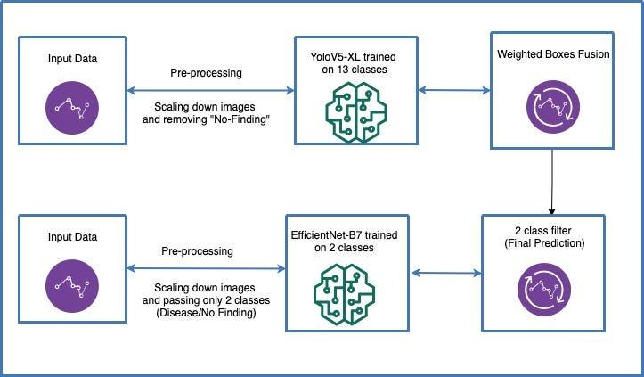

## Table of Contents

## What is object detection in the context of webpages?

Object detection on webpages involves identifying and locating different elements or objects within a web page, such as images, buttons, text boxes, and other interactive components. This process is crucial for web developers and designers to ensure that the layout and functionality of a webpage are working as intended. By detecting objects, developers can check if all elements are correctly placed and functioning, which helps in improving user experience and accessibility.

In practice, object detection on webpages can be achieved through various methods, including using browser developer tools or specialized software. For instance, when a developer inspects a webpage using browser tools, they can see the HTML structure and CSS styling that define the position and appearance of each object. This allows them to make adjustments or fix issues that might affect how users interact with the page. Additionally, automated tools can scan webpages to detect objects and report any discrepancies or errors, making maintenance and updates more efficient.

## Why is object detection important for web applications?

Object detection is important for web applications because it helps developers make sure everything on the webpage works correctly. When developers can see and understand all the parts of a webpage, like buttons, images, and text boxes, they can fix problems quickly. This means users will have a better experience because all the parts of the webpage will work as expected. For example, if a button isn't working, object detection can help find and fix it before users even notice.

Another reason object detection is important is that it helps with making webpages easier to use for everyone. This includes people who use special tools like screen readers. By knowing where all the objects are on a page, developers can make sure these tools work well with the webpage. This makes the internet a better place for everyone, no matter how they access it. In the end, object detection helps keep webpages running smoothly and makes them more accessible to all users.

## What are the basic components of a Webpage Object Detection Pipeline?

The first part of a Webpage Object Detection Pipeline is capturing the webpage. This means taking a screenshot or getting the HTML code of the page. Once you have the webpage data, the next step is to process it. This involves using special software or tools to look at the page and find all the objects like buttons, images, and text boxes. The tools use rules or patterns to know what to look for. For example, they might look for specific HTML tags to find different types of objects.

After the objects are found, the pipeline needs to understand what each object is and where it is on the page. This step is called classification and localization. The software labels each object, like saying "this is a button" or "this is an image." It also figures out the exact position of each object on the page. This information can be shown using coordinates, like $$ (x, y) $$ for the top-left corner and $$ (width, height) $$ for the size of the object. Once all objects are identified and located, the pipeline can send this information to developers or other systems that need it.

The last part of the pipeline is using the detected objects to improve the webpage. Developers can use this information to fix problems, make the page easier to use, or check if everything is working correctly. For example, if a button is not in the right place, they can move it. Or if an image is not loading, they can fix it. This helps make sure the webpage is good for everyone who uses it, including people who need special tools like screen readers.

## How does the CoVA pipeline approach webpage object detection?

The CoVA pipeline, which stands for Component-based Visual Analysis, is a method for detecting objects on webpages. It works by first taking a screenshot of the webpage and then using computer vision techniques to find and label different parts of the page. CoVA looks at the visual features of the webpage, like colors, shapes, and text, to figure out what each part is. For example, it might see a rectangle with text inside and decide it's a button. This approach helps the pipeline understand the webpage even if the HTML code is messy or hard to read.

After detecting the objects, CoVA classifies them into categories like buttons, images, or text boxes. It also finds out where each object is on the page using coordinates, like $$ (x, y) $$ for the top-left corner and $$ (width, height) $$ for the size. This information is very useful for developers who want to check if everything on the webpage is in the right place and working correctly. By using CoVA, they can quickly see if there are any problems and fix them, making the webpage better for everyone who uses it.

## What are the common challenges faced when detecting objects on webpages?

One common challenge in detecting objects on webpages is dealing with dynamic content. Webpages often change as users interact with them, like when clicking a button or scrolling down. This means the objects on the page can move around or appear and disappear, making it hard for detection tools to keep track of everything. Another challenge is handling different screen sizes and resolutions. What looks like a button on a big screen might look very different on a small phone, so the detection tools need to be smart enough to recognize objects no matter the device.

Another issue is the complexity of modern web design. Webpages can have lots of layers, animations, and special effects that make it tricky to see where one object ends and another begins. For example, if a button is partly covered by a pop-up ad, it can be hard to detect. Also, webpages often use different languages and coding styles, which can confuse detection tools that are used to looking for certain patterns. This means the tools need to be flexible and able to understand many different ways of building webpages.

## What preprocessing steps are necessary for webpage object detection?

Before detecting objects on a webpage, you need to prepare the page properly. This means taking a screenshot or getting the HTML code of the webpage. Once you have this, you might need to clean up the data. This could involve removing ads or pop-ups that might confuse the detection tools. You also need to make sure the webpage looks the same every time you take a screenshot, so you might need to set the page to a specific size or zoom level. This helps the tools see the objects clearly and in the same place each time.

After cleaning up the data, you need to break it down into smaller parts that the detection tools can understand. This might mean turning the screenshot into smaller pieces or analyzing the HTML code to find where different objects start and end. You also need to think about how the webpage might look on different devices, like phones or computers. This means you might need to adjust the size or resolution of the screenshot to match what users will see. By doing these preprocessing steps, you make sure the detection tools have the best chance of finding all the objects correctly.

## How can machine learning models be trained for webpage object detection?

To train [machine learning](/wiki/machine-learning) models for webpage object detection, you first need to gather a lot of examples of webpages. These examples should include screenshots or HTML code of different webpages with all the objects like buttons, images, and text boxes clearly labeled. This labeled data is called a dataset. You can use this dataset to teach the machine learning model what different objects look like and where they are on the page. The model learns by looking at the examples over and over again, adjusting its understanding each time to get better at recognizing objects.

Once the model is trained, you test it on new webpages to see how well it can detect objects. If it makes mistakes, you can go back and add more examples to the dataset or adjust the model's settings to improve its accuracy. This process of training and testing might need to be repeated many times until the model is good enough to use on real webpages. By using machine learning, the model can learn to recognize objects even if they look a bit different on different webpages or devices.

## What are the key performance metrics to evaluate a webpage object detection model?

To evaluate how well a webpage object detection model works, you need to look at some important numbers. One key metric is accuracy, which tells you how often the model correctly finds and labels all the objects on a webpage. Another important metric is precision, which shows how many of the objects the model says it found are actually correct. Recall is also crucial, as it measures how many of the real objects on the page the model was able to find. You can use a formula called F1-score to combine precision and recall into one number, which is helpful for getting a balanced view of the model's performance. The F1-score is calculated as $$ F1 = 2 \times \frac{\text{precision} \times \text{recall}}{\text{precision} + \text{recall}} $$. 

Another metric to consider is the Intersection over Union (IoU), which checks how well the model's detected object matches the actual object's location on the page. IoU is calculated by dividing the area of overlap between the predicted and actual object by the area of their union. A higher IoU means the model is better at finding the exact spot of objects. Speed is also important, as you want the model to detect objects quickly so it can be used in real-time applications. By looking at all these metrics together, you can understand how good the model is at detecting objects on webpages and where it might need improvement.

## How does the choice of machine learning model affect the performance of webpage object detection?

The choice of machine learning model can greatly affect how well a webpage object detection system works. Different models have different strengths and weaknesses. For example, some models like Convolutional Neural Networks (CNNs) are very good at understanding images and can detect objects on webpages by looking at screenshots. They are good at finding patterns in pictures, which makes them great for recognizing buttons, images, and other visual elements. However, CNNs might need a lot of data to train and can be slow to process, which could be a problem if you need quick results.

On the other hand, models like decision trees or Random Forests can work well with HTML code and might be faster to train and use. These models can look at the structure of the webpage and find objects based on the HTML tags and attributes. They might not be as good at understanding visual elements as CNNs, but they can be very fast and work well with less data. The choice between these models depends on what you need the object detection system to do. If you need to detect objects quickly and don't have a lot of data, a simpler model might be better. But if you need very accurate detection of visual elements, a CNN might be worth the extra time and data.

## What advanced techniques can be applied to improve the accuracy of object detection on webpages?

One advanced technique to improve the accuracy of object detection on webpages is using transfer learning. This means taking a machine learning model that was trained on a lot of pictures and using it to start detecting objects on webpages. The model already knows how to find things in pictures, so it can learn faster and work better on webpages. For example, you can use a model that was trained on a big dataset like ImageNet and then fine-tune it with webpage screenshots. This helps the model understand the specific objects on webpages better and makes it more accurate.

Another technique is using ensemble methods, where you combine the results from different models to get a better answer. You might use one model that's good at finding buttons and another that's good at finding images. By putting their results together, you can get a more complete picture of the webpage. This can help catch objects that one model might miss and make the overall detection more accurate. Ensemble methods can be more complex to set up, but they often lead to better results because they use the strengths of different models.

## How can the CoVA pipeline be optimized for real-time webpage object detection?

To optimize the CoVA pipeline for real-time webpage object detection, you need to make it faster and more efficient. One way to do this is by using a smaller, lighter version of the machine learning model. This means the model can process the webpage screenshot quicker, which is important for real-time detection. You can also use techniques like pruning, where you remove parts of the model that don't help much with detecting objects. This makes the model smaller and faster without losing too much accuracy. Another way to speed things up is by using hardware that's good at running machine learning models, like GPUs or specialized chips.

Another important step is to preprocess the webpage data more efficiently. This means taking the screenshot or HTML code and getting it ready for the model as quickly as possible. You can do this by using faster algorithms to clean up the data and break it down into parts the model can understand. For example, you might use a simpler method to remove ads or pop-ups so the model can focus on the important objects. By making these preprocessing steps faster, you can get the webpage ready for detection in less time, which helps with real-time performance.

## What are the future trends and research directions in webpage object detection using machine learning?

Future trends in webpage object detection using machine learning are likely to focus on making detection faster and more accurate. One big trend is the use of more advanced [deep learning](/wiki/deep-learning) models, like those based on transformers, which can understand the context of a webpage better. These models can look at the whole page and figure out how different objects relate to each other, which can help them detect objects more accurately. Another trend is the use of federated learning, where many devices work together to train a model without sharing their data. This can help gather more data from different types of webpages and devices, making the model better at detecting objects no matter where they appear.

Another research direction is improving the models to work well on different devices and screen sizes. This means making sure the detection works just as well on a phone as it does on a computer. Researchers are also looking into using more real-time data to train models, so they can keep up with changes on webpages quickly. This could involve using techniques like online learning, where the model keeps learning and improving as it sees new webpages. By focusing on these areas, future webpage object detection systems will be faster, more accurate, and easier to use on any device.