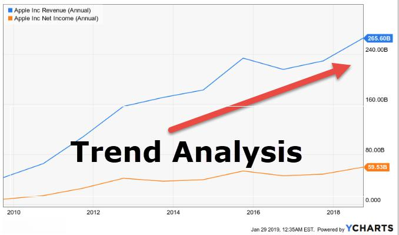

## Table of Contents

## What are company financial statistics?

Company financial statistics are numbers and data that show how a business is doing with its money. They tell us about things like how much money the company is making, how much it is spending, and how much it owes. These statistics help people like investors, managers, and analysts understand if the company is healthy and growing or if it is struggling.

There are many different types of financial statistics. Some common ones include revenue, which is the total amount of money a company makes from selling its products or services, and profit, which is what is left after the company pays all its costs. Other important statistics are assets, which are things the company owns that have value, and liabilities, which are the company's debts. By looking at these numbers, people can make decisions about whether to invest in the company or how to manage it better.

## Why are financial statistics important for businesses?

Financial statistics are really important for businesses because they show how well the company is doing with its money. They help business owners and managers see if the company is making enough money, spending too much, or if it owes too much money to others. By looking at these numbers, they can make smart choices about where to spend money, how to grow the business, or if they need to cut costs.

These statistics also help people outside the company, like investors and banks. Investors use them to decide if they should put their money into the company, hoping it will grow and they will make more money. Banks look at the statistics to see if the company is a good risk for loans. If the company's numbers look good, it might be easier to get a loan. So, financial statistics are key for making decisions that can help the business do well and keep growing.

## What types of financial statistics are commonly available on websites?

On websites, you can often find basic financial statistics like a company's revenue, which is how much money they make from selling things, and their profit, which is what's left after they pay for everything. These numbers are usually shown in reports called income statements. You might also see information about the company's assets, which are things they own that have value, and liabilities, which are the money they owe. These are found in balance sheets.

Another common statistic is the company's stock price, which shows how much each share of the company is worth on the stock market. Websites often have charts and graphs that show how the stock price has changed over time. You might also find data on the company's cash flow, which tells you how money moves in and out of the business. This can be important for understanding if the company has enough money to keep running smoothly.

Some websites also provide ratios like the price-to-earnings (P/E) ratio, which compares the company's stock price to its earnings per share. This helps investors see if the stock is a good buy. Other ratios might include the debt-to-equity ratio, which shows how much the company relies on borrowed money compared to money from shareholders. All these statistics help people make decisions about investing in or working with the company.

## How can beginners start using websites to access company financial statistics?

If you're new to looking at company financial statistics, start by visiting websites like Yahoo Finance or Google Finance. These sites are easy to use and have lots of information about different companies. Just type the name of the company you're interested in into the search bar, and you'll see a page with all sorts of numbers and charts. Look for sections like "Financials" or "Key Statistics" where you can find things like how much money the company makes, how much it spends, and how much it owes.

Once you're on the company's page, you can click on different tabs to see more details. For example, the "Income Statement" will show you the company's revenue and profit, while the "Balance Sheet" will tell you about its assets and liabilities. You might also want to check out the "Cash Flow" section to see how money moves in and out of the company. Don't worry if it seems confusing at first; the more you look at these numbers, the easier it will get. And remember, these websites often have tools and charts that can help you understand the data better.

## What are some of the most user-friendly websites for accessing financial statistics?

Yahoo Finance is one of the easiest websites to use for looking at company financial statistics. When you go to the site, you can just type in the name of the company you want to learn about. It will show you a page with lots of numbers and charts. You can find out how much money the company makes, how much it spends, and how much it owes. There are tabs like "Financials" and "Key Statistics" that make it simple to see all this information. Plus, Yahoo Finance has tools and graphs that help you understand the numbers better, even if you're new to this.

Another good website is Google Finance. It's also easy to use and has a lot of the same information as Yahoo Finance. You can search for a company and see its stock price, revenue, profit, and more. Google Finance has a clean layout that makes it easy to find what you're looking for. There are sections for the income statement, balance sheet, and cash flow, which are important for understanding a company's financial health. Both of these websites are great for beginners because they make it simple to get started with financial statistics.

## How do different websites vary in the depth and type of financial data they provide?

Different websites can show different amounts and types of financial data about companies. Some websites, like Yahoo Finance and Google Finance, give you basic information that's easy to understand. They show things like how much money a company makes, how much it spends, and how much it owes. These sites are good for beginners because they have simple charts and graphs that help you see the numbers clearly. They also let you look at a company's stock price and how it changes over time, which is helpful if you're thinking about investing.

Other websites, like Bloomberg and Morningstar, go into more detail. They have more advanced data and tools that can be useful if you want to learn more about a company's finances. For example, Bloomberg might show you more about a company's debts and how it's doing compared to other companies in the same industry. Morningstar might give you detailed reports and analysis that help you understand if a company is a good investment. These sites can be a bit harder to use if you're new to financial statistics, but they're great if you want to dive deeper into the numbers.

## What are the key features to look for in a website offering financial statistics?

When looking for a website that offers financial statistics, it's important to find one that is easy to use and has clear information. A good website should let you quickly search for a company and see basic numbers like how much money it makes, how much it spends, and how much it owes. It should have simple charts and graphs that help you understand these numbers better. Also, the website should be up-to-date, so you know you're looking at the latest information. Websites like Yahoo Finance and Google Finance are great examples because they make it easy for anyone to find and understand financial data.

Some websites go deeper into financial statistics and offer more advanced features. These sites might show you detailed reports about a company's debts, how it's doing compared to other companies, and special analysis that can help you decide if it's a good investment. Websites like Bloomberg and Morningstar are good for this because they give you a lot more information and tools. But they can be a bit harder to use if you're new to financial statistics. So, it's good to start with simpler sites and then move to more advanced ones as you learn more.

## How can one verify the accuracy and reliability of financial data from these websites?

To check if the financial data on a website is correct and reliable, you can start by looking at where the website gets its information. Good websites like Yahoo Finance and Google Finance usually get their data from official sources like the company's own reports or government filings. You can also compare the numbers on different websites to see if they match. If the numbers are the same on several sites, it's a good sign that the data is accurate. Another way to check is to look at the date of the information. Make sure it's recent, because old data might not be useful anymore.

Another thing you can do is read what other people say about the website. Look for reviews or articles that talk about how good the website's data is. If a lot of people trust the website and use it for their financial decisions, it's probably reliable. Also, some websites have special certifications or awards that show they are trusted sources of financial information. If you're still not sure, you can always go to the company's official website or look at their filings with the government to double-check the numbers. This way, you can feel more confident that the financial data you're using is accurate and reliable.

## What advanced tools and functionalities do expert-level websites offer for financial analysis?

Expert-level websites like Bloomberg and Morningstar offer advanced tools that help people do deep financial analysis. These websites have detailed reports that show a lot more than just basic numbers. For example, they can give you information about a company's debts, how it's doing compared to other companies in the same industry, and even predictions about how the company might do in the future. They also have special tools like stock screeners that let you find companies that meet certain financial criteria, which is really helpful if you're looking for good investments. These websites often have charts and graphs that you can change to see different kinds of data, making it easier to understand complex financial information.

Another important feature of these expert-level websites is the ability to do custom analysis. You can use their tools to create your own financial models and forecasts, which can be very useful if you're trying to make smart investment decisions. These websites also often have access to real-time data, so you can see the latest numbers as they come in. This is important because financial markets can change quickly, and having up-to-date information can make a big difference. Plus, many of these websites offer expert opinions and analysis from financial professionals, which can give you more insights into a company's performance and potential.

## How can financial statistics from websites be integrated into business decision-making processes?

Financial statistics from websites can help businesses make smart choices. When a company looks at numbers like how much money they are making, how much they are spending, and how much they owe, they can see if they are doing well or if they need to change something. For example, if a business sees that their costs are going up faster than their income, they might decide to find ways to spend less money. Websites like Yahoo Finance and Google Finance make it easy to find these numbers and use them to plan for the future. By checking these statistics regularly, a business can keep track of its health and make decisions that help it grow and stay strong.

Using financial statistics from websites can also help businesses when they are thinking about big decisions like investing in new projects or expanding to new places. For instance, if a company wants to open a new store, they can look at financial data to see if they have enough money to do it without getting into too much debt. They can also compare their numbers with other companies in the same industry to see how they are doing. Websites like Bloomberg and Morningstar offer more detailed reports and tools that can help with this kind of analysis. By using these resources, businesses can make choices that are based on solid information, which can lead to better results and more success.

## What are the legal and ethical considerations when using financial data from public websites?

When using financial data from public websites, it's important to think about the legal and ethical rules. Legally, you need to make sure you're not breaking any laws about how you use the data. For example, some websites might have rules about how you can share or use their information. Also, if you're using the data for business decisions, you need to be careful not to do anything that could be seen as insider trading, which is using secret information to make money in the stock market. It's always a good idea to check the website's terms of use and any laws that might apply to how you're using the data.

Ethically, it's important to use the data in a fair and honest way. This means not changing the numbers to make them look better or worse than they really are. It also means being clear about where you got the data from and not pretending it's your own work. If you're sharing the data with others, like in a report or presentation, you should give credit to the website where you found it. Using financial data ethically helps build trust and makes sure that everyone is playing by the same rules.

## How can one stay updated with the latest trends and tools in financial statistics websites?

To stay updated with the latest trends and tools in financial statistics websites, you can start by regularly visiting popular financial websites like Yahoo Finance, Google Finance, Bloomberg, and Morningstar. These sites often have sections dedicated to news and updates about new features or changes in how they present financial data. You can also sign up for newsletters or alerts from these websites, which will send you emails about new tools or important updates. Following financial news outlets and blogs can also help you learn about new trends and tools, as they often write about what's new in the world of financial statistics.

Another way to stay updated is by joining online communities and forums where people talk about financial statistics and investing. Websites like Reddit have groups where members share tips and discuss the latest tools and trends. You can also follow experts and influencers on social media platforms like Twitter or LinkedIn, where they often post about new developments in financial data analysis. By staying active in these communities and keeping an eye on what experts are saying, you can make sure you're always using the most up-to-date tools and information for your financial analysis.

## References & Further Reading

[1]: Bergstra, J., Bardenet, R., Bengio, Y., & Kégl, B. (2011). ["Algorithms for Hyper-Parameter Optimization."](https://dl.acm.org/doi/10.5555/2986459.2986743) Advances in Neural Information Processing Systems 24.

[2]: Lopez de Prado, M. (2018). ["Advances in Financial Machine Learning."](https://www.amazon.com/Advances-Financial-Machine-Learning-Marcos/dp/1119482089) John Wiley & Sons.

[3]: Aronson, D. R. (2006). ["Evidence-Based Technical Analysis: Applying the Scientific Method and Statistical Inference to Trading Signals."](https://www.amazon.com/Evidence-Based-Technical-Analysis-Scientific-Statistical/dp/0470008741) John Wiley & Sons.

[4]: Jansen, S. (2020). ["Machine Learning for Algorithmic Trading."](https://github.com/stefan-jansen/machine-learning-for-trading) Packt Publishing.

[5]: Chan, E. P. (2008). ["Quantitative Trading: How to Build Your Own Algorithmic Trading Business."](https://github.com/ftvision/quant_trading_echan_book) John Wiley & Sons.