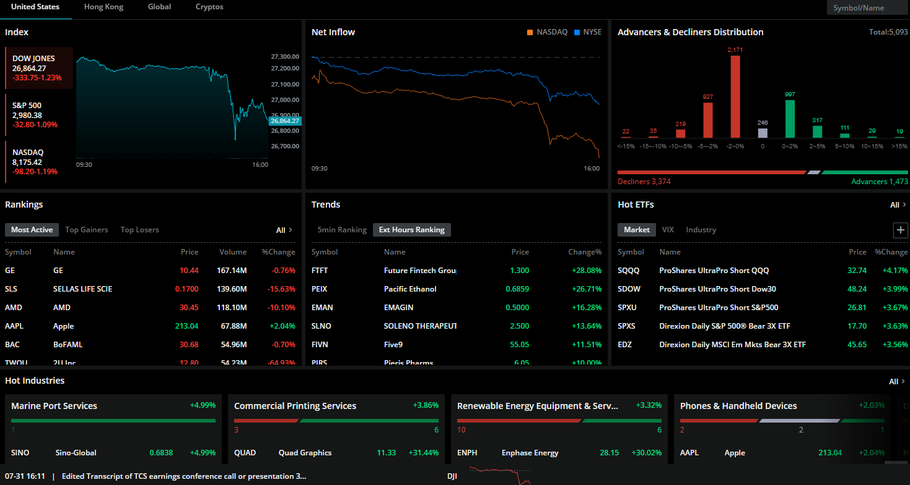

## Table of Contents

## What is Webull and what services does it offer?

Webull is a company that helps people buy and sell stocks, options, and other investments online. It's like a tool that makes it easy for anyone to start investing, even if they don't have a lot of money. You can use Webull on your phone or computer, and it doesn't cost a lot to use their services.

Webull offers different services to help people invest. They have a practice account where you can pretend to invest with fake money to learn how it works. They also give you information and tools to help you decide what to invest in. Plus, they have a community where people can talk about investing and share ideas.

## How can a beginner start using Webull?

To start using Webull, a beginner should first download the Webull app on their phone or visit the Webull website on their computer. Once the app is installed or the website is open, they need to sign up for an account. This involves entering some personal information like their name, email, and phone number. After signing up, they'll need to verify their identity, which usually means uploading a photo of their ID and maybe a selfie. Once everything is verified, they can set up a password and start using Webull.

After setting up the account, beginners can start exploring Webull's features. They can begin by using the practice account, which lets them trade with fake money to learn how investing works without risking real money. This is a great way to get comfortable with the platform. Once they feel ready, they can transfer real money into their Webull account and start buying and selling stocks, options, or other investments. Webull also offers educational resources and a community forum where beginners can learn more and ask questions.

## What are the fees associated with using Webull?

Webull does not charge any fees for trading stocks and ETFs. This means you can buy and sell these investments without paying any commission. However, there are some other fees you might need to know about. For example, if you want to trade options, Webull charges a small fee of $0.65 per contract. Also, if you need to transfer money out of your Webull account to your bank, there might be a fee for that, depending on how you do it.

There are also fees for certain services. If you need to have a paper statement sent to you, there's a fee for that. And if you want to use a wire transfer to move money, there are fees for both sending and receiving wire transfers. It's good to check Webull's fee schedule on their website to see all the possible fees, so you know what to expect.

## How does Webull's user interface compare to other trading platforms?

Webull's user interface is designed to be easy to use, even for people who are new to investing. The app and website have a clean look with simple menus and buttons that make it easy to find what you need. You can quickly see your investments, check stock prices, and make trades without getting confused. Compared to other trading platforms, Webull's interface is often seen as more modern and user-friendly. For example, platforms like E*TRADE or TD Ameritrade might have more features, but their interfaces can feel a bit more complicated and cluttered.

Another thing that makes Webull's interface stand out is how it uses colors and graphs to show information in a way that's easy to understand. You can see charts and graphs that help you see how stocks are doing at a glance. Other platforms might have similar tools, but Webull makes them easier to use and more visually appealing. Overall, if you're looking for a trading platform that's simple and easy to navigate, Webull's user interface is a great choice.

## What types of investment products can be traded on Webull?

Webull lets you trade different kinds of investments. You can buy and sell stocks, which are pieces of a company. You can also trade ETFs, which are like baskets of different stocks that you can buy and sell as one thing. Another type of investment you can trade on Webull is options, which are agreements that let you buy or sell a stock at a certain price in the future. 

Besides these, Webull also lets you trade cryptocurrencies like Bitcoin and Ethereum. This means you can buy and sell digital money on the platform. Webull gives you a lot of choices so you can pick the investments that fit your goals and how much risk you want to take.

## How does Webull ensure the security of user data and funds?

Webull takes the security of your data and money very seriously. They use strong encryption to keep your information safe when you're using their app or website. This means that your personal details and your money are protected from hackers. Webull also follows strict rules set by the government to make sure they're doing everything right. They have special teams that watch for anything suspicious and work to stop it before it becomes a problem.

Another way Webull keeps your money safe is by using something called SIPC insurance. This means that if something really bad happens to Webull, your money is protected up to $500,000. They also have other security measures like two-[factor](/wiki/factor-investing) authentication, which adds an extra step to make sure it's really you logging in. All these things together help make sure your data and funds are as safe as possible when you're using Webull.

## What are the advanced trading features available on Webull?

Webull offers several advanced trading features that can help experienced traders make better decisions. One of these features is the ability to set up different types of orders, like stop-loss and take-profit orders. These orders help you manage risk by automatically selling a stock if it drops to a certain price or if it reaches a target price you set. Webull also has a feature called paper trading, which lets you practice trading with fake money. This is great for trying out new strategies without risking real money.

Another advanced feature on Webull is the ability to use technical analysis tools. These tools help you look at charts and patterns to predict how a stock might move in the future. You can draw lines on charts, add indicators like moving averages, and even set up custom alerts to notify you when a stock hits a certain price or shows a specific pattern. Webull also offers real-time market data and news, which can be crucial for making quick trading decisions based on the latest information.

## How does Webull's mobile app enhance the trading experience?

Webull's mobile app makes trading easier and more convenient. You can use it on your phone, so you can check your investments and make trades from anywhere. The app is designed to be simple and easy to use, with big buttons and clear menus. This means you can quickly find what you need without getting confused. You can also set up alerts on the app, so it will notify you if a stock reaches a certain price or if something important happens in the market.

The app also has cool features that help you make better trading decisions. You can look at charts and use tools to see how stocks are doing. These tools help you understand if a stock might go up or down. Plus, the app gives you real-time information about the market, so you can make quick decisions based on the latest news. Overall, Webull's mobile app makes trading more accessible and helps you stay on top of your investments no matter where you are.

## What analytical tools does Webull provide for market analysis?

Webull gives you lots of tools to help you understand the market better. You can look at charts that show how stocks are doing over time. These charts let you draw lines and add things like moving averages, which help you see patterns and predict where a stock might go next. You can also use indicators like the Relative Strength Index (RSI) or the Moving Average Convergence Divergence (MACD) to see if a stock is overbought or oversold. These tools make it easier to decide when to buy or sell.

Another helpful feature is the ability to set up custom alerts. You can tell Webull to notify you if a stock hits a certain price or if it shows a specific pattern on the chart. This way, you don't have to watch the market all the time. Webull also gives you real-time data and news, so you can make quick decisions based on the latest information. All these tools together help you analyze the market and make smarter trading choices.

## How does Webull's customer support perform, and what are the available support channels?

Webull's customer support is pretty good and easy to use. They have a lot of ways to help you if you have questions or problems. You can reach them by email, phone, or through their website with a live chat. They also have a big help center with lots of articles and videos that can answer many common questions. This means you can often find the help you need without even talking to someone.

The support team at Webull is usually quick to answer and friendly. If you call them, you might have to wait a bit, but they try to help you as fast as they can. The live chat is really handy because you can get help right away while you're using the app or website. Overall, Webull makes sure you can get the help you need in a way that's easy and convenient.

## What are the regulatory compliances and licenses that Webull holds?

Webull follows strict rules to make sure they are doing things the right way. They are regulated by the Financial Industry Regulatory Authority (FINRA) and the Securities and Exchange Commission (SEC) in the United States. This means they have to follow the laws and rules set by these groups to protect people who use their services. Webull is also a member of the Securities Investor Protection Corporation (SIPC), which helps protect your money if something goes wrong with the company.

In addition to these, Webull has licenses that let them offer different services. They have a broker-dealer license, which allows them to help people buy and sell stocks and other investments. They also have the right permissions to offer options trading and [cryptocurrency](/wiki/cryptocurrency) trading. All these licenses and compliances show that Webull is working hard to be a safe and trustworthy place for people to invest their money.

## How does Webull's performance in terms of execution speed and reliability compare to industry standards?

Webull is known for being fast and reliable when it comes to making trades. When you want to buy or sell a stock, Webull usually does it quickly. This is important because in trading, even a few seconds can make a big difference. Compared to other trading platforms, Webull's speed is pretty good. They use strong technology to make sure your trades happen fast and without problems. This helps you feel confident that your orders will go through when you need them to.

In terms of reliability, Webull works hard to make sure their platform is always up and running. They have systems in place to keep things running smoothly, even when a lot of people are using the app at the same time. While no platform is perfect, Webull does a good job of keeping things stable. When you compare Webull to other platforms, it holds up well. People who use Webull often say they can count on it to work when they need it, which is a big plus for anyone who is trading.

## References & Further Reading

[1]: Bergstra, J., Bardenet, R., Bengio, Y., & Kégl, B. (2011). ["Algorithms for Hyper-Parameter Optimization."](https://papers.nips.cc/paper/4443-algorithms-for-hyper-parameter-optimization) Advances in Neural Information Processing Systems 24.

[2]: ["Advances in Financial Machine Learning"](https://www.amazon.com/Advances-Financial-Machine-Learning-Marcos/dp/1119482089) by Marcos Lopez de Prado

[3]: ["Evidence-Based Technical Analysis: Applying the Scientific Method and Statistical Inference to Trading Signals"](https://www.amazon.com/Evidence-Based-Technical-Analysis-Scientific-Statistical/dp/0470008741) by David Aronson

[4]: ["Machine Learning for Algorithmic Trading"](https://github.com/stefan-jansen/machine-learning-for-trading) by Stefan Jansen

[5]: ["Quantitative Trading: How to Build Your Own Algorithmic Trading Business"](https://books.google.com/books/about/Quantitative_Trading.html?id=j70yEAAAQBAJ) by Ernest P. Chan