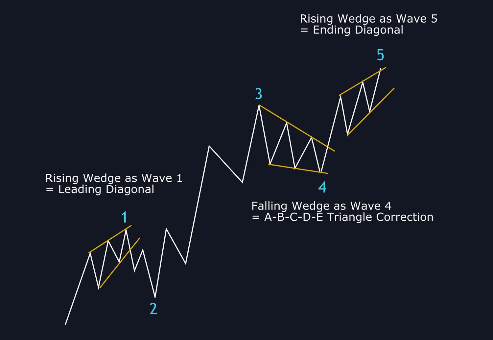

## Table of Contents

## What is a wedge pattern in technical analysis?

A wedge pattern in technical analysis is a chart pattern that shows price movements getting squeezed between two lines that are coming closer together. These lines can be either rising or falling, but they always move in the same direction. The pattern looks like a wedge, which is why it's called that. Traders watch this pattern because it often means that the price of a stock or other asset might soon break out in a big way.

There are two main types of wedge patterns: rising wedges and falling wedges. A rising wedge happens when the price is going up, but the upward moves are getting smaller and smaller. This usually means that the price might soon start to fall. On the other hand, a falling wedge happens when the price is going down, but the downward moves are getting smaller. This often means that the price might soon start to rise. Traders use these patterns to try to predict when a big price move might happen and to decide whether to buy or sell.

## How does a falling wedge pattern differ from a rising wedge pattern?

A falling wedge pattern and a rising wedge pattern are both chart patterns that show price movements squeezed between two lines that are coming closer together. The main difference between them is the direction of the price trend before the pattern forms. In a falling wedge, the price is going down before the pattern starts, but the downward moves get smaller and smaller. This often means that the price might soon start to go up. On the other hand, in a rising wedge, the price is going up before the pattern starts, but the upward moves get smaller and smaller. This usually means that the price might soon start to go down.

Both patterns are important for traders because they can signal a big price move is coming. When you see a falling wedge, it's a sign that the downward trend might be losing strength, and a breakout to the upside could happen. Traders might see this as a good time to buy. When you see a rising wedge, it's a sign that the upward trend might be losing strength, and a breakout to the downside could happen. Traders might see this as a good time to sell. By understanding these patterns, traders can make better decisions about when to enter or exit a trade.

## What are the key characteristics of a falling wedge pattern?

A falling wedge pattern happens when the price of something, like a stock, is going down but the downward moves are getting smaller and smaller. The pattern looks like a wedge that is pointing down. It is made up of two lines that are coming closer together. The top line is the resistance line, and it is sloping down. The bottom line is the support line, and it is also sloping down, but not as steeply as the top line. This means that the price is getting squeezed between these two lines.

Traders watch for this pattern because it often means that the price might soon start to go up. When the price breaks out of the wedge to the upside, it can be a good time to buy. The falling wedge shows that even though the price was going down, the downward moves were getting weaker. This can be a sign that the sellers are losing power and the buyers might soon take over. So, a falling wedge can be a good signal for traders to get ready for a possible upward move in the price.

## What are the key characteristics of a rising wedge pattern?

A rising wedge pattern happens when the price of something, like a stock, is going up but the upward moves are getting smaller and smaller. The pattern looks like a wedge that is pointing up. It is made up of two lines that are coming closer together. The top line is the resistance line, and it is sloping up. The bottom line is the support line, and it is also sloping up, but not as steeply as the top line. This means that the price is getting squeezed between these two lines.

Traders watch for this pattern because it often means that the price might soon start to go down. When the price breaks out of the wedge to the downside, it can be a good time to sell. The rising wedge shows that even though the price was going up, the upward moves were getting weaker. This can be a sign that the buyers are losing power and the sellers might soon take over. So, a rising wedge can be a good signal for traders to get ready for a possible downward move in the price.

## How can traders identify a wedge pattern on a price chart?

To identify a wedge pattern on a price chart, traders need to look for two lines that are coming closer together. These lines can be either going up or going down, but they should be moving in the same direction. The lines form the sides of the wedge. The top line is called the resistance line, and the bottom line is called the support line. In a rising wedge, both lines are going up, but the top line is steeper than the bottom line. In a falling wedge, both lines are going down, but the top line is less steep than the bottom line.

Traders should also pay attention to the price movements within the wedge. In a rising wedge, the price is making higher highs and higher lows, but the distance between these highs and lows is getting smaller. This shows that the upward moves are getting weaker. In a falling wedge, the price is making lower highs and lower lows, but the distance between these highs and lows is also getting smaller. This shows that the downward moves are getting weaker. By watching these patterns and the way the price moves within them, traders can spot a wedge pattern and get ready for a possible big price move when the price breaks out of the wedge.

## What does a breakout from a falling wedge pattern typically signify?

A breakout from a falling wedge pattern usually means that the price of a stock or other asset is about to go up. When you see a falling wedge, it means the price has been going down, but the downward moves are getting smaller. This shows that the sellers are losing power. When the price finally breaks out of the wedge and goes above the top line, it's a sign that the buyers are taking over. Traders see this as a good time to buy because they think the price will keep going up.

The breakout from a falling wedge can be a strong signal for traders. They often look for other signs to confirm the breakout, like a big increase in trading volume. If the volume goes up a lot when the price breaks out, it's even more likely that the price will keep going up. By watching for these signs, traders can make better decisions about when to buy and sell, and they can try to make money from the upward move in the price.

## What does a breakout from a rising wedge pattern typically signify?

A breakout from a rising wedge pattern usually means that the price of a stock or other asset is about to go down. When you see a rising wedge, it means the price has been going up, but the upward moves are getting smaller. This shows that the buyers are losing power. When the price finally breaks out of the wedge and goes below the bottom line, it's a sign that the sellers are taking over. Traders see this as a good time to sell because they think the price will keep going down.

The breakout from a rising wedge can be a strong signal for traders. They often look for other signs to confirm the breakout, like a big increase in trading volume. If the volume goes up a lot when the price breaks out, it's even more likely that the price will keep going down. By watching for these signs, traders can make better decisions about when to buy and sell, and they can try to make money from the downward move in the price.

## How can volume be used to confirm a wedge pattern breakout?

Volume is really important when traders want to know if a breakout from a wedge pattern is real. When the price breaks out of a wedge, traders look at the volume to see if it's higher than usual. If the volume is a lot higher when the price breaks out, it means more people are trading, and this can make the breakout stronger. For a falling wedge, if the price breaks out to the upside with high volume, it's a good sign that the price will keep going up. For a rising wedge, if the price breaks out to the downside with high volume, it's a good sign that the price will keep going down.

Traders use volume to check if the breakout is just a fake move or if it's a real change in the price direction. If the volume doesn't go up much when the price breaks out, traders might think the breakout is not strong and the price might go back into the wedge. But if the volume is high, it gives traders more confidence that the breakout is real and the price will keep moving in the new direction. So, watching the volume helps traders make better decisions about when to buy or sell.

## What are common entry and exit strategies for trading wedge patterns?

When trading wedge patterns, a common entry strategy for a falling wedge is to buy when the price breaks out above the top line of the wedge. Traders often wait for the price to close above this line to make sure the breakout is real. They also look for high volume to confirm the breakout. For a rising wedge, the common entry strategy is to sell when the price breaks out below the bottom line of the wedge. Again, traders wait for a close below this line and check for high volume to make sure the breakout is strong.

For exit strategies, traders often set a target price based on the height of the wedge. For a falling wedge, they measure the distance from the start of the wedge to the point where the two lines meet, and then add this distance to the breakout point to find the target. For a rising wedge, they do the same but subtract the distance from the breakout point. Another common exit strategy is to use a stop-loss order. For a falling wedge, traders might set a stop-loss just below the lowest point inside the wedge. For a rising wedge, they might set it just above the highest point inside the wedge. This helps them limit their losses if the price moves against them.

## How do wedge patterns fit into broader market analysis?

Wedge patterns are important tools in broader market analysis because they help traders understand where the price of a stock or other asset might be heading. When traders see a wedge pattern on a chart, it can tell them that a big price move might be coming soon. This is useful because it helps them decide when to buy or sell. Wedge patterns can be part of a bigger picture that traders look at, like trends, support and resistance levels, and other chart patterns. By putting all these pieces together, traders can get a better idea of what the market might do next.

In a bigger market analysis, wedge patterns can also show how strong or weak a trend is. For example, if a stock has been going up for a while and then forms a rising wedge, it might mean that the upward trend is getting weaker. This can be a warning sign for traders to be careful. On the other hand, if a stock has been going down and then forms a falling wedge, it might mean that the downward trend is losing strength, and a turnaround could be coming. By watching these patterns and how they fit into the overall market, traders can make smarter choices about their trades.

## What are the psychological factors driving the formation of wedge patterns?

Wedge patterns form because of how people feel about buying and selling. When a falling wedge starts, the price is going down, and people are selling more than they are buying. But as the wedge gets smaller, the sellers start to feel less sure about selling. They see that the price isn't going down as fast anymore, so they start to sell less. At the same time, some buyers see that the price is not falling as much and think it might be a good time to buy. This change in how people feel can make the price break out of the wedge and start going up.

For a rising wedge, it's the opposite. The price is going up at first, and people are buying more than they are selling. But as the wedge gets smaller, the buyers start to feel less sure about buying. They see that the price isn't going up as fast anymore, so they start to buy less. At the same time, some sellers see that the price is not rising as much and think it might be a good time to sell. This change in how people feel can make the price break out of the wedge and start going down. So, wedge patterns show how people's feelings about buying and selling can change over time and affect the price.

## How can advanced traders use wedge patterns in conjunction with other technical indicators for more accurate predictions?

Advanced traders can use wedge patterns along with other technical indicators to make better guesses about where the price might go next. For example, they might use moving averages to see if the price is following a trend. If a falling wedge forms and the price breaks out above the top line while also moving above a key moving average, it can be a strong sign that the price will keep going up. Traders might also use the Relative Strength Index (RSI) to see if the price is overbought or oversold. If a rising wedge breaks out to the downside and the RSI shows the price is overbought, it can confirm that the price might keep going down.

Another way advanced traders use wedge patterns is by looking at other chart patterns and volume. For instance, if a head and shoulders pattern forms right after a rising wedge breakout, it can be a double sign that the price will go down. Volume is also important. If the volume is high when the price breaks out of a wedge, it can make the breakout more likely to be real. By putting all these pieces together, like wedge patterns, moving averages, RSI, other chart patterns, and volume, advanced traders can get a clearer picture of what the market might do next and make smarter trading choices.

## References & Further Reading

[1]: Bulkowski, T. N. (2005). ["Encyclopedia of Chart Patterns (Wiley Trading)."](https://www.wiley.com/en-us/Encyclopedia+of+Chart+Patterns,+3rd+Edition-p-9781119739685) Wiley.

[2]: Murphy, J. J. (1999). ["Technical Analysis of the Financial Markets: A Comprehensive Guide to Trading Methods and Applications."](https://archive.org/details/technicalanalysi0000murp) New York Institute of Finance.

[3]: Elder, A. (1993). ["Trading for a Living: Psychology, Trading Tactics, Money Management."](https://www.amazon.com/Trading-Living-Psychology-Tactics-Management/dp/0471592242) Wiley.

[4]: Pring, M. J. (2002). ["Technical Analysis Explained: The Successful Investor's Guide to Spotting Investment Trends and Turning Points."](https://www.amazon.com/Technical-Analysis-Explained-Fifth-Successful/dp/0071825177) McGraw-Hill Education.

[5]: Nison, S. (2001). ["Japanese Candlestick Charting Techniques: A Contemporary Guide to the Ancient Investment Techniques of the Far East."](https://archive.org/details/japanesecandlest0000niso) New York Institute of Finance.