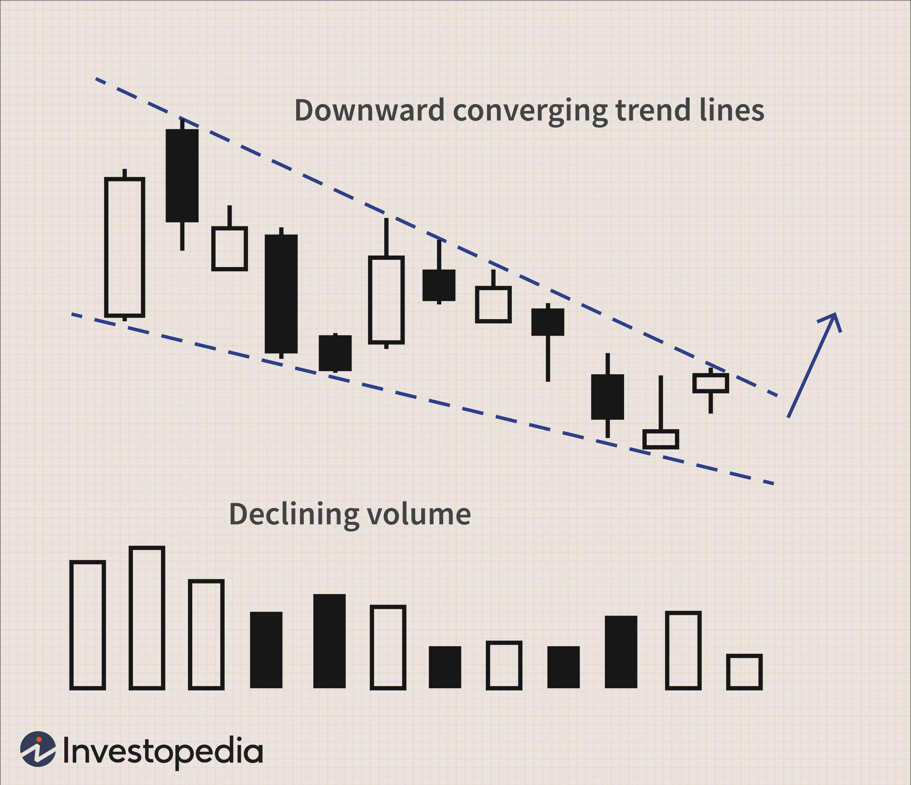

## Table of Contents

## What is a wedge pattern in trading?

A wedge pattern in trading is a type of chart pattern that traders use to predict future price movements. It looks like a triangle that is either pointing up or down. The pattern forms when the price of a stock or other asset moves between two lines that are getting closer together. These lines are called trend lines. When the price breaks out of the wedge, it usually means that the price will continue to move in the direction of the breakout.

There are two types of wedge patterns: rising wedges and falling wedges. A rising wedge happens when the price is going up, but the trend lines are getting closer together. This usually means that the price will eventually go down after breaking out of the wedge. On the other hand, a falling wedge happens when the price is going down, but the trend lines are also getting closer together. This usually means that the price will go up after breaking out of the wedge. Traders watch these patterns closely to make decisions about buying or selling.

## How does a wedge pattern form on a price chart?

A wedge pattern forms on a price chart when the price of a stock or asset moves between two trend lines that are getting closer together. These trend lines can be drawn by connecting the highs and lows of the price movements. As the price continues to move, it creates a shape that looks like a triangle. This triangle can point either up or down, depending on whether it's a rising wedge or a falling wedge. The key thing to watch is how the price behaves within these narrowing trend lines.

In a rising wedge, the price is making higher highs and higher lows, but the angle of the trend lines is such that they are converging. This means that even though the price is going up, the upward movement is getting weaker. Eventually, the price will break out of the wedge, usually downward, signaling that it might be time to sell. In a falling wedge, the price is making lower highs and lower lows, but again, the trend lines are coming together. This suggests that the downward movement is losing strength. When the price breaks out of a falling wedge, it usually goes up, which could be a good time to buy.

## What are the key differences between a rising wedge and a falling wedge?

A rising wedge and a falling wedge are two types of chart patterns that traders use to predict price movements. A rising wedge forms when the price of a stock or asset is going up, but the trend lines that connect the highs and lows are getting closer together. This means the price is making higher highs and higher lows, but the upward movement is getting weaker. When the price finally breaks out of a rising wedge, it usually goes down. This can be a signal for traders to sell their holdings because the price might keep falling.

On the other hand, a falling wedge forms when the price is going down, but the trend lines are also getting closer together. In this case, the price is making lower highs and lower lows, but the downward movement is losing strength. When the price breaks out of a falling wedge, it usually goes up. This can be a signal for traders to buy because the price might keep rising. So, the main difference between the two is the direction of the price movement before the breakout and the expected direction after the breakout.

## How can traders identify a wedge pattern in the market?

Traders can identify a wedge pattern by looking at the price chart of a stock or asset. They need to draw two trend lines that connect the highs and lows of the price movements. If these trend lines are getting closer together, and the price is moving between them, it might be forming a wedge pattern. The key is to see if the price is making higher highs and higher lows for a rising wedge, or lower highs and lower lows for a falling wedge. The trend lines should be converging, which means they are coming together as the pattern develops.

Once traders spot a possible wedge pattern, they need to watch for the breakout. A breakout happens when the price moves outside of the trend lines. For a rising wedge, if the price breaks down below the lower trend line, it's a sign that the price might keep going down. For a falling wedge, if the price breaks up above the upper trend line, it's a sign that the price might keep going up. Traders use these breakouts to make decisions about buying or selling, based on the direction the price is likely to move after leaving the wedge pattern.

## What does a breakout from a wedge pattern signify?

A breakout from a wedge pattern is a big deal for traders. It happens when the price of a stock or asset moves outside the two trend lines that make up the wedge. If it's a rising wedge, the price usually breaks down below the lower trend line. This means the price might keep going down. Traders see this as a sign to sell their stocks because they think the price will keep falling.

On the other hand, if it's a falling wedge, the price usually breaks up above the upper trend line. This means the price might keep going up. Traders see this as a sign to buy stocks because they think the price will keep rising. So, a breakout from a wedge pattern helps traders guess what the price will do next and make their trading decisions.

## What are the common entry points for trading a wedge pattern?

When trading a wedge pattern, the most common entry point is right after the price breaks out of the wedge. For a rising wedge, you would enter a short position, which means you sell, when the price breaks down below the lower trend line. This is because the breakout usually means the price will keep going down. For a falling wedge, you would enter a long position, which means you buy, when the price breaks up above the upper trend line. This is because the breakout usually means the price will keep going up.

Another entry point some traders use is before the breakout happens. They might enter a trade when the price touches one of the trend lines for the last time before breaking out. This can be riskier because you don't know for sure if the breakout will happen, but it can also be more rewarding if you get it right. For a rising wedge, you would sell when the price touches the upper trend line, and for a falling wedge, you would buy when the price touches the lower trend line.

## How do you set stop-loss orders when trading wedge patterns?

When trading wedge patterns, setting a stop-loss order is important to limit your risk. For a rising wedge, where you are selling when the price breaks down below the lower trend line, you should set your stop-loss just above the highest point inside the wedge. This way, if the price goes back up into the wedge, your stop-loss will trigger and you won't lose too much money. For a falling wedge, where you are buying when the price breaks up above the upper trend line, you should set your stop-loss just below the lowest point inside the wedge. This way, if the price goes back down into the wedge, your stop-loss will trigger and protect your investment.

Some traders also use a different method for setting stop-losses. They might place the stop-loss just outside the opposite trend line of the wedge. For a rising wedge, this means setting the stop-loss just above the upper trend line, and for a falling wedge, just below the lower trend line. This method gives the price more room to move before triggering the stop-loss, but it also means you might lose more money if the trade goes against you. It's all about finding a balance between giving the trade enough room to work and protecting yourself from big losses.

## What are the typical profit targets when trading wedges?

When trading wedges, traders often set their profit targets based on the height of the wedge. For a rising wedge, you measure the distance from the start of the wedge to the highest point inside it. When the price breaks down below the lower trend line, you add this distance to the breakout point to find your profit target. This means if the wedge is tall, your profit target will be further away from where you entered the trade. For a falling wedge, you do the same thing but in reverse. You measure the distance from the start of the wedge to the lowest point inside it. When the price breaks up above the upper trend line, you subtract this distance from the breakout point to find your profit target.

Some traders also use other methods to set profit targets. They might look at other support and resistance levels on the chart to decide where to take profits. Support levels are where the price might stop going down, and resistance levels are where the price might stop going up. If there's a strong support or resistance level near where the wedge pattern suggests the price will go, traders might set their profit target there. This way, they can take profits before the price might change direction. It's important to have a clear plan for where to take profits so you don't miss out on gains or hold onto a trade for too long.

## Can wedge patterns be used in conjunction with other technical indicators?

Yes, wedge patterns can be used with other technical indicators to make better trading decisions. Traders often use tools like moving averages, the Relative Strength Index (RSI), and the Moving Average Convergence Divergence (MACD) to confirm what the wedge pattern is telling them. For example, if a rising wedge suggests the price will go down, traders might look at the RSI to see if it's overbought, which means the price might really be ready to fall. Or, they might check if the MACD is showing a bearish signal, which would support the idea of selling.

Using these other indicators can help traders feel more confident about their trades. If a falling wedge suggests the price will go up, and the moving averages are also showing an upward trend, it can make traders more sure about buying. Plus, these indicators can help traders find the best times to enter and exit trades. For instance, if the price breaks out of a wedge and the RSI is showing it's not overbought or oversold, it might be a good time to act. Combining wedge patterns with other technical indicators can give traders a fuller picture of what might happen next in the market.

## How reliable are wedge patterns in predicting price movements?

Wedge patterns can be pretty helpful for traders trying to guess where the price of a stock or asset might go next. They are seen as reliable because they show that the price is moving in a way that's getting tighter and tighter, which often means a big move is coming soon. When the price breaks out of a wedge, it usually keeps going in the direction of the breakout. So, if you see a rising wedge and the price breaks down, it's a good sign to sell because the price might keep falling. If you see a falling wedge and the price breaks up, it's a good sign to buy because the price might keep rising.

But, wedge patterns aren't perfect. Sometimes, the price doesn't do what the wedge pattern says it should. Other things can affect the price, like news about the company or changes in the economy. That's why smart traders use wedge patterns along with other tools, like moving averages or the RSI, to make better guesses about what will happen next. By looking at more than just the wedge pattern, traders can feel more sure about their decisions and be ready for different possibilities.

## What are the psychological factors driving the formation of wedge patterns?

Wedge patterns form because of how people feel about buying and selling a stock or asset. When a rising wedge starts to form, it means more and more people are feeling unsure about the price going up. They start selling, even though the price is still going up a bit. This makes the price go up slower and slower, until it can't go up anymore and starts to fall. The wedge shape shows that people are getting less excited about the price going up, and more worried it might go down.

On the other hand, a falling wedge forms when people are feeling less and less sure about the price going down. They start buying, even though the price is still going down a bit. This makes the price go down slower and slower, until it can't go down anymore and starts to go up. The wedge shape shows that people are getting less worried about the price going down, and more hopeful it might go up. Both types of wedges show how people's feelings can change and affect the price of a stock or asset.

## How can algorithmic trading strategies be developed around wedge patterns?

Algorithmic trading strategies can be built around wedge patterns by using computer programs to spot these patterns on price charts and then make trades based on them. The program would look for the two trend lines that make up the wedge, one connecting the highs and the other connecting the lows, and see if they are getting closer together. When the price breaks out of the wedge, the program would automatically enter a trade. For a rising wedge, it would sell when the price breaks down below the lower trend line, expecting the price to keep falling. For a falling wedge, it would buy when the price breaks up above the upper trend line, expecting the price to keep rising.

To make these strategies work better, the program can also use other technical indicators to confirm the wedge pattern's signals. For example, it might check the Relative Strength Index (RSI) to see if the price is overbought or oversold, or look at the Moving Average Convergence Divergence (MACD) for more signs of whether to buy or sell. By combining these indicators with the wedge pattern, the program can make smarter trades and reduce the chance of losing money. This way, the algorithm can take advantage of the wedge pattern's predictions while also being ready for other things that might affect the price.

## References & Further Reading

[1]: Bergstra, J., Bardenet, R., Bengio, Y., & Kégl, B. (2011). ["Algorithms for Hyper-Parameter Optimization."](https://papers.nips.cc/paper/4443-algorithms-for-hyper-parameter-optimization) Advances in Neural Information Processing Systems 24.

[2]: ["Advances in Financial Machine Learning"](https://www.amazon.com/Advances-Financial-Machine-Learning-Marcos/dp/1119482089) by Marcos Lopez de Prado

[3]: ["Evidence-Based Technical Analysis: Applying the Scientific Method and Statistical Inference to Trading Signals"](https://www.amazon.com/Evidence-Based-Technical-Analysis-Scientific-Statistical/dp/0470008741) by David Aronson

[4]: ["Machine Learning for Algorithmic Trading"](https://github.com/stefan-jansen/machine-learning-for-trading) by Stefan Jansen

[5]: ["Quantitative Trading: How to Build Your Own Algorithmic Trading Business"](https://books.google.com/books/about/Quantitative_Trading.html?id=j70yEAAAQBAJ) by Ernest P. Chan