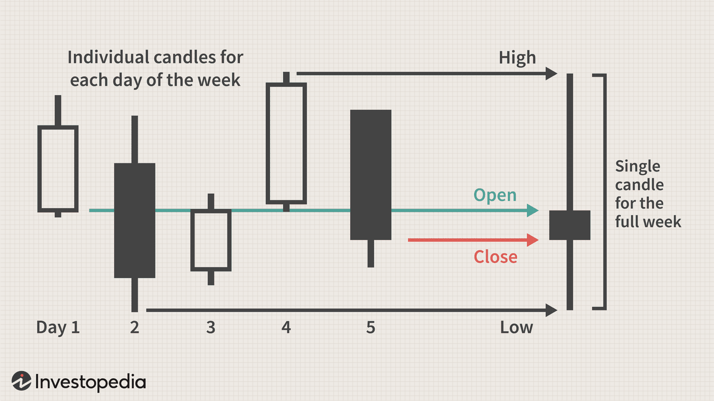

## Table of Contents

## What is a weekly chart and how is it different from daily and monthly charts?

A weekly chart is a type of chart used in financial markets to show the price movements of a stock, commodity, or other financial instrument over the course of a week. Each bar or candle on the chart represents one week's worth of data, showing the opening price, the highest price, the lowest price, and the closing price for that week. Traders and investors use weekly charts to get a broader view of the market trends and to make longer-term investment decisions.

Weekly charts are different from daily charts because they cover a longer time frame. A daily chart shows the price movements for each day, with each bar or candle representing one day's worth of data. This makes daily charts useful for short-term trading and for seeing more immediate price changes. On the other hand, weekly charts smooth out the daily fluctuations and help traders see the bigger picture over several weeks, which can be more helpful for making decisions about holding investments for a longer period.

Monthly charts are different from both weekly and daily charts because they cover an even longer time frame. Each bar or candle on a monthly chart represents one month's worth of data, showing the price movements over that month. Monthly charts are used by investors who are interested in very long-term trends and who might hold their investments for months or years. While weekly charts can help with medium-term decisions, monthly charts are best for understanding the overall direction of the market over extended periods.

## What are the primary uses of a weekly chart in data analysis?

Weekly charts are useful in data analysis for looking at trends over time. They help people see how things like stock prices or other data change from week to week. This can be important for making decisions about when to buy or sell something. By looking at a weekly chart, you can see if a trend is going up, down, or staying the same over several weeks. This bigger picture can help you understand if a change is just a short-term thing or part of a longer trend.

Another use of weekly charts is to compare different sets of data. For example, you might want to see how the sales of two different products are doing over time. A weekly chart can show you which product is doing better and help you make decisions about where to focus your efforts. It's also good for spotting patterns that might not be clear when looking at daily data. Weekly charts smooth out the small ups and downs, making it easier to see the overall direction things are going.

## How can weekly charts help in identifying long-term trends?

Weekly charts are great for spotting long-term trends because they show how things change over several weeks. When you look at a weekly chart, you can see if a trend is going up, down, or staying the same over time. This is helpful because it gives you a bigger picture than daily charts, which can be too detailed and show a lot of short-term ups and downs. By looking at the weekly chart, you can tell if a change in the data is just a short-term thing or if it's part of a bigger trend that's been going on for weeks.

For example, if you're looking at the price of a stock on a weekly chart, you might see that the price has been going up slowly over the last few months. This tells you that there's a long-term upward trend, even if there are some weeks where the price goes down a bit. This kind of information is really useful for making decisions about whether to keep holding onto the stock or if it's time to sell. Weekly charts help you see these long-term patterns clearly, making it easier to plan for the future.

## What are the advantages of using weekly charts over daily charts for beginners?

For beginners, weekly charts are easier to understand than daily charts because they show less detail. Daily charts can be confusing with all the ups and downs happening every day. Weekly charts smooth out these daily changes and show you the bigger picture over several weeks. This makes it simpler for someone new to see if a trend is going up, down, or staying the same without getting lost in all the small movements.

Another advantage of using weekly charts is that they help beginners focus on longer-term trends. When you're just starting out, it's easy to get caught up in short-term changes and make quick decisions that might not be the best. Weekly charts help you see how things are changing over time, which can lead to better decisions about when to buy or sell something. By looking at the bigger picture, beginners can learn to be more patient and make choices based on what's happening over weeks, not just days.

## In what scenarios would a monthly chart be more beneficial than a weekly chart?

Monthly charts are more helpful than weekly charts when you want to see how things change over a long time. If you're looking at something like the price of a stock or how much a product is selling, a monthly chart can show you the big trends over months or even years. This is good if you're planning to keep your investment for a long time and want to see if the overall direction is going up or down. Weekly charts might show you what's happening over a few weeks, but they can miss the bigger picture that monthly charts can show.

Another time when monthly charts are better is if you're trying to understand very slow changes. Some things, like the economy or big market trends, can take a long time to change. A monthly chart can help you see these slow changes more clearly than a weekly chart. For example, if you're looking at how the economy is doing, a monthly chart can show you if things are getting better or worse over time, which can help you make big decisions about where to put your money or what to invest in.

## How do weekly charts assist in reducing market noise compared to daily charts?

Weekly charts help reduce market noise by showing you how things change over a longer time. Daily charts can be full of small ups and downs that happen every day. These little changes can make it hard to see what's really going on. But when you look at a weekly chart, you see the bigger picture. Each bar or candle on the chart shows what happened over a whole week, so the small daily changes get smoothed out. This makes it easier to see if the price of a stock or something else is going up, down, or staying the same over time.

By using weekly charts, you can focus on the main trends without getting distracted by all the little movements that happen every day. For example, if you're looking at the price of a stock, a daily chart might show a lot of ups and downs that can be confusing. But a weekly chart will show you if the stock has been going up slowly over the last few weeks, even if there were some days when it went down. This helps you make better decisions because you're looking at what's happening over a longer time, not just what's happening right now.

## What technical analysis tools work best with weekly charts?

When using weekly charts, some of the best technical analysis tools are moving averages. Moving averages help you see the overall trend by smoothing out the ups and downs. A simple moving average, like a 10-week or 20-week moving average, can show you if the price is going up or down over time. If the price is above the moving average, it might mean the trend is going up. If it's below, the trend might be going down. This can help you decide when to buy or sell something.

Another good tool for weekly charts is the Relative Strength Index (RSI). The RSI helps you see if something is overbought or oversold. If the RSI is over 70, it might mean the price has gone up too much and could go down soon. If it's under 30, it might mean the price has gone down too much and could go up soon. Using the RSI on a weekly chart can help you see these signals more clearly than on a daily chart, because it's looking at the bigger picture over several weeks.

Support and resistance levels are also useful on weekly charts. These levels show where the price has had trouble going up or down in the past. On a weekly chart, you can see these levels more clearly because you're looking at longer time periods. If the price keeps bouncing off a certain level, that's a support or resistance level. Knowing these levels can help you make better decisions about when to buy or sell, because you can see where the price might go next based on what's happened before.

## How can traders use weekly charts to set long-term investment strategies?

Traders can use weekly charts to set long-term investment strategies by looking at the big trends over time. Instead of getting caught up in the daily ups and downs, weekly charts show how the price of a stock or other investment is moving over several weeks. This helps traders see if the trend is going up, down, or staying the same. For example, if a stock's price has been slowly going up over the last few months on the weekly chart, a trader might decide to buy and hold that stock for a long time, expecting the price to keep going up.

Another way traders use weekly charts for long-term strategies is by using tools like moving averages and support and resistance levels. A moving average on a weekly chart can show the overall direction of the price. If the price is above the moving average, it might be a good time to buy because the trend is going up. Support and resistance levels on a weekly chart can also help traders know where the price might go next. If the price keeps bouncing off a certain level, that's a good sign of where to set buy or sell points for the long term. By using these tools on weekly charts, traders can make better decisions about when to get in or out of an investment for the long haul.

## What are the limitations of weekly charts in fast-moving markets?

Weekly charts can be hard to use in fast-moving markets because they don't show the quick changes that happen every day. If the price of a stock or something else is moving a lot in a short time, a weekly chart might not show you what's happening right now. It only updates once a week, so you might miss out on important changes that happen between those updates. This can make it tough to make quick decisions when you need to.

Another problem with weekly charts in fast-moving markets is that they can make it seem like things are more stable than they really are. Because weekly charts smooth out the daily ups and downs, they might not show you how wild the market is right now. If you're only looking at a weekly chart, you might think the market is calm when it's actually moving a lot. This can lead to bad decisions if you're not also looking at daily charts to see what's happening in the short term.

## How do weekly charts integrate with other time frame analyses for a comprehensive market view?

Weekly charts work well with other time frames like daily and monthly charts to give you a full picture of the market. When you look at a weekly chart, you see how things are changing over several weeks. This helps you understand the bigger trends. But if you also look at a daily chart, you can see what's happening right now, day by day. This can help you catch quick changes that the weekly chart might miss. By using both, you can make better decisions because you know what's happening in the short term and the longer term.

Monthly charts are also important because they show you the very long-term trends. When you combine monthly charts with weekly and daily charts, you get a complete view of the market. The monthly chart tells you if the market is going up or down over many months or even years. The weekly chart helps you see how things are going over a few weeks, and the daily chart shows you the immediate changes. Together, these charts help you understand if a change is just a short-term thing or part of a bigger trend, so you can plan your investments better.

## Can weekly charts predict market reversals more accurately than daily charts? Why or why not?

Weekly charts can sometimes predict market reversals more accurately than daily charts because they show you the bigger picture over time. Daily charts can be full of small ups and downs that happen every day, which can make it hard to see if a real change is happening. But weekly charts smooth out these daily changes and help you see if the price is starting to go in a new direction over several weeks. This can make it easier to spot when a trend might be reversing, because you're looking at how things are changing over a longer time.

However, weekly charts might not always be better at predicting market reversals. In fast-moving markets, where prices change a lot in a short time, weekly charts can miss important changes that happen between weekly updates. Daily charts can show you these quick changes and help you make decisions faster. So, while weekly charts are good for seeing the bigger trends and possible reversals over time, they might not catch the quick shifts that daily charts can show. Using both types of charts together can give you a better chance of predicting market reversals accurately.

## What advanced techniques can experts use to enhance the effectiveness of weekly chart analysis?

Experts can use advanced techniques like trendline analysis to make weekly charts more effective. Trendlines are lines drawn on the chart to show the direction of the price over time. By drawing trendlines on a weekly chart, experts can see if the price is following a certain path or if it's about to break out of that path. This can help them predict where the price might go next. For example, if the price keeps bouncing off a trendline, it might mean the trend is strong. But if the price breaks through the trendline, it could be a sign that the trend is changing.

Another technique experts use is combining different indicators on weekly charts. They might use moving averages, the Relative Strength Index (RSI), and volume together to get a fuller picture of what's happening. Moving averages can show the overall trend, RSI can tell if something is overbought or oversold, and volume can show how strong the price movement is. By looking at all these things together on a weekly chart, experts can make better guesses about where the market might go next. This helps them make smarter decisions about when to buy or sell.

Experts also use pattern recognition on weekly charts to spot important changes. They look for patterns like head and shoulders, double tops, or double bottoms, which can signal that the price might reverse. By recognizing these patterns on a weekly chart, experts can predict when a trend might end and a new one might start. This can be really helpful for planning long-term investments, because they can see the bigger picture and make decisions based on what's likely to happen over time.

## References & Further Reading

[1]: Murphy, J. J. (1999). ["Technical Analysis of the Financial Markets: A Comprehensive Guide to Trading Methods and Applications"](https://archive.org/details/technicalanalysi0000murp). New York Institute of Finance.

[2]: Elder, A. (2002). ["Trading for a Living: Psychology, Trading Tactics, Money Management"](https://www.amazon.com/Trading-Living-Psychology-Tactics-Management/dp/0471592242). Wiley Finance.

[3]: Pring, M. J. (2002). ["Technical Analysis Explained: The Successful Investor's Guide to Spotting Investment Trends and Turning Points"](https://www.amazon.com/Technical-Analysis-Explained-Fifth-Successful/dp/0071825177). McGraw-Hill.

[4]: Lo, A. W., & Hasanhodzic, J. (2010). ["The Evolution of Technical Analysis: Financial Prediction from Babylonian Tablets to Bloomberg Terminals"](https://archive.org/details/evolutionoftechn0000loan). Wiley Trading.

[5]: Kaufman, P. J. (2013). ["Trading Systems and Methods"](https://www.amazon.com/Trading-Systems-Methods-Website-Wiley/dp/1118043561). Wiley.