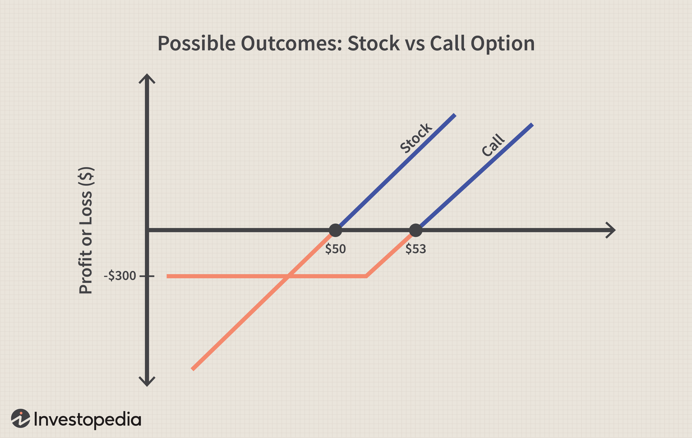

Options trading has experienced a notable increase in popularity among investors due to its potential for high returns and flexibility in crafting diverse investment strategies. Unlike traditional stock trading that involves buying and selling shares, options trading involves contracts that give investors the right, but not the obligation, to buy (call option) or sell (put option) an underlying asset at a specified price before a certain date. This form of trading has been embraced by various market participants ranging from individual investors to institutional entities aiming to hedge their positions or speculate on market movements.

Weekly options, a subset of options trading, have added a new dimension to the market by offering contracts with a very short lifespan, typically expiring every Friday, as opposed to the standard monthly options that expire on the third Friday of each month. The main distinction between weekly options and their traditional counterparts lies in their expiration cycles, providing traders with the ability to engage more frequently in adjusting their positions based on short-term market forecasts.



Simultaneously, there has been a significant rise in algorithmic trading in the financial markets. Algorithmic trading, or algo trading, employs complex mathematical models and computer programs to execute trades at high speeds and volumes that would be impossible for a human trader. This method is praised for its ability to enhance the precision and efficiency of executing trading strategies, allowing for the management of large datasets and the execution of trades based on pre-set criteria without human intervention.

This article aims to explore innovative investment strategies that integrate weekly options with algorithmic trading techniques. The fusion of these two approaches holds the promise of heightened efficiency and effectiveness, capitalizing on the flexibility of weekly options and the technological prowess of algorithmic trading. By harnessing the speed and precision of algo trading, investors can potentially optimize their strategies, execute trades with better timing, and manage risks more effectively, thus paving the way for potentially improved financial outcomes in the fast-paced environment of options trading.

## Table of Contents

## Understanding Weekly Options

Weekly options are a type of financial derivative with a lifespan of one week. Unlike traditional monthly options, which typically expire at the end of each month, weekly options allow traders and investors to engage in market activities with a short-term perspective. These instruments were introduced to the market to provide more frequent expiration opportunities, thus offering enhanced flexibility for participants who wish to capitalize on short-term market movements.

### Definition and Features of Weekly Options

Weekly options function in a similar manner to standard options contracts, possessing the key features of options: rights without obligations, predetermined strike prices, and expiration dates. They can be utilized for both calls and puts, enabling market participants to speculate on an asset's price increase or hedge against potential declines over a concise period. Weekly options generally become listed on Thursdays and cease trading on the Friday of the subsequent week. This condensed timeframe renders them particularly attractive for those seeking tactical trading opportunities rather than long-term investment strategies.

### Comparison with Traditional Monthly Options Contracts

While both weekly and monthly options serve the same basic function, their discrepancies lie primarily in their durations and trading cycles. Monthly options offer a longer window, which may be more appropriate for strategies aimed at capitalizing on broader market trends. They also generally align with the expiration cycles of standard financial calendars, providing consistency for investors interested in trends observed over a monthly basis. Conversely, weekly options offer a rapid cycle with four times as many expiration possibilities annually, allowing for more granular strategy adjustments.

### Advantages of Trading Weekly Options

Weekly options provide several benefits:

1. **Flexibility**: Their short duration makes it easy for traders to quickly adjust their positions to respond to market events or data releases, such as earnings reports or economic indicators.

2. **Potential for Quick Profits**: Because of their short life, weekly options can benefit from rapid changes in volatility, offering the potential for swift profits in turbulent markets.

3. **Lower Premiums**: Often, the time value component of weekly options premiums is lower than that of monthly options, making them a cost-effective choice for traders looking to engage in strategies without significant capital outlay.

### Risks Associated with Weekly Options

Despite their advantages, weekly options [carry](/wiki/carry-trading) heightened risks, primarily due to their short lifespan:

1. **Time Decay**: Since these options expire quickly, the time decay (theta) significantly impacts their value, potentially eroding profitability if the market does not move favorably in a very short time frame.

2. **Volatility Exposure**: Due to the short time horizon, weekly options can be highly sensitive to price fluctuations, meaning rapid movements may result in significant losses.

3. **Limited Reaction Time**: The quick expiration imposes a limited period for correcting or adjusting trades, demanding more active management and potentially intricate exit strategies.

### Market Scenarios Where Weekly Options Can Be Particularly Beneficial

Weekly options can be particularly advantageous in a variety of market scenarios, including:

1. **Earnings Announcements**: Companies frequently report earnings results on a quarterly basis; weekly options enable traders to establish short-term positions based on anticipated volatility or directional moves resulting from these announcements.

2. **Market Events**: Events like central bank meetings, geopolitical developments, or significant economic data releases can lead to increased market activity, where short-term options might be used to position for expected market moves.

3. **Hedging Short-Term Risk**: Investors with positions in underlying securities can use weekly options to hedge against anticipated short-term market risks without committing to longer-term contracts.

In summary, weekly options provide versatile tools for traders and investors looking to capture opportunities within specific, short-term timeframes. While their quick expiration makes them powerful for swift tactical plays and hedging, the associated risks necessitate careful consideration and vigilant management.

## Algorithmic Trading in Options Markets

Algorithmic trading, often referred to as algo trading, involves using computer programs to execute trades based on pre-defined criteria. In modern financial markets, [algorithmic trading](/wiki/algorithmic-trading) plays a crucial role by facilitating high-speed and high-frequency trading, significantly enhancing market efficiency. Algorithms can rapidly analyze a vast amount of data, execute orders at optimal prices, and minimize market impact, making them particularly advantageous in the fast-paced environment of options markets.

**Benefits of Using Algorithms for Options Trading**

Algorithms offer numerous benefits when applied to options trading. One of the primary advantages is speed. Computer algorithms can analyze market data and execute trades within milliseconds, a speed unattainable by human traders. This rapid execution is essential in options markets, where prices can change rapidly.

Moreover, algorithmic trading provides precision. Algorithms can be programmed to follow specific trading strategies without emotional biases affecting decision-making, ensuring consistent execution. Additionally, they process large datasets efficiently, giving traders the ability to analyze historical and real-time data comprehensively, which is essential for constructing complex options strategies.

**Types of Algorithms Commonly Used in Options Trading**

Various types of algorithms are employed in options trading to suit different trading objectives. Some common types include:

1. **Market-making algorithms**: These are designed to provide liquidity to the market by continuously quoting buy and sell prices. These algorithms profit from the bid-ask spread and are essential for maintaining market efficiency.

2. **Trend-following algorithms**: These algorithms analyze market trends and execute trades in the direction of the prevailing market movement, often using indicators like moving averages.

3. **Arbitrage algorithms**: These exploit price discrepancies between different markets or instruments. In options markets, they can identify and exploit inefficiencies between options and the underlying assets.

4. **Statistical arbitrage algorithms**: These use statistical models to identify and trade on pricing inefficiencies. Often, they involve simultaneous buying and selling of correlated instruments, such as different option contracts.

**Enhancement of Weekly Options Management Through Algo Trading Platforms**

Algo trading platforms can significantly enhance the management of weekly options by automating complex trading strategies that require precise timing. These platforms can backtest strategies against historical data, optimizing them for current market conditions. This capability is particularly beneficial for weekly options, which require rapid decision-making due to their short expiration period.

Algorithmic platforms also facilitate real-time monitoring and adjustments to positions, allowing traders to react swiftly to market changes. For example, if a particular weekly options strategy involves constantly adjusting positions to delta hedge, algorithmic systems can perform these adjustments automatically, ensuring timely responses to market fluctuations.

**Challenges and Technical Requirements of Implementing Algo Trading Strategies**

Despite the advantages, implementing algorithmic trading strategies poses challenges. One significant challenge is the technical infrastructure required. High-speed internet connections, powerful computational systems, and access to real-time market data are essential for effective algo trading. Ensuring low latency— the delay between market data receipt and trade execution— is critical to maintaining a competitive edge.

Additionally, developing robust algorithms demands expertise in both finance and programming. Writing algorithms requires a deep understanding of financial markets and the ability to translate strategies into complex code. Testing and validating these algorithms to ensure they perform as expected under diverse market conditions is vital.

Security is another concern; safeguarding algorithms from various cyber threats is essential to prevent unauthorized access and potential financial loss. Regular testing, updating of algorithms, and incorporating risk management techniques are essential practices for minimizing these risks.

In conclusion, algorithmic trading significantly enhances the efficiency of options trading by providing speed, precision, and the ability to manage complex strategies. While challenges exist, especially concerning technical requirements and security, advancements in technology continue to make algo trading an indispensable tool in modern options markets.

## Investment Strategies Using Weekly Options

Weekly options trading involves several strategies that capitalize on the unique characteristics of short-term options. These strategies require careful consideration of market conditions and individual risk tolerance to optimize performance and manage potential risks effectively.

### Common Strategies for Trading Weekly Options

1. **Straddles and Strangles**: Both strategies involve buying options of both call and put types. In a straddle, an investor purchases both a call and a put option with the same strike price and expiration date. This strategy is useful in volatile markets where price movement is uncertain but expected in either direction. A strangle, on the other hand, involves buying a call and a put option with different strike prices but the same expiration date. This setup is typically cheaper than a straddle and profitable when the asset price experiences significant movement.

2. **Iron Condors**: This strategy involves selling one call and one put at one strike price and buying another call and put at two different strike prices, all with the same expiration date. An iron condor profits from low volatility and stable price movements, as it benefits from the premium decay of the sold options.

### Guidelines for Selecting the Right Strategy

When selecting a strategy, investors should evaluate current market conditions and their risk tolerance. High [volatility](/wiki/volatility-trading-strategies) markets may favor straddles or strangles, allowing capture of profits from large price swings. Conversely, in stable markets, iron condors may be more advantageous due to their reliance on limited price movement.

Investors must also assess their risk tolerance. Straddles and strangles, while potentially offering higher returns, carry significant risk if the price does not move as expected. Iron condors, while generally safer, provide limited reward potential.

### Technical and Fundamental Analysis

The choice of weekly options strategy should be guided by both technical and [fundamental analysis](/wiki/fundamental-analysis). Technical analysis aids in understanding price patterns and market trends, which can indicate potential price movements. Investors use tools like moving averages, Relative Strength Index (RSI), and Bollinger Bands to inform their decisions.

Fundamental analysis, considering economic indicators, company announcements, or geopolitical events, provides insights into potential market volatility, helping investors anticipate significant market movements and choose suitable options strategies.

### Timing Trades and Managing Positions

Timing is crucial in weekly options due to their short lifespan. Investors must precisely predict market movements and act quickly. Effective management involves constant monitoring of market conditions and option positions. Adjusting or exiting positions in response to market changes is vital to mitigate losses and capture profits.

### Optimizing Strategy Performance with Algo Trading Tools

Algorithmic trading can enhance strategy performance in weekly options by executing trades swiftly and accurately. Algorithms can process vast amounts of data to identify trading opportunities and optimize entry and [exit](/wiki/exit-strategy) points. For instance, an algorithm could automatically execute a straddle when volatility exceeds a certain threshold, maximizing the chance of capitalizing on market swings.

Moreover, [backtesting](/wiki/backtesting) strategies using historical data ensures that the algorithms are robust and reliable. Continuous monitoring and [machine learning](/wiki/machine-learning) integration can refine these strategies, adapting to changing market conditions and improving performance over time.

By combining market analysis, strategic selection, precise timing, and algorithmic execution, investors can effectively leverage weekly options for potential profitability.

## Integrating Algo Trading with Weekly Options Strategies

Integrating algorithmic trading with weekly options strategies involves a systematic approach that enhances decision-making and execution efficiency. Here’s a step-by-step guide to achieving this integration:

### Step-by-Step Process for Integration

1. **Define Objectives and Constraints**: Begin by identifying the specific financial goals and risk tolerance levels for trading weekly options. This initial step guides the selection and design of algorithms.

2. **Develop or Select Algorithms**: Choose or create algorithms that cater to the characteristics of weekly options. These algorithms should analyze market conditions rapidly and execute trades in real-time. Some commonly used algorithms include mean reversion, momentum trading, and statistical arbitrage models. Python libraries such as Zipline or backtrader can be instrumental for this purpose.

3. **Backtest the Algorithms**: Before deploying any algorithm in live markets, backtesting is crucial. This process involves testing the algorithm against historical market data to evaluate its performance. The objective is to ensure that the algorithm can generate consistent returns and manage risks effectively. The code snippet below illustrates a simple backtesting approach using Python:

    ```python
    import backtrader as bt

    class TestStrategy(bt.Strategy):
        def __init__(self):
            self.sma = bt.indicators.SimpleMovingAverage(self.data, period=15)

        def next(self):
            if self.data.close > self.sma:
                self.buy()
            elif self.data.close < self.sma:
                self.sell()

    cerebro = bt.Cerebro()
    cerebro.addstrategy(TestStrategy)
    data = bt.feeds.YahooFinanceData(dataname='AAPL', fromdate=datetime(2020, 1, 1), todate=datetime(2021, 1, 1))
    cerebro.adddata(data)
    cerebro.run()
    ```

4. **Deploy and Monitor**: Once backtested, deploy the algorithm in a controlled setting, starting with a limited amount of capital. Continuous monitoring is essential to ensure that the algorithm behaves as expected in live conditions and adapts to unexpected market changes.

5. **Iterative Refinement**: Performance should be evaluated regularly to refine the algorithms and trading strategies. Incorporate new data insights, update models, and adjust parameters to improve the algorithm's effectiveness over time.

### Examples of Successful Strategies

Successful strategies with weekly options often combine technical analysis with timely market information. For instance, a [momentum](/wiki/momentum) strategy could leverage short-term price trends, benefitting from the rapid nature of weekly options. Another example is using volatility-based algorithms to exploit the priced-in volatility of options, which can be especially unpredictable in shorter timeframes.

### Importance of Backtesting and Continuous Monitoring

Backtesting ensures the robustness of a strategy by providing insights into how it might perform under various historical market conditions. Continuous monitoring allows traders to adjust strategies promptly in response to current market scenarios, thereby optimizing performance.

### Risk Management Practices

Risk management is integral to using algorithms in weekly options. Position sizing, stop-loss orders, and diversification among different options or underlying assets are standard practices. Algorithms should include fail-safes that minimize exposure during unexpected volatility spikes. Regular audits and performance reviews also help identify potential vulnerabilities in algorithmic trading approaches.

### Case Studies and Success Stories

One exemplar of successful integration is a proprietary trading firm utilizing machine learning algorithms to trade options on indices like the S&P 500. By constantly refining models with new data, the firm achieved substantial returns while maintaining controlled risk levels. Another success story involves a [hedge fund](/wiki/hedge-fund-trading-strategies) using adaptive algorithms that adjust trading parameters based on evolving statistical patterns, leading to increased trade success rates.

Incorporating algorithmic trading into weekly options strategies can significantly enhance trading performance, provided it is done judiciously with ongoing oversight and adaptation to market dynamics.

## Potential Risks and How to Mitigate Them

Trading weekly options with algorithmic strategies presents both opportunities and inherent risks that must be carefully managed. Understanding these potential risks and deploying strategies to mitigate them is crucial for success in this competitive space. 

Market volatility is a significant [factor](/wiki/factor-investing) affecting both weekly options and algorithmic strategies. Weekly options have shorter expiration periods, which can lead to quick shifts in price, highly sensitive to market movements. This heightened sensitivity is amplified under volatile market conditions, potentially leading to significant losses if not managed properly. Algorithms, designed to exploit these short-term price movements, can suffer during periods of unexpected volatility where traditional patterns and correlations may break down.

Mitigating risk involves a multi-faceted approach. One effective strategy is diversifying both algorithms and options positions. By spreading investments across various option strategies and utilizing multiple algorithms that respond to different market conditions, the overall risk is reduced. For example, combining a market-neutral strategy like an iron condor with a more aggressive straddle strategy can provide balance. 

Staying updated with current market conditions and technological advancements is vital. Continuous improvements in financial technology mean algorithmic platforms are frequently updated, introducing new tools and techniques. Investors must adapt their strategies to these changes to avoid obsolescence. Additionally, understanding macroeconomic indicators and news can aid in anticipating volatility, allowing better positioning of options strategies.

Several common pitfalls can emerge when integrating algo trading with weekly options. Over-reliance on algorithms without human oversight can result in ignoring fundamental signals or market anomalies. It's crucial to maintain a balance between automated strategies and manual inputs. Another pitfall is inadequate backtesting. Comprehensive backtesting ensures algorithms perform well across different market scenarios, mitigating unforeseen risks. 

Additionally, risk management should incorporate stop-loss orders and volatility buffers to protect against severe market moves. Here is a simple Python implementation showing how to integrate basic risk management rules within an algo trading framework:

```python
def execute_trade(strategy, current_market_conditions, stop_loss_threshold):
    position = strategy.generate_signals(current_market_conditions)
    initial_price = get_current_price(position.asset)

    while position.is_open:
        current_price = get_current_price(position.asset)
        if abs(current_price - initial_price) >= stop_loss_threshold:
            position.close()
            log("Stop-loss triggered. Position closed.")
            break

        # Strategy logic
        perform_strategy_logic(strategy, current_market_conditions)

# Example usage
execute_trade(strategy=my_strategy, 
              current_market_conditions=get_market_conditions(), 
              stop_loss_threshold=0.05)
```

Investors are encouraged to continue learning and adapting their strategies to effectively manage risks associated with weekly options and algorithmic trading, ensuring consistent recognition and adjustment to market dynamics.

## Conclusion

In conclusion, the article emphasizes the unique synergy between weekly options trading and algorithmic trading, highlighting how these two strategies complement each other to enhance trading efficiency and effectiveness. Combining weekly options with algorithmic trading allows investors to capitalize on the flexibility and rapid turnover of weekly contracts while leveraging the speed and precision of algorithms. This integration provides traders with the ability to process substantial amounts of data and execute trades with increased accuracy and timeliness, ultimately improving the potential for profit generation.

Investors are encouraged to explore and innovate within this dynamic space, as the adaptability of algorithmic strategies can offer a competitive edge. By continuously refining algorithms and adapting them to market conditions, traders can optimize their strategies for maximum effectiveness. It's important for investors to stay informed about technological advancements and market developments to maintain a strategic advantage.

Looking to the future, trends in options trading and algorithmic strategies suggest a growing reliance on machine learning and [artificial intelligence](/wiki/ai-artificial-intelligence) to further enhance decision-making processes. Such technological advancements may lead to the development of more sophisticated algorithmic tools, providing even greater opportunities for traders in managing weekly options portfolios.

Ultimately, success in this evolving field requires a combination of adaptability, continuous learning, and effective risk management. By integrating weekly options with algorithmic trading, investors can navigate the complexities of the market, aiming for consistent profitability and strategic growth. This article serves as a guide for those seeking to harness the potential of this powerful combination, emphasizing the need for innovative approaches and diligent execution.

## References & Further Reading

[1]: Bergstra, J., Bardenet, R., Bengio, Y., & Kégl, B. (2011). ["Algorithms for Hyper-Parameter Optimization."](https://proceedings.neurips.cc/paper/2011/file/86e8f7ab32cfd12577bc2619bc635690-Paper.pdf) Advances in Neural Information Processing Systems 24.

[2]: ["Advances in Financial Machine Learning"](https://www.amazon.com/Advances-Financial-Machine-Learning-Marcos/dp/1119482089) by Marcos Lopez de Prado

[3]: ["Evidence-Based Technical Analysis: Applying the Scientific Method and Statistical Inference to Trading Signals"](https://www.amazon.com/Evidence-Based-Technical-Analysis-Scientific-Statistical/dp/0470008741) by David Aronson

[4]: ["Machine Learning for Algorithmic Trading"](https://github.com/PacktPublishing/Machine-Learning-for-Algorithmic-Trading-Second-Edition) by Stefan Jansen

[5]: ["Quantitative Trading: How to Build Your Own Algorithmic Trading Business"](https://books.google.com/books/about/Quantitative_Trading.html?id=j70yEAAAQBAJ) by Ernest P. Chan