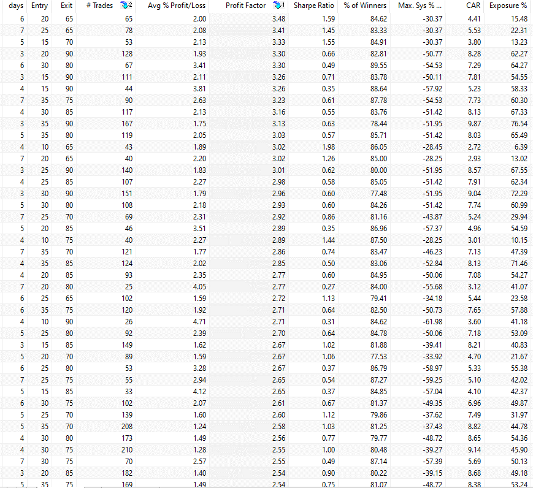

The Relative Strength Index (RSI) is a fundamental tool in algorithmic trading, serving as a momentum oscillator that provides insights into the speed and change of price movements of a tradable asset. Developed by J. Welles Wilder Jr. in 1978, the RSI has become a staple for traders seeking to determine potential overbought or oversold market conditions. This indicator, which oscillates between a scale of 0 to 100, is instrumental in identifying the potential reversal points of financial instruments, making it a valuable component in various trading strategies.

In algorithmic trading, the RSI can be utilized across different timeframes, each offering unique advantages. The weekly RSI is especially noteworthy due to its ability to capture broader market trends compared to shorter timeframes like the daily RSI. The weekly RSI smooths out short-term market noise, providing traders with a clearer view of the underlying market strength or weakness over a longer period. This is particularly beneficial for swing traders and long-term investors who aim to capitalize on more substantial price movements.



Selecting the appropriate RSI timeframe is crucial for optimizing trading results. A shorter timeframe, such as the daily RSI, is suitable for traders focusing on short-term price fluctuations and quick entry and exit points. In contrast, the weekly RSI is more aligned with traders seeking to align their strategies with longer-term trends and reduce the impact of false signals often encountered in shorter analyses.

The significance of choosing the right RSI timeframe lies in its ability to align with the trader's goals and risk tolerance. Employing a timeframe that complements the intended trading strategy enhances the effectiveness of decision-making processes and ultimately leads to more informed and strategic trade executions. As algorithmic trading continuously evolves, incorporating RSI across versatile timeframes remains a pivotal approach for optimizing performance in financial markets.

## Table of Contents

## Understanding Relative Strength Index (RSI)

The Relative Strength Index (RSI) is a widely utilized momentum oscillator in financial markets, designed to measure the speed and change of price movements. Developed by J. Welles Wilder Jr., RSI serves as an empirical indicator that aids traders in identifying overbought or oversold conditions within a security. This is achieved through a single line that moves between two extremes, 0 and 100, reflecting the current and historical strength or weakness of a market.

The standard RSI calculation is based on a 14-period timeframe, although this can be adapted depending on a trader's preference or strategy. The calculation involves two main steps:

1. Calculation of the Relative Strength (RS): This is the average gain of up periods during the specified time frame divided by the average loss of down periods over the same timeframe. It is usually expressed as:

   \[ RS = \frac{\text{Average Gain}}{\text{Average Loss}}
$$

2. Calculation of the RSI: The RSI is then derived from the RS using the following formula:

   \[ RSI = 100 - \left(\frac{100}{1 + RS}\right)
$$

The RSI scores range from 0 to 100. Traditional interpretations posit that values above 70 indicate an overbought market condition, suggesting a potential reversal or corrective price drop, while values below 30 suggest an oversold condition, which could predict a reversal to the upside.

The use of RSI can differ significantly between daily and weekly analyses. In daily analysis, RSI is more sensitive to rapid price movements and shorter-term trends, providing swift signals that may benefit intraday traders or those focused on capturing short-term price changes. Conversely, weekly RSI provides a smoothed perspective by considering price activity over a longer duration, which can help identify more stable and reliable trends. This extended timeframe can decrease the potential for false signals that often accompany shorter-term [volatility](/wiki/volatility-trading-strategies).

Traders may choose between daily and weekly RSI based on their specific strategy goals—while daily RSI is advantageous for a more aggressive, fast-paced approach, weekly RSI offers more strategic insights for those focusing on sustained trends and reducing the noise of daily market fluctuations.

## The Concept of Weekly RSI

The Relative Strength Index (RSI) is a [momentum](/wiki/momentum) oscillator that quantifies the speed and change of price movements. While typically applied on a daily basis, using RSI on a weekly timeframe can yield unique insights that are distinct from its daily counterpart. The weekly RSI is calculated using the same formula as the daily RSI but applies to data aggregated over a week. The RSI itself is calculated using the formula:

$$

\text{RSI} = 100 - \left(\frac{100}{1 + \text{RS}}}\right)
$$

where RS (Relative Strength) is the average of 'n' days' or weeks', up closes divided by the average of 'n' days' or weeks' down closes.

In using a weekly RSI, traders gain a broader view of market trends and potential inflection points. Compared to daily RSI, the weekly RSI is less about short-term price movement and more about understanding medium to long-term trends. It smooths out day-to-day volatility, offering a more gradual and robust indicator that can reveal persistent trends which daily RSIs might miss due to their sensitivity to day-to-day fluctuations. This can be particularly useful in identifying macro-level support and resistance zones and assessing the overall strength of a trend over a longer horizon.

The benefits of incorporating a weekly RSI into trading strategies include a more stable signal that is less prone to false positives or whipsaw movements commonly associated with the noise of daily price data. It encourages traders to hold positions longer and aligns with the strategic views of swing or long-term traders. However, this broader perspective comes with limitations. The primary trade-off is reduced responsiveness. While daily RSI can quickly reflect swift market changes, the weekly RSI by nature lags, making it less effective for capturing rapid market entries and exits.

In conclusion, weekly RSI offers a powerful tool for traders aiming to grasp longer-term market dynamics, providing insights that daily analyses may not fully capture. It should, however, be used in conjunction with other indicators and within the trader's broader strategic framework to mitigate its inherent lag and to make informed trading decisions.

## Backtesting Weekly RSI in Algorithmic Trading

Backtesting is a critical step in the development and validation of trading strategies, particularly when employing technical indicators such as the Relative Strength Index (RSI). In [algorithmic trading](/wiki/algorithmic-trading), where decisions are often automated, robust strategy validation through [backtesting](/wiki/backtesting) can significantly enhance confidence in trading systems before they are deployed in live markets.

To set up a backtest environment focused on weekly RSI, traders must first ensure they have access to historical price data with weekly granularity. This data can often be obtained through financial data providers or trading platforms that support algorithmic strategy development. The next step is to code the strategy logic, typically involving the calculation of the RSI over a specified number of weeks; a common setting might be an RSI period of 14 weeks.

The RSI itself is calculated as follows:

$$
RSI = 100 - \left( \frac{100}{1 + \frac{\text{Average Gain}}{\text{Average Loss}}} \right)
$$

For a weekly RSI strategy, the calculation involves the average gains and losses over the chosen number of weeks. Once the RSI values are computed, a trading strategy might involve buying when the RSI crosses above a certain threshold (e.g., 30, signaling an oversold condition) and selling when it drops below another threshold (e.g., 70, signaling an overbought condition).

Here is a simple Python snippet for calculating and backtesting a weekly RSI strategy using historical price data with a library such as pandas:

```python
import pandas as pd

def calculate_weekly_rsi(data, window=14):
    delta = data['Close'].diff()
    gain = (delta.where(delta > 0, 0))
    loss = (-delta.where(delta < 0, 0))

    avg_gain = gain.rolling(window=window, min_periods=1).mean()
    avg_loss = loss.rolling(window=window, min_periods=1).mean()

    rs = avg_gain / avg_loss
    rsi = 100 - (100 / (1 + rs))
    return rsi

def backtest_weekly_rsi(data, window=14):
    data['RSI'] = calculate_weekly_rsi(data, window)
    data['Signal'] = 0
    data.loc[data['RSI'] < 30, 'Signal'] = 1  # Buy signal
    data.loc[data['RSI'] > 70, 'Signal'] = -1  # Sell signal
    data['Position'] = data['Signal'].shift(1)  # Ensure signal is applied after the RSI moves

    return data

# Example usage:
# data = pd.read_csv('weekly_price_data.csv')  # Load your weekly price data
# backtested_data = backtest_weekly_rsi(data)
```

Upon running the backtest, traders analyze the results for key performance metrics such as the overall return, win/loss ratio, and maximum drawdown. These metrics offer insights into how effective the weekly RSI strategy is under historical market conditions.

Interpreting backtest results requires careful consideration of the trading environment. For instance, a consistently profitable backtest might suggest that the strategy is robust, but further stress testing across different market regimes (bullish, bearish, sideways) is advisable. Additionally, traders should remain cognizant of the potential for overfitting — designing a strategy that performs well on historical data but fails in live markets. Parameters like stop-loss levels and position sizing should also be included to ensure realistic results.

In conclusion, backtesting a weekly RSI strategy is essential in assessing its potential effectiveness and reliability. By understanding the historical performance of the RSI-based approach, traders can make more informed decisions and refine their strategies to maximize profitability while minimizing risk in live trading scenarios.

## Optimization of Weekly RSI for Enhanced Trading Results

Optimizing the Relative Strength Index (RSI) for weekly trading entails carefully adjusting its settings to enhance profitability. The weekly RSI can provide a smoothed view of price momentum, reducing market noise and leading to more informed trading decisions. This section outlines crucial steps to optimize the weekly RSI, highlights the significance of entry and [exit](/wiki/exit-strategy) points, and contrasts optimized weekly RSI strategies with those using standard timeframes.

### Steps to Optimize Weekly RSI Settings

1. **Choose the Appropriate RSI Period**: The default RSI period is 14. However, tuning the period can result in different insights. Traders typically experiment with longer periods, such as 20 or 28 weeks, to match their trading strategy and the specific asset’s volatility.

2. **Adjust Overbought and Oversold Levels**: The conventional overbought and oversold thresholds are 70 and 30, respectively. Lowering these levels, such as to 65 and 35, can result in more conservative trading signals, potentially reducing false positives.

3. **Customization through Rolling Averages**: Implementing rolling averages on the RSI values can help smooth out fluctuations and reveal more stable trends. For instance, using a 10-week moving average of the RSI line can provide a more consistent basis for decision-making.

4. **Regularly Review and Backtest**: Backtesting on historical data is essential. This process involves using past market data to assess how modified RSI settings would have performed. Platforms such as TradingView or MetaTrader can facilitate this analysis. Utilization of Python scripts for backtesting is common:

   ```python
   import pandas as pd
   pd_ta = pd.read_csv('market_data.csv') # replace with actual market data file
   rsi = pd_ta.ta.rsi(length=14) # calculate 14-period RSI
   backtest_results = backtest_strategy(market_data=pd_ta, rsi=rsi, overbought=68, oversold=32)
   ```

### The Role of Entry and Exit Points

Entry and exit points are vital in weekly RSI optimization, acting as the gatekeepers for effective trade execution. When the RSI crosses certain thresholds, it generates buy or sell signals:

- **Entry Point**: A common strategy is to enter a buy position when the RSI crosses above the oversold line, indicating potential upward momentum.
- **Exit Point**: Conversely, a sell position might be triggered when the RSI drops below the overbought line, suggesting possible downward momentum.

These entry and exit rules should be rigorously defined and tested, taking into account the historical volatility and trading [volume](/wiki/volume-trading-strategy) of the asset. Adjustments should be made to accommodate different market conditions and asset classes.

### Comparison with Standard Timeframe Strategies

Weekly RSI strategies inherently differ from standard daily RSI strategies in their contribution to long-term trend analysis and trade stability:

- **Noise Reduction**: Weekly RSI strategies are less susceptible to short-term market fluctuations, hence reducing noise and the frequency of false signals.
- **Trend Alignment**: Longer timeframes inherently recognize broader trends, which can align more effectively with macroeconomic indicators and geopolitical developments.

When comparing optimized weekly RSI to standard daily strategies, traders often find that weekly analyses foster a more patient trading discipline. For example, while daily RSI might prompt more frequent trades, weekly RSI often allows trades to capture larger, more significant market movements.

Through methodical optimization and strategic placement of entry and exit points, weekly RSI can become an integral component of a robust trading strategy, offering distinctive advantages over standard timeframe approaches.

## Case Studies: Weekly RSI in Action

Weekly Relative Strength Index (RSI) has been effectively employed in various trading strategies, with successful case studies highlighting its utility in capturing long-term market trends and assisting in trade timing decisions. Analyzing these real-world applications offers valuable insights into the strategic employment of weekly RSI, the lessons learned, and the potential pitfalls to avoid.

One notable case study involved the application of weekly RSI in stock trading to identify long-term investment opportunities. A trading strategy was developed where trades were executed when the weekly RSI crossed above 30 to signal a buy and crossed below 70 to indicate a sell. This approach was intended to capitalize on the established momentum trends while maintaining long-term positions. The strategy capitalized on capturing substantial trends, particularly when used in conjunction with other indicators such as moving averages. Traders learned that the weekly RSI is instrumental in reducing noise commonly associated with shorter timeframes.

A lesson drawn from this study is the significance of integrating weekly RSI with other technical indicators. One successful technique was to combine it with moving averages to confirm trend strength. For example, a bullish confirmation might involve waiting for both a weekly RSI crossover above 30 and the price crossing above a medium-term moving average. This integration helped enhance the reliability of entry and exit signals, leading to more robust trading decisions.

Another effective implementation of weekly RSI was observed in the foreign exchange markets, where traders sought to exploit longer-term currency trends. Here, weekly RSI was used to filter out false breakouts that frequently occur in volatile currency pairs. By focusing on weekly RSI, traders could identify more reliable reversals and continuation patterns, thus optimizing entry points. Python-based backtesting tools, such as pandas and [backtrader](/wiki/backtrader), were commonly employed for simulating this strategy, allowing traders to fine-tune their parameters before live deployment.

```python
import pandas as pd
import talib
import backtrader as bt

# Define a simple RSI Strategy
class RSI_Strategy(bt.SignalStrategy):
    def __init__(self):
        self.rsi = talib.RSI(self.data.close, timeperiod=52)  # Weekly RSI
        self.signal_add(bt.SIGNAL_LONG, self.rsi < 30)
        self.signal_add(bt.SIGNAL_SHORT, self.rsi > 70)

# Setup and run backtest
cerebro = bt.Cerebro()
cerebro.addstrategy(RSI_Strategy)
data = bt.feeds.YahooFinanceData(dataname='AAPL', fromdate=datetime(2020, 1, 1), todate=datetime(2023, 1, 1))
cerebro.adddata(data)
cerebro.run()
```

Despite the successes, these case studies also highlighted potential pitfalls. One common challenge is the lag associated with weekly data, which may delay signals compared to daily RSI, leading to missed rapid market movements. Traders must balance this lag with the benefit of reduced noise. Moreover, relying solely on weekly RSI without confirming signals may lead to entering prolonged ranges without significant price movement. Avoiding this pitfall requires setting up comprehensive trading rules that incorporate multiple confirmations and re-evaluating strategies based on evolving market conditions.

In conclusion, while weekly RSI provides valuable insights for long-term market analysis, its successful implementation requires integration with other indicators and careful consideration of its limitations. By learning from past applications and optimizing the strategies accordingly, traders can effectively leverage weekly RSI to enhance their trading systems.

## Integrating Weekly RSI in Your Trading Systems

Incorporating the Weekly Relative Strength Index (RSI) into trading algorithms can enhance the depth and robustness of trading strategies. Here are practical approaches for integrating weekly RSI effectively into your trading systems.

### Practical Tips for Incorporating Weekly RSI

To successfully integrate the weekly RSI into existing trading algorithms, consider the following strategies:

1. **Align RSI with Market Trends**: Use weekly RSI values to align trading strategies with prevailing market trends. This can be particularly useful in longer-term trades where identifying the primary trend is critical. Observing whether the weekly RSI is in overbought (>70) or oversold (<30) territory can provide insights into market momentum and potential reversal points.

2. **Divergence Analysis**: Implement divergence analysis using weekly RSI to spot potential reversals. For instance, a bullish divergence occurs when the price charts lower lows while the RSI plots higher lows, indicating weakening selling pressure and a potential upside reversal.

3. **Multi-Timeframe Analysis**: Combine weekly RSI signals with daily RSI for a multi-timeframe approach. This method provides a broader market perspective, capturing different aspects of market momentum and aiding in the confirmation of potential trade signals.

### Tools and Platforms for Weekly RSI Integration

Several trading platforms support the integration of RSI and other technical indicators into your trading algorithms. Consider the following tools:

- **MetaTrader 5 (MT5)**: MT5 offers an advanced trading environment with support for custom indicators, including weekly RSI. Traders can use MQL5, MT5's proprietary coding language, to develop automated trading strategies incorporating weekly RSI along with other indicators.

- **TradingView**: TradingView allows for robust charting and scripting capabilities (using Pine Script) to visually analyze weekly RSI alongside other indicators. It provides a community-driven platform to share and review strategies.

- **Python Libraries**: Utilize Python libraries such as TA-Lib and Pandas for computing weekly RSI values and backtesting your trading strategies. For example, you can calculate RSI using TA-Lib as follows:

   ```python
   import talib
   import pandas as pd

   # Example stock data
   df = pd.DataFrame({
       'close': [101, 102, 103, 104, 105, 104, 103, 102, 101, 100]
   })

   # Calculate RSI with a window size of 14 periods on weekly data
   df['rsi'] = talib.RSI(df['close'], timeperiod=14)
   ```

### Balancing Weekly RSI with Other Indicators

For a comprehensive strategy, consider integrating weekly RSI insights with other technical indicators:

- **Moving Averages**: Use moving averages to confirm weekly RSI signals. For example, a weekly RSI indicating an overbought condition may lead to setting sell signals when combined with the price crossing below a moving average.

- **MACD (Moving Average Convergence Divergence)**: The MACD can provide additional depth to RSI signals. When both RSI and MACD point to similar market conditions, it increases the confidence in the trade setup.

- **Volume Analysis**: Combine weekly RSI with volume indicators to gauge the strength behind price movements. Increasing volume during a breakout confirmed by RSI can signal strong market momentum in the direction of the breakout.

These steps and tools aid in enhancing the effectiveness of weekly RSI in trading strategies, providing a multi-dimensional approach that capitalizes on both momentum and trend analysis for optimized trading outcomes.

## Conclusion

The use of the Relative Strength Index (RSI) on a weekly timeframe offers traders distinct advantages, primarily due to its ability to smooth out market noise and provide a more stable analysis framework. Unlike daily RSI, which can be influenced by short-term market volatility, the weekly RSI offers a more grounded perspective, making it highly valuable for long-term strategy development. By looking at a broader window of data, traders can derive insights that are more indicative of enduring market trends rather than temporary fluctuations.

The key advantage of employing weekly RSI lies in its ability to provide a long-term perspective. This extended view enables traders to identify sustained overbought or oversold conditions and gain a clearer understanding of prevailing market trends. Consequently, it enhances decision-making by reducing the likelihood of hasty trades driven by short-term market movements.

Furthermore, the reliability of weekly RSI in strategy development comes from its capacity to filter out short-term market 'noise'. The smoothed data allows traders to focus on significant movements rather than reacting to every minor price tick. This can lead to more disciplined trading, helping avoid the pitfalls of emotional decision-making based on short-lived market perturbations.

Embracing weekly RSI as a core component of algorithmic trading strategies offers considerable benefits. It aligns with a systematic approach to trading by using clearly defined rules that leverage historical data for consistent application over time. With backtesting, traders can validate these strategies against past market conditions, thereby increasing their confidence in the predictive power of their models.

In summary, integrating weekly RSI into trading methodologies provides traders with enhanced stability and efficiency. By offering a reliable indication of market trends and reducing reactions to transient market changes, weekly RSI serves as an indispensable tool for developing robust trading strategies. As traders strive for sustained success, weekly RSI represents a strategic advantage in navigating the complexities of the financial markets.

## FAQ

**Common questions about the application of weekly RSI in trading**

1. **What is the primary purpose of using weekly RSI in trading?**

   The primary purpose of employing weekly RSI in trading is to gain insights into medium- to long-term market trends. Weekly RSI provides a broader perspective compared to daily RSI, helping traders identify the sustainability of overbought or oversold conditions and the strength of a prevailing trend.

2. **How is weekly RSI calculated, and how does it differ from daily RSI?**

   The Relative Strength Index (RSI) is calculated using the formula:
$$
   RSI = 100 - \left(\frac{100}{1 + RS}\right)

$$

   where $RS$ is the average gain of up periods during the specified time frame divided by the average loss of down periods. For weekly RSI, the formula is applied to weekly price data rather than daily data, providing insights based on weekly movements, thus filtering out daily market noise and capturing more sustained price trends.

3. **What are some complexities involved in setting and interpreting weekly RSI?**

   Setting the correct parameters for weekly RSI can be complex. The standard RSI period is 14, but traders might adjust this depending on their strategy or market conditions. Interpreting weekly RSI also requires understanding that signals may take longer to materialize. In trending markets, RSI may stay in overbought or oversold regions for extended periods, necessitating confirmation from other indicators before making trading decisions.

4. **How can I troubleshoot common issues with weekly RSI implementation?**

   - **Signal Delays:** Weekly RSI may generate delayed signals due to its longer timeframe. To mitigate this, consider using it in conjunction with shorter-term indicators or price action analysis for timely confirmation.

   - **Parameter Adjustment:** If RSI signals appear inconsistent with market trends, revisiting and adjusting the RSI calculation period could enhance signal reliability. Backtesting various periods can help find optimal settings.

   - **False Signals:** Weekly RSI might sometimes produce false signals. Implementing a multi-indicator strategy by combining weekly RSI with moving averages or MACD can enhance accuracy.

5. **Are there any specific platforms or tools recommended for integrating weekly RSI?**

   Most trading platforms, such as MetaTrader, TradingView, and various algorithmic trading software, support RSI calculations. Additionally, Python libraries like `pandas` and `ta` provide the functionality to automate weekly RSI analyses. For example:

   ```python
   import pandas as pd
   import ta

   data = pd.read_csv('market_data.csv')
   data['weekly_RSI'] = ta.momentum.RSIIndicator(close=data['Close'], window=14).rsi()
   ```

   This code snippet calculates the weekly RSI using the `ta` library on historical market data.

## References & Further Reading

[1]: Wilder, J. W. (1978). ["New Concepts in Technical Trading Systems"](https://books.google.com/books/about/New_Concepts_in_Technical_Trading_System.html?id=WesJAQAAMAAJ) - Trend Research

[2]: Murphy, J. J. (1999). ["Technical Analysis of the Financial Markets: A Comprehensive Guide to Trading Methods and Applications"](https://www.amazon.com/Technical-Analysis-Financial-Markets-Comprehensive/dp/0735200661) - New York Institute of Finance

[3]: Bulkowski, T. (2005). ["Encyclopedia of Chart Patterns"](https://books.google.com/books/about/Encyclopedia_of_Chart_Patterns.html?id=tIwlEAAAQBAJ) - Wiley

[4]: Wilder, J. W. (1978). ["RSI: The Relative Strength Index."](https://www.oanda.com/us-en/trade-tap-blog/trading-knowledge/understanding-the-relative-strength-index/) - StockCharts.com

[5]: Chan, E. P. (2008). ["Quantitative Trading: How to Build Your Own Algorithmic Trading Business"](https://github.com/ftvision/quant_trading_echan_book) - Wiley

[6]: Aronson, D. R. (2006). ["Evidence-Based Technical Analysis: Applying the Scientific Method and Statistical Inference to Trading Signals"](https://www.amazon.com/Evidence-Based-Technical-Analysis-Scientific-Statistical/dp/0470008741) - Wiley