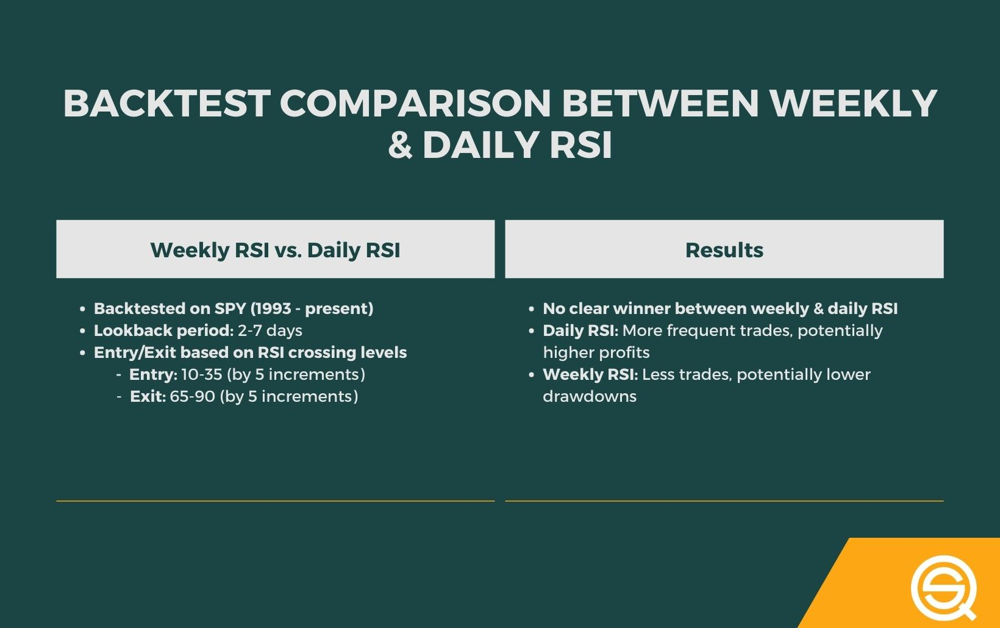

## Table of Contents

## What is RSI and how is it calculated?

RSI stands for Relative Strength Index. It's a tool used in trading to see if a stock or other thing you can trade is overbought or oversold. Overbought means the price might go down soon, and oversold means the price might go up soon. The RSI helps traders decide when to buy or sell.

To calculate the RSI, you first need to find the average gain and the average loss over a certain number of days, usually 14. You do this by adding up all the gains and dividing by 14, and doing the same for the losses. Then, you use these averages to find the relative strength, which is the average gain divided by the average loss. Finally, you use a special formula to turn the relative strength into the RSI, which is a number between 0 and 100. If the RSI is above 70, it might mean the thing you're trading is overbought. If it's below 30, it might mean it's oversold.

## What is the difference between weekly and daily RSI?

The main difference between weekly and daily RSI is the time period they look at. Daily RSI uses the price changes from one day to the next, while weekly RSI looks at the price changes from one week to the next. This means that daily RSI will show you quicker changes in whether something is overbought or oversold, while weekly RSI will give you a broader view over a longer time.

Because of this, daily RSI is often used by traders who want to make quick decisions and take advantage of short-term market movements. On the other hand, weekly RSI is more useful for those who are looking at the bigger picture and want to make decisions based on longer-term trends. Both can be helpful, but they give you different information based on the time frame you're interested in.

## How do you interpret RSI values on a weekly chart versus a daily chart?

When you look at RSI values on a daily chart, you're seeing how the price of something has changed from one day to the next. If the RSI is over 70, it might mean the price has gone up a lot and could be due for a drop soon. If it's under 30, it might mean the price has gone down a lot and could be ready to go up. Daily RSI helps traders who want to make quick decisions based on short-term changes in the market. They can buy or sell more often, trying to make money from these quick ups and downs.

On a weekly chart, the RSI looks at how the price has changed from one week to the next. This gives you a bigger picture of what's happening over a longer time. If the weekly RSI is over 70, it might mean the price has been going up for a while and could be ready for a bigger drop. If it's under 30, it might mean the price has been going down for a while and could be ready for a bigger rise. Weekly RSI is more useful for traders who want to make decisions based on longer-term trends and don't want to trade as often. They're looking at the bigger picture and trying to make money from larger market movements over time.

## What are the typical time frames used for weekly and daily RSI?

For daily RSI, the typical time frame is 14 days. This means you look at the price changes over the last 14 days to figure out if something is overbought or oversold. Traders use this to make quick decisions because it shows what's happening in the market right now. They might buy or sell more often, trying to make money from these short-term ups and downs.

For weekly RSI, the typical time frame is 14 weeks. This means you look at the price changes over the last 14 weeks to see the bigger picture. Weekly RSI is good for traders who want to make decisions based on longer-term trends. They don't trade as often and are looking to make money from bigger market movements over time.

## Can you explain the significance of overbought and oversold levels in weekly and daily RSI?

When you look at daily RSI, overbought and oversold levels help you see if a price might change soon. If the daily RSI goes over 70, it means the price has been going up a lot and might be ready to go down. This is called overbought. If it goes under 30, it means the price has been going down a lot and might be ready to go up. This is called oversold. Traders who use daily RSI want to make quick decisions. They might buy when it's oversold, hoping the price will go up, or sell when it's overbought, hoping the price will go down.

When you look at weekly RSI, overbought and oversold levels help you see the bigger picture. If the weekly RSI goes over 70, it means the price has been going up for a while and might be ready for a bigger drop. If it goes under 30, it means the price has been going down for a while and might be ready for a bigger rise. Traders who use weekly RSI are looking at longer-term trends. They might buy when it's oversold, expecting a bigger price increase over time, or sell when it's overbought, expecting a bigger price decrease over time.

## How does the volatility of a stock affect weekly versus daily RSI readings?

The [volatility](/wiki/volatility-trading-strategies) of a stock can make a big difference in how you see the RSI on a daily chart. If a stock is very volatile, meaning its price goes up and down a lot in a short time, the daily RSI can change quickly. It might go over 70 and then under 30 in just a few days. This can make it hard for traders to decide when to buy or sell because the RSI readings can be all over the place. So, if you're looking at daily RSI for a volatile stock, you need to be ready for quick changes and be careful about making decisions based on just one day's reading.

On a weekly chart, the volatility of a stock can still affect the RSI, but it's usually less dramatic. Because the weekly RSI looks at price changes over a longer time, the ups and downs of a volatile stock don't show up as quickly. This means the weekly RSI might not jump from overbought to oversold as fast as the daily RSI. Traders who use weekly RSI for volatile stocks can get a better sense of the bigger picture and might make fewer but more thought-out decisions. They can see trends that last longer and are less affected by short-term price swings.

## What are the common strategies for trading using weekly RSI compared to daily RSI?

When trading with daily RSI, the strategy often focuses on quick moves. Traders watch the RSI closely every day. If the RSI goes over 70, they might think the price is too high and could drop soon. So, they might sell to make money from that drop. If the RSI goes under 30, they might think the price is too low and could rise soon. So, they might buy, hoping to make money when the price goes up. This strategy works well for people who like to trade a lot and want to catch short-term changes in the market.

When trading with weekly RSI, the strategy is more about the big picture. Traders look at the RSI once a week and think about longer trends. If the weekly RSI goes over 70, they might think the price has been going up for a while and could be ready for a bigger drop. So, they might sell, but they're not in a hurry. If the weekly RSI goes under 30, they might think the price has been going down for a while and could be ready for a bigger rise. So, they might buy, but they're looking to hold onto the stock for a longer time. This strategy is good for people who don't want to trade every day and are more interested in longer-term market moves.

## How can divergences in weekly RSI versus daily RSI be used to predict market movements?

Divergences in RSI happen when the price of a stock and the RSI are not moving in the same way. On a daily chart, if the price keeps going up but the RSI starts going down, that's called a bearish divergence. It might mean the price could start to go down soon. If the price keeps going down but the RSI starts going up, that's called a bullish divergence. It might mean the price could start to go up soon. Traders who look at daily RSI can use these divergences to make quick trades, trying to make money from these short-term changes.

On a weekly chart, divergences in RSI are also important, but they show bigger trends over time. A bearish divergence on a weekly chart, where the price keeps going up but the RSI goes down, might mean a bigger drop in price is coming. A bullish divergence, where the price keeps going down but the RSI goes up, might mean a bigger rise in price is coming. Traders who use weekly RSI can use these divergences to make longer-term decisions, holding onto their stocks for a while to make money from these bigger market movements.

## What are the limitations of using weekly RSI compared to daily RSI for short-term trading?

Using weekly RSI for short-term trading can be tricky. Weekly RSI looks at price changes over a longer time, like 14 weeks. This means it doesn't show quick changes in the market. If you're trying to make money from short-term ups and downs, weekly RSI might not help much because it's too slow. You might miss out on chances to buy or sell at the right times because the weekly RSI doesn't change as fast as the market does.

Another problem with using weekly RSI for short-term trading is that it can be hard to spot the right moments to trade. Daily RSI, which looks at price changes over just 14 days, can show you when something is overbought or oversold much quicker. This helps you decide when to buy or sell to make money from short-term moves. But with weekly RSI, you might see these signals too late, and by the time you act, the market might have already moved on. So, if you want to trade often and make quick decisions, daily RSI is usually better for short-term trading.

## How do different market conditions affect the reliability of weekly versus daily RSI?

In calm markets, where prices don't move up and down a lot, both weekly and daily RSI can be pretty reliable. Daily RSI can help you see small changes in the market and make quick trades. It's good for catching little ups and downs. Weekly RSI can show you the bigger picture and help you make longer-term decisions. In a calm market, both can work well because the market isn't jumping around too much.

But in wild markets, where prices go up and down a lot, weekly RSI might be more reliable than daily RSI. Daily RSI can change really fast in a wild market, making it hard to know when to buy or sell. You might see the RSI go over 70 and then under 30 in just a few days, which can be confusing. Weekly RSI, on the other hand, looks at a longer time, so it doesn't change as quickly. It can help you see the bigger trends and make better decisions even when the market is moving a lot.

## Can you discuss any advanced techniques for combining weekly and daily RSI for better trading decisions?

One advanced technique for combining weekly and daily RSI is to use the weekly RSI to find the big trends and the daily RSI to time your trades better. Let's say the weekly RSI shows a stock is oversold, meaning it's been going down for a while and might be ready for a big rise. You can then look at the daily RSI to see when the best time might be to buy. If the daily RSI also shows the stock as oversold, that could be a good time to buy because both the short-term and long-term signals are saying the price might go up soon. This way, you're using the weekly RSI to see the bigger picture and the daily RSI to make your move at the right time.

Another technique is to watch for divergences between the weekly and daily RSI. If the weekly RSI is going up but the daily RSI starts going down, that's a bearish divergence. It might mean the price could go down soon, even though the bigger trend is up. You might want to sell before that happens. On the other hand, if the weekly RSI is going down but the daily RSI starts going up, that's a bullish divergence. It might mean the price could go up soon, even though the bigger trend is down. You might want to buy before that happens. By looking at both the weekly and daily RSI, you can get a better sense of what might happen next and make smarter trading decisions.

## How do professional traders typically integrate weekly and daily RSI into their overall analysis?

Professional traders often use weekly RSI to see the big picture of a stock's trend. They look at the weekly RSI to find out if a stock is overbought or oversold over a longer time, like 14 weeks. If the weekly RSI is over 70, it might mean the stock has been going up for a while and could be ready for a big drop. If it's under 30, it might mean the stock has been going down for a while and could be ready for a big rise. This helps them decide if they want to buy or sell a stock based on longer-term trends. They use this information to make big decisions, like whether to hold onto a stock for a long time or to get out of it before a big price change.

Then, they use daily RSI to fine-tune their trades. The daily RSI looks at price changes over just 14 days, so it shows what's happening in the market right now. If the daily RSI goes over 70, it might mean the stock is overbought and could drop soon. If it goes under 30, it might mean the stock is oversold and could rise soon. Traders use this to decide when to buy or sell to make money from short-term changes. By combining the weekly RSI for the big picture and the daily RSI for timing, professional traders can make better trading decisions. They look at both to see if the short-term and long-term signals match up, which can give them more confidence in their trades.

## What is the Concept of Weekly RSI?

The Relative Strength Index (RSI) is a [momentum](/wiki/momentum) oscillator that quantifies the speed and change of price movements. While typically applied on a daily basis, using RSI on a weekly timeframe can yield unique insights that are distinct from its daily counterpart. The weekly RSI is calculated using the same formula as the daily RSI but applies to data aggregated over a week. The RSI itself is calculated using the formula:

$$

\text{RSI} = 100 - \left(\frac{100}{1 + \text{RS}}}\right)
$$

where RS (Relative Strength) is the average of 'n' days' or weeks', up closes divided by the average of 'n' days' or weeks' down closes.

In using a weekly RSI, traders gain a broader view of market trends and potential inflection points. Compared to daily RSI, the weekly RSI is less about short-term price movement and more about understanding medium to long-term trends. It smooths out day-to-day volatility, offering a more gradual and robust indicator that can reveal persistent trends which daily RSIs might miss due to their sensitivity to day-to-day fluctuations. This can be particularly useful in identifying macro-level support and resistance zones and assessing the overall strength of a trend over a longer horizon.

The benefits of incorporating a weekly RSI into trading strategies include a more stable signal that is less prone to false positives or whipsaw movements commonly associated with the noise of daily price data. It encourages traders to hold positions longer and aligns with the strategic views of swing or long-term traders. However, this broader perspective comes with limitations. The primary trade-off is reduced responsiveness. While daily RSI can quickly reflect swift market changes, the weekly RSI by nature lags, making it less effective for capturing rapid market entries and exits.

In conclusion, weekly RSI offers a powerful tool for traders aiming to grasp longer-term market dynamics, providing insights that daily analyses may not fully capture. It should, however, be used in conjunction with other indicators and within the trader's broader strategic framework to mitigate its inherent lag and to make informed trading decisions.

## Question: How effective is backtesting weekly RSI in algorithmic trading?

Backtesting is a critical step in the development and validation of trading strategies, particularly when employing technical indicators such as the Relative Strength Index (RSI). In [algorithmic trading](/wiki/algorithmic-trading), where decisions are often automated, robust strategy validation through [backtesting](/wiki/backtesting) can significantly enhance confidence in trading systems before they are deployed in live markets.

To set up a backtest environment focused on weekly RSI, traders must first ensure they have access to historical price data with weekly granularity. This data can often be obtained through financial data providers or trading platforms that support algorithmic strategy development. The next step is to code the strategy logic, typically involving the calculation of the RSI over a specified number of weeks; a common setting might be an RSI period of 14 weeks.

The RSI itself is calculated as follows:

$$
RSI = 100 - \left( \frac{100}{1 + \frac{\text{Average Gain}}{\text{Average Loss}}} \right)
$$

For a weekly RSI strategy, the calculation involves the average gains and losses over the chosen number of weeks. Once the RSI values are computed, a trading strategy might involve buying when the RSI crosses above a certain threshold (e.g., 30, signaling an oversold condition) and selling when it drops below another threshold (e.g., 70, signaling an overbought condition).

Here is a simple Python snippet for calculating and backtesting a weekly RSI strategy using historical price data with a library such as pandas:

```python
import pandas as pd

def calculate_weekly_rsi(data, window=14):
    delta = data['Close'].diff()
    gain = (delta.where(delta > 0, 0))
    loss = (-delta.where(delta < 0, 0))

    avg_gain = gain.rolling(window=window, min_periods=1).mean()
    avg_loss = loss.rolling(window=window, min_periods=1).mean()

    rs = avg_gain / avg_loss
    rsi = 100 - (100 / (1 + rs))
    return rsi

def backtest_weekly_rsi(data, window=14):
    data['RSI'] = calculate_weekly_rsi(data, window)
    data['Signal'] = 0
    data.loc[data['RSI'] < 30, 'Signal'] = 1  # Buy signal
    data.loc[data['RSI'] > 70, 'Signal'] = -1  # Sell signal
    data['Position'] = data['Signal'].shift(1)  # Ensure signal is applied after the RSI moves

    return data

# Example usage:
# data = pd.read_csv('weekly_price_data.csv')  # Load your weekly price data
# backtested_data = backtest_weekly_rsi(data)
```

Upon running the backtest, traders analyze the results for key performance metrics such as the overall return, win/loss ratio, and maximum drawdown. These metrics offer insights into how effective the weekly RSI strategy is under historical market conditions.

Interpreting backtest results requires careful consideration of the trading environment. For instance, a consistently profitable backtest might suggest that the strategy is robust, but further stress testing across different market regimes (bullish, bearish, sideways) is advisable. Additionally, traders should remain cognizant of the potential for overfitting — designing a strategy that performs well on historical data but fails in live markets. Parameters like stop-loss levels and position sizing should also be included to ensure realistic results.

In conclusion, backtesting a weekly RSI strategy is essential in assessing its potential effectiveness and reliability. By understanding the historical performance of the RSI-based approach, traders can make more informed decisions and refine their strategies to maximize profitability while minimizing risk in live trading scenarios.

## What are the frequently asked questions?

**Common questions about the application of weekly RSI in trading**

1. **What is the primary purpose of using weekly RSI in trading?**

   The primary purpose of employing weekly RSI in trading is to gain insights into medium- to long-term market trends. Weekly RSI provides a broader perspective compared to daily RSI, helping traders identify the sustainability of overbought or oversold conditions and the strength of a prevailing trend.

2. **How is weekly RSI calculated, and how does it differ from daily RSI?**

   The Relative Strength Index (RSI) is calculated using the formula:
$$
   RSI = 100 - \left(\frac{100}{1 + RS}\right)

$$

   where $RS$ is the average gain of up periods during the specified time frame divided by the average loss of down periods. For weekly RSI, the formula is applied to weekly price data rather than daily data, providing insights based on weekly movements, thus filtering out daily market noise and capturing more sustained price trends.

3. **What are some complexities involved in setting and interpreting weekly RSI?**

   Setting the correct parameters for weekly RSI can be complex. The standard RSI period is 14, but traders might adjust this depending on their strategy or market conditions. Interpreting weekly RSI also requires understanding that signals may take longer to materialize. In trending markets, RSI may stay in overbought or oversold regions for extended periods, necessitating confirmation from other indicators before making trading decisions.

4. **How can I troubleshoot common issues with weekly RSI implementation?**

   - **Signal Delays:** Weekly RSI may generate delayed signals due to its longer timeframe. To mitigate this, consider using it in conjunction with shorter-term indicators or price action analysis for timely confirmation.

   - **Parameter Adjustment:** If RSI signals appear inconsistent with market trends, revisiting and adjusting the RSI calculation period could enhance signal reliability. Backtesting various periods can help find optimal settings.

   - **False Signals:** Weekly RSI might sometimes produce false signals. Implementing a multi-indicator strategy by combining weekly RSI with moving averages or MACD can enhance accuracy.

5. **Are there any specific platforms or tools recommended for integrating weekly RSI?**

   Most trading platforms, such as MetaTrader, TradingView, and various algorithmic trading software, support RSI calculations. Additionally, Python libraries like `pandas` and `ta` provide the functionality to automate weekly RSI analyses. For example:

   ```python
   import pandas as pd
   import ta

   data = pd.read_csv('market_data.csv')
   data['weekly_RSI'] = ta.momentum.RSIIndicator(close=data['Close'], window=14).rsi()
   ```

   This code snippet calculates the weekly RSI using the `ta` library on historical market data.

## References & Further Reading

[1]: Wilder, J. W. (1978). ["New Concepts in Technical Trading Systems"](https://books.google.com/books/about/New_Concepts_in_Technical_Trading_System.html?id=WesJAQAAMAAJ) - Trend Research

[2]: Murphy, J. J. (1999). ["Technical Analysis of the Financial Markets: A Comprehensive Guide to Trading Methods and Applications"](https://www.amazon.com/Technical-Analysis-Financial-Markets-Comprehensive/dp/0735200661) - New York Institute of Finance

[3]: Bulkowski, T. (2005). ["Encyclopedia of Chart Patterns"](https://books.google.com/books/about/Encyclopedia_of_Chart_Patterns.html?id=tIwlEAAAQBAJ) - Wiley

[4]: Wilder, J. W. (1978). ["RSI: The Relative Strength Index."](https://www.oanda.com/us-en/trade-tap-blog/trading-knowledge/understanding-the-relative-strength-index/) - StockCharts.com

[5]: Chan, E. P. (2008). ["Quantitative Trading: How to Build Your Own Algorithmic Trading Business"](https://github.com/ftvision/quant_trading_echan_book) - Wiley

[6]: Aronson, D. R. (2006). ["Evidence-Based Technical Analysis: Applying the Scientific Method and Statistical Inference to Trading Signals"](https://www.amazon.com/Evidence-Based-Technical-Analysis-Scientific-Statistical/dp/0470008741) - Wiley