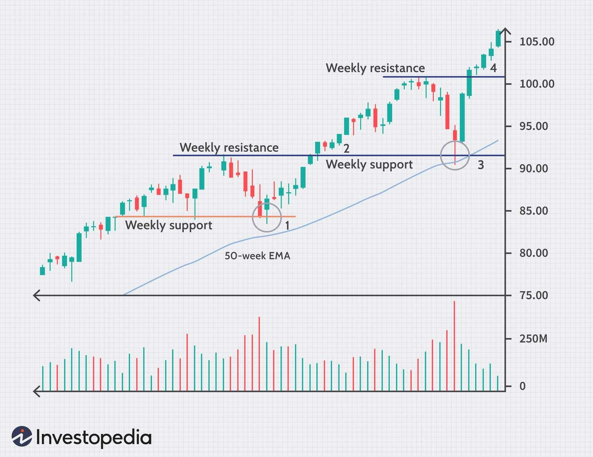

## Table of Contents

## What is a weekly trading strategy?

A weekly trading strategy is a plan that traders use to buy and sell stocks, currencies, or other financial assets over the course of a week. The goal is to make profits by taking advantage of short-term price movements. Traders using this strategy often look at weekly charts and use technical analysis to find good times to enter and exit trades. They might also pay attention to news and events that could affect the market during the week.

Weekly trading strategies can be less stressful than daily trading because they give traders more time to think and make decisions. Instead of watching the market every minute, traders can check their positions once or twice a day. This approach can help them avoid making quick, emotional decisions. However, it still requires a good understanding of the market and the ability to stick to a plan, even when things don't go as expected.

## Why might someone choose a weekly trading strategy over daily or monthly strategies?

Someone might choose a weekly trading strategy because it's a good middle ground between daily and monthly trading. Weekly trading gives you more time to think about your trades than daily trading, which can be very fast and stressful. You don't have to watch the market every minute, so you can make better decisions without feeling rushed. This can help you avoid making quick, emotional choices that might lead to losses.

On the other hand, weekly trading is more active than monthly trading. Monthly trading can be too slow for some people because you might miss out on good opportunities that happen within a month. With weekly trading, you can take advantage of short-term price movements while still having enough time to plan your moves carefully. This balance can be appealing if you want to be more involved in the market than monthly trading allows, but not as involved as daily trading requires.

## What are the key components of a successful weekly trading strategy?

A successful weekly trading strategy needs a few key parts to work well. First, you need a clear plan that says when to buy and sell. This plan should use weekly charts and look at past price movements to find good times to trade. It's important to stick to your plan and not let feelings like fear or greed make you change it. Also, you should set clear goals for how much money you want to make and how much you're willing to lose. This helps you stay focused and know when to stop trading.

Another important part is doing your homework. You should keep an eye on news and events that could affect the market during the week. This can help you understand why prices are moving and make better decisions. It's also good to use tools like stop-loss orders to limit your losses if the market moves against you. Finally, you need to keep track of how well your strategy is working and be ready to change it if it's not giving you the results you want. This way, you can keep improving and make more money over time.

## How do you identify potential entry points in a weekly trading strategy?

To find good times to start trading in a weekly strategy, you need to look at the weekly charts and use technical analysis. This means you check the price movements over the past weeks to see patterns. You might look for trends, like if the price is going up or down steadily. You could also watch for special patterns, like when the price makes a certain shape that often means it's a good time to buy or sell. Another thing to look at is support and resistance levels. These are price points where the price often stops and turns around. If the price gets close to these levels, it might be a good time to start a trade.

It's also important to pay attention to what's happening in the world that could affect the market. News about the economy, big companies, or even politics can change how people feel about buying or selling. If there's news that might make the price go up or down, you might want to start a trade just before or after the news comes out. Combining this with the patterns you see on the charts can help you find the best times to enter the market. Remember, the goal is to find times when the price is likely to move in a way that will make you money.

## What are common exit strategies used in weekly trading?

In weekly trading, one common exit strategy is to set a target price for taking profits. This means deciding ahead of time at what price you want to sell your asset to make a profit. If the price reaches this level during the week, you sell and take your gains. Another way is to use a stop-loss order. This is when you set a price at which you will sell if the market goes against you, to limit your losses. Both of these methods help you manage your trades without having to watch the market all the time.

Another exit strategy is based on technical indicators. Traders often look at moving averages, RSI, or other tools to decide when to get out of a trade. If these indicators show that the trend might be changing or the market is getting too hot, it might be a good time to sell. Some traders also use time-based exits, where they decide to sell at the end of the week no matter what, to avoid holding onto a trade for too long. This can help them stick to their weekly plan and not get caught up in longer-term market movements.

## How can risk management be integrated into a weekly trading strategy?

Risk management is very important in a weekly trading strategy. One way to manage risk is by using stop-loss orders. A stop-loss order is a tool that automatically sells your asset if the price drops to a certain level. This helps you limit how much money you could lose on a trade. Another way to manage risk is by not putting all your money into one trade. Instead, you can spread your money across different trades. This way, if one trade goes bad, you won't lose everything.

It's also a good idea to only risk a small amount of your total money on any single trade. A common rule is to not risk more than 1-2% of your total trading money on one trade. This helps you keep trading even if you have a few losses. You should also think about the overall risk of your strategy. This means looking at how all your trades together might affect your money. If you see that you're taking too much risk, you can change your strategy to be safer. By doing these things, you can protect your money and trade more confidently.

## What technical indicators are most useful for weekly trading?

For weekly trading, some of the most useful technical indicators are moving averages, the Relative Strength Index (RSI), and the MACD (Moving Average Convergence Divergence). Moving averages help you see the overall trend of the market over time. By looking at the 50-week and 200-week moving averages, you can tell if the market is going up or down. If the shorter moving average crosses above the longer one, it might be a good time to buy. If it crosses below, it might be a good time to sell.

The RSI is another helpful tool. It measures how fast and how much the price is moving. If the RSI is over 70, it means the market might be overbought and could go down soon. If it's under 30, the market might be oversold and could go up. The MACD helps you see changes in the strength and direction of a trend. It's made up of two lines, and when the faster line crosses above the slower line, it's a sign to buy. When it crosses below, it's a sign to sell. Using these indicators together can help you make better trading decisions each week.

## How does market analysis differ for weekly trading compared to other time frames?

Market analysis for weekly trading is different from daily or monthly trading because it looks at a longer time frame than daily trading but a shorter one than monthly trading. Weekly trading focuses on trends and patterns that happen over weeks, not days or months. This means you look at weekly charts to see how prices have moved over the past few weeks. You use these charts to find good times to buy and sell, based on the bigger picture of what's happening in the market. This can help you avoid getting caught up in the small ups and downs that happen every day.

When you do market analysis for weekly trading, you also pay attention to news and events that could affect the market over the next week. This is different from daily trading, where you might be more focused on what's happening right now, or monthly trading, where you might be looking at bigger economic trends. In weekly trading, you want to know about things like company earnings reports or economic data releases that are coming up in the next week. These can cause big price movements, and knowing about them ahead of time can help you make better trading decisions.

## Can you explain how to adjust a weekly trading strategy based on market volatility?

When the market is moving a lot and prices are changing quickly, it's called high volatility. If you're doing weekly trading, you might need to change your plan to handle this. One way to do this is by using wider stop-loss orders. This means you set the price where you'll sell if the market goes against you a bit higher than usual. This gives your trade more room to move without getting stopped out too early. You might also want to lower the amount of money you put into each trade. By risking less money per trade, you can protect yourself if the market makes big, sudden moves.

Another thing you can do is to trade less often when the market is very volatile. Instead of making many trades in a week, you might choose to make fewer trades and be more careful about when you enter the market. This can help you avoid getting caught in big price swings. Also, you can look at different indicators like the Average True Range (ATR) to see how much the market is moving. If the ATR is high, it means the market is more volatile, and you might want to adjust your strategy to be safer. By making these changes, you can keep trading even when the market is moving a lot.

## What are some advanced techniques for optimizing a weekly trading strategy?

To make your weekly trading strategy even better, you can use something called backtesting. This means you look at how your strategy would have worked in the past using old market data. By doing this, you can see if your plan would have made money or lost money. If you find parts of your strategy that didn't work well, you can change them. Another advanced technique is to use different kinds of technical indicators together. For example, you might use moving averages to see the trend and the RSI to check if the market is overbought or oversold. Using these together can give you a better picture of what's happening in the market and help you make smarter trading choices.

Another way to optimize your weekly trading strategy is by using something called position sizing. This means deciding how much money to put into each trade based on how risky it is. If a trade seems very risky, you might put less money into it. If it seems safer, you might put more money in. This can help you manage your risk better. Also, you can use something called algorithmic trading. This is when you use a computer program to make trades for you based on your strategy. The computer can watch the market all the time and make trades faster than you can. This can help you take advantage of opportunities you might miss if you were trading by yourself.

## How do you backtest a weekly trading strategy to ensure its effectiveness?

To backtest a weekly trading strategy, you need to use old market data to see how your plan would have worked in the past. Start by collecting data on the asset you want to trade, like stock prices or currency rates, for several years. Then, apply your trading rules to this data, pretending you are making trades each week based on your strategy. Keep track of how much money you would have made or lost with each trade. This helps you see if your strategy would have been profitable and where it might need changes.

After you finish backtesting, look at the results carefully. See if there are patterns where your strategy did well or poorly. Maybe it works great in some market conditions but not in others. Use this information to tweak your strategy. For example, if you find that your stop-loss orders are too tight and get you out of trades too early, you might want to make them wider. Backtesting isn't perfect because past results don't always predict the future, but it's a great way to test and improve your weekly trading strategy before you use real money.

## What are the psychological challenges traders face with weekly trading strategies and how can they be overcome?

One of the biggest psychological challenges traders face with weekly trading strategies is the need for patience. Weekly trading means you have to wait longer to see if your trades will work out. This can be hard because it's easy to get impatient and want to make quick decisions. Sometimes, traders might feel tempted to change their plan or make a new trade just because they're bored or worried. This can lead to bad choices and losses. To overcome this, traders need to trust their plan and stick to it. It helps to remind yourself why you chose a weekly strategy and to focus on the bigger picture instead of small daily changes.

Another challenge is dealing with losses. Even with a good strategy, not every trade will be a winner. Losing money can make traders feel upset or scared, and they might start doubting their strategy. This can lead to emotional trading, where they make decisions based on feelings instead of their plan. To handle this, it's important to accept that losses are a normal part of trading. Setting clear goals and risk limits can help. Also, keeping a trading journal where you write down what you learned from each trade, even the bad ones, can help you stay calm and learn from your mistakes. By focusing on the long-term results and not getting too upset about short-term losses, traders can better manage the psychological challenges of weekly trading.

## What are the challenges and pitfalls?

Weekly trading strategies present distinct challenges and pitfalls that necessitate careful consideration and strategic planning. A primary challenge is the inherent requirement for patience. Unlike daily trading techniques where trades occur more frequently, weekly strategies operate on a longer timeline, meaning traders might execute significantly fewer trades. This can test the trader's patience and may lead to decisions driven by the lack of immediate feedback or action, which, if not managed, can result in suboptimal trading outcomes.

The unpredictability of market conditions significantly impacts weekly trends. Weekly strategies are vulnerable to unexpected market shifts caused by macroeconomic events, geopolitical developments, or sudden shifts in market sentiment. These abrupt changes can undermine established trends, causing potential losses if not properly managed. Therefore, robust risk management practices are vital. These can include setting stop-loss orders, diversifying trades across multiple assets, and maintaining a balanced risk-reward ratio. To quantify risk, metrics such as the Sharpe Ratio or Value at Risk (VaR) can be employed:

$$
\text{Sharpe Ratio} = \frac{(R_p - R_f)}{\sigma_p}
$$

where $R_p$ is the expected portfolio return, $R_f$ is the risk-free rate, and $\sigma_p$ is the standard deviation of the portfolio return.

Comprehensive [backtesting](/wiki/backtesting) is an indispensable component for refining strategy rules for weekly setups. Backtesting involves using historical data to simulate trades and evaluate the performance of a strategy under various market conditions. This process helps identify potential weaknesses in the strategy and allows for adjustments to the algorithmic framework. Key metrics such as win rate, maximum drawdown, and risk-adjusted returns should be closely monitored during backtesting. The following is a basic example of backtesting a weekly strategy using Python:

```python
import pandas as pd
import numpy as np

# Example of backtesting with weekly data
def calculate_strategy_performance(data, strategy_func):
    initial_cash = 10000
    cash = initial_cash
    position = 0

    # Iterate over the weekly data
    for index, row in data.iterrows():
        signal = strategy_func(row)

        # Buy signal
        if signal == 'buy' and cash > row['Close']:
            position += 1
            cash -= row['Close']

        # Sell signal
        if signal == 'sell' and position > 0:
            position -= 1
            cash += row['Close']

    # Calculate total value
    total_value = cash + position * data.iloc[-1]['Close']
    return total_value

# Mock strategy function
def simple_moving_average_strategy(row):
    if row['SMA'] > row['Close']:
        return 'buy'
    elif row['SMA'] < row['Close']:
        return 'sell'
    return 'hold'

# Mock data
data = pd.DataFrame({
    'Close': np.linspace(100, 200, 52),  # Simulated weekly prices
    'SMA': np.linspace(90, 210, 52)     # Example simple moving average
})

performance = calculate_strategy_performance(data, simple_moving_average_strategy)
print(f"Strategy performance: ${performance}")
```

In this code, a simplified backtesting framework is shown where a basic moving average strategy dictates buy and sell signals based on weekly data. The process can be significantly more complex when applied to real-world scenarios, requiring additional considerations such as transaction costs, slippage, and varying market conditions.

## What is the Weekly Trading Strategy Backtesting?

Backtesting in weekly trading strategies is an essential process that allows traders to simulate trades using historical data to evaluate the effectiveness and optimize potential strategies. This process helps in discerning how a strategy might perform in real market conditions without risking actual capital. 

One of the primary objectives of backtesting is to confirm the robustness of a trading strategy. Important metrics that traders should focus on include:

1. **Win Rate**: This metric indicates the proportion of winning trades out of the total number of trades executed during the backtest period. A higher win rate suggests that the strategy can frequently identify profitable opportunities. However, it should be evaluated in conjunction with other metrics, as a high win rate does not necessarily equate to overall profitability.

2. **Maximum Drawdown**: It measures the largest peak-to-trough decline in the portfolio value during the backtest period. It is a critical risk metric, indicating the potential risk of loss in a strategy. The formula for maximum drawdown is:
$$
   \text{Maximum Drawdown} = \frac{\text{Peak Portfolio Value} - \text{Trough Portfolio Value}}{\text{Peak Portfolio Value}}

$$

   A smaller maximum drawdown suggests that the strategy is less likely to undergo significant losses, making it an attractive option for risk-averse traders.

3. **Risk-Adjusted Returns**: This metric is used to determine how much return a strategy generates for the level of risk taken. The Sharpe Ratio is a common measure, calculated as:
$$
   \text{Sharpe Ratio} = \frac{\text{Average Return} - \text{Risk-Free Rate}}{\text{Standard Deviation of Return}}

$$

   A higher Sharpe Ratio indicates a more favorable risk-return trade-off.

Proper backtesting not only validates the efficacy of a strategy but also identifies weaknesses. It allows traders to refine their strategy rules to improve performance and reliability. By examining historical performance, traders can adjust parameters, such as entry and [exit](/wiki/exit-strategy) signals, risk management thresholds, and other significant aspects to enhance strategy effectiveness. Moreover, backtesting helps in understanding market behaviors under different conditions, allowing the development of a nuanced trading approach.

In Python, traders often use libraries like Pandas for data manipulation and PyAlgoTrade or Backtrader for strategy testing. For instance, a simple backtest framework in Python might consist of loading historical data, implementing the trading logic, and iterating over the data to simulate trades and calculate performance metrics.

```python
import pandas as pd
import backtrader as bt

# Load historical data
data = pd.read_csv('historical_data.csv')

# Define your strategy
class WeeklyStrategy(bt.Strategy):
    def __init__(self):
        self.weekly_sma = bt.indicators.SimpleMovingAverage(self.data.close, period=5)

    def next(self):
        if self.data.close[0] > self.weekly_sma[0]:
            self.buy()
        elif self.data.close[0] < self.weekly_sma[0]:
            self.sell()

# Initialize Cerebro engine
cerebro = bt.Cerebro()
cerebro.addstrategy(WeeklyStrategy)

# Add data feed to Cerebro
data_feed = bt.feeds.PandasData(dataname=data)
cerebro.adddata(data_feed)

# Run backtest
cerebro.run()

# Plot results
cerebro.plot()
```

The above Python example outlines a rudimentary framework where historical data is loaded, a simple moving average strategy is defined, and the backtest is conducted using the Backtrader library. Through such backtesting simulations, traders gain critical insights needed to enhance and refine their weekly trading strategies for better risk management and maximizing potential returns.

## References & Further Reading

[1]: Bergstra, J., Bardenet, R., Bengio, Y., & Kégl, B. (2011). ["Algorithms for Hyper-Parameter Optimization."](https://papers.nips.cc/paper/4443-algorithms-for-hyper-parameter-optimization) Advances in Neural Information Processing Systems 24.

[2]: ["Advances in Financial Machine Learning"](https://www.amazon.com/Advances-Financial-Machine-Learning-Marcos/dp/1119482089) by Marcos Lopez de Prado

[3]: ["Evidence-Based Technical Analysis: Applying the Scientific Method and Statistical Inference to Trading Signals"](https://www.amazon.com/Evidence-Based-Technical-Analysis-Scientific-Statistical/dp/0470008741) by David Aronson

[4]: ["Machine Learning for Algorithmic Trading"](https://github.com/stefan-jansen/machine-learning-for-trading) by Stefan Jansen

[5]: ["Quantitative Trading: How to Build Your Own Algorithmic Trading Business"](https://books.google.com/books/about/Quantitative_Trading.html?id=j70yEAAAQBAJ) by Ernest P. Chan