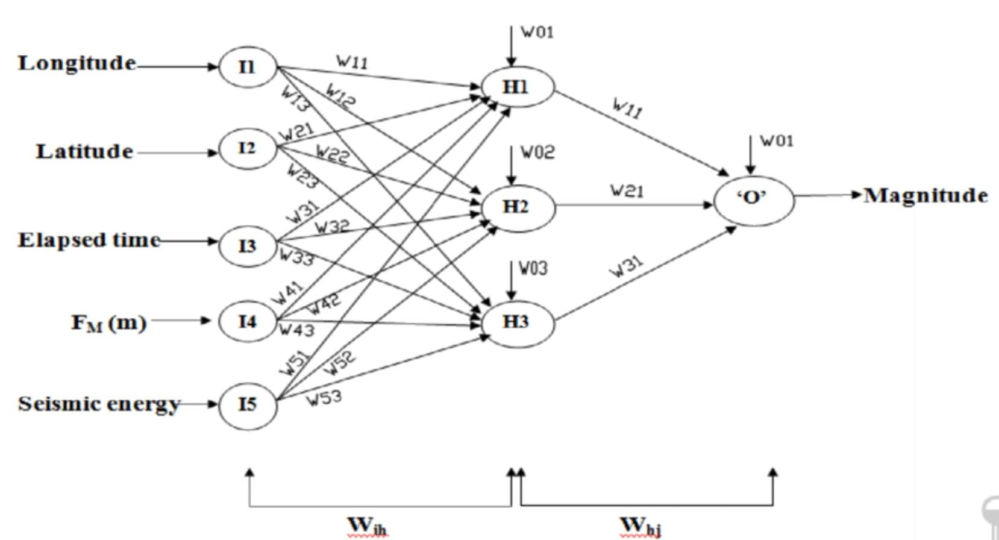

## Table of Contents

## What is a weight in the context of machine learning?

In machine learning, a weight is a number that a model uses to make predictions. Think of it like a dial that the model can turn to adjust how much it pays attention to different pieces of information. For example, in a model that predicts house prices, one weight might control how much the model considers the size of the house, while another weight might control how much it considers the age of the house. These weights are adjusted during training so that the model gets better at making accurate predictions.

When training a machine learning model, the goal is to find the best set of weights that minimize the error between the model's predictions and the actual outcomes. This process is often done using an algorithm like gradient descent, which iteratively adjusts the weights to improve the model's performance. For instance, if the model is consistently underestimating house prices, the weights might be adjusted to give more importance to factors that increase the predicted price. Over many iterations, the weights are fine-tuned until the model's predictions are as accurate as possible.

## How do weights influence the output of a neural network?

Weights in a neural network are like knobs that control how much each piece of information matters when the network makes a decision. Imagine you're trying to guess how much a cake will weigh based on its ingredients. Each ingredient has a weight that tells the network how important that ingredient is. If the weight for flour is high, the network will pay more attention to how much flour is in the cake. When the network gets new information, it multiplies that information by the weights and adds it all up to make a prediction.

The way weights affect the output is through a process called forward propagation. During forward propagation, the input data is fed into the network, and it travels through layers of neurons. At each neuron, the input is multiplied by the weights and then passed through an activation function. This process continues until the output layer, where the final result is produced. If the weights are set correctly, the network can make accurate predictions. For example, if the network is trying to recognize a picture of a cat, the weights help the network focus on features like whiskers and ears, which are important for identifying a cat.

## What is the initial process of setting weights in a neural network?

When you first start building a [neural network](/wiki/neural-network), you need to set the weights to some initial values. This is called weight initialization. The goal is to start with weights that are neither too big nor too small, so the network can learn well. One common way to do this is by using random numbers. For example, you might use a method called "Glorot initialization" or "Xavier initialization," which sets the weights to random values drawn from a specific distribution. This helps the network start off on the right foot by making sure the signals flowing through it are not too strong or too weak.

After the weights are set, the network begins to learn by adjusting these weights. This happens during training, where the network sees many examples and tries to get better at making predictions. The weights are updated using an algorithm like gradient descent, which looks at how wrong the network's predictions are and tweaks the weights to make the predictions more accurate. Over time, these adjustments help the network learn the best weights for making good predictions. If the initial weights were set well, the network can learn faster and more effectively.

## How are weights adjusted during the training of a neural network?

During the training of a neural network, weights are adjusted through a process called backpropagation. This process works by first making a prediction with the current weights, then comparing that prediction to the actual correct answer. If the prediction is wrong, the network calculates how much each weight contributed to the error. This is done using a method called the chain rule from calculus, which helps figure out how small changes in each weight affect the final prediction. The network then adjusts the weights in the opposite direction of the error, making the prediction a little better each time. This adjustment is guided by an optimization algorithm like gradient descent, which uses the gradient (or slope) of the error with respect to each weight to decide how much to change it.

The formula for updating weights using gradient descent can be written as $$ w_{new} = w_{old} - \eta \cdot \frac{\partial E}{\partial w} $$, where $$ w_{new} $$ is the new weight, $$ w_{old} $$ is the old weight, $$ \eta $$ is the learning rate, and $$ \frac{\partial E}{\partial w} $$ is the gradient of the error with respect to the weight. The learning rate is a small number that controls how big the adjustments to the weights are. If it's too big, the network might overshoot the best weights; if it's too small, the learning might be too slow. By repeatedly applying this update rule over many examples, the neural network gradually improves its weights, getting better at making accurate predictions.

## What is the role of the loss function in adjusting weights?

The loss function is like a scorekeeper that tells the neural network how well it's doing. When the network makes a prediction, the loss function compares that prediction to the actual correct answer and calculates a number called the "loss" or "error." This number shows how far off the prediction was. The goal of training a neural network is to make this loss number as small as possible, which means the network is making better predictions.

To make the loss smaller, the network adjusts its weights. It does this by using a method called backpropagation, where it figures out how each weight affects the loss. If a weight makes the loss bigger, the network will change that weight to make the loss smaller. The formula for updating weights using gradient descent is $$ w_{new} = w_{old} - \eta \cdot \frac{\partial E}{\partial w} $$, where $$ w_{new} $$ is the new weight, $$ w_{old} $$ is the old weight, $$ \eta $$ is the learning rate, and $$ \frac{\partial E}{\partial w} $$ is how the loss changes when the weight changes. By using the loss function to guide these adjustments, the neural network can learn the best weights for making accurate predictions.

## Can you explain the concept of weight initialization and its importance?

Weight initialization is the process of setting the starting values for the weights in a neural network before it starts learning. Imagine you're trying to solve a puzzle, and you need to start somewhere. If you start with good guesses, you might solve the puzzle faster. In a neural network, starting with good initial weights helps the network learn faster and more effectively. One common way to do this is by using random numbers, but not just any random numbers. Methods like "Glorot initialization" or "Xavier initialization" use a special way to pick these numbers so that the network starts off on the right foot.

The importance of weight initialization comes from how it affects the learning process. If the weights are too big or too small at the start, the network might have a hard time learning. For example, if the weights are too big, the signals passing through the network might become too strong, causing the network to make wild guesses. If the weights are too small, the signals might become too weak, and the network might not learn anything at all. By using a good initialization method, the network can start with weights that are just right, making it easier for the network to adjust them during training and find the best weights for making accurate predictions.

## What are some common weight initialization techniques?

One common weight initialization technique is called "Glorot initialization" or "Xavier initialization." This method sets the weights to random numbers drawn from a uniform distribution. The idea is to make sure the signals flowing through the network are neither too strong nor too weak. The formula for Xavier initialization is $$ W \sim U\left[-\frac{\sqrt{6}}{\sqrt{n_{in} + n_{out}}}, \frac{\sqrt{6}}{\sqrt{n_{in} + n_{out}}}\right] $$, where $$ W $$ is the weight, $$ U $$ is the uniform distribution, and $$ n_{in} $$ and $$ n_{out} $$ are the number of input and output neurons, respectively. This helps the network learn faster by starting with weights that are balanced.

Another popular technique is "He initialization," which is similar to Xavier initialization but designed for networks using ReLU activation functions. The formula for He initialization is $$ W \sim U\left[-\sqrt{\frac{6}{n_{in}}}, \sqrt{\frac{6}{n_{in}}}\right] $$. This method works well because ReLU functions can sometimes cause the network to "die" if the weights are not initialized properly. By using He initialization, the network can avoid this problem and learn more effectively.

A third technique is "LeCun initialization," which is tailored for networks using sigmoid or tanh activation functions. The formula for LeCun initialization is $$ W \sim U\left[-\sqrt{\frac{3}{n_{in}}}, \sqrt{\frac{3}{n_{in}}}\right] $$. This method helps the network start with weights that are suitable for these activation functions, making it easier for the network to learn and adjust the weights during training.

## How does the choice of activation function affect weight updates?

The choice of activation function in a neural network can have a big impact on how weights are updated during training. Different activation functions can make the network learn faster or slower. For example, if you use a ReLU (Rectified Linear Unit) activation function, the network might learn faster because ReLU lets the signals flow more easily through the network. But if the weights are not set up right at the start, ReLU can cause some neurons to "die" and stop learning. On the other hand, if you use a sigmoid or tanh activation function, the network might learn more slowly because these functions can make the signals smaller as they move through the network. This can make it harder for the network to adjust the weights and learn the right values.

To make sure the weights are updated in the best way, you need to pick the right weight initialization method that matches the activation function. For example, if you are using ReLU, you might want to use He initialization. The formula for He initialization is $$ W \sim U\left[-\sqrt{\frac{6}{n_{in}}}, \sqrt{\frac{6}{n_{in}}}\right] $$. This helps the network start with weights that are good for ReLU and avoids the problem of neurons dying. If you are using sigmoid or tanh, you might want to use LeCun initialization instead. The formula for LeCun initialization is $$ W \sim U\left[-\sqrt{\frac{3}{n_{in}}}, \sqrt{\frac{3}{n_{in}}}\right] $$. By choosing the right initialization method for your activation function, you can help the network learn faster and make better predictions.

## What is the impact of learning rate on weight adjustments?

The learning rate is like a dial that controls how big the steps are when a neural network adjusts its weights. If the learning rate is too high, the network might take big steps and overshoot the best weights, making it hard to learn. On the other hand, if the learning rate is too low, the network will take tiny steps and learn very slowly. The formula for updating weights using gradient descent is $$ w_{new} = w_{old} - \eta \cdot \frac{\partial E}{\partial w} $$, where $$ w_{new} $$ is the new weight, $$ w_{old} $$ is the old weight, $$ \eta $$ is the learning rate, and $$ \frac{\partial E}{\partial w} $$ is the gradient of the error with respect to the weight. The learning rate, $$ \eta $$, decides how much the weights change each time.

Finding the right learning rate is important for the neural network to learn well. If you start with a high learning rate, you might see the network's performance improve quickly at first, but then it might start to get worse because it's overshooting. If you lower the learning rate, the network will take smaller steps and might eventually find the best weights, but it will take longer. Sometimes, people use a technique called "learning rate scheduling" to change the learning rate during training. This can help the network learn faster at the beginning and then fine-tune the weights more carefully later on.

## How do regularization techniques like L1 and L2 affect weights?

Regularization techniques like L1 and L2 help prevent a neural network from overfitting by adding a penalty to the weights. Overfitting is when a network learns the training data too well but can't make good predictions on new data. L1 regularization adds a penalty that is the sum of the absolute values of the weights, which can make some weights become zero. This is called sparsity, and it helps the network focus on the most important features. The formula for L1 regularization is $$ \text{Loss} + \lambda \sum_{i} |w_i| $$, where $$ \lambda $$ is a small number that controls how strong the penalty is, and $$ w_i $$ are the weights. By making some weights zero, L1 helps the network be simpler and less likely to overfit.

L2 regularization, on the other hand, adds a penalty that is the sum of the squares of the weights. This penalty makes all the weights smaller but doesn't make them zero. The formula for L2 regularization is $$ \text{Loss} + \lambda \sum_{i} w_i^2 $$. By making the weights smaller, L2 helps the network generalize better to new data. Both L1 and L2 regularization make the network's predictions more stable and less likely to be thrown off by small changes in the input data. Choosing between L1 and L2 depends on what you want the network to do: L1 if you want some weights to be zero, and L2 if you want all weights to be smaller but not zero.

## What are the challenges associated with vanishing and exploding gradients in relation to weights?

Vanishing gradients happen when the gradients, which tell the network how to adjust the weights, get really small as they go through the layers of the network. This makes it hard for the network to learn because the weights in the early layers don't change much. Imagine trying to climb a hill, but each step you take gets smaller and smaller until you're barely moving. This is a big problem in deep neural networks with many layers. To fix it, people use special activation functions like ReLU, which help keep the gradients from getting too small. They also use weight initialization methods like He initialization, which is designed to make sure the gradients don't vanish. The formula for He initialization is $$ W \sim U\left[-\sqrt{\frac{6}{n_{in}}}, \sqrt{\frac{6}{n_{in}}}\right] $$. By using these techniques, the network can learn better and adjust the weights in the early layers.

Exploding gradients are the opposite problem. They happen when the gradients get really big as they go through the layers, making the weights change too much. It's like trying to climb a hill, but each step you take gets bigger and bigger until you're jumping all over the place. This can make the network's predictions very unstable. To stop this from happening, people use a technique called gradient clipping, which limits how big the gradients can get. They also use careful weight initialization to start with weights that are not too big. By managing the gradients and starting with good weights, the network can learn without the weights going crazy. Both vanishing and exploding gradients are big challenges, but with the right techniques, you can help the network learn well and make good predictions.

## How do advanced techniques like batch normalization influence weight optimization?

Batch normalization is like a helper that makes it easier for a neural network to learn the best weights. It does this by making the data that goes into each layer of the network more consistent. Imagine you're trying to learn how to throw a ball accurately, but the ball's weight keeps changing. It would be hard to get good at throwing. Batch normalization is like using a ball with a consistent weight, so you can learn faster. It does this by adjusting the data so that it has a mean of zero and a standard deviation of one. This helps the network learn better because the weights don't have to change as much to handle different kinds of data.

Batch normalization also helps solve the problem of vanishing and exploding gradients. When the gradients get too small or too big, it's hard for the network to adjust the weights properly. Batch normalization keeps the gradients in a good range, so the network can learn without the weights going crazy. This makes the training process more stable and helps the network find the best weights faster. By using batch normalization, you can train deeper networks that learn well and make good predictions.

## References & Further Reading

[1]: Goodfellow, I., Bengio, Y., & Courville, A. (2016). ["Deep Learning."](https://link.springer.com/article/10.1007/s10710-017-9314-z) MIT Press.

[2]: Glorot, X., & Bengio, Y. (2010). ["Understanding the difficulty of training deep feedforward neural networks."](https://proceedings.mlr.press/v9/glorot10a/glorot10a.pdf) Proceedings of the Thirteenth International Conference on Artificial Intelligence and Statistics, 249-256.

[3]: He, K., Zhang, X., Ren, S., & Sun, J. (2015). ["Delving Deep into Rectifiers: Surpassing Human-Level Performance on ImageNet Classification."](https://arxiv.org/abs/1502.01852) Proceedings of the IEEE International Conference on Computer Vision (ICCV).

[4]: Ioffe, S., & Szegedy, C. (2015). ["Batch Normalization: Accelerating Deep Network Training by Reducing Internal Covariate Shift."](https://arxiv.org/abs/1502.03167) Proceedings of the 32nd International Conference on Machine Learning.

[5]: LeCun, Y., Bottou, L., Orr, G., & Müller, K. (1998). ["Efficient BackProp."](https://link.springer.com/chapter/10.1007/978-3-642-35289-8_3) Lecture Notes in Computer Science, 1524, 9-50.

[6]: Bishop, C. M. (2006). ["Pattern Recognition and Machine Learning."](https://www.cs.uoi.gr/~arly/courses/ml/tmp/Bishop_book.pdf) Springer. 

[7]: Nesterov, Y. (1983). ["A Method for Unconstrained Convex Minimization Problem with the Rate of Convergence O(1/k^2)."](https://scispace.com/papers/a-method-for-unconstrained-convex-minimization-problem-with-5ai2g7vsat) Doklady AN USSR, 269, 543-547.

[8]: Ruder, S. (2016). ["An overview of gradient descent optimization algorithms."](https://arxiv.org/abs/1609.04747) arXiv preprint arXiv:1609.04747.