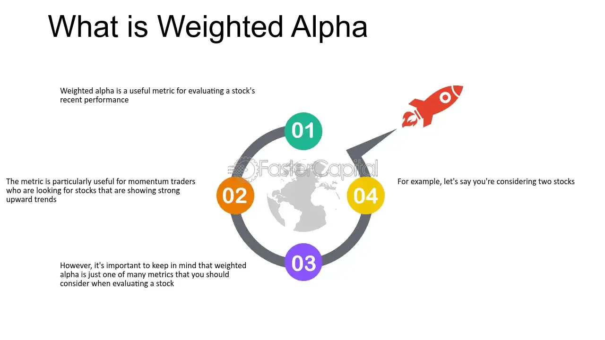

## Table of Contents

## What is Weighted Alpha?

Weighted Alpha is a measure used to evaluate how well a stock has performed compared to what was expected. It takes into account both the stock's price movement and the amount of risk involved. If a stock's Weighted Alpha is positive, it means the stock did better than expected. If it's negative, the stock didn't do as well as people thought it would.

This measure is helpful for investors because it gives them a clearer picture of a stock's performance. Instead of just looking at the stock's price, Weighted Alpha considers how much risk was involved in getting that performance. This makes it a useful tool for comparing different stocks and making smarter investment choices.

## Why is Weighted Alpha important in investment analysis?

Weighted Alpha is important in investment analysis because it helps investors see how well a stock is doing compared to what was expected. It's not just about whether the stock's price went up or down. Weighted Alpha looks at both the stock's price change and the risk that came with it. This means investors get a fuller picture of how the stock performed. If a stock has a high Weighted Alpha, it did better than people thought it would, considering the risks involved.

This measure is useful because it helps investors make better choices. By looking at Weighted Alpha, investors can compare different stocks more easily. They can see which stocks are doing better than expected for the level of risk involved. This can guide them in deciding where to put their money. In simple terms, Weighted Alpha helps investors find stocks that are not just doing well, but doing well in a way that's worth the risk.

## How does Weighted Alpha differ from regular Alpha?

Regular Alpha measures how much a stock or a portfolio has done better than a benchmark, like the S&P 500. It's a simple way to see if a stock is beating the market. For example, if a stock's Alpha is positive, it's doing better than the market, and if it's negative, it's doing worse.

Weighted Alpha takes things a step further. It not only looks at how a stock is doing compared to the market, but also considers the risk involved in getting that performance. This means Weighted Alpha gives you a more complete picture. It's like saying, "Yes, this stock did well, but was it worth the risk?" So, a stock with a high Weighted Alpha did better than expected, considering how risky it was.

In simple terms, while regular Alpha tells you if a stock beat the market, Weighted Alpha tells you if it was worth the risk to get that performance. This makes Weighted Alpha a more useful tool for investors who want to understand not just performance, but the quality of that performance.

## What are the key components needed to calculate Weighted Alpha?

To calculate Weighted Alpha, you need to know two main things: the stock's return and its risk. The stock's return is how much the stock's price has gone up or down over a certain time. This is compared to a benchmark, like the S&P 500, to see if the stock did better or worse than the market. The risk part is a bit trickier. It's usually measured by something called beta, which shows how much the stock's price moves compared to the market. A stock with a high beta is riskier because its price can swing a lot.

Once you have these two pieces of information, you can calculate the Weighted Alpha. You start by finding the regular Alpha, which is the difference between the stock's return and the benchmark's return. Then, you adjust this Alpha by the stock's beta to get the Weighted Alpha. This adjustment makes sure that the stock's performance is looked at in the context of how risky it was to get that performance. So, a stock with a high return might not have a high Weighted Alpha if it was very risky to get that return.

## Can you explain the formula for calculating Weighted Alpha?

To calculate Weighted Alpha, you first need to find the regular Alpha. This is done by taking the stock's return and subtracting the benchmark's return. The stock's return is how much the stock's price has changed over a certain time, and the benchmark's return is how much the market, like the S&P 500, has changed over the same time. If the stock's return is higher than the benchmark's return, you get a positive Alpha, meaning the stock did better than the market. If it's lower, you get a negative Alpha, meaning the stock did worse than the market.

Once you have the regular Alpha, you adjust it by the stock's beta to get the Weighted Alpha. Beta measures the stock's risk, showing how much the stock's price moves compared to the market. A stock with a high beta is riskier because its price can change a lot. To find the Weighted Alpha, you multiply the regular Alpha by the stock's beta. This adjustment makes sure that the stock's performance is considered in the context of how risky it was to get that performance. So, a stock with a high return might not have a high Weighted Alpha if it was very risky to get that return.

## How is the weighting factor determined in Weighted Alpha?

The weighting [factor](/wiki/factor-investing) in Weighted Alpha is determined by the stock's beta. Beta is a measure of how much a stock's price moves compared to the market. If a stock has a high beta, it means its price can change a lot, making it riskier. If a stock has a low beta, its price doesn't move as much, so it's less risky. The beta is used to adjust the regular Alpha to get the Weighted Alpha, making sure the stock's performance is looked at in the context of its risk.

To find the weighting factor, you just use the stock's beta. For example, if a stock has a beta of 1.5, that means it's 50% more volatile than the market. When you calculate the Weighted Alpha, you multiply the regular Alpha by this beta. This way, you get a number that shows not just how well the stock did compared to the market, but also how much risk was involved in getting that performance.

## What are the typical time frames used when calculating Weighted Alpha?

When people calculate Weighted Alpha, they often use different time frames depending on what they want to know. A common time frame is one year. This gives a good idea of how a stock has done over a full year, which can be useful for long-term investors. Another popular time frame is three months, or a quarter. This shorter period can show more recent performance, which might be more interesting for people who trade stocks more often.

Sometimes, people also look at even shorter time frames, like one month, to get a quick snapshot of how a stock is doing right now. But using shorter time frames can make the numbers more jumpy and less reliable for understanding the bigger picture. No matter which time frame you choose, the goal is to see how well a stock has done compared to what was expected, while also considering the risk involved.

## How can Weighted Alpha be used to compare different stocks or funds?

Weighted Alpha can help you compare different stocks or funds by showing you which ones are doing better than expected for the level of risk involved. If you're looking at two stocks, one with a high Weighted Alpha and one with a low Weighted Alpha, the stock with the higher number is doing better than people thought it would, considering how risky it is. This can help you decide where to put your money. For example, if Stock A has a Weighted Alpha of 10 and Stock B has a Weighted Alpha of 5, Stock A might be a better choice because it's doing better than expected for its risk level.

You can also use Weighted Alpha to compare funds. If you're choosing between two mutual funds or ETFs, looking at their Weighted Alphas can tell you which one is performing better than expected, given the risks. This way, you can see which fund is giving you a better return for the level of risk you're taking on. For instance, if Fund X has a Weighted Alpha of 15 and Fund Y has a Weighted Alpha of 8, Fund X might be the better pick because it's outperforming expectations more, considering its risk.

## What are the limitations of using Weighted Alpha as a performance metric?

One limitation of using Weighted Alpha as a performance metric is that it depends a lot on the time frame you use. If you look at a short time frame, like one month, the Weighted Alpha can change a lot and might not give you a good idea of how the stock will do in the long run. On the other hand, if you use a longer time frame, like a year, you might miss out on recent changes that could be important. So, the time frame you choose can make a big difference in what the Weighted Alpha tells you.

Another limitation is that Weighted Alpha only gives you part of the picture. It looks at how a stock did compared to what was expected and the risk involved, but it doesn't tell you everything. For example, it doesn't consider other important things like the company's financial health, what's happening in the industry, or big news that could affect the stock. So, while Weighted Alpha can be a helpful tool, you shouldn't use it alone to make investment decisions. You need to look at other information too to get a full understanding of a stock's performance.

## How does Weighted Alpha correlate with other risk-adjusted performance metrics?

Weighted Alpha is similar to other risk-adjusted performance metrics like the Sharpe Ratio and the Treynor Ratio because they all try to show how well an investment is doing when you think about the risk involved. The Sharpe Ratio looks at the extra return you get for the total risk you take, while the Treynor Ratio looks at the extra return for the market risk you take. Weighted Alpha, on the other hand, looks at how a stock did compared to what was expected, considering how risky it is. So, while they all care about risk and return, they look at different parts of it.

Even though these metrics are trying to do the same thing, they might not always agree with each other. For example, a stock could have a high Weighted Alpha but a low Sharpe Ratio. This could happen if the stock did better than expected but the total risk was high. So, it's good to use more than one of these metrics when you're trying to figure out if an investment is doing well. By looking at different angles, you can get a better idea of how the stock or fund is really performing.

## Can you provide a case study where Weighted Alpha significantly impacted investment decisions?

Imagine a small investor named Sarah who wanted to invest her savings in the stock market. She was looking at two tech companies, TechA and TechB. TechA had a Weighted Alpha of 15, while TechB had a Weighted Alpha of 5. Sarah used Weighted Alpha to help her decide which stock to buy. She knew that a higher Weighted Alpha means the stock did better than expected, considering how risky it is. So, she chose to invest in TechA because its Weighted Alpha was much higher. A year later, TechA's stock price had gone up a lot more than TechB's, and Sarah was happy with her choice.

In another case, a fund manager named John was managing a portfolio for his clients. He was looking at two mutual funds, FundX and FundY. FundX had a Weighted Alpha of 20, while FundY had a Weighted Alpha of 10. John used Weighted Alpha to compare the funds and see which one was doing better than expected for the risk involved. He decided to put more money into FundX because its Weighted Alpha was higher. Over the next six months, FundX did much better than FundY, and John's clients were pleased with the returns. These examples show how Weighted Alpha can help investors make smarter choices by considering both performance and risk.

## What advanced techniques can be applied to enhance the accuracy of Weighted Alpha calculations?

To make Weighted Alpha calculations more accurate, one advanced technique is to use more detailed risk models. Instead of just using beta, which measures how much a stock moves compared to the market, you can use other risk measures like standard deviation or Value at Risk (VaR). These can give you a better idea of the stock's risk. For example, standard deviation shows how much the stock's price changes over time, and VaR tells you the most you could lose in a bad situation. By using these more detailed risk measures, you can get a clearer picture of the stock's performance compared to its risk.

Another technique is to use more advanced statistical methods to calculate the expected return of the stock. Instead of just comparing the stock's return to a benchmark like the S&P 500, you can use models that look at more factors, like the company's earnings, the industry it's in, and even what's happening in the economy. These models can help you predict what the stock's return should be more accurately. By using these advanced methods, you can make sure your Weighted Alpha calculation is based on a more accurate expected return, which can lead to better investment decisions.

## What is Understanding Weighted Alpha?

Weighted alpha is a mathematical metric that seeks to evaluate the risk-adjusted performance of investments, particularly focusing on recent market dynamics. This measure places greater emphasis on recent price movements, which allows it to effectively capture the trends and momentum in a security’s price. Unlike traditional performance metrics that may treat all observations equally, weighted alpha allocates varying levels of importance to different periods within the evaluation timeframe, usually a year or shorter. This approach facilitates a more nuanced understanding of how a security performs over time.

One of the main advantages of weighted alpha is its ability to highlight current market trends by amplifying the contribution of more recent data points. This is particularly useful in environments with rapidly changing market conditions, where recent data might be more indicative of future directions than older data. By integrating both price and time into the analysis, weighted alpha provides insights that combine temporal and value dimensions, therefore offering a comprehensive picture of a security's performance.

To compute the weighted alpha, one typically assigns weights to different periods within a defined timeframe, which are then used to calculate weighted returns. The resulting value provides a risk-adjusted performance measure. This weighted approach can be customized by adjusting how much weight is allocated to each period based on specific preferences or market conditions. For example, a simple version could involve calculating weighted returns where the weight of each period increases linearly as it approaches the present. 

Mathematically, if $r_t$ represents the return at time $t$ and $w_t$ the corresponding weight, the weighted alpha over $n$ periods can be expressed as:

$$
\text{Weighted Alpha} = \sum_{t=1}^{n} w_t \cdot r_t
$$

In practice, implementing the weighted alpha calculation can be done using programming languages like Python. For instance, one could use a code snippet that calculates the weighted alpha for a list of returns:

```python
def calculate_weighted_alpha(returns, weights):
    if len(returns) != len(weights):
        raise ValueError("The length of returns and weights must match.")

    weighted_alpha = sum(r * w for r, w in zip(returns, weights))
    return weighted_alpha

# Example usage:
returns = [0.02, 0.05, -0.01, 0.03, 0.04]  # Sample returns
weights = [1, 2, 3, 4, 5]  # Increasing weight towards recent periods
result = calculate_weighted_alpha(returns, weights)
print("Weighted Alpha:", result)
```

In conclusion, weighted alpha serves as a powerful tool for evaluating security performance by prioritizing recent market activities, making it particularly useful in contexts where short-term trends are critical.

## How is Weighted Alpha calculated?

Weighted alpha is calculated by assigning weights to different periods within a specified timeframe, usually a year. This calculation provides a nuanced view of a security's performance by emphasizing more recent price movements, which are potentially more relevant for traders and investors.

The formula for weighted alpha generally involves summing the weighted returns of a security over the chosen timeframe. More recent data points are assigned greater weights, which reflects their increased significance in assessing current market dynamics. This approach helps capture trends and [momentum](/wiki/momentum) and allows for a more focused analysis of short-term performance.

A common method for implementing weighted alpha calculations is to use an exponential weight decay, where the weight of each period decreases exponentially as one moves further back in time. Mathematically, this can be expressed with weights calculated as follows:

$$
w_t = e^{-\lambda (T-t)}
$$

In this formula, $w_t$ represents the weight assigned to time period $t$, $\lambda$ is the decay rate, and $T$ is the most recent time period. A higher value of $\lambda$ increases the emphasis on recent data points.

The weighted alpha is then calculated by summing the returns of the security, each multiplied by its respective weight:

$$
\text{Weighted Alpha} = \sum_{t=1}^{T} w_t \cdot R_t
$$

Here, $R_t$ is the return of the security at time $t$.

Using programming languages like Python can streamline the calculation of weighted alpha in financial analysis and [algorithmic trading](/wiki/algorithmic-trading). For instance, one could use the following Python code snippet to calculate weighted alpha given a time series of returns:

```python
import numpy as np

def calculate_weighted_alpha(returns, decay_rate):
    T = len(returns)
    weights = np.exp(-decay_rate * np.arange(T-1, -1, -1))
    weighted_alpha = np.sum(weights * returns)
    return weighted_alpha

# Example usage
returns = np.array([0.01, 0.02, -0.005, 0.03, -0.01]) # hypothetical returns data
decay_rate = 0.1
weighted_alpha = calculate_weighted_alpha(returns, decay_rate)
print(f"Weighted Alpha: {weighted_alpha}")
```

The flexibility in weight assignments allows traders and analysts to tailor the weighted alpha calculation to their specific needs, potentially focusing more on recent periods if that aligns better with their trading strategies and objectives.

## What are the applications in algorithmic trading?

In algorithmic trading, weighted alpha is a crucial metric for developing strategies that exploit momentum by emphasizing recent price movements. By integrating weighted alpha into algorithms, traders can design systems that dynamically adjust their trading parameters, improving the system's adaptability to current market conditions.

Weighted alpha calculates a performance index that assigns greater importance to recent price data, thus identifying securities with strong recent trends. This approach enables algorithms to capitalize on these trends by adjusting their trading strategies accordingly. For instance, an algorithm can be programmed to execute buy or sell orders when the weighted alpha of a security crosses a certain threshold, indicating a significant change in momentum.

An essential part of implementing weighted alpha in algorithmic trading involves parameter tuning. Algorithms can constantly refine their parameters, such as entry and [exit](/wiki/exit-strategy) points, based on real-time calculations of weighted alpha. This dynamic adjustment is made possible by the formula used in calculating weighted alpha, which often takes the form:

$$
\text{Weighted Alpha} = \sum_{i=1}^{n} (w_i \times r_i)
$$

where $w_i$ represents the weight assigned to the price change $r_i$ in period $i$, and $n$ is the total number of periods considered. Weights are generally higher for more recent periods.

Python code can be utilized to illustrate how weighted alpha might be integrated into an algorithmic trading strategy. For instance, here is a simplified representation of how weighted alpha could be computed and used in an automated trading script:

```python
import numpy as np

def calculate_weighted_alpha(prices, weights):
    returns = np.diff(prices) / prices[:-1]
    weighted_alpha = np.sum(weights * returns)
    return weighted_alpha

# Sample price data and weights
prices = np.array([100, 102, 105, 110, 108, 115])
weights = np.array([0.1, 0.15, 0.2, 0.25, 0.3])  # Higher weights for more recent periods

weighted_alpha = calculate_weighted_alpha(prices, weights)

# Example of a simple trading decision based on weighted alpha
if weighted_alpha > 0.05:  # Threshold for trade execution
    print("Buy signal generated")
else:
    print("Hold or sell")
```

In this example, the `calculate_weighted_alpha` function computes the weighted alpha based on input prices and weights, and a buy signal is generated if the weighted alpha exceeds a specified threshold. This strategy emphasizes recent price actions, allowing the trading system to respond promptly to new information.

Overall, weighted alpha serves as a powerful tool in algorithmic trading, enhancing the decision-making process by focusing on short-term performance, optimizing trading strategies, and improving profitability.

## References & Further Reading

[1]: ["Advances in Financial Machine Learning"](https://www.amazon.com/Advances-Financial-Machine-Learning-Marcos/dp/1119482089) by Marcos Lopez de Prado

[2]: ["Evidence-Based Technical Analysis: Applying the Scientific Method and Statistical Inference to Trading Signals"](https://www.wiley.com/en-us/Evidence+Based+Technical+Analysis%3A+Applying+the+Scientific+Method+and+Statistical+Inference+to+Trading+Signals-p-9780470008744) by David Aronson

[3]: ["Machine Learning for Algorithmic Trading"](https://github.com/stefan-jansen/machine-learning-for-trading) by Stefan Jansen

[4]: ["Quantitative Trading: How to Build Your Own Algorithmic Trading Business"](https://www.amazon.com/Quantitative-Trading-Build-Algorithmic-Business/dp/1119800064) by Ernest P. Chan