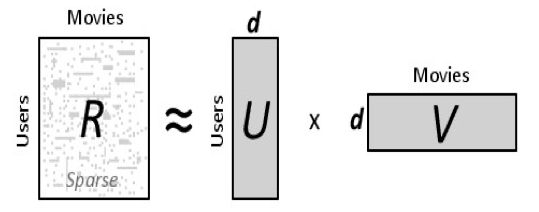

## Table of Contents

## What is Weighted Alternating Least Squares (WALS) and why is it used in machine learning?

Weighted Alternating Least Squares (WALS) is a method used in machine learning to solve matrix factorization problems, particularly when dealing with large and sparse datasets. In simple terms, it's a way to find patterns in data by breaking down a big matrix into smaller, more manageable parts. WALS works by alternating between optimizing two sets of variables, while applying different weights to the data points. This helps the algorithm focus on the most important parts of the data, which is especially useful when some data is missing or less reliable.

WALS is commonly used in recommendation systems, where it helps predict what users might like based on their past behavior. For example, if you've watched certain movies on a streaming service, WALS can help suggest other movies you might enjoy. By weighting the data, WALS can give more importance to recent actions or more trusted sources of information. This makes the recommendations more accurate and personalized. Overall, WALS is a powerful tool in machine learning because it can handle complex, real-world data effectively and provide meaningful insights.

## How does WALS differ from standard Alternating Least Squares (ALS)?

Weighted Alternating Least Squares (WALS) and standard Alternating Least Squares (ALS) are both methods used to solve matrix factorization problems, but they handle data differently. In standard ALS, all data points are treated equally when the algorithm tries to find the best way to break down a matrix into smaller parts. This means that every piece of information is given the same importance, regardless of how reliable or recent it is. On the other hand, WALS introduces weights to the data points, allowing the algorithm to focus more on certain pieces of information. This weighting can be based on various factors, like the confidence in the data or the recency of the information, making WALS more flexible and potentially more accurate in handling real-world data.

For example, in a recommendation system, if a user recently watched a movie, WALS can give more importance to this recent action compared to movies watched months ago. This helps in providing more relevant recommendations. In contrast, standard ALS would treat all the movies the user has watched the same, which might not capture the user's current interests as effectively. By using weights, WALS can better handle sparse and noisy data, making it particularly useful in scenarios where not all data is equally valuable or reliable.

## What are the key components of the WALS algorithm?

The WALS algorithm works by breaking down a big matrix into smaller parts, called factors, using a process that goes back and forth between two sets of these factors. The key idea is to use weights to give more importance to some data points over others. These weights help the algorithm focus on the most important or reliable information. For example, if you're trying to recommend movies, WALS can give more weight to movies a user recently watched, making the recommendations more accurate.

The algorithm starts with some initial guesses for the factors and then alternates between updating them. In each step, it tries to minimize the difference between the original matrix and the product of the factors, but it does this while taking the weights into account. This means the algorithm pays more attention to data points with higher weights. The process continues until the factors are good enough to represent the original matrix well, considering the weights. This back-and-forth approach, combined with the use of weights, makes WALS effective for dealing with large, messy datasets where not all data is equally important.

## Can you explain the mathematical formulation of WALS?

The WALS algorithm aims to break down a large matrix into smaller parts, called factors, while considering the importance of different data points. Let's say we have a matrix $R$ that we want to approximate with two smaller matrices $U$ and $V$. The goal is to minimize the difference between $R$ and the product $UV^T$, but with weights. These weights are represented by another matrix $C$, where each entry $c_{ij}$ tells us how important the corresponding entry $r_{ij}$ in $R$ is. The mathematical formulation of WALS tries to minimize the weighted squared error, which can be written as:

$$ \min_{U, V} \sum_{(i,j) \in \Omega} c_{ij} (r_{ij} - u_i^T v_j)^2 $$

Here, $\Omega$ is the set of observed entries in $R$, $u_i$ is the $i$-th row of $U$, and $v_j$ is the $j$-th row of $V$. The algorithm alternates between fixing $U$ and solving for $V$, and then fixing $V$ and solving for $U$. This back-and-forth process helps to find the best $U$ and $V$ that minimize the weighted error. By considering the weights $c_{ij}$, WALS can focus on the most important parts of the data, making it especially useful for large and sparse datasets where some entries are more reliable or relevant than others.

## How is the weighting factor incorporated into the WALS algorithm?

The weighting [factor](/wiki/factor-investing) in the Weighted Alternating Least Squares (WALS) algorithm helps the method focus on the most important parts of the data. When you have a big matrix that you want to break down into smaller parts, you use weights to show which pieces of information are more important. These weights are stored in another matrix called $C$. Each entry in $C$ tells the algorithm how much attention to pay to the corresponding entry in the original matrix. By using these weights, WALS can give more importance to recent actions or more reliable data, making the results more accurate and useful.

In the mathematical formulation of WALS, the weights are used to minimize the difference between the original matrix and the product of the two smaller matrices, but with a twist. The goal is to make the weighted squared error as small as possible. This can be written as $$ \min_{U, V} \sum_{(i,j) \in \Omega} c_{ij} (r_{ij} - u_i^T v_j)^2 $$. Here, $\Omega$ is the set of observed entries, and $c_{ij}$ is the weight for the entry $r_{ij}$ in the original matrix. By considering these weights, WALS can handle large and messy datasets better, focusing on the parts of the data that matter most.

## What types of problems can WALS effectively solve in machine learning?

Weighted Alternating Least Squares (WALS) is great for solving problems in [machine learning](/wiki/machine-learning) where you have a lot of data but some parts of it are missing or not as important. One big use is in recommendation systems, where WALS helps figure out what movies or products people might like based on what they've enjoyed before. By using weights, WALS can pay more attention to recent actions or more reliable information, making the recommendations more accurate and personalized. For example, if someone just watched a new movie, WALS can give that more weight than movies they watched a long time ago, so the next suggestions are more relevant.

Another area where WALS is helpful is in handling large and messy datasets. These datasets often have gaps or noise, and WALS can deal with this by focusing on the most important parts of the data. The weights let the algorithm decide which pieces of information to trust more, so it can still find useful patterns even when some data is missing or not very reliable. This makes WALS a powerful tool for real-world applications where data can be complicated and not perfect.

## How do you implement WALS in a practical machine learning scenario?

To implement Weighted Alternating Least Squares (WALS) in a practical machine learning scenario, you start by setting up your data in a matrix form. This matrix represents the interactions between users and items, like movies they've watched or products they've bought. You also need a weight matrix that tells the algorithm which interactions are more important. For example, if you're building a movie recommendation system, you might give more weight to recent movie views. Once you have these matrices ready, you can use a programming language like Python to run the WALS algorithm. Libraries like TensorFlow or PySpark can help you do this efficiently, especially if you're dealing with a lot of data.

The WALS algorithm works by breaking down the big matrix into smaller parts, called factors, and it does this by alternating between updating two sets of these factors. The goal is to minimize the difference between the original matrix and the product of the factors, but with the weights taken into account. This can be written as $$ \min_{U, V} \sum_{(i,j) \in \Omega} c_{ij} (r_{ij} - u_i^T v_j)^2 $$. The algorithm keeps going back and forth until it finds the best way to represent the original matrix, focusing on the most important data points. Once you have the factors, you can use them to make predictions or recommendations. For instance, in a movie recommendation system, you can use the factors to suggest new movies to users based on their past views, with recent views having a bigger impact on the recommendations.

## What are the computational complexities associated with WALS?

The computational complexity of WALS can be quite high, especially when dealing with large datasets. The main reason for this is that WALS needs to go back and forth between updating two sets of factors, $U$ and $V$, to minimize the weighted squared error. This process, known as alternating optimization, requires solving a system of linear equations in each step. The complexity of solving these equations can be around $O(n^3)$ for a naive approach, where $n$ is the number of users or items. However, using more efficient methods like conjugate gradient can reduce this to $O(n^2)$ per iteration. Since WALS typically needs many iterations to converge, the overall complexity can be quite significant, especially for large and sparse matrices.

To handle these computational challenges, practical implementations often use techniques like parallel processing and distributed computing. Libraries like TensorFlow or PySpark can help with this, allowing the workload to be spread across multiple processors or machines. For example, in a recommendation system with millions of users and items, you might use a distributed setup to speed up the computation. This can make the WALS algorithm more manageable, even though it still requires careful tuning of parameters like the number of factors and the weights to balance accuracy and performance.

## How does WALS handle sparse data compared to other methods?

WALS is really good at dealing with sparse data, which means data where a lot of information is missing. In a big matrix, many entries might be empty, like in a recommendation system where most users haven't rated most items. WALS uses weights to focus on the data that is there, making it more important than the missing parts. This helps the algorithm find patterns even when a lot of data is missing. For example, if you've only watched a few movies, WALS can still suggest new ones by paying more attention to those few movies you've seen.

Compared to other methods, WALS does a better job with sparse data because it can adjust how much importance it gives to each piece of information. Other methods might treat all data the same, which can be a problem when a lot of it is missing. WALS, on the other hand, can give more weight to the data you do have, making its predictions more accurate. This is especially useful in real-world situations where data is often incomplete or messy. By using weights, WALS can make the most out of the data it has, even if it's not a lot.

## What are some optimization techniques used to improve the performance of WALS?

To make WALS faster and work better with big data, there are several tricks you can use. One common trick is to use parallel processing, which means splitting the work across many computers or processors. This can make the algorithm run much quicker, especially when you have a lot of users and items. Another trick is to use a method called conjugate gradient to solve the math problems in WALS. This can cut down the time it takes to find the best factors from $$ O(n^3) $$ to $$ O(n^2) $$ per step, making the whole process faster.

Another way to improve WALS is to carefully choose the number of factors and the weights. By tuning these, you can balance how accurate the results are with how long it takes to get them. For example, using fewer factors can make the algorithm run faster but might make the recommendations less accurate. Also, setting the right weights can help the algorithm focus on the most important data, which is especially useful when dealing with sparse data where a lot of information is missing. By using these optimization techniques, WALS can handle large, messy datasets more effectively and provide better results.

## How can WALS be integrated with other machine learning algorithms for enhanced results?

WALS can be combined with other machine learning algorithms to make predictions even better. For example, you can use WALS to start with good guesses about what users might like, and then use a different algorithm like a [neural network](/wiki/neural-network) to fine-tune those guesses. The WALS part helps by breaking down the big matrix of user-item interactions into smaller parts, focusing on the most important data. Then, the neural network can learn more complex patterns from these smaller parts, making the final recommendations more accurate. By working together, WALS and other algorithms can use their strengths to give you the best possible results.

Another way to use WALS with other methods is in a system called ensemble learning. Here, you might run WALS alongside other algorithms like decision trees or random forests. Each algorithm makes its own predictions, and then you combine them to get a final prediction that's better than any single one. For example, WALS can give you a good starting point for movie recommendations, and then a decision tree can look at other factors like the time of day or the user's mood to refine those recommendations. By blending the results from WALS and other algorithms, you can create a more robust and accurate prediction system.

## What are the current research trends and future directions for WALS in machine learning?

Current research in WALS is focusing on making it work better with even bigger and messier data. One trend is to use WALS with [deep learning](/wiki/deep-learning) to improve recommendation systems. For example, researchers are trying to combine WALS with neural networks to capture more complex patterns in user behavior. This can help make recommendations more accurate by considering not just what users have done in the past, but also how they might change over time. Another trend is to make WALS faster and more scalable. This involves using new techniques like parallel processing and distributed computing to handle huge amounts of data more efficiently. By doing this, WALS can be used in more real-world applications where data is constantly growing and changing.

Looking to the future, WALS might be used in even more areas of machine learning. One direction is to use WALS for tasks beyond recommendation systems, like in natural language processing or image recognition. For example, WALS could help break down large matrices of text or image data into smaller parts, making it easier to find patterns and make predictions. Another future direction is to make WALS more adaptable to different types of data. This means finding ways to automatically set the weights and the number of factors based on the data itself, so WALS can work well with any kind of dataset without a lot of manual tuning. By doing this, WALS could become a more flexible and powerful tool in machine learning.

## References & Further Reading

[1]: Hu, Y., Koren, Y., & Volinsky, C. (2008). ["Collaborative Filtering for Implicit Feedback Datasets."](http://yifanhu.net/PUB/cf.pdf) IEEE International Conference on Data Mining.

[2]: Zhou, Y., Wilkinson, D., Schreiber, R., & Pan, R. (2008). ["Large-Scale Parallel Collaborative Filtering for the Netflix Prize."](https://www.researchgate.net/profile/Robert-Schreiber-6/publication/220788980_Large-Scale_Parallel_Collaborative_Filtering_for_the_Netflix_Prize/links/00b7d5213e07f3dbcc000000/Large-Scale-Parallel-Collaborative-Filtering-for-the-Netflix-Prize.pdf) Proceedings of the 4th international conference on Algorithmic Aspects in Information and Management.

[3]: Takács, G., Pilászy, I., Németh, B., & Tikk, D. (2009). ["Scalable Collaborative Filtering Approaches for Large Recommender Systems."](https://jmlr.csail.mit.edu/papers/volume10/takacs09a/takacs09a.pdf) Journal of Machine Learning Research, 10:623-656.

[4]: ["Matrix Factorization Techniques for Recommender Systems"](https://ieeexplore.ieee.org/abstract/document/5197422) by Yehuda Koren, Robert Bell, and Chris Volinsky. 

[5]: Gemulla, R., Nijkamp, E., Haas, P. J., & Sismanis, Y. (2011). ["Large-Scale Matrix Factorization with Distributed Stochastic Gradient Descent."](https://dl.acm.org/doi/10.1145/2020408.2020426) Proceedings of the ACM SIGKDD International Conference on Knowledge Discovery and Data Mining.