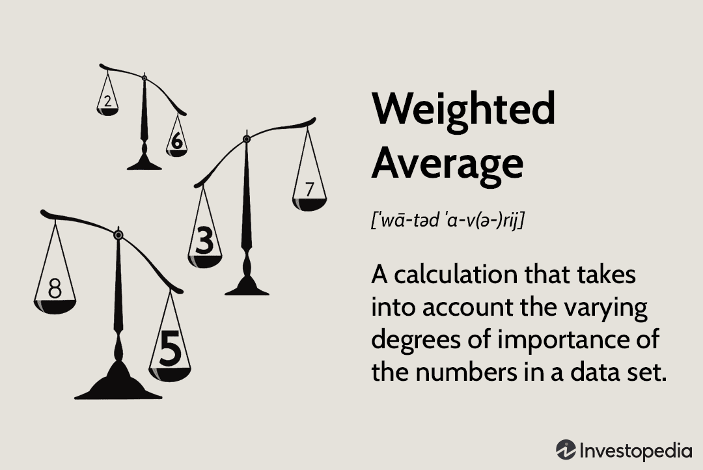

## Table of Contents

## What is a weighted average and how does it differ from a simple average?

A weighted average is a type of average where some values in the data set are given more importance, or "weight," than others. This means that instead of treating all numbers equally like you do in a simple average, you multiply each number by its weight before adding them up. Then, you divide the total by the sum of the weights. For example, if you're calculating your grade in a class where homework counts for 20% and exams count for 80%, you'd use a weighted average to reflect that exams have a bigger impact on your final grade.

A simple average, also known as an arithmetic mean, treats all numbers the same. You add up all the numbers and then divide by how many numbers you have. It's like if you wanted to know the average height of your friends; you'd add up all their heights and divide by the number of friends. The main difference between a weighted average and a simple average is that the weighted average lets you adjust the importance of different values, which can be useful in situations where not all data points are equally important.

## How do you calculate a weighted average?

To calculate a weighted average, you start by multiplying each number in your set by its weight. Imagine you have three test scores: 70, 80, and 90. If the weights for these scores are 1, 2, and 3 respectively, you would multiply 70 by 1, 80 by 2, and 90 by 3. This gives you 70, 160, and 270. Next, you add these results together. In this case, 70 + 160 + 270 equals 500.

After you've added up the weighted values, you need to find the sum of the weights. In our example, the weights are 1, 2, and 3, so their sum is 6. Finally, you divide the total of the weighted values by the sum of the weights. So, you take 500 and divide it by 6, which gives you a weighted average of about 83.33. This method lets you give more importance to some numbers over others, which is useful when different pieces of data matter more in your calculation.

## Can you provide a simple example of calculating a weighted average?

Let's say you have three homework assignments, and each one has a different weight. The first assignment is worth 10 points and has a weight of 1. The second is worth 15 points and has a weight of 2. The third is worth 20 points and has a weight of 3. To find the weighted average, you first multiply each score by its weight. So, you do 10 times 1, which is 10. Then, 15 times 2, which is 30. And finally, 20 times 3, which is 60.

Next, you add up all those results. So, 10 plus 30 plus 60 equals 100. Now, you need to add up the weights too. The weights are 1, 2, and 3, so their total is 6. To get the weighted average, you divide the total of the weighted scores by the total of the weights. So, 100 divided by 6 gives you a weighted average of about 16.67. This way, you can see how the different weights affect the final average.

## What are some common applications of weighted averages in everyday life?

Weighted averages are used a lot in school to figure out grades. Imagine you have tests, homework, and projects in a class. Each of these might count differently towards your final grade. If tests are worth 50%, homework 30%, and projects 20%, your teacher uses a weighted average to calculate your final grade. This means your test scores have a bigger impact on your grade than your homework or projects. It's a fair way to show what you've learned because it considers how important each part of the class is.

Another place you might see weighted averages is in shopping, especially when you're looking at customer reviews. If you're buying something online, the website might show an average star rating. But not all reviews are the same. Some people might have bought the product a long time ago, while others bought it recently. The website might give more weight to newer reviews because they're more relevant. This helps you get a better idea of what the product is like now, not just what it was like in the past.

## How are weighted averages used in financial analysis?

In financial analysis, weighted averages are often used to calculate the cost of capital for a company. Imagine a company uses both debt and equity to fund its operations. These two types of funding have different costs. Debt might have a lower cost because it's less risky for investors, while equity might be more expensive because shareholders expect higher returns. To figure out the overall cost of capital, analysts use a weighted average cost of capital (WACC). They give more weight to the funding source the company uses more. This helps them understand how much it really costs the company to get the money it needs to grow.

Another common use of weighted averages in finance is in portfolio management. When you invest in a mix of stocks, bonds, or other assets, each one might have a different expected return and level of risk. To figure out the overall expected return of your investment portfolio, you use a weighted average. You give more weight to the investments that make up a bigger part of your portfolio. This helps you see the big picture of how your investments might perform, considering how much you've put into each one. It's a way to balance risk and reward based on how much you've invested in different assets.

## What is the importance of weighted averages in grading systems?

Weighted averages are important in grading systems because they help teachers and schools give a fair grade that reflects how important each part of the class is. In a class, there might be homework, quizzes, tests, and projects. Each of these parts might not be equally important. For example, a big final exam might count for more than a small homework assignment. By using a weighted average, the teacher can make sure that the final grade shows what the student learned overall, not just how they did on one part of the class.

This method also helps students understand what they need to focus on to do well in the class. If a student knows that tests are worth more than homework, they might study harder for the tests. It's a clear way to show students what matters most in their learning. This can motivate them to work harder on the parts of the class that will have a bigger impact on their grade.

## How can weighted averages affect decision-making in business?

Weighted averages can help businesses make smarter choices by giving more importance to things that matter more. Imagine a company wants to decide where to open a new store. They might look at different factors like how many people live in an area, how much money people make there, and how close other stores are. Each of these things might not be equally important. The company can use a weighted average to give more weight to the factors that will make the biggest difference in how well the store does. This helps them pick the best spot for their new store.

In another example, a business might use weighted averages when they're figuring out how much it costs to make their products. They might have different costs for things like materials, labor, and shipping. Some of these costs might be more important than others. By using a weighted average, the business can get a better idea of their total costs. This can help them set prices that make sure they make money, and it can also help them decide where to spend their money to save the most. Using weighted averages helps businesses make decisions that are based on what's really important, not just on simple averages.

## What are the potential pitfalls of using weighted averages incorrectly?

Using weighted averages the wrong way can lead to big mistakes. If you give too much weight to something that's not that important, your results can be way off. Imagine a business deciding where to build a new factory. If they give too much weight to how close it is to a highway and not enough to how many people live nearby, they might end up in a place where no one buys their products. This can cost them a lot of money and time.

Another problem is if you don't use all the right information. If you leave out important data or use numbers that aren't correct, your weighted average won't be accurate. For example, if a teacher only uses test scores and forgets to include homework and projects in the final grade, students might get grades that don't show what they really learned. This can be unfair and cause problems for everyone involved.

## How do weighted moving averages work in time series analysis?

In time series analysis, weighted moving averages help smooth out data over time by giving more importance to some numbers than others. Imagine you're looking at the daily sales of a store for the last week. Instead of treating each day's sales the same, you might want to give more weight to the most recent days because they might be a better sign of what's happening now. So, if you're using a weighted moving average, you might give the sales from today a weight of 5, yesterday a weight of 4, the day before that a weight of 3, and so on. You multiply each day's sales by its weight, add them up, and then divide by the sum of the weights. This gives you a number that shows the trend of your sales, but it pays more attention to what's happening lately.

Using weighted moving averages can help you see patterns in your data more clearly. For example, if you're trying to predict future sales, a weighted moving average can help you focus on recent trends, which might be more important than what happened a long time ago. But you have to be careful with how you choose the weights. If you give too much weight to the most recent data, you might miss out on important long-term trends. And if you don't choose the right weights, your predictions might not be as good. So, [picking](/wiki/asset-class-picking) the right weights is key to making sure your weighted moving average works well for your time series analysis.

## Can you explain the use of weighted averages in portfolio management?

In portfolio management, weighted averages help investors figure out how their whole investment might do. Imagine you have money in different things like stocks, bonds, and maybe even some real estate. Each of these things might go up or down in value at different times. By using a weighted average, you can see how your whole portfolio might perform. You give more importance to the things you've put more money into. So, if you have a lot of money in stocks, the performance of your stocks will have a bigger impact on your overall results than something you've put less money into, like bonds.

This method helps you balance the risk and reward of your investments. If you know that stocks are riskier but might give you higher returns, and bonds are safer but might give you lower returns, you can use a weighted average to see how your mix of investments might work out. It's like making a recipe where you put in different ingredients, but you want to know how the whole dish will taste. By using a weighted average, you can make better choices about where to put your money, so you get the mix of risk and reward that's right for you.

## How do statistical software tools calculate and apply weighted averages?

Statistical software tools make it easy to calculate weighted averages by letting you put in your numbers and their weights. You just need to tell the software what your data is and how much each piece of data matters. For example, if you're looking at test scores and you want to give more importance to the final exam, you can tell the software to give that test a higher weight. The software then does the math for you. It multiplies each number by its weight, adds them all up, and divides by the total of the weights. This gives you the weighted average, which you can use to understand your data better.

These tools are helpful because they save time and reduce mistakes. Instead of doing the math by hand, which can be hard and take a long time, the software does it quickly and correctly. You can also use the software to try different weights and see how they change your results. This can be useful if you're not sure how important each part of your data should be. By playing around with the weights, you can find the best way to look at your data and make decisions based on what matters most.

## What advanced techniques exist for optimizing weights in weighted average calculations?

One advanced way to find the best weights for a weighted average is by using something called optimization techniques. These techniques help you figure out the best weights to use so your results are as accurate as possible. One common method is called linear regression, where you try to find weights that make your predictions match the real data as closely as possible. Another method is called genetic algorithms, which are like a computer version of natural selection. The computer tries lots of different weights, sees which ones work best, and then keeps tweaking them until it finds the best set of weights.

Another technique is called the least squares method, which tries to make the difference between your weighted average and the real data as small as possible. This method is good because it's simple to understand and use. You can also use [machine learning](/wiki/machine-learning) to find the best weights. Machine learning can look at a lot of data and find patterns that help it pick the best weights. These advanced techniques can be really helpful because they let you use data in the best way possible, which can make your decisions more accurate and help you understand your data better.

## What is the process for understanding weighted average calculations?

Weighted averages provide a nuanced perspective on financial metrics by assigning varying levels of importance, or weights, to different data points, making them crucial for applications in fields like algorithmic trading. Unlike simple averages, which treat all data points equally, weighted averages consider the relevance or significance of each data point, thus offering a more precise reflection of the underlying data, especially in the context of financial markets.

In financial computations, various factors such as [volatility](/wiki/volatility-trading-strategies), [liquidity](/wiki/liquidity-risk-premium), time decay, or historical significance often necessitate the application of weighted averages. For instance, in a trading scenario, recent data might be weighted more heavily due to its higher relevance, especially in fast-evolving market conditions. This can be crucial for accurately assessing trends and making real-time trading decisions.

Mathematically, the weighted average is calculated using the following formula:

$$
\text{Weighted Average} = \frac{\sum_{i=1}^{n} w_i \cdot x_i}{\sum_{i=1}^{n} w_i}
$$

Where $x_i$ represents the data points and $w_i$ their corresponding weights. The numerator consists of the sum of products of each data point and its weight, while the denominator is the sum of the weights. This formula highlights how weighted averages can be tailored by altering the weights to influence which data points drive the average.

In the complex environment of financial markets, precision is paramount. Weighted averages provide this precision, as they allow traders and algorithms to focus on the factors deemed most critical for decision-making, unlike equal-weighted analyses that might dilute key insights by not differentiating between data points of varying significance. Properly weighted analyses can identify trends or signals that might be overlooked by simpler approaches, thus enhancing the strategic execution of trades and improving the overall decision-making framework in trading algorithms.

## What are the applications of weighted averages in algorithmic trading?

Weighted averages are essential tools in [algorithmic trading](/wiki/algorithmic-trading), providing a means to refine trading strategies and achieve specific objectives. One prominent application of weighted averages is the Volume-Weighted Average Price (VWAP). VWAP serves as a benchmark that traders use to execute orders progressively throughout the trading period, thereby minimizing the market impact. By weighting each price according to the [volume](/wiki/volume-trading-strategy) traded at that price, VWAP gives a representation of the average price an asset has traded at throughout the day, adjusted for volume. This can be particularly useful for institutional investors looking to execute large trades without causing significant price fluctuations.

In practical terms, the VWAP is calculated using the formula:

$$
\text{VWAP} = \frac{\sum_{i}(P_i \times V_i)}{\sum_{i} V_i}
$$

where $P_i$ is the price of the transaction, and $V_i$ is the volume of the transaction.

Another critical application is the use of Exponential Moving Averages (EMA), which emphasize recent data points by assigning them higher weights. This characteristic makes EMA a valuable tool for traders seeking to identify market trends and signals more promptly than a Simple Moving Average (SMA) would allow. The formula for EMA involves a smoothing [factor](/wiki/factor-investing) $\alpha$, commonly set as $\alpha = \frac{2}{N+1}$, where $N$ is the number of days in the EMA.

The EMA is calculated as:

$$
\text{EMA}_t = \alpha \times P_t + (1 - \alpha) \times \text{EMA}_{t-1}
$$

EMA provides traders with more responsive signals, which can be pivotal for making timely entry and [exit](/wiki/exit-strategy) decisions in rapidly changing markets.

Furthermore, weighted averages play a crucial role in portfolio rebalancing. By employing weighted averages, traders can dynamically adjust the weights of assets in their portfolios according to current market conditions or predefined risk preferences. This dynamic adjustment helps in maintaining the desired risk-reward balance, crucial for optimizing portfolio performance.

Beyond these applications, weighted averages aid in price discovery processes by providing a smoothed representation of market prices over defined periods. This can be particularly beneficial for [arbitrage](/wiki/arbitrage) opportunities, where traders capitalize on price discrepancies of the same asset in different markets. Additionally, in risk management, weighted averages offer a comprehensive view of potential trade-offs, allowing traders to evaluate the risk exposures of their strategies effectively.

Overall, the use of weighted averages in algorithmic trading exemplifies their capacity to support sophisticated trade executions, position management, and strategic portfolio adjustments, leading to informed financial decisions.

## References & Further Reading

[1]: ["Advances in Financial Machine Learning"](https://books.google.com/books/about/Advances_in_Financial_Machine_Learning.html?id=oU9KDwAAQBAJ) by Marcos Lopez de Prado

[2]: ["Evidence-Based Technical Analysis: Applying the Scientific Method and Statistical Inference to Trading Signals"](https://www.amazon.com/Evidence-Based-Technical-Analysis-Scientific-Statistical/dp/0470008741) by David Aronson

[3]: ["Machine Learning for Algorithmic Trading"](https://github.com/PacktPublishing/Machine-Learning-for-Algorithmic-Trading-Second-Edition) by Stefan Jansen

[4]: ["Quantitative Trading: How to Build Your Own Algorithmic Trading Business"](https://books.google.com/books/about/Quantitative_Trading.html?id=j70yEAAAQBAJ) by Ernest P. Chan

[5]: Bergstra, J., Bardenet, R., Bengio, Y., & Kégl, B. (2011). ["Algorithms for Hyper-Parameter Optimization."](https://proceedings.neurips.cc/paper/2011/file/86e8f7ab32cfd12577bc2619bc635690-Paper.pdf) Advances in Neural Information Processing Systems 24.